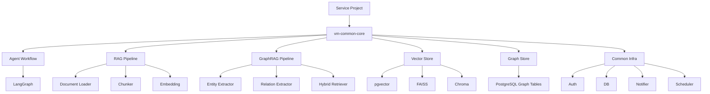

# GraphRAG AI Agent 공통 프레임워크 개발 프로젝트 계획서

## 1. 프로젝트 개요

### 1.1 프로젝트명

GraphRAG AI Agent 공통 프레임워크 개발

### 1.2 추진 배경

현재 `VectorMoon`, `Sol-Bat`, `accountBook`, `lotto` 프로젝트는 바이브코딩 방식으로 빠르게 구현되었으며, 각 프로젝트 안에 인증, DB, 알림, 스케줄러, LangGraph Agent, RAG, Vector Store 등 유사한 공통 기능이 반복적으로 포함되어 있다.

`vm-common-core`는 이러한 반복 기능을 공통화하기 위한 기반 프로젝트로 시작되었으며, 본 프로젝트에서는 이를 확장하여 GraphRAG 기반 AI Agent 개발 시 재사용 가능한 공통 프레임워크로 발전시키는 것을 목표로 한다.

### 1.3 프로젝트 목적

본 프로젝트의 목적은 신규 AI 서비스 개발 시 반복적으로 필요한 GraphRAG, RAG, Agent Workflow, Vector Store, Graph Store, 인증, DB, 알림, 스케줄러 기능을 공통 프레임워크로 표준화하여 개발 생산성과 품질을 높이는 것이다.

### 1.4 프로젝트 범위

본 프로젝트는 `vm-common-core`를 중심으로 다음 기능을 공통 프레임워크화한다.

- GraphRAG 기반 지식 검색 프레임워크
- Vector Store 추상화 및 통합 관리
- Graph Store 추상화 및 엔티티/관계 저장 구조
- LangGraph 기반 Agent Workflow 공통 구조
- 도메인별 Entity/Relation Schema 확장 구조
- 문서 로딩, 청킹, 임베딩, 인덱싱 파이프라인
- Hybrid Retrieval: Vector Search + Graph Traversal
- 출처 기반 답변 생성 지원
- 인증, DB, 알림, 스케줄러 등 기존 공통 모듈 안정화
- 기존 프로젝트 중 1개 이상에 파일럿 적용

### 1.5 제외 범위

- 각 서비스의 전체 비즈니스 기능 재개발
- 대규모 운영 인프라 구축
- 상용 Graph DB 도입 확정 및 운영 전환
- 모든 기존 프로젝트의 전면 마이그레이션
- 외부 API 유료 사용량 최적화 정책 수립

## 2. 추진 전략

### 2.1 기본 전략

본 프로젝트는 공통 프레임워크 개발 프로젝트로 추진한다. 기존 4개 서비스에서 이미 구현된 RAG/Agent 기능을 분석하고, 재사용 가능한 구조를 `vm-common-core`로 이동 또는 재설계한다.

### 2.2 적용 우선순위

1. `Sol-Bat`: GraphRAG 파일럿 적용 1순위
2. `VectorMoon`: 투자 분석 지식 그래프 확장 적용
3. `accountBook`: 거래/가맹점/카테고리 경량 지식 그래프 적용
4. `lotto`: 통계/전략 설명용 그래프 적용 검토

### 2.3 개발 방식

- KTSSP 산출물 단계 기준으로 진행
- Markdown 기반 산출물 우선 작성
- 구현 산출물은 `vm-common-core` 중심으로 관리
- 기존 프로젝트는 파일럿 적용 대상으로 활용
- 최소 기능 단위로 설계, 구현, 테스트를 반복

## 3. 목표 아키텍처

### 3.1 개념 구조



### 3.2 공통 모듈 후보

```text
vm-common-core/
  auth/
  db/
  notifier/
  scheduler/
  ai_pipeline/
    loaders/
    vectorstores/
    langgraph/
    rag/
      document_pipeline.py
      rag_manager.py
      retriever.py
    graphrag/
      schema.py
      graph_store.py
      extractor.py
      hybrid_retriever.py
      graph_state.py
      workflow.py
```

## 4. 주요 개발 대상

### 4.1 GraphRAG Core

- `Entity`: 도메인 객체 표현
- `Relation`: 엔티티 간 관계 표현
- `GraphChunk`: 문서 chunk와 근거 연결
- `GraphStore`: 그래프 저장소 추상화
- `GraphRetriever`: 관계 기반 검색
- `HybridRetriever`: 벡터 검색과 그래프 검색 결합

### 4.2 Agent Core

- `BaseAgentState`
- `AgentWorkflowFactory`
- `AgentNode`
- `PromptTemplateManager`
- `ToolRegistry`
- `DomainAgentConfig`

### 4.3 RAG Core

- 문서 로더
- 텍스트 분할기
- 임베딩 생성기
- 벡터 저장소 팩토리
- 문서 인덱싱 관리자
- 출처/메타데이터 관리

### 4.4 Infra Core

- 인증/JWT 공통 모듈 정리
- SQLAlchemy DB 세션 관리
- 설정 파일 및 환경변수 관리
- 이메일/텔레그램 알림
- APScheduler 기반 배치 작업

## 5. 단계별 추진 계획 및 산출물

### 5.1 100. 프로젝트계획

저장 위치: `D:\Dev\codex\GitHub\01.docs\01.산출물\100.프로젝트계획`

| 산출물 | 설명 | 작성 방식 |
|---|---|---|
| 프로젝트계획서 | 프로젝트 개요, 범위, 일정, 역할, 관리 계획 | Markdown |
| WBS | 단계별 작업 분해 및 일정 관리 | Markdown 또는 Excel |
| 착수보고서 | 프로젝트 착수 목적과 추진 방향 | Markdown 또는 PPT |

### 5.2 210. 아키텍처정의

저장 위치: `D:\Dev\codex\GitHub\01.docs\01.산출물\200.프로젝트실행\210.아키텍처정의`

| 산출물 | 설명 | 주요 내용 |
|---|---|---|
| 시스템아키텍처정의서 | 전체 프레임워크 구조 정의 | 모듈 구조, 저장소 구조, 배포 구조 |
| 개발표준정의서 | 개발 규칙 및 코딩 표준 | Python, FastAPI, LangGraph, 테스트 기준 |
| GraphRAG 아키텍처 정의서 | GraphRAG 처리 구조 정의 | Entity, Relation, Retrieval 흐름 |

### 5.3 220. 요구정의

저장 위치: `D:\Dev\codex\GitHub\01.docs\01.산출물\200.프로젝트실행\220.요구정의`

| 산출물 | 설명 | 주요 내용 |
|---|---|---|
| 요구사항정의서 | 기능/비기능 요구사항 정의 | GraphRAG, Agent, RAG, 운영 요구사항 |
| 요구사항추적표 | 요구사항-설계-구현-테스트 연결 | 요구사항 ID 기반 추적 |
| 유스케이스목록 | 사용자/개발자 관점 사용 사례 | 신규 서비스 적용, 문서 인덱싱, Agent 실행 |
| 액터목록 | 시스템 사용자와 외부 시스템 | 서비스 개발자, 운영자, LLM, Vector DB |

### 5.4 230. 분석

저장 위치: `D:\Dev\codex\GitHub\01.docs\01.산출물\200.프로젝트실행\230.분석`

| 산출물 | 설명 | 주요 내용 |
|---|---|---|
| 기존 프로젝트 공통기능 분석서 | 4개 프로젝트의 중복/공통 기능 분석 | VectorMoon, Sol-Bat, accountBook, lotto |
| 도메인정의서 | 공통 도메인 개념 정의 | Entity, Relation, Document, Chunk |
| 단어_용어정의서 | 프로젝트 용어 표준화 | GraphRAG, Hybrid Retrieval 등 |
| 논리 ERD | 논리 데이터 모델 | graph_entities, graph_relations, graph_chunks |
| 시스템 인터페이스 목록 | 외부 연동 목록 | OpenAI, pgvector, SMTP, Telegram |
| SW 라이선스 이행 서약서 | 오픈소스 및 라이선스 준수 | 라이선스 사용 원칙 |

### 5.5 240. 설계

저장 위치: `D:\Dev\codex\GitHub\01.docs\01.산출물\200.프로젝트실행\240.설계`

| 산출물 | 설명 | 주요 내용 |
|---|---|---|
| 상세설계서 | 내부 모듈 상세 설계 | 클래스, 함수, 책임, 예외 처리 |
| 설계 클래스 다이어그램 | 주요 클래스 관계 | GraphStore, HybridRetriever, AgentFactory |
| 설계 시퀀스 다이어그램 | 주요 처리 흐름 | 문서 인덱싱, 질의 응답, Agent 실행 |
| 시스템인터페이스정의서 | 외부 시스템 연동 상세 | OpenAI, DB, Telegram, SMTP |
| 물리 ERD | 실제 DB 테이블 구조 | PostgreSQL 기반 그래프 테이블 |
| 테이블정의서 | 테이블/컬럼 상세 정의 | 데이터 타입, PK, FK, 인덱스 |
| 프로그램목록 | 구현 대상 파일 목록 | 모듈별 소스 파일 목록 |
| API 명세서 | 공통 프레임워크 API | Python API, FastAPI 적용 예 |

### 5.6 250. 구현

저장 위치: `D:\Dev\codex\GitHub\01.docs\01.산출물\200.프로젝트실행\250.구현`

| 산출물 | 설명 | 주요 내용 |
|---|---|---|
| 소스코드 | `vm-common-core` 구현 결과 | GraphRAG, RAG, Agent 공통 모듈 |
| 구현결과서 | 구현 범위 및 결과 요약 | 구현 모듈, 미구현 사항, 제약 |
| SW라이선스목록 | 사용 라이브러리 목록 | LangChain, LangGraph, OpenAI, SQLAlchemy 등 |
| 단위 테스트 시나리오 | 단위 테스트 설계 및 결과 | 모듈별 테스트 케이스 |

### 5.7 260. 테스트

저장 위치: `D:\Dev\codex\GitHub\01.docs\01.산출물\200.프로젝트실행\260.테스트`

| 산출물 | 설명 | 주요 내용 |
|---|---|---|
| 테스트계획서 | 테스트 범위와 방법 | 단위, 통합, 품질, 성능 테스트 |
| 테스트시나리오 | 테스트 케이스 목록 | 요구사항 ID 기반 테스트 |
| 테스트결과서 | 테스트 수행 결과 | 성공/실패, 결함, 조치 결과 |
| 결함 및 조치결과 보고서 | 결함 처리 결과 | 결함 ID, 원인, 조치, 재검증 |

### 5.8 270. 이행

저장 위치: `D:\Dev\codex\GitHub\01.docs\01.산출물\200.프로젝트실행\270.이행`

| 산출물 | 설명 | 주요 내용 |
|---|---|---|
| 사용자매뉴얼 | 서비스 개발자 사용 가이드 | 신규 Agent 생성, 도메인 스키마 등록 |
| 운영자매뉴얼 | 운영 및 배포 가이드 | 환경변수, DB 초기화, 배치, 장애 대응 |
| 적용가이드 | 기존 프로젝트 적용 방법 | Sol-Bat 파일럿, VectorMoon 확장 |

### 5.9 300. 프로젝트종료

저장 위치: `D:\Dev\codex\GitHub\01.docs\01.산출물\300.프로젝트종료`

| 산출물 | 설명 |
|---|---|
| 프로젝트완료보고서 | 계획 대비 실적, 주요 성과, Lessons Learned |
| 이행점검체크리스트 | 배포/전환 준비 상태 점검 |

### 5.10 400. 프로젝트관리

저장 위치: `D:\Dev\codex\GitHub\01.docs\01.산출물\400.프로젝트관리`

| 산출물 | 설명 |
|---|---|
| 이슈_위험관리대장 | 이슈와 위험 통합 관리 |
| 결함관리대장 | 테스트 및 리뷰 결함 관리 |
| 형상관리계획서 | Git 브랜치, 태그, 릴리즈 관리 |
| 품질보증체크리스트 | 산출물/소스 품질 점검 |
| 동료검토결과서 | 주요 산출물 및 코드 리뷰 결과 |

## 6. WBS 초안

| 단계 | 작업 | 기간 | 주요 산출물 |
|---|---|---:|---|
| 계획 | 프로젝트 범위 및 추진계획 수립 | 1주 | 프로젝트계획서, WBS |
| 아키텍처 | 목표 아키텍처 및 개발 표준 정의 | 1주 | 시스템아키텍처정의서, 개발표준정의서 |
| 요구정의 | 기능/비기능 요구사항 정의 | 1주 | 요구사항정의서, 요구사항추적표 |
| 분석 | 기존 프로젝트 공통 기능 분석 | 1주 | 공통기능분석서, 도메인정의서 |
| 설계 | GraphRAG/Agent 상세 설계 | 2주 | 상세설계서, ERD, API 명세서 |
| 구현 | 공통 프레임워크 구현 | 3주 | 소스코드, 구현결과서 |
| 파일럿 | Sol-Bat 파일럿 적용 | 1주 | 적용결과서 |
| 테스트 | 단위/통합/품질 테스트 | 1주 | 테스트시나리오, 테스트결과서 |
| 이행 | 사용/운영 가이드 작성 | 1주 | 사용자매뉴얼, 운영자매뉴얼 |
| 종료 | 완료보고 및 회고 | 1주 | 프로젝트완료보고서 |

총 예상 기간: 13주

## 7. 역할 및 책임

| 역할 | 책임 |
|---|---|
| PM | 일정, 범위, 산출물, 이슈/위험 관리 |
| Architect | 전체 아키텍처, 기술 의사결정, 설계 검토 |
| AI Engineer | GraphRAG, RAG, LangGraph Agent 구현 |
| Backend Engineer | FastAPI, DB, 인증, 공통 API 구현 |
| QA | 테스트 계획, 테스트 수행, 결함 관리 |
| DevOps | 형상관리, 배포, 환경 구성 |

현재 1인 개발 또는 소규모 개발 기준에서는 PM, Architect, AI Engineer, Backend Engineer 역할을 동일 인원이 겸임할 수 있다.

## 8. 품질 관리 계획

### 8.1 품질 기준

- 공통 모듈은 서비스 프로젝트와 독립적으로 import 가능해야 한다.
- GraphRAG 검색 결과는 출처를 포함해야 한다.
- 요구사항별 테스트 케이스를 1개 이상 확보한다.
- 보안정보는 코드와 산출물에 포함하지 않는다.
- 외부 API 키는 `.env` 또는 Secret Manager를 통해 관리한다.
- 공통 모듈은 최소 단위 테스트를 포함한다.

### 8.2 테스트 기준

- 문서 로딩/청킹 테스트
- 임베딩 생성 테스트
- Vector Store 저장/검색 테스트
- Graph Store Entity/Relation 저장/검색 테스트
- Hybrid Retrieval 테스트
- LangGraph Agent Workflow 테스트
- 서비스 파일럿 적용 테스트

## 9. 위험 관리 계획

| 위험 ID | 위험 내용 | 영향도 | 대응 방안 |
|---|---|---|---|
| R-001 | GraphRAG 범위 과대 | 높음 | 1차 범위를 PostgreSQL 기반 경량 GraphRAG로 제한 |
| R-002 | LLM API 비용 증가 | 중간 | 테스트 데이터 축소, Mock LLM 도입 |
| R-003 | 기존 프로젝트 코드 중복/불일치 | 높음 | 공통기능 분석 후 기준 구현본 선정 |
| R-004 | Vector DB/Graph DB 선택 지연 | 중간 | 1차 PostgreSQL + pgvector 기준으로 진행 |
| R-005 | 산출물 작성 부담 증가 | 중간 | Markdown 우선 작성, 필요 시 KTSSP 양식 변환 |
| R-006 | 보안정보 노출 | 높음 | `.env`, 로그, 산출물 점검 절차 적용 |

## 10. 형상 관리 계획

### 10.1 저장소

- 공통 프레임워크: `vm-common-core`
- 파일럿 대상: `Sol-Bat`
- 참고 프로젝트: `VectorMoon`, `accountBook`, `lotto`
- 산출물: `D:\Dev\codex\GitHub\01.docs\01.산출물`

### 10.2 브랜치 전략

| 브랜치 | 용도 |
|---|---|
| `main` | 안정 버전 |
| `develop` | 통합 개발 |
| `feature/graphrag-core` | GraphRAG Core 개발 |
| `feature/rag-core` | RAG Core 개발 |
| `feature/agent-core` | Agent Core 개발 |
| `pilot/sol-bat` | Sol-Bat 파일럿 적용 |

### 10.3 버전 관리

- `v0.1.0`: GraphRAG Core 초기 버전
- `v0.2.0`: Hybrid Retrieval 적용
- `v0.3.0`: Agent Workflow Factory 적용
- `v1.0.0`: Sol-Bat 파일럿 검증 완료 후 1차 릴리즈

## 11. 보안 관리 계획

- 산출물에는 API Key, DB Password, Token 등 민감정보를 기재하지 않는다.
- `.env.example`에는 샘플 값만 포함한다.
- Git에 `.env`, DB 파일, 로그 파일이 포함되지 않도록 관리한다.
- JWT 기본 Secret 사용을 금지한다.
- Google OAuth 개발 모드는 명시적 설정에서만 허용한다.
- FAISS 역직렬화 등 위험 기능은 기본 비활성화한다.

## 12. 의사결정 사항

| 항목 | 기본 결정 | 비고 |
|---|---|---|
| 1차 Graph Store | PostgreSQL Table | Neo4j는 후속 검토 |
| 1차 Vector Store | pgvector | FAISS/Chroma는 옵션 |
| 1차 파일럿 | Sol-Bat | 농업 도메인이 GraphRAG에 적합 |
| 산출물 형식 | Markdown 우선 | 필요 시 docx/pptx 변환 |
| 공통 프레임워크 위치 | vm-common-core | 기존 공통 모듈 확장 |

## 13. 완료 기준

본 프로젝트는 다음 조건을 만족하면 1차 완료로 본다.

- GraphRAG Core 모듈이 `vm-common-core`에 구현된다.
- Entity/Relation/Chunk 저장 구조가 정의된다.
- Hybrid Retrieval이 동작한다.
- LangGraph Agent에서 Hybrid Retrieval 결과를 사용할 수 있다.
- Sol-Bat 파일럿 적용이 완료된다.
- 요구사항정의서, 상세설계서, 테스트결과서, 사용자매뉴얼이 작성된다.
- 민감정보 노출 없이 소스와 산출물이 정리된다.

## 14. 다음 단계

1. WBS 상세화
2. 시스템아키텍처정의서 작성
3. 요구사항정의서 작성
4. 기존 프로젝트 공통기능 분석서 작성
5. GraphRAG 상세설계서 작성
6. `vm-common-core` 구현 착수

