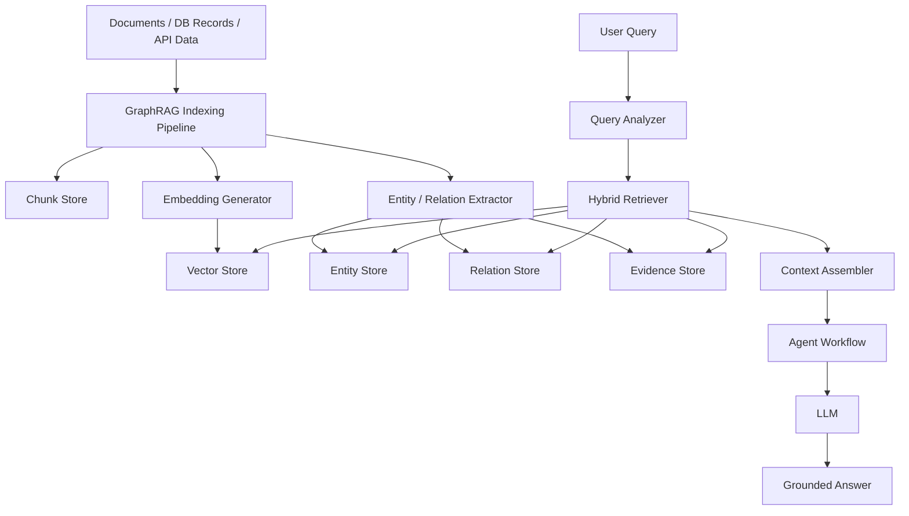
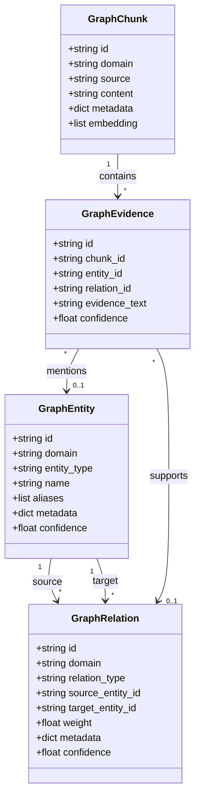
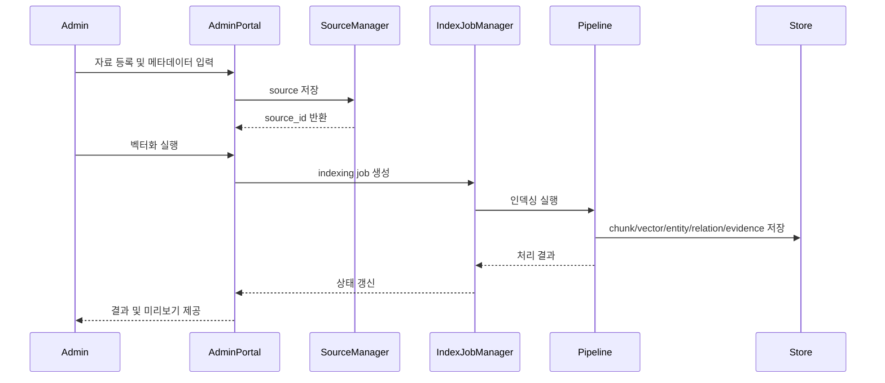
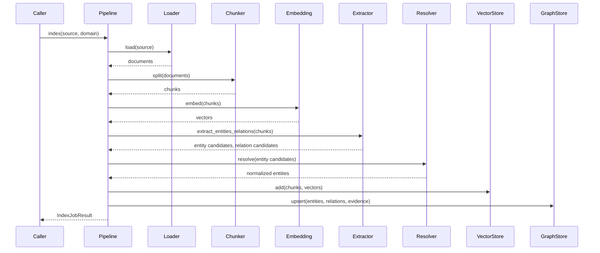
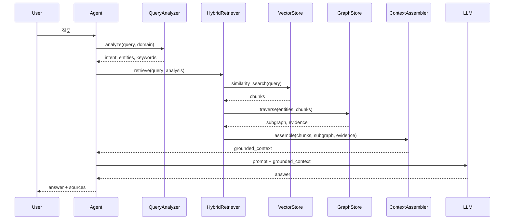
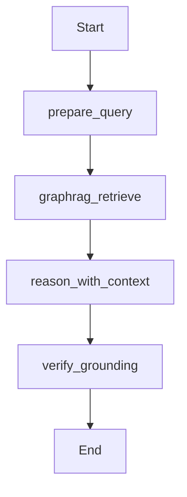

# GraphRAG AI Agent 공통 프레임워크 GraphRAG 아키텍처 정의서

## 1. 문서 개요

### 1.1 목적

본 문서는 GraphRAG AI Agent 공통 프레임워크에서 제공할 GraphRAG 아키텍처를 정의한다. 기존 RAG의 벡터 유사도 검색 한계를 보완하기 위해 문서 chunk, 도메인 엔티티, 엔티티 간 관계, 근거 정보를 함께 저장하고 검색하는 구조를 설계한다.

### 1.2 적용 범위

본 문서는 다음 범위에 적용한다.

- GraphRAG Core 구성요소
- 문서 인덱싱 및 지식 그래프 생성 흐름
- 질의 시 Hybrid Retrieval 처리 흐름
- Entity/Relation/Chunk/Evidence 데이터 구조
- 도메인 확장 방식
- Agent Workflow 연동 방식
- GraphRAG 품질, 운영, 보안 기준

### 1.3 관련 산출물

| 산출물 | 경로 |
|---|---|
| 시스템아키텍처정의서 | `01.docs/01.산출물/200.프로젝트실행/210.아키텍처정의/GraphRAG_AI_Agent_공통프레임워크_시스템아키텍처정의서.md` |
| WBS | `01.docs/01.산출물/100.프로젝트계획/GraphRAG_AI_Agent_공통프레임워크_WBS.md` |
| 프로젝트계획서 | `01.docs/01.산출물/100.프로젝트계획/GraphRAG_AI_Agent_공통프레임워크_프로젝트계획서.md` |

## 2. GraphRAG 정의

### 2.1 기본 개념

GraphRAG는 문서를 단순히 벡터로 검색하는 방식에서 확장하여, 문서 내 주요 개념을 Entity로 추출하고 Entity 간 관계를 Relation으로 저장한 뒤, 질의 시 벡터 검색과 그래프 탐색을 함께 수행하는 검색 증강 생성 구조이다.

### 2.2 기존 RAG와 GraphRAG 비교

| 구분 | 기존 RAG | GraphRAG |
|---|---|---|
| 저장 단위 | 문서 chunk, embedding | chunk, embedding, entity, relation, evidence |
| 검색 방식 | 벡터 유사도 중심 | 벡터 검색 + 그래프 탐색 |
| 강점 | 빠른 의미 검색 | 관계 추론, 근거 연결, 도메인 구조 반영 |
| 약점 | 관계성 파악 약함 | 인덱싱 복잡도 증가 |
| 적합 사례 | 문서 Q&A | 도메인 지식 추론, 영향 관계 분석, 정책/전략 검색 |

### 2.3 본 프로젝트 적용 목표

- 신규 AI 서비스가 공통 GraphRAG 파이프라인을 재사용할 수 있도록 한다.
- 서비스별 도메인 지식을 Entity/Relation Schema로 확장 가능하게 한다.
- Agent 답변이 어떤 문서, 어떤 엔티티, 어떤 관계를 근거로 생성되었는지 추적 가능하게 한다.
- 1차 구현은 PostgreSQL + pgvector 기반 경량 GraphRAG로 제한한다.

## 3. GraphRAG 전체 구성

### 3.1 구성 개념도



### 3.2 주요 구성요소

| 구성요소 | 책임 |
|---|---|
| `DocumentPipeline` | 문서 로드, chunk 분할, 메타데이터 생성 |
| `SourceManager` | 벡터화 대상 자료 등록, 수정, 삭제, 상태 관리 |
| `IndexJobManager` | 인덱싱 작업 생성, 실행, 재시도, 이력 관리 |
| `EmbeddingProvider` | chunk 및 query embedding 생성 |
| `EntityExtractor` | chunk 또는 DB record에서 Entity 후보 추출 |
| `RelationExtractor` | Entity 간 Relation 후보 추출 |
| `EntityResolver` | 동일 Entity 중복 정규화 및 alias 처리 |
| `GraphStore` | Entity, Relation, Evidence 저장 및 탐색 |
| `VectorStore` | chunk embedding 저장 및 유사도 검색 |
| `HybridRetriever` | Vector Search와 Graph Traversal 결과 통합 |
| `ContextAssembler` | LLM 입력용 근거 컨텍스트 생성 |
| `GraphRAGAgentNode` | LangGraph Agent에서 GraphRAG 검색 수행 |

## 4. 패키지 아키텍처

### 4.1 목표 패키지 구조

```text
common_core/
  ai_pipeline/
    graphrag/
      __init__.py
      schema.py
      domain_schema.py
      graph_store.py
      entity_extractor.py
      relation_extractor.py
      entity_resolver.py
      hybrid_retriever.py
      context_assembler.py
      indexing_pipeline.py
      source_manager.py
      index_job_manager.py
      agent_node.py
      metrics.py
```

### 4.2 모듈별 책임

| 파일 | 책임 |
|---|---|
| `schema.py` | Entity, Relation, GraphChunk, Evidence, RetrievalResult 모델 정의 |
| `domain_schema.py` | 서비스별 Entity/Relation Type 정의 및 검증 |
| `graph_store.py` | Graph DB 추상 인터페이스와 PostgreSQL 구현 |
| `entity_extractor.py` | LLM 또는 규칙 기반 Entity 추출 |
| `relation_extractor.py` | LLM 또는 규칙 기반 Relation 추출 |
| `entity_resolver.py` | Entity 정규화, alias, 중복 병합 |
| `hybrid_retriever.py` | 벡터 검색과 그래프 검색 결합 |
| `context_assembler.py` | 근거 컨텍스트 생성 |
| `indexing_pipeline.py` | 문서 인덱싱 전체 흐름 제어 |
| `source_manager.py` | 관리자 사이트에서 등록한 벡터화 대상 자료 관리 |
| `index_job_manager.py` | 인덱싱 작업 상태, 재시도, 재처리 관리 |
| `agent_node.py` | LangGraph 노드에서 GraphRAG 검색 실행 |
| `metrics.py` | 검색 품질 및 실행 지표 수집 |

## 5. 데이터 모델

### 5.1 핵심 객체



### 5.2 테이블 후보

| 테이블 | 주요 컬럼 | 설명 |
|---|---|---|
| `graphrag_entities` | `id`, `domain`, `entity_type`, `name`, `aliases`, `metadata`, `confidence` | Entity 저장 |
| `graphrag_relations` | `id`, `domain`, `relation_type`, `source_entity_id`, `target_entity_id`, `weight`, `metadata`, `confidence` | Relation 저장 |
| `graphrag_chunks` | `id`, `domain`, `source`, `content`, `metadata`, `embedding_ref` | 문서 chunk 저장 |
| `graphrag_evidence` | `id`, `chunk_id`, `entity_id`, `relation_id`, `evidence_text`, `confidence` | 근거 연결 |
| `graphrag_domain_schemas` | `domain`, `entity_types`, `relation_types`, `rules` | 도메인 스키마 저장 |
| `graphrag_index_jobs` | `id`, `domain`, `source`, `status`, `started_at`, `ended_at`, `error` | 인덱싱 작업 이력 |

### 5.3 공통 필드 규칙

| 필드 | 규칙 |
|---|---|
| `domain` | 서비스 또는 지식 영역 식별자. 예: `solbat`, `vectormoon`, `accountbook` |
| `entity_type` | 도메인 스키마에 등록된 Entity Type만 허용 |
| `relation_type` | 도메인 스키마에 등록된 Relation Type만 허용 |
| `source` | 원문 파일명, URL, DB 테이블, API 이름 등 출처 |
| `confidence` | 추출 또는 매칭 신뢰도. 0.0~1.0 |
| `metadata` | 서비스별 확장 필드. JSON 형식 |

## 6. 도메인 확장 아키텍처

### 6.1 Domain Schema 구조

서비스 프로젝트는 공통 프레임워크에 도메인 스키마를 등록하여 GraphRAG를 확장한다.

```yaml
domain: solbat
entity_types:
  - FARM
  - CROP
  - DISEASE
  - PEST
  - WEATHER
  - TASK
  - POLICY
relation_types:
  - AFFECTS
  - CAUSES
  - RECOMMENDS
  - APPLIES_TO
  - MENTIONED_IN
```

### 6.2 도메인별 Entity/Relation 예시

| 도메인 | Entity 예시 | Relation 예시 |
|---|---|---|
| Sol-Bat | Farm, Crop, Disease, Pest, Weather, Task, Policy | AFFECTS, CAUSES, RECOMMENDS, APPLIES_TO |
| VectorMoon | Stock, Sector, Indicator, News, Strategy, Risk, Portfolio | IMPACTS, BELONGS_TO, SIGNALS, HAS_RISK |
| accountBook | Merchant, Category, Transaction, UserPattern, Subscription | CLASSIFIED_AS, SIMILAR_TO, REPEATS_MONTHLY |
| lotto | Number, Draw, Pattern, Strategy, Range | CO_OCCURS_WITH, BELONGS_TO_RANGE, GENERATED_BY |

### 6.3 도메인 스키마 검증

| 검증 항목 | 기준 |
|---|---|
| Entity Type | 대문자 snake/camel 계열 이름 사용 |
| Relation Type | 방향성이 드러나는 동사형 이름 사용 |
| Relation 방향 | source와 target 의미가 명확해야 함 |
| Metadata | 공통 필드와 충돌하지 않아야 함 |
| Evidence | 모든 자동 추출 Relation은 가능한 경우 근거 chunk와 연결 |

## 7. 인덱싱 아키텍처

### 7.1 인덱싱 단계

| 단계 | 작업 | 산출 데이터 |
|---|---|---|
| 1 | Source Load | Raw Document 또는 Record |
| 2 | Parse | Text, Metadata |
| 3 | Chunking | GraphChunk |
| 4 | Embedding | Vector Embedding |
| 5 | Entity Extraction | GraphEntity 후보 |
| 6 | Entity Resolution | 정규화된 GraphEntity |
| 7 | Relation Extraction | GraphRelation 후보 |
| 8 | Evidence Linking | GraphEvidence |
| 9 | Store | Vector Store + Graph Store |
| 10 | Index Job Logging | graphrag_index_jobs |

### 7.2 관리자 사이트 기반 자료 관리 흐름

관리자 사이트는 인덱싱 파이프라인의 시작점으로 동작한다. 운영자는 자료를 등록하고, 메타데이터를 보정한 뒤 벡터화/그래프화를 실행한다.



관리자 사이트에서 관리해야 할 자료 상태는 다음과 같다.

| 상태 | 설명 |
|---|---|
| REGISTERED | 자료 등록 완료, 인덱싱 전 |
| VALIDATED | 자료 형식 및 메타데이터 검증 완료 |
| INDEXING | 벡터화/그래프화 진행 중 |
| INDEXED | 인덱싱 완료 |
| FAILED | 인덱싱 실패 |
| DISABLED | 검색 대상에서 제외 |
| DELETED | 삭제 처리 |

### 7.3 인덱싱 시퀀스



### 7.3 Entity/Relation 추출 방식

| 방식 | 설명 | 적용 기준 |
|---|---|---|
| Rule 기반 | 정규식, 키워드, 사전 기반 추출 | 명확한 패턴이 있는 데이터 |
| LLM 기반 | 프롬프트로 Entity/Relation JSON 추출 | 비정형 문서 |
| Hybrid | Rule 후보 + LLM 보정 | 1차 표준 방식 |
| Manual Curation | 사용자가 직접 보정 | 중요 지식 또는 파일럿 검증 |

## 8. 질의 및 검색 아키텍처

### 8.1 질의 처리 단계

| 단계 | 작업 | 결과 |
|---|---|---|
| 1 | Query Normalize | 정규화된 질문 |
| 2 | Query Intent Detect | 질의 유형 |
| 3 | Query Entity Detect | 질문 내 Entity 후보 |
| 4 | Vector Search | 관련 chunk 후보 |
| 5 | Entity Linking | chunk와 질문 Entity 연결 |
| 6 | Graph Traversal | 관련 Entity/Relation 탐색 |
| 7 | Evidence Reranking | 근거 재정렬 |
| 8 | Context Assembly | LLM 입력 컨텍스트 |
| 9 | Answer Generation | 출처 포함 답변 |

### 8.2 질의 시퀀스



## 9. Hybrid Retrieval 설계

### 9.1 검색 결과 통합 기준

Hybrid Retrieval은 다음 신호를 결합하여 최종 근거를 선정한다.

| 신호 | 설명 | 예시 가중치 |
|---|---|---:|
| Vector Similarity | 질문과 chunk의 의미 유사도 | 0.40 |
| Entity Match | 질문 Entity와 검색 Entity 일치도 | 0.25 |
| Relation Relevance | 질의 의도와 Relation Type의 관련도 | 0.20 |
| Evidence Confidence | 추출 근거 신뢰도 | 0.10 |
| Recency / Metadata Boost | 최신성, 도메인 필터 등 부가 점수 | 0.05 |

### 9.2 기본 점수식

```text
final_score =
  vector_score * 0.40
  + entity_score * 0.25
  + relation_score * 0.20
  + evidence_confidence * 0.10
  + metadata_boost * 0.05
```

가중치는 도메인별 설정으로 분리한다.

### 9.3 그래프 탐색 범위

| 설정 | 기본값 | 설명 |
|---|---:|---|
| `max_depth` | 2 | Entity 주변 탐색 깊이 |
| `max_entities` | 20 | 검색 결과에 포함할 최대 Entity 수 |
| `max_relations` | 50 | 검색 결과에 포함할 최대 Relation 수 |
| `min_confidence` | 0.5 | Entity/Relation 최소 신뢰도 |
| `top_k_chunks` | 5 | 벡터 검색 chunk 수 |
| `top_k_evidence` | 8 | 최종 근거 수 |

## 10. Agent Workflow 연동

### 10.1 LangGraph 노드 구성



### 10.2 공통 Agent State 확장

| 필드 | 설명 |
|---|---|
| `query` | 사용자 질문 |
| `domain` | 서비스 도메인 |
| `detected_entities` | 질문에서 탐지된 Entity |
| `retrieved_chunks` | 벡터 검색 chunk |
| `retrieved_entities` | 검색된 Entity |
| `retrieved_relations` | 검색된 Relation |
| `evidence` | 답변 근거 |
| `grounded_context` | LLM 입력 컨텍스트 |
| `answer` | 최종 답변 |
| `sources` | 출처 목록 |
| `confidence_score` | 답변 신뢰도 |

### 10.3 Agent 연동 방식

서비스 프로젝트는 다음 중 하나의 방식으로 GraphRAG를 사용한다.

| 방식 | 설명 |
|---|---|
| 직접 호출 | `HybridRetriever.retrieve()`를 서비스 코드에서 직접 호출 |
| LangGraph Node | `GraphRAGRetrieveNode`를 Workflow에 삽입 |
| Agent Template | 공통 Agent Template을 상속하여 도메인별 Agent 생성 |

## 11. Context Assembly 설계

### 11.1 LLM 입력 컨텍스트 구조

```text
[Question]
사용자 질문

[Detected Entities]
- Entity 목록

[Relevant Relations]
- source --relation--> target

[Evidence Chunks]
1. 출처, chunk 내용
2. 출처, chunk 내용

[Answer Rules]
- 제공된 근거 안에서 답변
- 출처를 포함
- 근거가 부족하면 부족하다고 명시
```

### 11.2 답변 근거 정책

| 정책 | 설명 |
|---|---|
| 근거 우선 | 답변은 검색된 Evidence에 기반해야 함 |
| 출처 표기 | 파일명, 문서명, URL, DB record 등 출처 표시 |
| 불확실성 표시 | 근거 부족 시 추정으로 답변하지 않음 |
| 도메인 준수 | 도메인 Schema에 없는 관계는 답변 근거로 사용하지 않음 |

## 12. 품질 평가 아키텍처

### 12.1 검색 품질 지표

| 지표 | 설명 |
|---|---|
| Recall@K | 정답 근거가 상위 K개 검색 결과에 포함되는 비율 |
| Precision@K | 상위 K개 검색 결과 중 관련 근거 비율 |
| Entity Match Rate | 질문 핵심 Entity가 검색 결과에 포함되는 비율 |
| Relation Hit Rate | 필요한 Relation이 검색되는 비율 |
| Grounding Rate | 답변 문장이 근거와 연결되는 비율 |
| No Evidence Accuracy | 근거 부족 시 모른다고 답하는 비율 |

### 12.2 테스트 데이터셋 구조

| 필드 | 설명 |
|---|---|
| `question` | 테스트 질문 |
| `domain` | 도메인 |
| `expected_entities` | 기대 Entity |
| `expected_relations` | 기대 Relation |
| `expected_sources` | 기대 출처 |
| `answer_criteria` | 답변 평가 기준 |

## 13. 운영 및 모니터링

### 13.1 운영 지표

| 지표 | 설명 |
|---|---|
| Indexing Success Rate | 인덱싱 성공률 |
| Extraction Failure Count | Entity/Relation 추출 실패 수 |
| Retrieval Latency | 검색 응답 시간 |
| LLM Latency | LLM 응답 시간 |
| Token Usage | LLM 토큰 사용량 |
| Empty Result Rate | 검색 결과 없음 비율 |
| Low Confidence Rate | 낮은 신뢰도 답변 비율 |

### 13.2 로그 항목

| 로그 | 주요 필드 |
|---|---|
| Index Job Log | job_id, domain, source, chunk_count, status, error |
| Extraction Log | chunk_id, entity_count, relation_count, confidence |
| Retrieval Log | query, domain, vector_hits, graph_hits, latency |
| Agent Run Log | run_id, workflow, nodes, answer_confidence, error |

## 14. 보안 및 개인정보 보호

### 14.1 보안 원칙

- API Key, DB Password, Token은 GraphRAG metadata에 저장하지 않는다.
- 문서 chunk에 민감정보가 포함될 가능성이 있으면 마스킹 후 인덱싱한다.
- 사용자별 private 지식은 domain, user_id, scope metadata로 분리한다.
- 검색 시 권한 필터를 Vector Store와 Graph Store 양쪽에 동일하게 적용한다.

### 14.2 접근 제어

| Scope | 설명 |
|---|---|
| `PUBLIC` | 모든 사용자 또는 서비스가 접근 가능한 공용 지식 |
| `PRIVATE` | 특정 사용자 또는 조직만 접근 가능한 지식 |
| `SYSTEM` | 시스템 운영 및 공통 프레임워크 내부 지식 |

## 15. 오류 처리 및 Fallback

| 오류 상황 | 처리 방식 |
|---|---|
| Vector Store 장애 | Graph Store 검색만 수행하거나 일반 오류 반환 |
| Graph Store 장애 | Vector RAG로 fallback |
| LLM Entity 추출 실패 | Rule 기반 추출 결과만 사용 |
| 검색 결과 없음 | 근거 부족 메시지 반환 |
| LLM 답변 실패 | 검색 근거 요약 또는 시스템 fallback 메시지 반환 |
| 권한 필터 오류 | 검색 중단 및 보안 로그 기록 |

## 16. 1차 파일럿 적용 기준

### 16.1 Sol-Bat 적용 범위

Sol-Bat 파일럿은 농업 지식 문서와 농장/작물/병해충/날씨/작업 관계를 대상으로 한다.

| 항목 | 1차 범위 |
|---|---|
| 문서 | 주간농사정보, 농업 매뉴얼, 정책 문서 |
| Entity | FARM, CROP, DISEASE, PEST, WEATHER, TASK, POLICY |
| Relation | AFFECTS, CAUSES, RECOMMENDS, APPLIES_TO, MENTIONED_IN |
| Agent | Farming Agent의 지식 검색 노드 |
| 저장소 | PostgreSQL + pgvector |

### 16.2 파일럿 성공 기준

| 기준 | 목표 |
|---|---|
| 문서 인덱싱 | 샘플 문서 3건 이상 인덱싱 |
| Entity 추출 | 주요 Entity Type 5종 이상 추출 |
| Relation 추출 | 주요 Relation Type 3종 이상 추출 |
| 검색 품질 | 테스트 질문 기준 기대 출처 70% 이상 검색 |
| 답변 품질 | 출처 포함 답변 생성 |

## 17. 아키텍처 결정 사항

| ID | 결정 사항 | 결정 내용 |
|---|---|---|
| GR-ADR-001 | Graph Store | 1차는 PostgreSQL Graph Tables 사용 |
| GR-ADR-002 | Vector Store | 1차는 pgvector 사용 |
| GR-ADR-003 | Entity/Relation 추출 | Rule + LLM Hybrid 방식 |
| GR-ADR-004 | Graph Traversal Depth | 기본 2-depth |
| GR-ADR-005 | 도메인 확장 | Domain Schema 등록 방식 |
| GR-ADR-006 | Agent 연동 | LangGraph Node 방식 우선 지원 |

## 18. 후속 상세화 과제

| 과제 | 후속 산출물 |
|---|---|
| Graph Store 물리 테이블 정의 | 물리 ERD, 테이블정의서 |
| Domain Schema 상세 정의 | 도메인정의서 |
| Entity/Relation 추출 프롬프트 | Prompt 설계서 |
| Hybrid Retrieval 상세 알고리즘 | 상세설계서 |
| GraphRAG 테스트 데이터셋 | 테스트시나리오 |
| Sol-Bat 파일럿 스키마 | 파일럿 적용 설계서 |

## 19. 승인 및 변경 이력

### 19.1 승인 기록

| 구분 | 역할 | 승인 여부 | 일자 | 비고 |
|---|---|---|---|---|
| 작성 | GraphRAG Engineer | 작성 완료 | 2026-06-20 | 초안 |
| 검토 | 아키텍터 | 승인 필요 | - | 사용자 확인 필요 |
| 승인 | PM | 승인 필요 | - | 사용자 확인 필요 |

### 19.2 변경 이력

| 버전 | 일자 | 변경 내용 | 작성자 |
|---|---|---|---|
| v0.1 | 2026-06-20 | 최초 작성 | GraphRAG Engineer |
