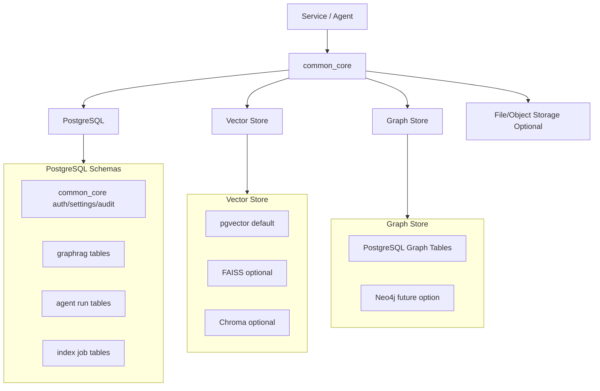
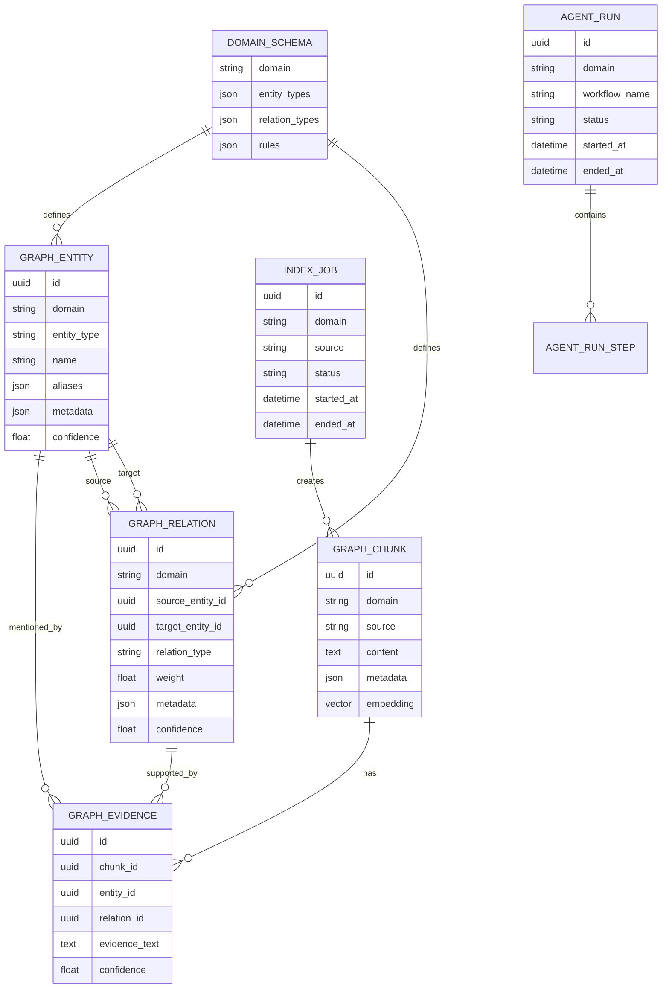
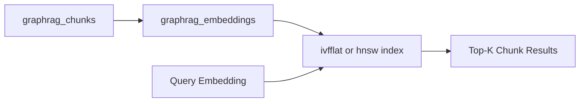
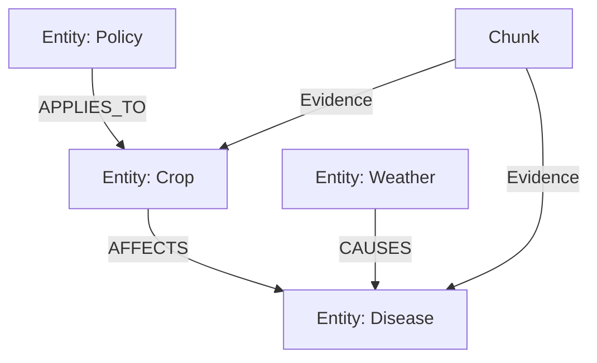
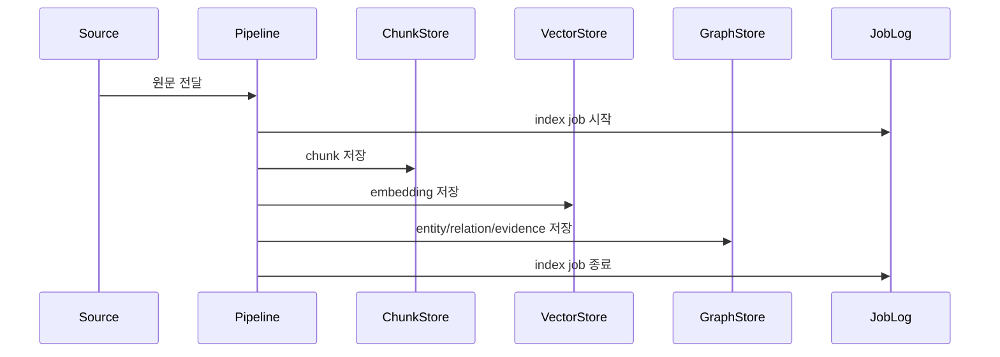
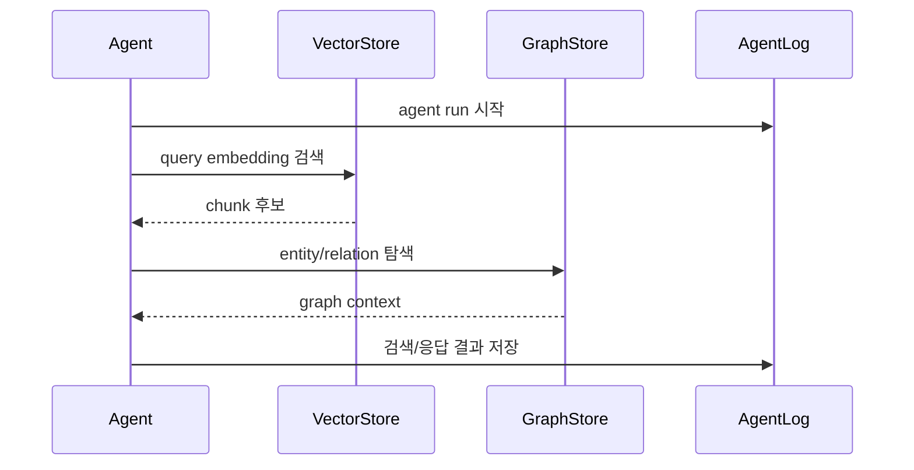

# GraphRAG AI Agent 공통 프레임워크 데이터/저장소 아키텍처 정의서

## 1. 문서 개요

### 1.1 목적

본 문서는 GraphRAG AI Agent 공통 프레임워크의 데이터 및 저장소 아키텍처를 정의한다. GraphRAG 처리에 필요한 문서 chunk, embedding, entity, relation, evidence, domain schema, indexing job, agent 실행 이력을 어떤 저장소에 어떤 구조로 저장하고 관리할지에 대한 기준을 제공한다.

### 1.2 적용 범위

본 문서는 다음 영역에 적용한다.

- PostgreSQL 기반 관계형 저장소
- pgvector 기반 벡터 저장소
- PostgreSQL Graph Tables 기반 경량 Graph Store
- FAISS/Chroma 선택 저장소
- 관리자 사이트 기반 벡터화 자료 등록/상태 관리
- 인덱싱 작업 이력 저장
- Agent 실행 이력 저장
- 사용자/조직/도메인별 접근 범위 관리
- 백업, 보존, 삭제, 마이그레이션 기준

### 1.3 관련 산출물

| 산출물 | 경로 |
|---|---|
| 시스템아키텍처정의서 | `01.docs/01.산출물/200.프로젝트실행/210.아키텍처정의/GraphRAG_AI_Agent_공통프레임워크_시스템아키텍처정의서.md` |
| GraphRAG 아키텍처 정의서 | `01.docs/01.산출물/200.프로젝트실행/210.아키텍처정의/GraphRAG_AI_Agent_공통프레임워크_GraphRAG아키텍처정의서.md` |
| WBS | `01.docs/01.산출물/100.프로젝트계획/GraphRAG_AI_Agent_공통프레임워크_WBS.md` |

## 2. 데이터 아키텍처 원칙

| 원칙 | 설명 |
|---|---|
| 단일 기준 저장소 | 1차 구현은 PostgreSQL을 기준 저장소로 사용한다. |
| 벡터/그래프 분리 | embedding 검색과 entity/relation 탐색은 논리적으로 분리하되 evidence로 연결한다. |
| 도메인 분리 | `domain`, `scope`, `user_id`, `tenant_id` 기준으로 서비스와 접근 범위를 분리한다. |
| 근거 추적 | 모든 entity/relation은 가능한 경우 원문 chunk 또는 evidence와 연결한다. |
| 저장소 교체 가능성 | Vector Store와 Graph Store는 adapter 계층을 통해 교체 가능하게 설계한다. |
| 운영 추적성 | 인덱싱, 검색, Agent 실행 이력은 추적 가능해야 한다. |
| 민감정보 최소화 | API Key, Password, Token 등 Secret은 저장하지 않는다. |
| 점진적 확장 | 초기에는 PostgreSQL Graph Tables를 사용하고, 필요 시 Neo4j 등 전문 Graph DB로 확장한다. |

## 3. 전체 저장소 구성

### 3.1 저장소 구성도



### 3.2 저장소별 역할

| 저장소 | 1차 적용 | 역할 | 비고 |
|---|---|---|---|
| PostgreSQL | 필수 | 메타데이터, graph tables, agent run, audit 저장 | 기준 저장소 |
| pgvector | 필수 | chunk embedding 저장 및 유사도 검색 | PostgreSQL extension |
| FAISS | 선택 | 로컬 파일 기반 벡터 검색 | accountBook 유형 또는 오프라인 테스트 |
| Chroma | 선택 | 개발/실험용 벡터 저장소 | 로컬 PoC |
| File/Object Storage | 선택 | 원본 파일 저장 | 초기에는 로컬 파일 또는 서비스 저장소 사용 |
| Neo4j | 후속 | 전문 Graph DB | 초기 범위 제외 |

## 4. 스키마 구조

### 4.1 PostgreSQL 스키마 분리

| 스키마 | 용도 | 주요 테이블 |
|---|---|---|
| `common_core` | 공통 인증, 설정, 감사 로그 | users, audit_logs, settings |
| `graphrag` | GraphRAG 지식 데이터 | entities, relations, chunks, evidence |
| `agent` | Agent 실행 이력 | agent_runs, agent_run_steps |
| `ops` | 운영/작업 이력 | index_jobs, retrieval_logs, error_logs |

초기 구현에서는 PostgreSQL 스키마 분리가 어렵거나 기존 프로젝트 구조와 충돌할 경우, 테이블 prefix 방식으로 시작할 수 있다.

예:

```text
graphrag_entities
graphrag_relations
graphrag_chunks
graphrag_evidence
agent_runs
agent_run_steps
graphrag_sources
```

### 4.2 ERD 개념도



## 5. 주요 테이블 정의 초안

### 5.1 `graphrag_domain_schemas`

| 컬럼 | 타입 | 설명 |
|---|---|---|
| `id` | UUID | PK |
| `domain` | VARCHAR(100) | 도메인 식별자 |
| `version` | VARCHAR(30) | 스키마 버전 |
| `entity_types` | JSONB | 허용 Entity Type 목록 |
| `relation_types` | JSONB | 허용 Relation Type 목록 |
| `rules` | JSONB | 검증/추출 규칙 |
| `is_active` | BOOLEAN | 활성 여부 |
| `created_at` | TIMESTAMP | 생성일 |

### 5.2.1 `graphrag_sources`

관리자 사이트에서 등록한 벡터화 대상 자료의 기준 테이블이다. 파일, URL, DB record, API source, 직접 입력 텍스트 등 다양한 자료 원천을 동일한 방식으로 관리한다.

| 컬럼 | 타입 | 설명 |
|---|---|---|
| `id` | UUID | PK |
| `domain` | VARCHAR(100) | 도메인 |
| `tenant_id` | VARCHAR(100), NULL | 조직/서비스 분리 키 |
| `user_id` | VARCHAR(100), NULL | 등록 사용자 |
| `scope` | VARCHAR(30) | PUBLIC, PRIVATE, SYSTEM |
| `source_type` | VARCHAR(50) | file, url, db, api, text |
| `source_uri` | TEXT | 파일 경로, URL, DB 식별자 등 |
| `display_name` | VARCHAR(300) | 관리자 화면 표시명 |
| `description` | TEXT, NULL | 자료 설명 |
| `tags` | JSONB | 검색/분류 태그 |
| `status` | VARCHAR(30) | REGISTERED, VALIDATED, INDEXING, INDEXED, FAILED, DISABLED, DELETED |
| `content_hash` | VARCHAR(128), NULL | 원문 중복 확인용 hash |
| `metadata` | JSONB | 확장 메타데이터 |
| `created_at` | TIMESTAMP | 생성일 |
| `updated_at` | TIMESTAMP | 수정일 |
| `deleted_at` | TIMESTAMP, NULL | 삭제일 |
| `updated_at` | TIMESTAMP | 수정일 |

### 5.2 `graphrag_chunks`

| 컬럼 | 타입 | 설명 |
|---|---|---|
| `id` | UUID | PK |
| `domain` | VARCHAR(100) | 도메인 |
| `tenant_id` | VARCHAR(100), NULL | 조직/서비스 분리 키 |
| `user_id` | VARCHAR(100), NULL | 사용자 분리 키 |
| `scope` | VARCHAR(30) | PUBLIC, PRIVATE, SYSTEM |
| `source_type` | VARCHAR(50) | file, url, db, api |
| `source` | TEXT | 원문 출처 |
| `source_id` | VARCHAR(200), NULL | 외부 원천 ID |
| `chunk_index` | INTEGER | 원문 내 chunk 순번 |
| `content` | TEXT | chunk 본문 |
| `content_hash` | VARCHAR(128) | 중복 판단용 hash |
| `metadata` | JSONB | 확장 메타데이터 |
| `created_at` | TIMESTAMP | 생성일 |

### 5.3 `graphrag_embeddings`

pgvector를 직접 사용할 경우 chunk 테이블에 vector 컬럼을 둘 수 있으나, 저장소 교체 가능성을 위해 별도 테이블 방식을 기본안으로 둔다.

| 컬럼 | 타입 | 설명 |
|---|---|---|
| `id` | UUID | PK |
| `chunk_id` | UUID | FK: graphrag_chunks.id |
| `provider` | VARCHAR(50) | openai 등 |
| `model` | VARCHAR(100) | embedding model |
| `dimension` | INTEGER | vector dimension |
| `embedding` | VECTOR | pgvector embedding |
| `created_at` | TIMESTAMP | 생성일 |

### 5.4 `graphrag_entities`

| 컬럼 | 타입 | 설명 |
|---|---|---|
| `id` | UUID | PK |
| `domain` | VARCHAR(100) | 도메인 |
| `tenant_id` | VARCHAR(100), NULL | 조직/서비스 분리 키 |
| `user_id` | VARCHAR(100), NULL | 사용자 분리 키 |
| `scope` | VARCHAR(30) | PUBLIC, PRIVATE, SYSTEM |
| `entity_type` | VARCHAR(100) | Entity Type |
| `name` | VARCHAR(300) | 대표 이름 |
| `normalized_name` | VARCHAR(300) | 정규화 이름 |
| `aliases` | JSONB | alias 목록 |
| `metadata` | JSONB | 확장 메타데이터 |
| `confidence` | FLOAT | 추출 신뢰도 |
| `created_at` | TIMESTAMP | 생성일 |
| `updated_at` | TIMESTAMP | 수정일 |

### 5.5 `graphrag_relations`

| 컬럼 | 타입 | 설명 |
|---|---|---|
| `id` | UUID | PK |
| `domain` | VARCHAR(100) | 도메인 |
| `tenant_id` | VARCHAR(100), NULL | 조직/서비스 분리 키 |
| `user_id` | VARCHAR(100), NULL | 사용자 분리 키 |
| `scope` | VARCHAR(30) | PUBLIC, PRIVATE, SYSTEM |
| `source_entity_id` | UUID | 출발 Entity |
| `target_entity_id` | UUID | 도착 Entity |
| `relation_type` | VARCHAR(100) | Relation Type |
| `direction` | VARCHAR(20) | directed, bidirectional |
| `weight` | FLOAT | 관계 가중치 |
| `metadata` | JSONB | 확장 메타데이터 |
| `confidence` | FLOAT | 추출 신뢰도 |
| `created_at` | TIMESTAMP | 생성일 |
| `updated_at` | TIMESTAMP | 수정일 |

### 5.6 `graphrag_evidence`

| 컬럼 | 타입 | 설명 |
|---|---|---|
| `id` | UUID | PK |
| `chunk_id` | UUID | 근거 chunk |
| `entity_id` | UUID, NULL | 연결 Entity |
| `relation_id` | UUID, NULL | 연결 Relation |
| `evidence_text` | TEXT | 근거 문장 |
| `offset_start` | INTEGER, NULL | 원문 시작 위치 |
| `offset_end` | INTEGER, NULL | 원문 종료 위치 |
| `confidence` | FLOAT | 근거 신뢰도 |
| `created_at` | TIMESTAMP | 생성일 |

### 5.7 `graphrag_index_jobs`

| 컬럼 | 타입 | 설명 |
|---|---|---|
| `id` | UUID | PK |
| `domain` | VARCHAR(100) | 도메인 |
| `source_type` | VARCHAR(50) | file, url, db, api |
| `source` | TEXT | 인덱싱 원천 |
| `status` | VARCHAR(30) | PENDING, RUNNING, SUCCESS, FAILED |
| `chunk_count` | INTEGER | 생성 chunk 수 |
| `entity_count` | INTEGER | 추출 Entity 수 |
| `relation_count` | INTEGER | 추출 Relation 수 |
| `error_message` | TEXT, NULL | 실패 사유 |
| `started_at` | TIMESTAMP | 시작일 |
| `ended_at` | TIMESTAMP | 종료일 |

### 5.8 `agent_runs`

| 컬럼 | 타입 | 설명 |
|---|---|---|
| `id` | UUID | PK |
| `domain` | VARCHAR(100) | 도메인 |
| `workflow_name` | VARCHAR(100) | Agent workflow 이름 |
| `query` | TEXT | 사용자 질문 |
| `status` | VARCHAR(30) | SUCCESS, FAILED |
| `confidence_score` | FLOAT | 답변 신뢰도 |
| `sources` | JSONB | 사용 출처 목록 |
| `metadata` | JSONB | 확장 메타데이터 |
| `started_at` | TIMESTAMP | 시작일 |
| `ended_at` | TIMESTAMP | 종료일 |

### 5.9 `agent_run_steps`

| 컬럼 | 타입 | 설명 |
|---|---|---|
| `id` | UUID | PK |
| `agent_run_id` | UUID | FK: agent_runs.id |
| `step_name` | VARCHAR(100) | Node 또는 처리 단계 |
| `status` | VARCHAR(30) | SUCCESS, FAILED |
| `input_summary` | TEXT | 입력 요약 |
| `output_summary` | TEXT | 출력 요약 |
| `latency_ms` | INTEGER | 처리 시간 |
| `error_message` | TEXT, NULL | 오류 메시지 |
| `created_at` | TIMESTAMP | 생성일 |

## 6. Vector Store 아키텍처

### 6.1 기본 저장 방식

1차 구현은 PostgreSQL + pgvector를 기준으로 한다.



### 6.2 pgvector 인덱스 전략

| 인덱스 | 용도 | 적용 기준 |
|---|---|---|
| HNSW | 고성능 유사도 검색 | pgvector 버전과 운영 환경이 지원할 경우 우선 검토 |
| IVFFLAT | 일반적인 근사 검색 | 데이터가 일정 규모 이상일 경우 적용 |
| Exact Search | 소규모 개발/테스트 | 초기 PoC 또는 데이터 적을 때 |

### 6.3 벡터 메타데이터 필터

검색 시 다음 필터를 반드시 적용할 수 있어야 한다.

| 필터 | 목적 |
|---|---|
| `domain` | 서비스별 지식 분리 |
| `tenant_id` | 조직별 지식 분리 |
| `user_id` | 사용자 private 지식 분리 |
| `scope` | PUBLIC/PRIVATE/SYSTEM 접근 제어 |
| `source_type` | 파일, URL, DB, API 등 원천 구분 |
| `created_at` | 최신성 기준 검색 |

## 7. Graph Store 아키텍처

### 7.1 기본 저장 방식

초기 Graph Store는 PostgreSQL 일반 테이블로 구성한다.



### 7.2 그래프 탐색 쿼리 유형

| 유형 | 설명 |
|---|---|
| Entity 주변 탐색 | 특정 Entity의 1~2 depth relation 조회 |
| Relation Type 탐색 | 특정 관계 유형만 조회 |
| Evidence 기반 탐색 | 특정 chunk가 지지하는 Entity/Relation 조회 |
| Domain 제한 탐색 | 특정 domain 안에서만 탐색 |
| 권한 제한 탐색 | scope, tenant_id, user_id 필터 적용 |

### 7.3 향후 Neo4j 확장 기준

다음 조건 중 2개 이상 충족 시 Neo4j 등 전문 Graph DB 도입을 검토한다.

- Relation 수 100만 건 이상
- 3-depth 이상 탐색이 빈번함
- 경로 탐색, 중심성, 커뮤니티 탐지 등 그래프 알고리즘 필요
- PostgreSQL recursive query 성능 한계 발생
- 도메인 간 복잡한 지식 연결 요구 증가

## 8. 데이터 흐름

### 8.1 인덱싱 데이터 흐름



### 8.2 검색 데이터 흐름



## 9. 데이터 생명주기

| 단계 | 설명 | 관리 대상 |
|---|---|---|
| 수집 | 문서, DB, API 데이터 수집 | source metadata |
| 등록 | 관리자 사이트에서 벡터화 대상 자료 등록 | graphrag_sources |
| 정제 | 텍스트 추출, 민감정보 마스킹 | content, metadata |
| 분할 | chunk 생성 | graphrag_chunks |
| 임베딩 | vector 생성 | graphrag_embeddings |
| 추출 | Entity/Relation 추출 | graphrag_entities, graphrag_relations |
| 연결 | Evidence 연결 | graphrag_evidence |
| 검색 | 질의 시 검색 | retrieval logs |
| 보존 | 운영 기준에 따른 보관 | jobs, runs, chunks |
| 삭제 | 원천 문서 삭제 또는 재인덱싱 | cascade 또는 soft delete |

### 9.1 관리자 사이트 데이터 관리

관리자 사이트는 벡터화 대상 자료를 등록하고, 자료 상태와 인덱싱 작업을 추적하기 위한 운영 화면/API를 제공한다.

| 기능 | 대상 테이블 | 처리 |
|---|---|---|
| 자료 등록 | `graphrag_sources` | source metadata 생성 |
| 자료 수정 | `graphrag_sources` | display_name, tags, scope, metadata 수정 |
| 벡터화 실행 | `graphrag_index_jobs` | job 생성 후 pipeline 실행 |
| 상태 조회 | `graphrag_sources`, `graphrag_index_jobs` | 자료별 최신 job 상태 표시 |
| 미리보기 | `graphrag_chunks`, `graphrag_entities`, `graphrag_relations` | chunk/entity/relation 조회 |
| 재인덱싱 | `graphrag_index_jobs` | 기존 데이터 비활성화 후 신규 job 실행 |
| 삭제/비활성화 | 관련 GraphRAG 테이블 | soft delete, disabled, hard delete 정책 적용 |

자료 삭제는 기본적으로 soft delete를 우선한다. 운영자가 검색 대상에서만 제외하려면 `status=DISABLED`를 사용하고, 개발/테스트 데이터 또는 승인된 삭제 건에 한해 hard delete를 허용한다.

## 10. 권한 및 데이터 분리

### 10.1 Scope 정책

| Scope | 설명 | 검색 가능 범위 |
|---|---|---|
| PUBLIC | 공용 지식 | 모든 사용자 |
| PRIVATE | 사용자 또는 조직 전용 지식 | 소유자 또는 권한 보유자 |
| SYSTEM | 프레임워크 내부 지식 | 시스템/관리자 |

### 10.2 권한 필터 기준

Vector Search와 Graph Traversal 모두 동일한 권한 필터를 적용해야 한다.

```text
domain = requested_domain
AND (
  scope = 'PUBLIC'
  OR tenant_id = current_tenant_id
  OR user_id = current_user_id
)
```

### 10.3 데이터 격리 전략

| 구분 | 전략 |
|---|---|
| 서비스 분리 | `domain` 기준 |
| 조직 분리 | `tenant_id` 기준 |
| 사용자 분리 | `user_id` 기준 |
| 공용 지식 | `scope=PUBLIC` |
| 시스템 지식 | `scope=SYSTEM` |

## 11. 중복 및 정합성 관리

### 11.1 Chunk 중복 관리

| 기준 | 설명 |
|---|---|
| `content_hash` | 동일 content 중복 저장 방지 |
| `source + chunk_index` | 동일 원천 재인덱싱 식별 |
| `metadata.version` | 원문 버전 관리 |

### 11.2 Entity 중복 관리

| 기준 | 설명 |
|---|---|
| `domain + entity_type + normalized_name` | 기본 중복 판단 |
| alias 매칭 | 동일 Entity 후보 병합 |
| confidence 비교 | 낮은 신뢰도 Entity 보류 또는 병합 |

### 11.3 Relation 중복 관리

| 기준 | 설명 |
|---|---|
| `source_entity_id + relation_type + target_entity_id` | 기본 중복 판단 |
| evidence 추가 | 같은 relation에 근거 evidence를 누적 |
| weight 갱신 | 근거 수와 신뢰도에 따라 relation weight 조정 |

## 12. 성능 및 인덱스 전략

| 대상 | 인덱스 후보 | 목적 |
|---|---|---|
| `graphrag_chunks` | `(domain, scope)`, `content_hash`, `source` | 필터 및 중복 조회 |
| `graphrag_sources` | `(domain, status)`, `content_hash`, `source_type` | 자료 관리 및 중복 조회 |
| `graphrag_embeddings` | vector index | 유사도 검색 |
| `graphrag_entities` | `(domain, entity_type, normalized_name)` | Entity 조회/중복 방지 |
| `graphrag_relations` | `(source_entity_id)`, `(target_entity_id)`, `(relation_type)` | 그래프 탐색 |
| `graphrag_evidence` | `(chunk_id)`, `(entity_id)`, `(relation_id)` | 근거 추적 |
| `graphrag_index_jobs` | `(domain, status, started_at)` | 작업 이력 조회 |
| `agent_runs` | `(domain, started_at)`, `(status)` | 실행 이력 조회 |

## 13. 백업 및 복구

### 13.1 백업 대상

| 대상 | 백업 여부 | 비고 |
|---|---|---|
| GraphRAG tables | 필수 | Entity, Relation, Evidence |
| Vector embeddings | 권장 | 재생성 가능하지만 비용이 발생 |
| Agent run logs | 권장 | 운영 분석 및 품질 평가 |
| 원본 파일 | 필수 | 재인덱싱 필요 시 사용 |
| Secret | 별도 관리 | DB 백업에 포함하지 않음 |

### 13.2 복구 기준

| 장애 | 복구 방법 |
|---|---|
| chunk/embedding 손상 | 원본 파일 기준 재인덱싱 |
| entity/relation 손상 | chunk + extractor 기준 재생성 |
| index job 실패 | 실패 job 재시도 |
| vector index 성능 저하 | index rebuild |
| DB 장애 | PostgreSQL 백업 복구 |

## 14. 마이그레이션 전략

### 14.1 기존 프로젝트 데이터 이관

| 프로젝트 | 현행 저장 방식 | 이관 방향 |
|---|---|---|
| Sol-Bat | pgvector RAG Manager | GraphRAG tables + pgvector로 확장 |
| VectorMoon | pgvector stock_docs | domain=`vectormoon`으로 재인덱싱 |
| accountBook | FAISS 파일 기반 | FAISS 유지 또는 pgvector 선택 이관 |
| lotto | LangGraph 중심 | 통계/전략 문서가 있을 경우 GraphRAG 인덱싱 |

### 14.2 이관 방식

1. 현행 metadata 구조 분석
2. domain/schema 매핑 정의
3. 원문 또는 기존 chunk export
4. GraphRAG indexing pipeline으로 재처리
5. 검색 결과 비교 검증
6. 파일럿 서비스에 적용

## 15. 데이터 품질 관리

| 품질 항목 | 기준 |
|---|---|
| 완전성 | chunk, embedding, entity, evidence 연결 누락 최소화 |
| 정확성 | Entity/Relation 추출 결과 도메인 전문가 검토 |
| 일관성 | domain schema에 등록된 type만 사용 |
| 추적성 | relation은 근거 evidence와 연결 |
| 최신성 | source version과 indexing job 기준 관리 |
| 보안성 | private 데이터 권한 필터 적용 |

## 16. 운영 모니터링 데이터

| 지표 | 저장 위치 | 활용 |
|---|---|---|
| indexing duration | graphrag_index_jobs | 인덱싱 성능 분석 |
| source status count | graphrag_sources | 등록/실패/비활성 자료 현황 |
| chunk count | graphrag_index_jobs | 문서 처리량 분석 |
| entity/relation count | graphrag_index_jobs | 추출 품질 분석 |
| retrieval latency | retrieval_logs | 검색 성능 분석 |
| empty result rate | retrieval_logs | 검색 품질 개선 |
| agent confidence | agent_runs | 답변 품질 추적 |
| error message | index_jobs, agent_run_steps | 장애 분석 |

## 17. 보안 유의사항

- 원문 chunk에 개인정보가 포함될 수 있으므로 인덱싱 전 마스킹 정책을 검토한다.
- private 문서는 `scope=PRIVATE`, `user_id` 또는 `tenant_id`를 반드시 설정한다.
- 검색 API는 Vector Store와 Graph Store 양쪽에 동일한 권한 필터를 적용한다.
- DB 백업 파일은 암호화된 저장소에 보관한다.
- LLM 프롬프트 로그 저장 시 민감정보 포함 여부를 점검한다.

## 18. 아키텍처 결정 사항

| ID | 결정 사항 | 결정 내용 | 사유 |
|---|---|---|---|
| DATA-ADR-001 | 기준 DB | PostgreSQL | 기존 프로젝트와 호환성이 높음 |
| DATA-ADR-002 | 기준 Vector Store | pgvector | PostgreSQL과 통합 가능 |
| DATA-ADR-003 | Graph Store | PostgreSQL Graph Tables | 초기 구현 비용과 운영 부담 최소화 |
| DATA-ADR-004 | Embedding 저장 | 별도 `graphrag_embeddings` 테이블 | 모델 교체와 재임베딩 관리 용이 |
| DATA-ADR-005 | 권한 분리 | `domain`, `scope`, `tenant_id`, `user_id` | 서비스/조직/사용자별 검색 제어 |
| DATA-ADR-006 | 중복 관리 | hash + normalized_name + relation key | 재인덱싱 안정성 확보 |
| DATA-ADR-007 | 자료 관리 기준 | `graphrag_sources` 기준 테이블 | 관리자 사이트와 인덱싱 작업의 연결 기준 확보 |

## 19. 후속 상세화 과제

| 과제 | 후속 산출물 |
|---|---|
| 논리 ERD 확정 | 230.분석 - 논리 ERD |
| 물리 테이블/컬럼 상세 | 240.설계 - 테이블정의서 |
| DB Migration 스크립트 | 250.구현 - 소스코드 |
| pgvector 인덱스 상세 | 240.설계 - 상세설계서 |
| 백업/복구 절차 | 270.이행 - 운영자매뉴얼 |
| 데이터 품질 테스트 | 260.테스트 - 테스트시나리오 |
| 관리자 사이트 자료 관리 상세 | 220.요구정의 - 액터목록, 유스케이스목록, 요구사항정의서 |

## 20. 승인 및 변경 이력

### 20.1 승인 기록

| 구분 | 역할 | 승인 여부 | 일자 | 비고 |
|---|---|---|---|---|
| 작성 | Data Engineer | 작성 완료 | 2026-06-20 | 초안 |
| 검토 | DBA / Architect | 승인 필요 | - | 사용자 확인 필요 |
| 승인 | PM | 승인 필요 | - | 사용자 확인 필요 |

### 20.2 변경 이력

| 버전 | 일자 | 변경 내용 | 작성자 |
|---|---|---|---|
| v0.1 | 2026-06-20 | 최초 작성 | Data Engineer |
