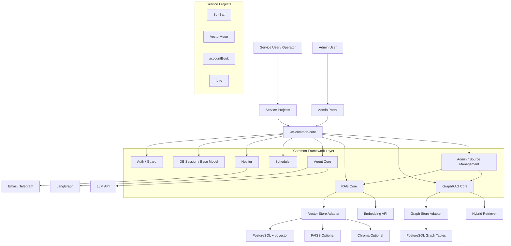
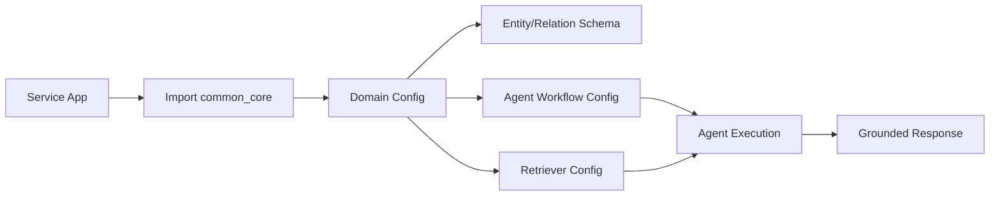
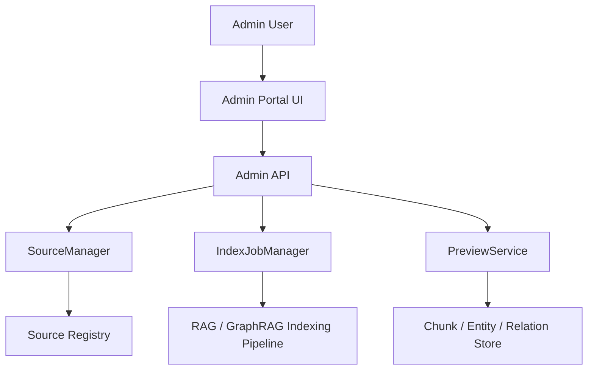
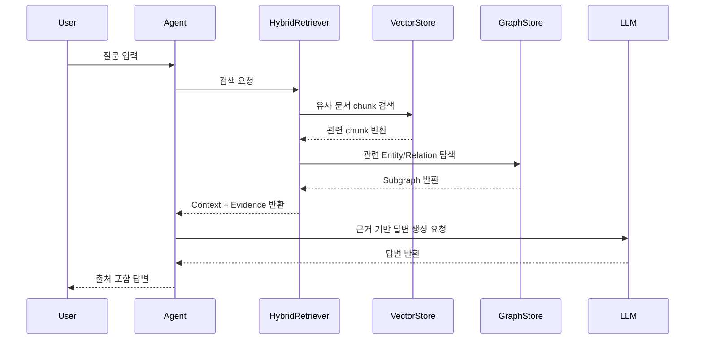
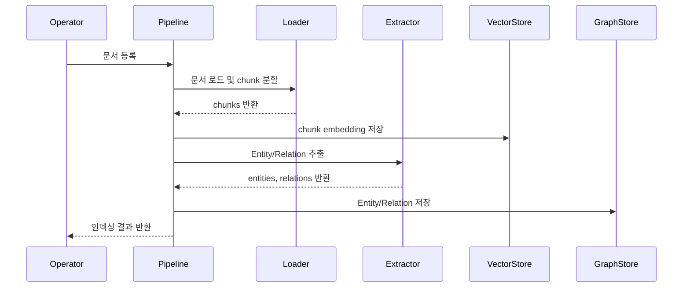
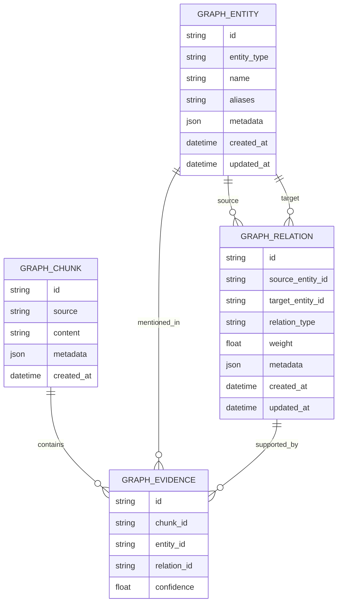
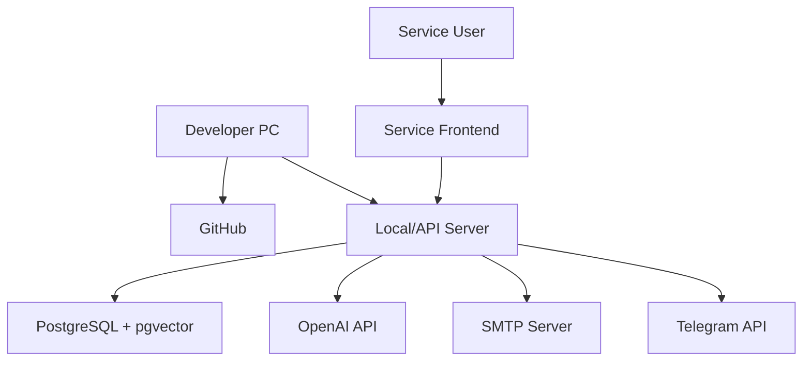
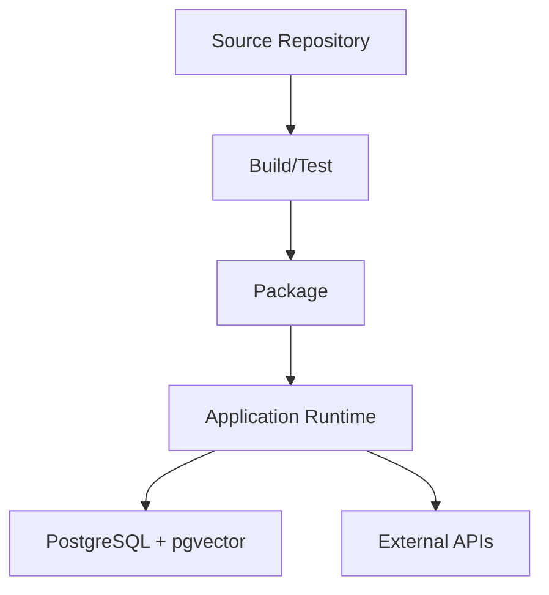
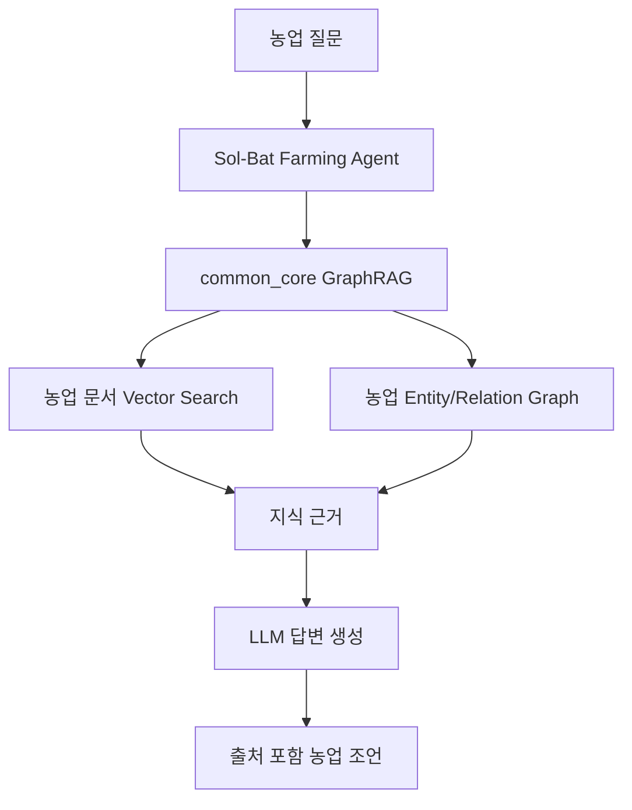

# GraphRAG AI Agent 공통 프레임워크 시스템아키텍처정의서

## 1. 문서 개요

### 1.1 목적

본 문서는 GraphRAG AI Agent 공통 프레임워크 개발 프로젝트의 시스템 아키텍처를 정의한다. 신규 AI 서비스 개발 시 반복적으로 필요한 RAG, GraphRAG, LangGraph Agent Workflow, Vector Store, Graph Store, 인증, DB, 알림, 스케줄러 기능을 공통 프레임워크로 구성하기 위한 기준 아키텍처를 제공한다.

### 1.2 적용 범위

본 문서는 다음 범위에 적용한다.

- `GraphRAG-AI-Agnet` 프로젝트 산출물 관리 구조
- `vm-common-core` 기반 공통 프레임워크 목표 구조
- 기존 프로젝트(`Sol-Bat`, `VectorMoon`, `accountBook`, `lotto`)와의 연동 구조
- GraphRAG 기반 AI Agent 실행 구조
- Vector Store, Graph Store, LLM API, DB, 알림, 스케줄러 등 주요 구성요소

### 1.3 관련 산출물

| 산출물 | 경로 |
|---|---|
| 프로젝트계획서 | `01.docs/01.산출물/100.프로젝트계획/GraphRAG_AI_Agent_공통프레임워크_프로젝트계획서.md` |
| 단계별 인력정의서 | `01.docs/01.산출물/100.프로젝트계획/GraphRAG_AI_Agent_공통프레임워크_단계별_인력정의서.md` |
| WBS | `01.docs/01.산출물/100.프로젝트계획/GraphRAG_AI_Agent_공통프레임워크_WBS.md` |
| 계획 산출물 검토 및 확정 | `01.docs/01.산출물/100.프로젝트계획/GraphRAG_AI_Agent_공통프레임워크_계획산출물_검토및확정.md` |

## 2. 아키텍처 원칙

| 원칙 | 설명 |
|---|---|
| 공통화 우선 | 여러 서비스에서 반복되는 AI Agent, RAG, GraphRAG, 인증, DB, 알림, 스케줄러 기능을 공통 모듈로 제공한다. |
| 도메인 확장 가능 | 농업, 투자, 가계부, 로또 등 서비스별 Entity/Relation Schema를 플러그인 방식으로 확장할 수 있어야 한다. |
| 저장소 독립성 | Vector Store와 Graph Store는 추상화 계층을 통해 교체 가능하게 설계한다. |
| 출처 기반 응답 | Agent 응답은 검색된 문서 chunk, 엔티티, 관계 등 근거를 추적할 수 있어야 한다. |
| 단계적 도입 | 1차는 PostgreSQL + pgvector 기반으로 구현하고, Neo4j 등 전용 Graph DB는 후속 확장 대상으로 둔다. |
| 보안 내재화 | API Key, DB Password, Token 등 민감정보는 코드와 산출물에 포함하지 않는다. |
| 운영 가능성 | 로깅, 오류 처리, 모니터링, 배치 실행, 설정 관리 기준을 공통화한다. |
| 테스트 가능성 | RAG, GraphRAG, Agent Workflow는 단위/통합/품질 테스트가 가능해야 한다. |

## 3. 전체 시스템 구성

### 3.1 전체 아키텍처 개념도



### 3.2 계층 구조

| 계층 | 구성요소 | 책임 |
|---|---|---|
| Service Layer | Sol-Bat, VectorMoon, accountBook, lotto, 신규 서비스 | 도메인 기능 구현, 사용자 요청 처리 |
| Admin Layer | Admin Portal, Source Management UI/API | 벡터화 대상 자료 등록, 검수, 인덱싱 실행, 모니터링 |
| Agent Layer | Agent Workflow, Agent State, Tool Registry | 서비스별 AI Agent 실행 흐름 제어 |
| Retrieval Layer | RAG Core, GraphRAG Core, Hybrid Retriever | 문서/벡터/그래프 기반 지식 검색 |
| Knowledge Layer | Entity, Relation, Chunk, Domain Schema | 지식 구조화 및 근거 관리 |
| Storage Layer | PostgreSQL, pgvector, FAISS, Chroma | 관계형 데이터, 벡터, 그래프 저장 |
| Common Infra Layer | Auth, DB, Notifier, Scheduler, Settings | 공통 운영 기능 |
| External Layer | OpenAI API, SMTP, Telegram, 외부 데이터 API | 외부 서비스 연동 |

## 4. 소프트웨어 구성

### 4.1 목표 패키지 구조

```text
vm-common-core/
  auth/
    jwt_handler.py
    guards.py
    models.py
  db/
    database.py
    base_model.py
    audit.py
    settings.py
  notifier/
    email.py
    telegram.py
  scheduler/
    base_scheduler.py
  ai_pipeline/
    loaders/
      document_loader.py
    vectorstores/
      factory.py
      base.py
    langgraph/
      base_state.py
      workflow_factory.py
    rag/
      document_pipeline.py
      rag_manager.py
      retriever.py
      metadata.py
    graphrag/
      schema.py
      graph_store.py
      extractor.py
      hybrid_retriever.py
      graph_state.py
      workflow.py
      domain_schema.py
```

### 4.2 핵심 모듈 정의

| 모듈 | 주요 클래스/기능 | 설명 |
|---|---|---|
| `auth` | `create_access_token`, `decode_jwt`, `get_current_user` | JWT 기반 인증 및 권한 확인 |
| `db` | `Base`, `SessionLocal`, `get_db`, `TimestampMixin` | SQLAlchemy 기반 DB 공통 기능 |
| `notifier` | `send_email`, `send_telegram_message` | 이메일/텔레그램 알림 |
| `scheduler` | `BaseScheduler` | APScheduler 기반 배치 실행 |
| `loaders` | `get_document_loader`, `load_and_split_document` | PDF, DOCX, CSV, MD 등 문서 로딩 |
| `vectorstores` | `VectorStoreFactory`, `BaseVectorStore` | pgvector, FAISS, Chroma 저장소 추상화 |
| `rag` | `RAGManager`, `DocumentPipeline`, `Retriever` | 일반 RAG 처리 |
| `graphrag` | `GraphStore`, `EntityExtractor`, `RelationExtractor`, `HybridRetriever` | GraphRAG 처리 |
| `langgraph` | `BaseAgentState`, `WorkflowFactory` | Agent Workflow 공통 구조 |
| `admin` | `SourceManager`, `IndexJobManager`, `PreviewService` | 벡터화 자료 관리와 인덱싱 운영 |

### 4.3 서비스 프로젝트 연동 방식



서비스 프로젝트는 다음 항목만 정의하고 공통 프레임워크를 사용한다.

- 서비스 도메인 Entity Type
- 서비스 도메인 Relation Type
- 문서 메타데이터 규칙
- Agent Workflow Node 구성
- Prompt Template
- Vector/Graph Store 설정

### 4.4 관리자 사이트 연동 방식

관리자 사이트는 벡터화 대상 자료를 운영자가 직접 관리하기 위한 공통 관리 계층이다.



관리자 사이트는 다음 기능을 제공한다.

| 기능 | 설명 |
|---|---|
| 자료 등록 | 파일, URL, DB record, API source 등록 |
| 자료 메타데이터 관리 | domain, source_type, scope, tenant_id, user_id, tags 관리 |
| 벡터화 실행 | 선택 자료에 대한 chunking, embedding, entity/relation 추출 실행 |
| 작업 상태 관리 | PENDING, RUNNING, SUCCESS, FAILED 상태 조회 |
| 재처리 | 실패 작업 재시도, 원문 변경 시 재인덱싱 |
| 미리보기 | chunk, embedding metadata, entity, relation, evidence 조회 |
| 삭제/비활성화 | 자료 및 연결된 vector/graph 데이터 삭제 또는 비활성화 |
| 검색 테스트 | 관리자 질의로 검색 결과와 근거 확인 |

## 5. GraphRAG 처리 구조

### 5.1 GraphRAG 주요 흐름



### 5.2 문서 인덱싱 흐름



### 5.3 Hybrid Retrieval 전략

| 단계 | 처리 | 설명 |
|---|---|---|
| 1 | Query 분석 | 사용자 질문에서 핵심 키워드, 의도, 도메인 후보 추출 |
| 2 | Vector Search | 유사 문서 chunk 검색 |
| 3 | Entity Linking | 검색된 chunk와 질문에서 Entity 후보 식별 |
| 4 | Graph Traversal | Entity 주변 Relation과 연결 Entity 탐색 |
| 5 | Reranking | chunk, entity, relation 근거를 점수화 |
| 6 | Context Assembly | LLM 입력용 근거 컨텍스트 구성 |
| 7 | Answer Generation | 출처 기반 답변 생성 |

## 6. 데이터 아키텍처

### 6.1 논리 데이터 구조



### 6.2 주요 테이블 후보

| 테이블 | 설명 |
|---|---|
| `graph_entities` | 도메인 엔티티 저장 |
| `graph_relations` | 엔티티 간 관계 저장 |
| `graph_chunks` | 문서 chunk 및 원문 근거 저장 |
| `graph_evidence` | chunk, entity, relation 근거 연결 |
| `graph_domain_schemas` | 서비스별 Entity/Relation Schema 정의 |
| `graph_index_jobs` | 문서 인덱싱 작업 이력 |
| `agent_runs` | Agent 실행 이력 |
| `agent_run_steps` | Agent Node별 실행 이력 |

### 6.3 저장소 선택

| 저장소 | 1차 적용 여부 | 용도 | 비고 |
|---|---|---|---|
| PostgreSQL | 적용 | 관계형 데이터, Graph Table | 기본 저장소 |
| pgvector | 적용 | 문서 chunk embedding 검색 | 기본 Vector Store |
| FAISS | 옵션 | 로컬 파일 기반 벡터 검색 | accountBook 유형에 적합 |
| Chroma | 옵션 | 로컬/개발용 벡터 검색 | 개발 및 실험 용도 |
| Neo4j | 후속 검토 | 전용 Graph DB | 초기 범위 제외 |

## 7. H/W 구성

### 7.1 개발 환경

| 구성요소 | 권장 사양 |
|---|---|
| OS | Windows 10/11 또는 Linux |
| CPU | 4 Core 이상 |
| Memory | 16GB 이상 권장 |
| Disk | 20GB 이상 여유 공간 |
| Python | 3.10 이상 |
| Node.js | Frontend 또는 도구 사용 시 필요 |
| Git | GitHub 연동 및 형상관리 |

### 7.2 운영 기준 환경

초기 운영은 소규모 API 서버와 PostgreSQL 기반으로 구성한다.

| 구성요소 | 권장 사양 |
|---|---|
| Application Server | 2 Core / 4GB 이상 |
| DB Server | 2 Core / 4GB 이상, PostgreSQL + pgvector |
| Storage | 문서/로그/인덱스 용량에 따라 확장 |
| Network | 외부 LLM API 호출 가능 |

## 8. N/W 구성

### 8.1 네트워크 개념도



### 8.2 외부 연동

| 외부 시스템 | 프로토콜 | 용도 | 보안 기준 |
|---|---|---|---|
| GitHub | HTTPS/Git | 소스 및 산출물 형상관리 | 인증 기반 접근 |
| OpenAI API | HTTPS | LLM, Embedding | API Key Secret 관리 |
| SMTP | SMTP/TLS | 이메일 발송 | 계정/앱 비밀번호 Secret 관리 |
| Telegram API | HTTPS | 봇 알림 | Bot Token Secret 관리 |
| Supabase/PostgreSQL | TCP/SSL | DB 및 pgvector | DB URL Secret 관리 |

## 9. DB 구성

### 9.1 DB 구성 원칙

- 1차 DB는 PostgreSQL을 기준으로 한다.
- Vector Search는 pgvector를 기본으로 사용한다.
- GraphRAG 관계 데이터는 PostgreSQL 일반 테이블로 구성한다.
- 서비스별 DB와 공통 GraphRAG DB는 논리적으로 분리 가능해야 한다.
- 모든 인덱싱 작업과 Agent 실행 이력은 추적 가능해야 한다.

### 9.2 DB 스키마 구분

| 스키마 | 용도 |
|---|---|
| `public` | 기본 서비스 데이터 또는 개발 환경 기본 스키마 |
| `common_core` | 공통 인증, 설정, 감사 로그 |
| `graphrag` | Entity, Relation, Chunk, Evidence |
| `agent` | Agent 실행 이력, Workflow 상태 |

## 10. 보안 아키텍처

### 10.1 인증/인가

| 영역 | 방식 |
|---|---|
| API 인증 | JWT Bearer Token |
| 관리자 기능 | Role 기반 접근 제어 |
| 개발 모드 인증 | 명시적 DEBUG 설정에서만 허용 |
| 서비스 간 호출 | API Key 또는 내부 토큰 방식 검토 |

### 10.2 Secret 관리

다음 값은 코드와 산출물에 포함하지 않는다.

- `OPENAI_API_KEY`
- `DATABASE_URL`
- `VECTOR_DB_URL`
- `SUPABASE_DB_URL`
- `JWT_SECRET_KEY`
- `MAIL_PASSWORD`
- `TELEGRAM_BOT_TOKEN`

### 10.3 보안 점검 항목

| 항목 | 기준 |
|---|---|
| JWT Secret | 기본값 사용 금지 |
| Google OAuth | Client ID 미설정 시 운영 우회 금지 |
| FAISS Load | 위험 역직렬화 기본 비활성화 |
| 로그 | API Key, Token, Password 출력 금지 |
| 산출물 | 민감정보 기재 금지 |
| Git | `.env`, DB 파일, 로그 파일 커밋 금지 |

## 11. 배포 아키텍처

### 11.1 초기 배포 구조



### 11.2 배포 단위

| 배포 단위 | 설명 |
|---|---|
| `vm-common-core` | 공통 프레임워크 라이브러리 |
| Service Project | 공통 프레임워크를 사용하는 개별 서비스 |
| DB Migration | GraphRAG/Agent 관련 테이블 생성 및 변경 |
| Documents | 산출물 및 사용 가이드 |

## 12. 운영 아키텍처

### 12.1 운영 관리 대상

| 대상 | 관리 항목 |
|---|---|
| Agent Run | 실행 시간, 성공/실패, 오류 메시지 |
| Retrieval | 검색 결과 수, 검색 시간, 검색 점수 |
| Indexing Job | 처리 문서 수, chunk 수, 실패 사유 |
| Source Management | 등록 자료 수, 대기/실패 작업 수, 재처리 대상 |
| LLM API | 호출 수, 응답 시간, 오류, 비용 |
| DB | 연결 상태, 쿼리 성능, 저장 용량 |
| Scheduler | 배치 실행 결과, 재시도 여부 |

### 12.2 로그 구조

| 로그 | 설명 |
|---|---|
| Application Log | API 요청, 예외, 주요 처리 흐름 |
| Agent Log | Agent Node별 실행 상태 |
| Retrieval Log | Vector/Graph 검색 요청과 결과 요약 |
| Indexing Log | 문서 인덱싱 처리 결과 |
| Security Log | 인증 실패, 권한 오류 |

## 13. 파일럿 적용 아키텍처

### 13.1 Sol-Bat 파일럿 적용 구조



### 13.2 Sol-Bat Entity/Relation 후보

| Entity Type | 예시 |
|---|---|
| `FARM` | 농장 |
| `CROP` | 호두, 고소득 작물 |
| `DISEASE` | 탄저병, 역병 |
| `PEST` | 해충 |
| `WEATHER` | 강수량, 온도, 습도 |
| `TASK` | 방제, 관수, 배수, 수확 |
| `POLICY` | 보조금, 지원사업 |
| `DOCUMENT` | 주간농사정보, 매뉴얼 |

| Relation Type | 예시 |
|---|---|
| `AFFECTS` | 날씨가 작물에 영향을 줌 |
| `CAUSES` | 병해충이 증상을 유발함 |
| `RECOMMENDS` | 문서가 작업을 권장함 |
| `APPLIES_TO` | 정책이 작물/지역에 적용됨 |
| `MENTIONED_IN` | 엔티티가 문서에 언급됨 |

## 14. 기술 스택

| 영역 | 기술 |
|---|---|
| Language | Python |
| API | FastAPI |
| Agent Workflow | LangGraph |
| LLM | OpenAI GPT 계열 |
| Embedding | OpenAI text-embedding 계열 |
| Vector Store | pgvector, FAISS, Chroma |
| Graph Store | PostgreSQL Graph Tables |
| ORM | SQLAlchemy |
| Scheduler | APScheduler |
| Auth | JWT, OAuth 연계 |
| Notification | SMTP, Telegram Bot API |
| Docs | Markdown, Mermaid |
| SCM | Git, GitHub |

## 15. 아키텍처 결정 사항

| ID | 결정 사항 | 결정 내용 | 사유 |
|---|---|---|---|
| ADR-001 | 1차 Graph Store | PostgreSQL Table | 기존 DB/pgvector 구조와 통합이 쉽고 초기 구현 비용이 낮음 |
| ADR-002 | 1차 Vector Store | pgvector | Sol-Bat, VectorMoon 구조와 정합성이 높음 |
| ADR-003 | Agent Workflow | LangGraph | 기존 프로젝트에서 이미 사용 중이며 상태 기반 workflow 구성에 적합 |
| ADR-004 | 산출물 형식 | Markdown | 빠른 작성, Git diff, Mermaid 다이어그램 관리에 유리 |
| ADR-005 | 파일럿 대상 | Sol-Bat | 농업 도메인의 Entity/Relation 구조가 GraphRAG에 적합 |
| ADR-006 | GitHub 업로드 | PM 요청 시 수행 | 작업 중 산출물 안정성 확보 |

## 16. 아키텍처 리스크 및 대응

| 리스크 ID | 내용 | 영향 | 대응 |
|---|---|---|---|
| AR-001 | GraphRAG 범위 과대 | 일정 지연 | 1차는 PostgreSQL 기반 경량 GraphRAG로 제한 |
| AR-002 | 검색 품질 미흡 | Agent 답변 품질 저하 | Hybrid Retrieval 평가 기준과 테스트 데이터셋 확보 |
| AR-003 | LLM API 비용 증가 | 운영 비용 증가 | Mock LLM, 캐시, 호출 제한 적용 |
| AR-004 | 기존 프로젝트별 구조 차이 | 공통화 난이도 증가 | Adapter와 Domain Schema 방식 적용 |
| AR-005 | DB 성능 저하 | 검색 지연 | 인덱스 설계, 검색 범위 제한, 쿼리 튜닝 |
| AR-006 | 민감정보 노출 | 보안 사고 | Secret 관리, Git ignore, 산출물 점검 |

## 17. 후속 상세화 과제

다음 항목은 후속 산출물에서 상세화한다.

| 과제 | 후속 산출물 |
|---|---|
| GraphRAG 처리 흐름 상세 | GraphRAG 아키텍처 정의서 |
| 개발 규칙 및 코딩 표준 | 개발표준정의서 |
| 기능/비기능 요구사항 | 요구사항정의서 |
| Entity/Relation 논리 모델 | 도메인정의서, 논리 ERD |
| DB 물리 구조 | 물리 ERD, 테이블정의서 |
| 클래스 및 모듈 상세 | 상세설계서 |
| 테스트 기준 | 테스트계획서, 테스트시나리오 |

## 18. 승인 및 변경 이력

### 18.1 승인 기록

| 구분 | 역할 | 승인 여부 | 일자 | 비고 |
|---|---|---|---|---|
| 작성 | 아키텍터 | 작성 완료 | 2026-06-20 | 초안 |
| 검토 | PM | 승인 필요 | - | 사용자 확인 필요 |
| 승인 | Product Owner | 승인 필요 | - | 사용자 확인 필요 |

### 18.2 변경 이력

| 버전 | 일자 | 변경 내용 | 작성자 |
|---|---|---|---|
| v0.1 | 2026-06-20 | 최초 작성 | 아키텍터 |
