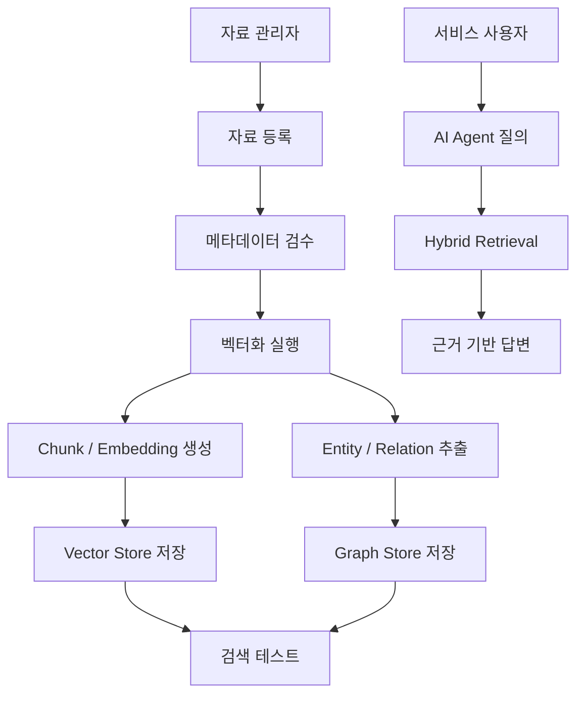
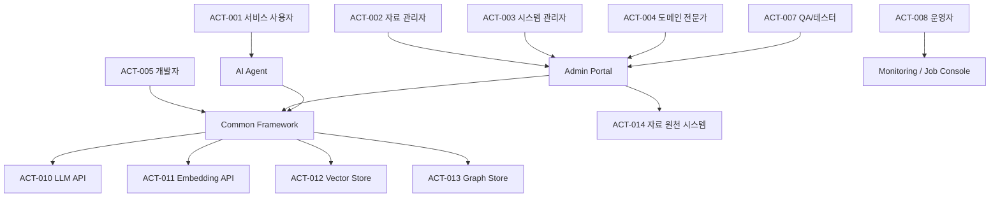

# GraphRAG AI Agent 공통 프레임워크 액터목록 및 유스케이스목록

## 1. 문서 개요

### 1.1 목적

본 문서는 GraphRAG AI Agent 공통 프레임워크 개발 프로젝트의 요구정의 단계에서 시스템과 상호작용하는 액터와 주요 유스케이스를 식별한다. 특히 벡터화 대상 자료를 관리하는 관리자 사이트의 자료 등록, 벡터화 실행, 작업 상태 모니터링 유스케이스를 포함하여 후속 요구사항정의서, 요구사항추적표, 상세설계서의 기준으로 사용한다.

### 1.2 적용 범위

본 문서는 다음 범위에 적용한다.

- GraphRAG AI Agent 공통 프레임워크
- 관리자 사이트(Admin Portal)
- 자료 등록 및 메타데이터 관리
- 벡터화/그래프화 인덱싱 작업
- Hybrid Retrieval 및 Agent 질의 처리
- 서비스 프로젝트 연동
- 운영, 모니터링, 보안, 품질 검증

### 1.3 관련 산출물

| 산출물 | 경로 |
|---|---|
| WBS | `01.docs/01.산출물/100.프로젝트계획/GraphRAG_AI_Agent_공통프레임워크_WBS.md` |
| 시스템아키텍처정의서 | `01.docs/01.산출물/200.프로젝트실행/210.아키텍처정의/GraphRAG_AI_Agent_공통프레임워크_시스템아키텍처정의서.md` |
| GraphRAG 아키텍처 정의서 | `01.docs/01.산출물/200.프로젝트실행/210.아키텍처정의/GraphRAG_AI_Agent_공통프레임워크_GraphRAG아키텍처정의서.md` |
| 데이터/저장소 아키텍처 정의서 | `01.docs/01.산출물/200.프로젝트실행/210.아키텍처정의/GraphRAG_AI_Agent_공통프레임워크_데이터저장소아키텍처정의서.md` |
| 개발표준정의서 | `01.docs/01.산출물/200.프로젝트실행/210.아키텍처정의/GraphRAG_AI_Agent_공통프레임워크_개발표준정의서.md` |

## 2. 시스템 범위 요약

### 2.1 대상 시스템

| 구분 | 설명 |
|---|---|
| 공통 프레임워크 | RAG, GraphRAG, Agent Workflow, Vector Store, Graph Store, Auth, Scheduler, Notifier 등 공통 기능 제공 |
| 관리자 사이트 | 벡터화 대상 자료 등록, 검수, 인덱싱 실행, 상태 모니터링, 검색 테스트 기능 제공 |
| 서비스 프로젝트 | `Sol-Bat`, `VectorMoon`, `accountBook`, `lotto` 및 신규 서비스에서 공통 프레임워크 사용 |
| 저장소 | PostgreSQL, pgvector, Graph Tables, 파일 저장소 또는 외부 자료 원천 |
| 외부 AI 서비스 | LLM API, Embedding API |

### 2.2 핵심 업무 흐름

## 3. 액터 목록

### 3.1 액터 정의

| 액터 ID | 액터명 | 유형 | 설명 | 주요 관심사 |
|---|---|---|---|---|
| ACT-001 | 서비스 사용자 | Primary | 서비스 프로젝트에서 AI Agent에게 질문하고 답변을 받는 사용자 | 정확한 답변, 출처, 응답 속도 |
| ACT-002 | 자료 관리자 | Primary | 관리자 사이트에서 벡터화 대상 자료를 등록하고 관리하는 사용자 | 자료 등록, 검수, 인덱싱 실행, 상태 확인 |
| ACT-003 | 시스템 관리자 | Primary | 시스템 설정, 권한, 운영 상태, 장애 대응을 담당하는 관리자 | 권한 관리, 설정 관리, 운영 안정성 |
| ACT-004 | 도메인 전문가 | Supporting | Entity/Relation Schema와 추출 결과의 품질을 검토하는 전문가 | 도메인 지식 정확도, 관계 품질 |
| ACT-005 | 개발자 | Supporting | 공통 프레임워크를 서비스 프로젝트에 연동하고 확장하는 사용자 | API, SDK, 설정, 확장성 |
| ACT-006 | PM/기획자 | Supporting | 요구사항, 범위, 우선순위, 산출물 추적을 관리하는 역할 | 요구사항 추적, 일정, 승인 |
| ACT-007 | QA/테스터 | Supporting | 기능, 검색 품질, 보안, 회귀 테스트를 수행하는 역할 | 검증 기준, 테스트 데이터, 결함 추적 |
| ACT-008 | 운영자 | Supporting | 배치, 인덱싱 작업, 로그, 모니터링을 확인하는 역할 | 장애 감지, 재처리, 이력 확인 |
| ACT-009 | 서비스 애플리케이션 | System | 공통 프레임워크를 호출하는 개별 서비스 시스템 | 안정적인 API, 도메인 분리 |
| ACT-010 | LLM API | External System | 답변 생성, Entity/Relation 추출을 수행하는 외부 AI API | 호출 안정성, 비용, 보안 |
| ACT-011 | Embedding API | External System | 문서 chunk와 질의의 embedding을 생성하는 외부 API | embedding 품질, 호출 비용 |
| ACT-012 | Vector Store | External/System | chunk embedding을 저장하고 유사도 검색을 수행하는 저장소 | 검색 성능, 권한 필터 |
| ACT-013 | Graph Store | External/System | Entity, Relation, Evidence를 저장하고 탐색하는 저장소 | 관계 탐색 성능, 정합성 |
| ACT-014 | 자료 원천 시스템 | External System | 파일, URL, DB, API 등 벡터화 대상 자료가 존재하는 원천 | 연동 방식, 접근 권한, 변경 감지 |

### 3.2 액터 관계

## 4. 유스케이스 분류

### 4.1 유스케이스 그룹

| 그룹 ID | 그룹명 | 설명 |
|---|---|---|
| UCG-001 | 관리자 사이트 | 벡터화 대상 자료와 인덱싱 작업을 관리 |
| UCG-002 | 자료 인덱싱 | chunking, embedding, entity/relation 추출, 저장 |
| UCG-003 | GraphRAG 검색 | vector search, graph traversal, hybrid retrieval |
| UCG-004 | Agent 실행 | Agent Workflow 실행, 답변 생성, 출처 제공 |
| UCG-005 | 도메인 스키마 | Entity/Relation Schema 등록 및 검증 |
| UCG-006 | 운영/모니터링 | 작업 상태, 로그, 지표, 실패 재처리 |
| UCG-007 | 보안/권한 | 로그인, 권한, scope, tenant/user 필터 |
| UCG-008 | 개발자 연동 | 서비스 프로젝트에서 공통 프레임워크 사용 |
| UCG-009 | 품질 검증 | 검색 품질, 답변 근거, 회귀 테스트 |

## 5. 유스케이스 목록

### 5.1 관리자 사이트 유스케이스

| UC ID | 유스케이스명 | 주 액터 | 보조 액터 | 우선순위 | 설명 |
|---|---|---|---|---|---|
| UC-ADM-001 | 관리자 로그인 | 자료 관리자 | 시스템 관리자 | High | 관리자 사이트에 인증 후 접근한다. |
| UC-ADM-002 | 자료 목록 조회 | 자료 관리자 | 운영자 | High | 등록된 벡터화 대상 자료와 상태를 조회한다. |
| UC-ADM-003 | 자료 등록 | 자료 관리자 | 자료 원천 시스템 | High | 파일, URL, DB, API, text 자료를 등록한다. |
| UC-ADM-004 | 자료 메타데이터 수정 | 자료 관리자 | 도메인 전문가 | High | domain, source_type, scope, tags, 설명 등을 수정한다. |
| UC-ADM-005 | 자료 상세 조회 | 자료 관리자 | 도메인 전문가 | High | 원문, chunk, entity, relation, evidence를 확인한다. |
| UC-ADM-006 | 자료 검증 | 자료 관리자 | 시스템 | High | 자료 형식, 크기, MIME type, 필수 메타데이터를 검증한다. |
| UC-ADM-007 | 벡터화 실행 | 자료 관리자 | Embedding API, Vector Store | High | 선택 자료에 대해 chunking과 embedding 생성을 실행한다. |
| UC-ADM-008 | 그래프화 실행 | 자료 관리자 | LLM API, Graph Store | High | Entity/Relation 추출 및 Evidence 저장을 실행한다. |
| UC-ADM-009 | 인덱싱 작업 상태 모니터링 | 자료 관리자 | 운영자 | High | PENDING, RUNNING, SUCCESS, FAILED 상태를 조회한다. |
| UC-ADM-010 | 실패 작업 재시도 | 자료 관리자 | 운영자 | High | 실패한 인덱싱 작업을 재실행한다. |
| UC-ADM-011 | 자료 재인덱싱 | 자료 관리자 | 시스템 | Medium | 원문 또는 메타데이터 변경 시 기존 지식을 갱신한다. |
| UC-ADM-012 | 자료 비활성화 | 자료 관리자 | 시스템 관리자 | Medium | 특정 자료를 검색 대상에서 제외한다. |
| UC-ADM-013 | 자료 삭제 | 자료 관리자 | 시스템 관리자 | Medium | 자료와 연결된 vector/graph 데이터를 삭제 또는 soft delete한다. |
| UC-ADM-014 | 검색 테스트 실행 | 자료 관리자 | GraphRAG Engine | High | 관리자 질의로 vector/graph/hybrid 검색 결과를 검증한다. |
| UC-ADM-015 | 추출 결과 보정 요청 | 도메인 전문가 | 자료 관리자 | Medium | Entity/Relation 추출 결과의 보정 필요 사항을 기록한다. |
| UC-ADM-016 | 작업 이력 조회 | 운영자 | 자료 관리자 | Medium | 인덱싱 작업의 실행 시간, 처리량, 오류 내용을 조회한다. |

### 5.2 자료 인덱싱 유스케이스

| UC ID | 유스케이스명 | 주 액터 | 보조 액터 | 우선순위 | 설명 |
|---|---|---|---|---|---|
| UC-IDX-001 | 자료 로드 | 시스템 | 자료 원천 시스템 | High | 등록된 source에서 원문을 로드한다. |
| UC-IDX-002 | 자료 파싱 | 시스템 | - | High | PDF, DOCX, CSV, MD, text 등의 내용을 text로 변환한다. |
| UC-IDX-003 | Chunk 생성 | 시스템 | - | High | 원문을 검색 가능한 chunk 단위로 분할한다. |
| UC-IDX-004 | Embedding 생성 | 시스템 | Embedding API | High | chunk embedding을 생성한다. |
| UC-IDX-005 | Vector 저장 | 시스템 | Vector Store | High | chunk와 embedding을 Vector Store에 저장한다. |
| UC-IDX-006 | Entity 추출 | 시스템 | LLM API | High | chunk에서 Entity 후보를 추출한다. |
| UC-IDX-007 | Relation 추출 | 시스템 | LLM API | High | Entity 간 Relation 후보를 추출한다. |
| UC-IDX-008 | Entity 정규화 | 시스템 | 도메인 전문가 | Medium | 중복 Entity를 병합하고 alias를 관리한다. |
| UC-IDX-009 | Evidence 연결 | 시스템 | Graph Store | High | chunk와 Entity/Relation의 근거 연결을 저장한다. |
| UC-IDX-010 | Index Job 기록 | 시스템 | 운영자 | High | 작업 상태, 처리 건수, 오류 메시지를 기록한다. |

### 5.3 GraphRAG 검색 및 Agent 유스케이스

| UC ID | 유스케이스명 | 주 액터 | 보조 액터 | 우선순위 | 설명 |
|---|---|---|---|---|---|
| UC-SRCH-001 | 사용자 질의 입력 | 서비스 사용자 | 서비스 애플리케이션 | High | 사용자가 AI Agent에 질문을 입력한다. |
| UC-SRCH-002 | 질의 분석 | 시스템 | LLM API | High | 질문의 의도, 키워드, Entity 후보를 분석한다. |
| UC-SRCH-003 | Vector Search 수행 | 시스템 | Vector Store | High | 질문과 유사한 chunk를 검색한다. |
| UC-SRCH-004 | Graph Traversal 수행 | 시스템 | Graph Store | High | 관련 Entity/Relation subgraph를 탐색한다. |
| UC-SRCH-005 | Hybrid Retrieval 수행 | 시스템 | Vector Store, Graph Store | High | vector 결과와 graph 결과를 통합하고 재정렬한다. |
| UC-SRCH-006 | Context Assembly 수행 | 시스템 | - | High | LLM 입력용 근거 컨텍스트를 구성한다. |
| UC-SRCH-007 | 근거 기반 답변 생성 | 시스템 | LLM API | High | 검색 근거를 기반으로 답변을 생성한다. |
| UC-SRCH-008 | 출처 제공 | 시스템 | 서비스 사용자 | High | 답변에 원문 출처, chunk, evidence 정보를 제공한다. |
| UC-SRCH-009 | 근거 부족 응답 | 시스템 | 서비스 사용자 | High | 충분한 근거가 없으면 추정 답변을 제한한다. |

### 5.4 도메인 스키마 및 서비스 연동 유스케이스

| UC ID | 유스케이스명 | 주 액터 | 보조 액터 | 우선순위 | 설명 |
|---|---|---|---|---|---|
| UC-DOM-001 | 도메인 등록 | 개발자 | 도메인 전문가 | High | 서비스별 domain을 등록한다. |
| UC-DOM-002 | Entity Type 정의 | 도메인 전문가 | 개발자 | High | 도메인별 Entity Type을 정의한다. |
| UC-DOM-003 | Relation Type 정의 | 도메인 전문가 | 개발자 | High | 도메인별 Relation Type과 방향성을 정의한다. |
| UC-DOM-004 | 도메인 스키마 검증 | 시스템 | 도메인 전문가 | High | 등록된 Entity/Relation Schema의 유효성을 검증한다. |
| UC-DOM-005 | 서비스 프로젝트 연동 | 개발자 | 서비스 애플리케이션 | High | 공통 프레임워크를 서비스 프로젝트에서 호출한다. |
| UC-DOM-006 | Agent Workflow 구성 | 개발자 | GraphRAG Engineer | Medium | 서비스별 Agent Workflow에 GraphRAG 노드를 연결한다. |

### 5.5 운영, 보안, 품질 유스케이스

| UC ID | 유스케이스명 | 주 액터 | 보조 액터 | 우선순위 | 설명 |
|---|---|---|---|---|---|
| UC-OPS-001 | 운영 지표 조회 | 운영자 | 시스템 관리자 | Medium | 인덱싱 성공률, 검색 지연, LLM 호출량 등을 조회한다. |
| UC-OPS-002 | 오류 로그 조회 | 운영자 | 개발자 | Medium | 작업 실패, 검색 실패, API 오류 로그를 확인한다. |
| UC-OPS-003 | 작업 알림 수신 | 운영자 | Notifier | Low | 인덱싱 실패 또는 장시간 실행 작업 알림을 받는다. |
| UC-SEC-001 | 관리자 권한 확인 | 시스템 | 시스템 관리자 | High | 관리자 API 호출 시 Role 기반 접근을 확인한다. |
| UC-SEC-002 | 자료 접근 범위 필터링 | 시스템 | Vector Store, Graph Store | High | domain, scope, tenant_id, user_id 기준으로 검색 권한을 제한한다. |
| UC-SEC-003 | 민감정보 마스킹 | 시스템 | 자료 관리자 | High | 원문, 로그, 미리보기에서 민감정보 노출을 제한한다. |
| UC-QA-001 | 검색 품질 테스트 | QA/테스터 | 도메인 전문가 | High | 기대 source, entity, relation 기준으로 검색 품질을 검증한다. |
| UC-QA-002 | 답변 근거 검증 | QA/테스터 | 서비스 사용자 | High | 답변이 evidence에 근거하는지 검증한다. |
| UC-QA-003 | 회귀 테스트 수행 | QA/테스터 | 개발자 | Medium | 프롬프트, 검색 가중치, 모델 변경 후 품질 저하 여부를 확인한다. |

## 6. 핵심 유스케이스 상세

### 6.1 UC-ADM-003 자료 등록

| 항목 | 내용 |
|---|---|
| 유스케이스 ID | UC-ADM-003 |
| 유스케이스명 | 자료 등록 |
| 주 액터 | 자료 관리자 |
| 보조 액터 | 자료 원천 시스템 |
| 목적 | 벡터화 및 GraphRAG 인덱싱 대상 자료를 시스템에 등록한다. |
| 선행 조건 | 관리자가 로그인되어 있고 자료 등록 권한을 보유한다. |
| 후행 조건 | `graphrag_sources`에 source가 등록되고 상태가 `REGISTERED` 또는 `VALIDATED`로 저장된다. |
| 우선순위 | High |

#### 기본 흐름

1. 자료 관리자가 관리자 사이트의 자료 등록 화면에 접근한다.
2. 자료 유형을 선택한다. 예: file, url, db, api, text.
3. 자료명, domain, source_type, scope, tags, 설명 등 메타데이터를 입력한다.
4. 시스템은 필수 입력값, 파일 크기, 확장자, MIME type, URL 형식 등을 검증한다.
5. 시스템은 중복 자료 여부를 `content_hash` 또는 `source_uri` 기준으로 확인한다.
6. 자료 관리자가 등록을 요청한다.
7. 시스템은 `graphrag_sources`에 자료 정보를 저장한다.
8. 시스템은 등록 결과와 source_id를 반환한다.

#### 대안 흐름

| 흐름 ID | 조건 | 처리 |
|---|---|---|
| A1 | 필수 메타데이터 누락 | 누락 항목을 표시하고 저장하지 않는다. |
| A2 | 허용되지 않은 파일 형식 | 등록을 중단하고 허용 형식을 안내한다. |
| A3 | 중복 자료 감지 | 기존 자료와 비교 정보를 표시하고 덮어쓰기 또는 새 버전 등록 여부를 선택하게 한다. |
| A4 | 원천 시스템 접근 실패 | 실패 사유를 표시하고 자료 상태를 저장하지 않는다. |

#### 예외 흐름

| 예외 ID | 조건 | 처리 |
|---|---|---|
| E1 | DB 저장 실패 | 오류 로그를 남기고 사용자에게 등록 실패 메시지를 표시한다. |
| E2 | 권한 없음 | 접근을 차단하고 보안 로그를 기록한다. |

#### 주요 데이터

| 데이터 | 설명 |
|---|---|
| `domain` | 서비스 또는 지식 영역 |
| `source_type` | file, url, db, api, text |
| `source_uri` | 파일 경로, URL, DB 식별자 등 |
| `scope` | PUBLIC, PRIVATE, SYSTEM |
| `tenant_id` | 조직/테넌트 식별자 |
| `user_id` | 사용자 식별자 |
| `tags` | 검색 및 관리 태그 |
| `status` | REGISTERED, VALIDATED 등 |
| `content_hash` | 중복 탐지 및 변경 감지용 hash |

### 6.2 UC-ADM-007 벡터화 실행

| 항목 | 내용 |
|---|---|
| 유스케이스 ID | UC-ADM-007 |
| 유스케이스명 | 벡터화 실행 |
| 주 액터 | 자료 관리자 |
| 보조 액터 | Embedding API, Vector Store |
| 목적 | 등록된 자료를 chunk로 분할하고 embedding을 생성하여 Vector Store에 저장한다. |
| 선행 조건 | 자료 상태가 `REGISTERED` 또는 `VALIDATED`이며 인덱싱 실행 권한이 있다. |
| 후행 조건 | vector 저장이 완료되고 Index Job 상태가 `SUCCESS` 또는 `FAILED`로 기록된다. |
| 우선순위 | High |

#### 기본 흐름

1. 자료 관리자가 자료 상세 또는 목록 화면에서 벡터화 실행을 선택한다.
2. 시스템은 자료 상태와 권한을 확인한다.
3. 시스템은 `graphrag_index_jobs`에 작업을 생성하고 상태를 `PENDING`으로 저장한다.
4. 시스템은 작업을 시작하며 상태를 `RUNNING`으로 변경한다.
5. 시스템은 원문을 로드하고 파싱한다.
6. 시스템은 chunking 옵션에 따라 chunk를 생성한다.
7. 시스템은 Embedding API를 호출하여 chunk embedding을 생성한다.
8. 시스템은 chunk와 embedding을 Vector Store에 저장한다.
9. 시스템은 처리 건수, 소요 시간, 오류 여부를 기록한다.
10. 시스템은 작업 상태를 `SUCCESS`로 변경한다.

#### 대안 흐름

| 흐름 ID | 조건 | 처리 |
|---|---|---|
| A1 | 이미 인덱싱된 자료 | 재인덱싱 여부를 확인한다. |
| A2 | 일부 chunk embedding 실패 | 실패 chunk를 기록하고 정책에 따라 부분 성공 또는 실패 처리한다. |
| A3 | Embedding API 제한 | 재시도하거나 작업을 `FAILED`로 기록한다. |

#### 예외 흐름

| 예외 ID | 조건 | 처리 |
|---|---|---|
| E1 | 자료 로드 실패 | 작업을 `FAILED`로 변경하고 실패 사유를 저장한다. |
| E2 | Vector Store 장애 | 작업을 `FAILED`로 변경하고 운영자 알림 대상으로 기록한다. |
| E3 | 권한 없음 | 작업 생성을 차단하고 보안 로그를 기록한다. |

### 6.3 UC-ADM-009 인덱싱 작업 상태 모니터링

| 항목 | 내용 |
|---|---|
| 유스케이스 ID | UC-ADM-009 |
| 유스케이스명 | 인덱싱 작업 상태 모니터링 |
| 주 액터 | 자료 관리자 |
| 보조 액터 | 운영자 |
| 목적 | 벡터화/그래프화 인덱싱 작업의 진행 상태와 실패 사유를 확인한다. |
| 선행 조건 | 관리자가 로그인되어 있고 작업 조회 권한을 보유한다. |
| 후행 조건 | 관리자가 작업 상태, 처리 건수, 실패 사유, 재처리 필요 여부를 확인한다. |
| 우선순위 | High |

#### 기본 흐름

1. 자료 관리자 또는 운영자가 인덱싱 작업 화면에 접근한다.
2. 시스템은 최근 작업 목록을 조회한다.
3. 사용자는 domain, source, status, 기간 조건으로 작업을 필터링한다.
4. 시스템은 작업 상태, 시작/종료 시간, 처리 chunk 수, entity 수, relation 수, 오류 메시지를 표시한다.
5. 사용자는 특정 작업을 선택하여 상세 이력을 확인한다.
6. 실패 작업의 경우 사용자는 재시도 또는 재인덱싱을 요청할 수 있다.

#### 상태 정의

| 상태 | 설명 | 후속 조치 |
|---|---|---|
| PENDING | 작업 생성 후 실행 대기 | 실행 대기 |
| RUNNING | 인덱싱 실행 중 | 진행률 확인 |
| SUCCESS | 인덱싱 완료 | 검색 테스트 가능 |
| FAILED | 인덱싱 실패 | 오류 확인 및 재시도 |
| CANCELED | 사용자 또는 시스템에 의해 취소 | 필요 시 재실행 |

#### 예외 흐름

| 예외 ID | 조건 | 처리 |
|---|---|---|
| E1 | 작업 목록 조회 실패 | 오류 메시지를 표시하고 로그를 기록한다. |
| E2 | 작업 상세 이력 없음 | 기본 작업 정보만 표시하고 이력 누락을 경고한다. |

### 6.4 UC-ADM-014 검색 테스트 실행

| 항목 | 내용 |
|---|---|
| 유스케이스 ID | UC-ADM-014 |
| 유스케이스명 | 검색 테스트 실행 |
| 주 액터 | 자료 관리자 |
| 보조 액터 | GraphRAG Engine |
| 목적 | 인덱싱된 자료가 실제 질의에서 적절히 검색되는지 검증한다. |
| 선행 조건 | 자료가 `INDEXED` 상태이며 검색 테스트 권한이 있다. |
| 후행 조건 | 검색 결과, score, chunk, entity, relation, evidence가 화면에 표시된다. |
| 우선순위 | High |

#### 기본 흐름

1. 관리자가 검색 테스트 화면에 접근한다.
2. domain, scope, 검색 방식(vector, graph, hybrid)을 선택한다.
3. 테스트 질의를 입력한다.
4. 시스템은 권한 필터를 적용한다.
5. 시스템은 선택된 방식으로 검색을 수행한다.
6. 시스템은 검색 결과와 score, 출처, 관련 Entity/Relation을 표시한다.
7. 관리자는 결과를 확인하고 필요 시 자료 재인덱싱 또는 스키마 보정을 요청한다.

## 7. 유스케이스 우선순위

### 7.1 MVP 포함 대상

| 우선순위 | UC ID | 유스케이스명 | 선정 사유 |
|---:|---|---|---|
| 1 | UC-ADM-003 | 자료 등록 | 관리자 사이트의 시작점 |
| 2 | UC-ADM-007 | 벡터화 실행 | RAG/GraphRAG 자료화 핵심 기능 |
| 3 | UC-ADM-009 | 인덱싱 작업 상태 모니터링 | 운영 가능성 확보 |
| 4 | UC-IDX-003 | Chunk 생성 | 검색 단위 생성 핵심 |
| 5 | UC-IDX-004 | Embedding 생성 | Vector Search 필수 |
| 6 | UC-IDX-005 | Vector 저장 | 검색 저장소 반영 |
| 7 | UC-SRCH-005 | Hybrid Retrieval 수행 | GraphRAG 가치 검증 |
| 8 | UC-SRCH-007 | 근거 기반 답변 생성 | Agent 사용자 가치 |
| 9 | UC-SEC-001 | 관리자 권한 확인 | 관리자 기능 보안 필수 |
| 10 | UC-SEC-002 | 자료 접근 범위 필터링 | private 지식 보호 필수 |

### 7.2 후속 확장 대상

| UC ID | 유스케이스명 | 후속 검토 사유 |
|---|---|---|
| UC-ADM-015 | 추출 결과 보정 요청 | 수동 보정 UI/Workflow 상세화 필요 |
| UC-OPS-003 | 작업 알림 수신 | Notifier 연동 정책 확정 필요 |
| UC-DOM-006 | Agent Workflow 구성 | 설계 단계에서 LangGraph Template 상세화 필요 |
| UC-QA-003 | 회귀 테스트 수행 | 테스트 데이터셋 확정 후 구체화 필요 |

## 8. 유스케이스 추적 후보

후속 요구사항정의서에서는 다음 기준으로 기능 요구사항 ID를 부여한다.

| 요구사항 그룹 | 대상 유스케이스 | 요구사항 ID 후보 |
|---|---|---|
| 관리자 인증/권한 | UC-ADM-001, UC-SEC-001 | FR-ADM-AUTH-001~ |
| 자료 관리 | UC-ADM-002~UC-ADM-006 | FR-ADM-SRC-001~ |
| 인덱싱 실행 | UC-ADM-007~UC-ADM-011, UC-IDX-001~UC-IDX-010 | FR-IDX-001~ |
| 검색 테스트 | UC-ADM-014, UC-SRCH-003~UC-SRCH-005 | FR-ADM-TEST-001~ |
| Agent 질의 | UC-SRCH-001~UC-SRCH-009 | FR-AGT-001~ |
| 도메인 스키마 | UC-DOM-001~UC-DOM-006 | FR-DOM-001~ |
| 운영/모니터링 | UC-OPS-001~UC-OPS-003 | FR-OPS-001~ |
| 보안/접근제어 | UC-SEC-001~UC-SEC-003 | NFR-SEC-001~ |
| 품질 검증 | UC-QA-001~UC-QA-003 | NFR-QA-001~ |

## 9. 주요 화면 후보

| 화면 ID | 화면명 | 관련 유스케이스 | 주요 표시/입력 항목 |
|---|---|---|---|
| UI-ADM-001 | 관리자 로그인 | UC-ADM-001 | ID, Password 또는 OAuth |
| UI-ADM-002 | 자료 목록 | UC-ADM-002, UC-ADM-009 | 자료명, domain, source_type, status, 최근 작업 상태 |
| UI-ADM-003 | 자료 등록 | UC-ADM-003 | 파일/URL/text, domain, scope, tags, 설명 |
| UI-ADM-004 | 자료 상세 | UC-ADM-004, UC-ADM-005 | 원문 정보, chunk, entity, relation, evidence |
| UI-ADM-005 | 인덱싱 작업 | UC-ADM-007~UC-ADM-011 | 작업 상태, 진행률, 실패 사유, 재시도 |
| UI-ADM-006 | 검색 테스트 | UC-ADM-014 | 테스트 질의, 검색 방식, score, evidence |
| UI-ADM-007 | 도메인 스키마 | UC-DOM-001~UC-DOM-004 | Entity Type, Relation Type, 검증 규칙 |
| UI-ADM-008 | 운영 지표 | UC-OPS-001, UC-OPS-002 | 성공률, 실패 건수, 지연 시간, 오류 로그 |

## 10. 주요 데이터 후보

| 데이터 객체 | 설명 | 관련 유스케이스 |
|---|---|---|
| Source | 벡터화 대상 자료의 등록 정보 | UC-ADM-002~UC-ADM-013 |
| IndexJob | 인덱싱 작업 이력과 상태 | UC-ADM-007~UC-ADM-011, UC-IDX-010 |
| Chunk | 원문 분할 단위 | UC-IDX-003, UC-SRCH-003 |
| Embedding | chunk 또는 query의 vector 표현 | UC-IDX-004, UC-SRCH-003 |
| Entity | 도메인 주요 개념 | UC-IDX-006, UC-SRCH-004 |
| Relation | Entity 간 관계 | UC-IDX-007, UC-SRCH-004 |
| Evidence | chunk와 Entity/Relation의 근거 연결 | UC-IDX-009, UC-SRCH-008 |
| DomainSchema | 도메인별 Entity/Relation 정의 | UC-DOM-001~UC-DOM-004 |
| AgentRun | Agent 실행 이력 | UC-SRCH-001~UC-SRCH-009 |
| AuditLog | 관리자 작업 감사 로그 | UC-SEC-001, UC-ADM-013 |

## 11. 비기능 요구사항 도출 후보

| 구분 | 요구 방향 | 관련 유스케이스 |
|---|---|---|
| 보안 | 관리자 기능은 Role 기반 권한을 적용한다. | UC-ADM-001, UC-SEC-001 |
| 접근제어 | 검색 시 domain, scope, tenant_id, user_id 필터를 적용한다. | UC-SEC-002, UC-SRCH-003~UC-SRCH-005 |
| 감사 | 자료 등록, 수정, 삭제, 인덱싱 실행은 audit log를 남긴다. | UC-ADM-003, UC-ADM-004, UC-ADM-007, UC-ADM-013 |
| 성능 | 검색 응답 시간과 인덱싱 처리 시간을 측정 가능해야 한다. | UC-SRCH-005, UC-OPS-001 |
| 신뢰성 | 인덱싱 실패 시 실패 사유와 재시도 수단을 제공한다. | UC-ADM-009, UC-ADM-010 |
| 확장성 | Vector Store, Graph Store, LLM Provider는 교체 가능해야 한다. | UC-IDX-004, UC-IDX-005, UC-SRCH-005 |
| 품질 | 답변은 검색 근거와 출처를 포함해야 한다. | UC-SRCH-007, UC-SRCH-008 |
| 개인정보 | 미리보기, 로그, 검색 결과에서 민감정보 마스킹을 지원한다. | UC-SEC-003 |

## 12. 검토 필요 사항

| 항목 | 검토 내용 | 담당 후보 |
|---|---|---|
| 관리자 사이트 기술 스택 | FastAPI admin template, React, Next.js 등 선택 필요 | 아키텍터, 개발자 |
| 파일 저장소 | 로컬 파일, DB 저장, Object Storage 중 1차 방식 결정 필요 | Data Engineer, Architect |
| 인덱싱 비동기 처리 | APScheduler, Background Task, Celery/RQ 도입 시점 결정 필요 | Architect, DevOps |
| 수동 보정 범위 | Entity/Relation 수동 수정 기능을 MVP에 포함할지 결정 필요 | PM, 도메인 전문가 |
| 검색 테스트 기준 | vector/graph/hybrid 각각의 결과 표시 기준 결정 필요 | GraphRAG Engineer, QA |
| 삭제 정책 | soft delete와 hard delete 기준 결정 필요 | PM, Security Engineer, DBA |

## 13. 승인 및 변경 이력

### 13.1 승인 기록

| 구분 | 역할 | 승인 여부 | 일자 | 비고 |
|---|---|---|---|---|
| 작성 | 기획자 | 작성 완료 | 2026-06-20 | 초안 |
| 검토 | PM | 승인 필요 | - | 사용자 확인 필요 |
| 검토 | 아키텍터 | 승인 필요 | - | 후속 요구사항정의서 연계 검토 |
| 승인 | Product Owner | 승인 필요 | - | 사용자 확인 필요 |

### 13.2 변경 이력

| 버전 | 일자 | 변경 내용 | 작성자 |
|---|---|---|---|
| v0.1 | 2026-06-20 | 액터목록 및 유스케이스목록 최초 작성 | 기획자 |
