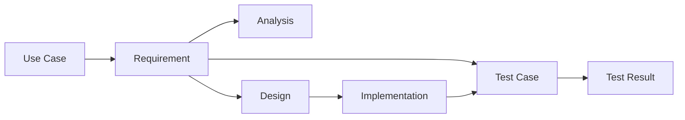

# GraphRAG AI Agent 공통 프레임워크 요구사항추적표

## 1. 문서 개요

### 1.1 목적

본 문서는 GraphRAG AI Agent 공통 프레임워크 개발 프로젝트의 요구사항이 유스케이스, 설계, 구현, 테스트 산출물까지 일관되게 추적될 수 있도록 요구사항 추적 기준을 정의한다. 요구사항 누락, 범위 변경, 테스트 미검증 항목을 관리하기 위한 기준 문서로 사용한다.

### 1.2 적용 범위

본 문서는 다음 요구사항 영역에 적용한다.

- 관리자 사이트(Admin Portal)
- 자료 등록 및 자료 관리
- 자료 인덱싱
- GraphRAG 검색
- Agent 실행
- 도메인 스키마
- 운영/모니터링
- 개발자 연동
- 보안, 성능, 신뢰성, 유지보수성, 품질
- AI 품질

### 1.3 관련 산출물

| 산출물 | 경로 |
|---|---|
| 액터목록 및 유스케이스목록 | `01.docs/01.산출물/200.프로젝트실행/220.요구정의/GraphRAG_AI_Agent_공통프레임워크_액터목록_유스케이스목록.md` |
| 요구사항정의서 | `01.docs/01.산출물/200.프로젝트실행/220.요구정의/GraphRAG_AI_Agent_공통프레임워크_요구사항정의서.md` |
| 시스템아키텍처정의서 | `01.docs/01.산출물/200.프로젝트실행/210.아키텍처정의/GraphRAG_AI_Agent_공통프레임워크_시스템아키텍처정의서.md` |
| GraphRAG 아키텍처 정의서 | `01.docs/01.산출물/200.프로젝트실행/210.아키텍처정의/GraphRAG_AI_Agent_공통프레임워크_GraphRAG아키텍처정의서.md` |
| 데이터/저장소 아키텍처 정의서 | `01.docs/01.산출물/200.프로젝트실행/210.아키텍처정의/GraphRAG_AI_Agent_공통프레임워크_데이터저장소아키텍처정의서.md` |
| 개발표준정의서 | `01.docs/01.산출물/200.프로젝트실행/210.아키텍처정의/GraphRAG_AI_Agent_공통프레임워크_개발표준정의서.md` |

## 2. 추적 기준

### 2.1 추적 방향

### 2.2 추적 상태

| 상태 | 설명 |
|---|---|
| 정의 | 요구사항정의서에 요구사항이 정의됨 |
| 설계대기 | 후속 설계 산출물에 반영 필요 |
| 설계반영 | 상세설계, API 명세, ERD 등에 반영됨 |
| 구현대기 | 구현 대상이나 아직 구현 전 |
| 구현완료 | 소스 또는 설정으로 구현 완료 |
| 테스트대기 | 테스트 시나리오 또는 테스트 케이스 작성 필요 |
| 테스트완료 | 테스트 수행 및 결과 확인 완료 |
| 보류 | 의사결정 또는 후속 범위로 보류 |

### 2.3 산출물 약어

| 약어 | 산출물 |
|---|---|
| UC | 액터목록 및 유스케이스목록 |
| REQ | 요구사항정의서 |
| ANA | 공통기능분석서, 도메인정의서 |
| DES | 상세설계서, API 명세서, ERD, 테이블정의서 |
| IMP | 구현 소스, 설정, 샘플 코드 |
| TST | 테스트계획서, 테스트시나리오, 테스트결과서 |
| OPS | 운영자매뉴얼, 운영 체크리스트 |

## 3. 요구사항 추적 매트릭스

### 3.1 관리자 인증/권한

| 요구사항 ID | 요구사항명 | 관련 UC | 우선순위 | 설계 추적 대상 | 구현 추적 대상 | 테스트 추적 대상 | 상태 |
|---|---|---|---|---|---|---|---|
| FR-ADM-AUTH-001 | 관리자 로그인 | UC-ADM-001 | High | 관리자 API/화면 설계, 인증 설계 | Admin Auth, Login API | 미인증 접근 차단 테스트 | 설계대기 |
| FR-ADM-AUTH-002 | 관리자 Role 확인 | UC-SEC-001 | High | 권한 모델, Role 정책 | Auth Guard, RBAC Middleware | Role별 접근 테스트 | 설계대기 |
| FR-ADM-AUTH-003 | 관리자 작업 감사 로그 | UC-ADM-003, UC-ADM-013 | High | Audit Log 테이블/이벤트 설계 | Audit Logger | 등록/수정/삭제 감사 로그 테스트 | 설계대기 |

### 3.2 관리자 자료 관리

| 요구사항 ID | 요구사항명 | 관련 UC | 우선순위 | 설계 추적 대상 | 구현 추적 대상 | 테스트 추적 대상 | 상태 |
|---|---|---|---|---|---|---|---|
| FR-ADM-SRC-001 | 자료 목록 조회 | UC-ADM-002 | High | 자료 목록 화면, `GET /admin/sources` | SourceManager, Admin Source API | 자료 목록 조회 테스트 | 설계대기 |
| FR-ADM-SRC-002 | 자료 조건 검색 | UC-ADM-002 | Medium | 검색 조건, 페이징 설계 | Source Query API | 조건별 필터 테스트 | 설계대기 |
| FR-ADM-SRC-003 | 자료 등록 | UC-ADM-003 | High | 자료 등록 화면, `POST /admin/sources` | SourceManager.create | 자료 등록 정상/예외 테스트 | 설계대기 |
| FR-ADM-SRC-004 | 자료 메타데이터 입력 | UC-ADM-003 | High | Source DTO, 입력 검증 설계 | Source Validation | 필수값 검증 테스트 | 설계대기 |
| FR-ADM-SRC-005 | 자료 형식 검증 | UC-ADM-006 | High | 파일/URL 검증 정책 | Source Validator | 허용/차단 형식 테스트 | 설계대기 |
| FR-ADM-SRC-006 | 자료 중복 확인 | UC-ADM-003 | Medium | 중복 기준, hash 정책 | Content Hash, Duplicate Check | 중복 자료 등록 테스트 | 설계대기 |
| FR-ADM-SRC-007 | 자료 상세 조회 | UC-ADM-005 | High | 자료 상세 화면, preview API | PreviewService | chunk/entity/relation 조회 테스트 | 설계대기 |
| FR-ADM-SRC-008 | 자료 메타데이터 수정 | UC-ADM-004 | High | `PATCH /admin/sources/{id}` | SourceManager.update | 메타데이터 수정 테스트 | 설계대기 |
| FR-ADM-SRC-009 | 자료 비활성화 | UC-ADM-012 | Medium | Source status 정책 | SourceManager.disable | 비활성 자료 검색 제외 테스트 | 설계대기 |
| FR-ADM-SRC-010 | 자료 삭제 | UC-ADM-013 | Medium | 삭제/soft delete 정책 | SourceManager.delete | 삭제 및 연관 데이터 처리 테스트 | 설계대기 |

### 3.3 관리자 검색 테스트

| 요구사항 ID | 요구사항명 | 관련 UC | 우선순위 | 설계 추적 대상 | 구현 추적 대상 | 테스트 추적 대상 | 상태 |
|---|---|---|---|---|---|---|---|
| FR-ADM-TEST-001 | 검색 테스트 실행 | UC-ADM-014 | High | 검색 테스트 화면/API | Admin SearchTest API | 테스트 질의 검색 실행 테스트 | 설계대기 |
| FR-ADM-TEST-002 | 검색 방식 선택 | UC-ADM-014 | Medium | vector/graph/hybrid 옵션 | Retriever Mode Selector | 검색 방식별 결과 테스트 | 설계대기 |
| FR-ADM-TEST-003 | 검색 결과 근거 표시 | UC-ADM-014 | High | 결과 표시 항목 설계 | Search Result Formatter | score/source/evidence 표시 테스트 | 설계대기 |

### 3.4 자료 인덱싱

| 요구사항 ID | 요구사항명 | 관련 UC | 우선순위 | 설계 추적 대상 | 구현 추적 대상 | 테스트 추적 대상 | 상태 |
|---|---|---|---|---|---|---|---|
| FR-IDX-001 | 인덱싱 작업 생성 | UC-ADM-007, UC-IDX-010 | High | `graphrag_index_jobs` 테이블, Job API | IndexJobManager.create | 작업 생성 상태 테스트 | 설계대기 |
| FR-IDX-002 | 자료 로드 | UC-IDX-001 | High | Loader 인터페이스 | DocumentLoader | 파일/URL/text 로드 테스트 | 설계대기 |
| FR-IDX-003 | 자료 파싱 | UC-IDX-002 | High | Parser 설계 | Document Parser | PDF/DOCX/CSV/MD 파싱 테스트 | 설계대기 |
| FR-IDX-004 | Chunk 생성 | UC-IDX-003 | High | Chunking 정책 | Chunker | chunk size/overlap 테스트 | 설계대기 |
| FR-IDX-005 | Embedding 생성 | UC-IDX-004 | High | EmbeddingProvider 설계 | EmbeddingProvider | embedding 생성/실패 테스트 | 설계대기 |
| FR-IDX-006 | Vector Store 저장 | UC-IDX-005 | High | Vector Store Adapter | PgVectorStore | 저장 후 유사도 검색 테스트 | 설계대기 |
| FR-IDX-007 | Entity 추출 | UC-IDX-006 | High | EntityExtractor 설계 | EntityExtractor | Entity 추출 결과 테스트 | 설계대기 |
| FR-IDX-008 | Relation 추출 | UC-IDX-007 | High | RelationExtractor 설계 | RelationExtractor | Relation 추출 결과 테스트 | 설계대기 |
| FR-IDX-009 | Evidence 연결 | UC-IDX-009 | High | Evidence 모델/테이블 | Evidence Linker | Entity/Relation 근거 연결 테스트 | 설계대기 |
| FR-IDX-010 | 작업 상태 갱신 | UC-ADM-009 | High | Job 상태 전이 설계 | IndexJobManager.update_status | PENDING/RUNNING/SUCCESS/FAILED 테스트 | 설계대기 |
| FR-IDX-011 | 실패 작업 재시도 | UC-ADM-010 | High | Retry 정책 | IndexJobManager.retry | 실패 작업 재시도 테스트 | 설계대기 |

### 3.5 GraphRAG 검색

| 요구사항 ID | 요구사항명 | 관련 UC | 우선순위 | 설계 추적 대상 | 구현 추적 대상 | 테스트 추적 대상 | 상태 |
|---|---|---|---|---|---|---|---|
| FR-SRCH-001 | 질의 정규화 | UC-SRCH-002 | High | Query Analyzer 설계 | QueryAnalyzer | 질의 정규화 테스트 | 설계대기 |
| FR-SRCH-002 | Query Entity 탐지 | UC-SRCH-002 | Medium | Entity Linking 설계 | QueryEntityDetector | 질문 Entity 탐지 테스트 | 설계대기 |
| FR-SRCH-003 | Vector Search | UC-SRCH-003 | High | Vector Search 인터페이스 | VectorRetriever | top_k 검색 테스트 | 설계대기 |
| FR-SRCH-004 | Graph Traversal | UC-SRCH-004 | High | GraphStore 탐색 설계 | GraphStore.traverse | subgraph 탐색 테스트 | 설계대기 |
| FR-SRCH-005 | Hybrid Retrieval | UC-SRCH-005 | High | HybridRetriever 상세 설계 | HybridRetriever | vector+graph 통합 검색 테스트 | 설계대기 |
| FR-SRCH-006 | 권한 필터 검색 | UC-SEC-002 | High | 검색 권한 필터 설계 | Retrieval Access Filter | scope/tenant/user 필터 테스트 | 설계대기 |
| FR-SRCH-007 | 검색 결과 없음 처리 | UC-SRCH-009 | High | Empty Result 정책 | Retrieval Fallback | 근거 부족 응답 테스트 | 설계대기 |

### 3.6 Agent 실행

| 요구사항 ID | 요구사항명 | 관련 UC | 우선순위 | 설계 추적 대상 | 구현 추적 대상 | 테스트 추적 대상 | 상태 |
|---|---|---|---|---|---|---|---|
| FR-AGT-001 | Agent Workflow 실행 | UC-DOM-006, UC-SRCH-001 | High | LangGraph Workflow 설계 | GraphRAGAgentNode | Agent Workflow 실행 테스트 | 설계대기 |
| FR-AGT-002 | Context Assembly | UC-SRCH-006 | High | Context 구조 설계 | ContextAssembler | context 구성 테스트 | 설계대기 |
| FR-AGT-003 | 근거 기반 답변 생성 | UC-SRCH-007 | High | Prompt/답변 정책 설계 | Answer Generator | evidence 기반 답변 테스트 | 설계대기 |
| FR-AGT-004 | 출처 제공 | UC-SRCH-008 | High | Source 출력 포맷 설계 | Source Formatter | 출처 포함 답변 테스트 | 설계대기 |
| FR-AGT-005 | Fallback 응답 | UC-SRCH-009 | High | Agent Fallback 설계 | Agent Fallback Handler | 장애/근거 부족 테스트 | 설계대기 |
| FR-AGT-006 | Agent 실행 이력 저장 | UC-OPS-002 | Medium | `agent_runs`, `agent_run_steps` | AgentRunLogger | 실행 이력 저장 테스트 | 설계대기 |

### 3.7 도메인 스키마

| 요구사항 ID | 요구사항명 | 관련 UC | 우선순위 | 설계 추적 대상 | 구현 추적 대상 | 테스트 추적 대상 | 상태 |
|---|---|---|---|---|---|---|---|
| FR-DOM-001 | 도메인 등록 | UC-DOM-001 | High | Domain Schema 모델 | DomainSchemaManager | domain 등록 테스트 | 설계대기 |
| FR-DOM-002 | Entity Type 정의 | UC-DOM-002 | High | Entity Type 정책 | DomainSchemaManager | Entity Type 검증 테스트 | 설계대기 |
| FR-DOM-003 | Relation Type 정의 | UC-DOM-003 | High | Relation Type 정책 | DomainSchemaManager | Relation Type 검증 테스트 | 설계대기 |
| FR-DOM-004 | 도메인 스키마 검증 | UC-DOM-004 | High | Schema Validator 설계 | DomainSchemaValidator | 잘못된 스키마 차단 테스트 | 설계대기 |
| FR-DOM-005 | 도메인별 검색 설정 | UC-DOM-006 | Medium | Domain Retrieval Config | Domain Config Loader | 도메인별 설정 반영 테스트 | 설계대기 |

### 3.8 운영/모니터링

| 요구사항 ID | 요구사항명 | 관련 UC | 우선순위 | 설계 추적 대상 | 구현 추적 대상 | 테스트 추적 대상 | 상태 |
|---|---|---|---|---|---|---|---|
| FR-OPS-001 | 인덱싱 작업 이력 조회 | UC-ADM-016 | High | Job History API | IndexJob Query API | 작업 이력 조회 테스트 | 설계대기 |
| FR-OPS-002 | 운영 지표 수집 | UC-OPS-001 | Medium | Metrics 모델 | MetricsCollector | 지표 수집 테스트 | 설계대기 |
| FR-OPS-003 | 오류 로그 조회 | UC-OPS-002 | Medium | Error Log 구조 | Error Logger | 오류 로그 조회 테스트 | 설계대기 |
| FR-OPS-004 | 작업 알림 | UC-OPS-003 | Low | Notifier 연동 설계 | Notification Adapter | 실패 알림 테스트 | 보류 |
| FR-OPS-005 | 검색/Agent 실행 로그 | UC-OPS-002 | Medium | Retrieval/Agent Log 구조 | RunLogger | 실행 로그 기록 테스트 | 설계대기 |

### 3.9 개발자 연동

| 요구사항 ID | 요구사항명 | 관련 UC | 우선순위 | 설계 추적 대상 | 구현 추적 대상 | 테스트 추적 대상 | 상태 |
|---|---|---|---|---|---|---|---|
| FR-DEV-001 | 공통 설정 제공 | UC-DOM-005 | High | Settings 구조 설계 | Config Loader | 설정 기반 실행 테스트 | 설계대기 |
| FR-DEV-002 | Store Adapter 제공 | UC-IDX-005, UC-SRCH-005 | High | Adapter 인터페이스 | BaseVectorStore, BaseGraphStore | Adapter 교체 테스트 | 설계대기 |
| FR-DEV-003 | Agent Node 제공 | UC-DOM-006 | High | Agent Node 인터페이스 | GraphRAGAgentNode | 서비스 workflow 연결 테스트 | 설계대기 |
| FR-DEV-004 | 예제 코드 제공 | UC-DOM-005 | Medium | 예제 시나리오 설계 | Sample Code | 예제 재현 테스트 | 설계대기 |

### 3.10 보안

| 요구사항 ID | 요구사항명 | 관련 UC | 우선순위 | 설계 추적 대상 | 구현 추적 대상 | 테스트 추적 대상 | 상태 |
|---|---|---|---|---|---|---|---|
| NFR-SEC-001 | Secret 보호 | UC-SEC-003 | High | Secret 관리 정책 | 환경변수/설정 관리 | Secret 노출 점검 | 설계대기 |
| NFR-SEC-002 | 관리자 API 인증 | UC-SEC-001 | High | 인증 미들웨어 설계 | JWT Guard | 미인증 API 차단 테스트 | 설계대기 |
| NFR-SEC-003 | Role 기반 인가 | UC-SEC-001 | High | RBAC 정책 | Role Guard | 권한별 API 접근 테스트 | 설계대기 |
| NFR-SEC-004 | 자료 접근 범위 제한 | UC-SEC-002 | High | Scope/Tenant/User 필터 | Retrieval Access Filter | Private 자료 격리 테스트 | 설계대기 |
| NFR-SEC-005 | 민감정보 마스킹 | UC-SEC-003 | High | Masking 정책 | Masking Filter | 로그/미리보기 마스킹 테스트 | 설계대기 |
| NFR-SEC-006 | 감사 로그 무결성 | UC-ADM-013 | Medium | Audit 보존 정책 | Audit Storage | 감사 로그 보존 테스트 | 설계대기 |
| NFR-SEC-007 | 파일 업로드 보안 | UC-ADM-006 | High | Upload 검증 정책 | Upload Validator | 비허용 파일 차단 테스트 | 설계대기 |
| NFR-SEC-008 | LLM Prompt 보호 | UC-SRCH-007 | High | Prompt Logging 정책 | Prompt Masking | Prompt 민감정보 마스킹 테스트 | 설계대기 |

### 3.11 성능

| 요구사항 ID | 요구사항명 | 관련 UC | 우선순위 | 설계 추적 대상 | 구현 추적 대상 | 테스트 추적 대상 | 상태 |
|---|---|---|---|---|---|---|---|
| NFR-PERF-001 | 검색 응답 시간 측정 | UC-SRCH-005 | High | Latency Metric 설계 | MetricsCollector | 검색 응답 시간 측정 테스트 | 설계대기 |
| NFR-PERF-002 | 관리자 목록 응답 | UC-ADM-002, UC-ADM-009 | High | Pagination 설계 | Paging Query | 대량 목록 페이징 테스트 | 설계대기 |
| NFR-PERF-003 | 인덱싱 비동기 처리 | UC-ADM-007 | Medium | 비동기 Job 설계 | Background Job Runner | 비동기 작업 상태 테스트 | 설계대기 |
| NFR-PERF-004 | 검색 범위 제한 | UC-SRCH-005 | High | Search Config 설계 | Retriever Config | top_k/depth 제한 테스트 | 설계대기 |
| NFR-PERF-005 | 대용량 자료 처리 | UC-IDX-003~UC-IDX-010 | Medium | Chunk 단위 처리 설계 | Streaming/Batch Chunker | 대용량 자료 처리 테스트 | 설계대기 |

### 3.12 신뢰성

| 요구사항 ID | 요구사항명 | 관련 UC | 우선순위 | 설계 추적 대상 | 구현 추적 대상 | 테스트 추적 대상 | 상태 |
|---|---|---|---|---|---|---|---|
| NFR-REL-001 | 작업 실패 기록 | UC-ADM-009 | High | Error Code/Job Log 설계 | Job Error Logger | 실패 단계 기록 테스트 | 설계대기 |
| NFR-REL-002 | 재시도 정책 | UC-ADM-010 | Medium | Retry 정책 | Retry Handler | 재시도 횟수/결과 테스트 | 설계대기 |
| NFR-REL-003 | Partial Failure 처리 | UC-IDX-004~UC-IDX-009 | Medium | 부분 실패 정책 | Partial Failure Handler | chunk 단위 실패 테스트 | 설계대기 |
| NFR-REL-004 | 검색 Fallback | UC-SRCH-007, UC-SRCH-009 | High | Fallback 정책 | Retrieval Fallback | Graph 장애 fallback 테스트 | 설계대기 |
| NFR-REL-005 | 중복 실행 방지 | UC-ADM-007 | Medium | Job Lock 정책 | Job Lock/Idempotency | 중복 인덱싱 차단 테스트 | 설계대기 |

### 3.13 확장성 및 유지보수성

| 요구사항 ID | 요구사항명 | 관련 UC | 우선순위 | 설계 추적 대상 | 구현 추적 대상 | 테스트 추적 대상 | 상태 |
|---|---|---|---|---|---|---|---|
| NFR-MNT-001 | 저장소 추상화 | UC-IDX-005, UC-SRCH-005 | High | Store 인터페이스 설계 | BaseVectorStore, BaseGraphStore | Store 구현체 교체 테스트 | 설계대기 |
| NFR-MNT-002 | 도메인 확장성 | UC-DOM-001~UC-DOM-006 | High | Domain Plugin 구조 | Domain Schema Loader | 신규 domain 추가 테스트 | 설계대기 |
| NFR-MNT-003 | 설정 외부화 | UC-DOM-005 | High | 설정 파일/환경변수 구조 | Settings Manager | 설정 변경 반영 테스트 | 설계대기 |
| NFR-MNT-004 | 모듈 책임 분리 | UC-ADM-003, UC-ADM-007, UC-SRCH-005 | High | 모듈/클래스 설계 | SourceManager, IndexJobManager, Retriever | 모듈 단위 테스트 | 설계대기 |
| NFR-MNT-005 | 문서화 | UC-DOM-005 | Medium | 개발자 가이드 구성 | README, Usage Guide | 문서 절차 재현 테스트 | 설계대기 |

### 3.14 품질 및 AI 품질

| 요구사항 ID | 요구사항명 | 관련 UC | 우선순위 | 설계 추적 대상 | 구현 추적 대상 | 테스트 추적 대상 | 상태 |
|---|---|---|---|---|---|---|---|
| NFR-QA-001 | 요구사항 추적성 | UC-QA-001 | High | 추적표 관리 기준 | 산출물 링크 관리 | 추적 누락 점검 | 정의 |
| NFR-QA-002 | 단위 테스트 | UC-QA-003 | High | 단위 테스트 설계 | pytest 테스트 | 핵심 모듈 단위 테스트 | 설계대기 |
| NFR-QA-003 | 통합 테스트 | UC-QA-003 | High | E2E 테스트 설계 | 통합 테스트 코드 | 인덱싱-검색-Agent 통합 테스트 | 설계대기 |
| NFR-QA-004 | 관리자 기능 테스트 | UC-ADM-003, UC-ADM-007, UC-ADM-009 | High | 관리자 테스트 시나리오 | API/UI 테스트 | 자료 등록/인덱싱/상태 테스트 | 설계대기 |
| NFR-QA-005 | 회귀 테스트 | UC-QA-003 | Medium | 회귀 테스트셋 설계 | Quality Regression Runner | 변경 전후 품질 비교 테스트 | 설계대기 |
| AIR-001 | 근거 기반 답변 | UC-SRCH-007, UC-QA-002 | High | Grounding 검증 설계 | Evidence Mapper | 답변-evidence 연결 테스트 | 설계대기 |
| AIR-002 | 출처 표시 | UC-SRCH-008 | High | Source 출력 포맷 | Source Formatter | 출처 포함 여부 테스트 | 설계대기 |
| AIR-003 | 근거 부족 시 제한 | UC-SRCH-009 | High | No Evidence 정책 | No Evidence Handler | 근거 부족 응답 테스트 | 설계대기 |
| AIR-004 | 검색 품질 지표 | UC-QA-001 | Medium | 품질 지표 설계 | Evaluation Metrics | Recall@K/Precision@K 산출 테스트 | 설계대기 |
| AIR-005 | GraphRAG 품질 평가 | UC-ADM-014, UC-QA-001 | Medium | 비교 평가 설계 | Evaluation Runner | Vector vs Hybrid 비교 테스트 | 설계대기 |
| AIR-006 | Entity/Relation 신뢰도 | UC-IDX-006, UC-IDX-007 | High | confidence 정책 | Extractor Confidence | confidence 저장 테스트 | 설계대기 |
| AIR-007 | 도메인 스키마 준수 | UC-DOM-004, UC-SRCH-004 | High | Schema Enforcement 설계 | Schema Validator | 미등록 schema 차단 테스트 | 설계대기 |

## 4. 유스케이스별 요구사항 역추적

| UC ID | 유스케이스명 | 관련 요구사항 |
|---|---|---|
| UC-ADM-001 | 관리자 로그인 | FR-ADM-AUTH-001, NFR-SEC-002 |
| UC-ADM-002 | 자료 목록 조회 | FR-ADM-SRC-001, FR-ADM-SRC-002, NFR-PERF-002 |
| UC-ADM-003 | 자료 등록 | FR-ADM-AUTH-003, FR-ADM-SRC-003, FR-ADM-SRC-004, FR-ADM-SRC-006, NFR-MNT-004, NFR-QA-004 |
| UC-ADM-004 | 자료 메타데이터 수정 | FR-ADM-SRC-008 |
| UC-ADM-005 | 자료 상세 조회 | FR-ADM-SRC-007 |
| UC-ADM-006 | 자료 검증 | FR-ADM-SRC-005, NFR-SEC-007 |
| UC-ADM-007 | 벡터화 실행 | FR-IDX-001, NFR-PERF-003, NFR-REL-005, NFR-QA-004 |
| UC-ADM-008 | 그래프화 실행 | FR-IDX-007, FR-IDX-008, FR-IDX-009 |
| UC-ADM-009 | 인덱싱 작업 상태 모니터링 | FR-IDX-010, NFR-PERF-002, NFR-REL-001, NFR-QA-004 |
| UC-ADM-010 | 실패 작업 재시도 | FR-IDX-011, NFR-REL-002 |
| UC-ADM-011 | 자료 재인덱싱 | FR-IDX-011, NFR-REL-005 |
| UC-ADM-012 | 자료 비활성화 | FR-ADM-SRC-009 |
| UC-ADM-013 | 자료 삭제 | FR-ADM-AUTH-003, FR-ADM-SRC-010, NFR-SEC-006 |
| UC-ADM-014 | 검색 테스트 실행 | FR-ADM-TEST-001, FR-ADM-TEST-002, FR-ADM-TEST-003, AIR-005 |
| UC-ADM-015 | 추출 결과 보정 요청 | 후속 수동 보정 요구사항 정의 필요 |
| UC-ADM-016 | 작업 이력 조회 | FR-OPS-001 |
| UC-IDX-001 | 자료 로드 | FR-IDX-002 |
| UC-IDX-002 | 자료 파싱 | FR-IDX-003 |
| UC-IDX-003 | Chunk 생성 | FR-IDX-004, NFR-PERF-005 |
| UC-IDX-004 | Embedding 생성 | FR-IDX-005 |
| UC-IDX-005 | Vector 저장 | FR-IDX-006, FR-DEV-002, NFR-MNT-001 |
| UC-IDX-006 | Entity 추출 | FR-IDX-007, AIR-006 |
| UC-IDX-007 | Relation 추출 | FR-IDX-008, AIR-006 |
| UC-IDX-008 | Entity 정규화 | 후속 Entity Resolver 요구사항 상세화 필요 |
| UC-IDX-009 | Evidence 연결 | FR-IDX-009, AIR-001 |
| UC-IDX-010 | Index Job 기록 | FR-IDX-001 |
| UC-SRCH-001 | 사용자 질의 입력 | FR-AGT-001 |
| UC-SRCH-002 | 질의 분석 | FR-SRCH-001, FR-SRCH-002 |
| UC-SRCH-003 | Vector Search 수행 | FR-SRCH-003 |
| UC-SRCH-004 | Graph Traversal 수행 | FR-SRCH-004, AIR-007 |
| UC-SRCH-005 | Hybrid Retrieval 수행 | FR-SRCH-005, NFR-PERF-001, NFR-PERF-004, NFR-MNT-001 |
| UC-SRCH-006 | Context Assembly 수행 | FR-AGT-002 |
| UC-SRCH-007 | 근거 기반 답변 생성 | FR-AGT-003, NFR-SEC-008, NFR-REL-004, AIR-001 |
| UC-SRCH-008 | 출처 제공 | FR-AGT-004, AIR-002 |
| UC-SRCH-009 | 근거 부족 응답 | FR-SRCH-007, FR-AGT-005, NFR-REL-004, AIR-003 |
| UC-DOM-001 | 도메인 등록 | FR-DOM-001, NFR-MNT-002 |
| UC-DOM-002 | Entity Type 정의 | FR-DOM-002, NFR-MNT-002 |
| UC-DOM-003 | Relation Type 정의 | FR-DOM-003, NFR-MNT-002 |
| UC-DOM-004 | 도메인 스키마 검증 | FR-DOM-004, AIR-007 |
| UC-DOM-005 | 서비스 프로젝트 연동 | FR-DEV-001, FR-DEV-004, NFR-MNT-003, NFR-MNT-005 |
| UC-DOM-006 | Agent Workflow 구성 | FR-AGT-001, FR-DOM-005, FR-DEV-003 |
| UC-OPS-001 | 운영 지표 조회 | FR-OPS-002 |
| UC-OPS-002 | 오류 로그 조회 | FR-AGT-006, FR-OPS-003, FR-OPS-005 |
| UC-OPS-003 | 작업 알림 수신 | FR-OPS-004 |
| UC-SEC-001 | 관리자 권한 확인 | FR-ADM-AUTH-002, NFR-SEC-002, NFR-SEC-003 |
| UC-SEC-002 | 자료 접근 범위 필터링 | FR-SRCH-006, NFR-SEC-004 |
| UC-SEC-003 | 민감정보 마스킹 | NFR-SEC-001, NFR-SEC-005, NFR-SEC-008 |
| UC-QA-001 | 검색 품질 테스트 | NFR-QA-001, AIR-004, AIR-005 |
| UC-QA-002 | 답변 근거 검증 | AIR-001 |
| UC-QA-003 | 회귀 테스트 수행 | NFR-QA-002, NFR-QA-003, NFR-QA-005 |

## 5. 단계별 추적 계획

| 단계 | 산출물 | 추적 반영 기준 |
|---|---|---|
| 230.분석 | 공통기능분석서, 도메인정의서 | 요구사항별 기존 프로젝트 공통 기능 및 도메인 개념 매핑 |
| 240.설계 | 상세설계서, API 명세서, ERD, 테이블정의서 | 요구사항별 화면, API, DB, 클래스, 시퀀스 반영 여부 표시 |
| 250.구현 | 소스 코드, 설정, 샘플 코드 | 요구사항별 구현 모듈, 클래스, 함수, API endpoint 연결 |
| 260.테스트 | 테스트계획서, 테스트시나리오, 테스트결과서 | 요구사항별 테스트 케이스 ID와 테스트 결과 연결 |
| 270.이행 | 사용자매뉴얼, 운영자매뉴얼 | 관리자/운영/개발자 사용 절차 반영 여부 연결 |

## 6. 추적 커버리지 현황

### 6.1 요구사항 기준 커버리지

| 구분 | 총 요구사항 수 | 유스케이스 연결 | 설계 연결 | 구현 연결 | 테스트 연결 |
|---|---:|---:|---:|---:|---:|
| 기능 요구사항 | 54 | 54 | 0 | 0 | 0 |
| 비기능 요구사항 | 28 | 28 | 0 | 0 | 0 |
| AI 품질 요구사항 | 7 | 7 | 0 | 0 | 0 |
| 합계 | 89 | 89 | 0 | 0 | 0 |

설계, 구현, 테스트 연결은 후속 단계 산출물 작성 시 갱신한다.

### 6.2 보완 필요 유스케이스

| UC ID | 유스케이스명 | 보완 필요 내용 | 후속 조치 |
|---|---|---|---|
| UC-ADM-015 | 추출 결과 보정 요청 | 수동 보정 기능 요구사항 상세화 필요 | 요구사항 변경 또는 후속 고도화 등록 |
| UC-IDX-008 | Entity 정규화 | Entity Resolver 상세 요구사항 보강 필요 | 분석/설계 단계에서 Entity 정규화 정책 정의 |
| UC-OPS-003 | 작업 알림 수신 | 알림 채널과 발송 조건 확정 필요 | 운영 요구사항 상세화 |

## 7. 변경 관리 기준

요구사항이 변경될 경우 다음 항목을 함께 갱신한다.

| 변경 유형 | 갱신 대상 |
|---|---|
| 요구사항 추가 | 요구사항정의서, 요구사항추적표, WBS 영향도 |
| 요구사항 삭제 | 요구사항정의서, 요구사항추적표, 관련 유스케이스 |
| 우선순위 변경 | 요구사항정의서, MVP 범위, 테스트 우선순위 |
| 유스케이스 변경 | 액터목록 및 유스케이스목록, 요구사항추적표 |
| 설계 변경 | 상세설계서, API 명세서, ERD, 요구사항추적표 |
| 구현 변경 | 구현 소스, 테스트 케이스, 요구사항추적표 |
| 테스트 결과 변경 | 테스트결과서, 결함 목록, 요구사항추적표 |

## 8. 승인 및 변경 이력

### 8.1 승인 기록

| 구분 | 역할 | 승인 여부 | 일자 | 비고 |
|---|---|---|---|---|
| 작성 | 기획자 | 작성 완료 | 2026-06-20 | 초안 |
| 검토 | PM | 승인 필요 | - | 사용자 확인 필요 |
| 검토 | QA | 승인 필요 | - | 테스트 추적성 검토 필요 |
| 검토 | 아키텍터 | 승인 필요 | - | 설계 추적성 검토 필요 |
| 승인 | Product Owner | 승인 필요 | - | 사용자 확인 필요 |

### 8.2 변경 이력

| 버전 | 일자 | 변경 내용 | 작성자 |
|---|---|---|---|
| v0.1 | 2026-06-20 | 요구사항추적표 최초 작성 | 기획자 |
