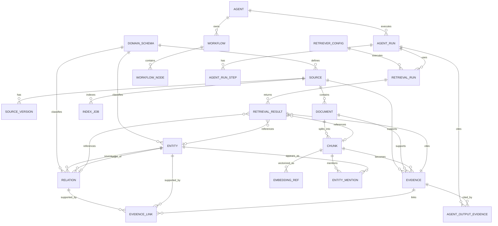

# GraphRAG AI Agent 공통 프레임워크 논리 데이터 모델 분석서

## 1. 문서 개요

### 1.1 목적

본 문서는 GraphRAG AI Agent 공통 프레임워크 개발 프로젝트의 `230.분석` 단계 산출물로, 공통 프레임워크에서 관리해야 할 핵심 데이터 객체와 관계를 논리 데이터 모델 관점에서 정의한다. 분석 대상은 자료 관리, 문서 인덱싱, 벡터 검색, GraphRAG 지식 그래프, Agent 실행, 관리자 사이트 운영 데이터이다.

### 1.2 분석 기준

| 구분 | 기준 |
|---|---|
| 용어 기준 | 도메인 개념 및 용어정의서의 Source, Document, Chunk, Entity, Relation, Evidence, IndexJob, Retriever, Agent, Workflow |
| 구현 기준 | `Sol-Bat`, `VectorMoon`, `accountBook`, `lotto`의 RAG/Agent 구현 현황 |
| 저장소 기준 | PostgreSQL, pgvector, FAISS adapter, 향후 Graph Store 확장 |
| 설계 수준 | 논리 모델 수준이며 물리 컬럼 타입, 인덱스, 파티션은 후속 물리 설계에서 상세화 |

### 1.3 모델링 원칙

| 원칙 | 설명 |
|---|---|
| 추적성 | Agent 답변과 검색 결과는 Source, Document, Chunk, Evidence까지 추적 가능해야 한다. |
| 도메인 확장성 | 공통 엔티티는 유지하고 서비스별 특화 속성은 Domain Schema와 metadata로 확장한다. |
| 저장소 독립성 | PGVector, FAISS, Chroma 등 실제 Vector Store 구현 차이를 공통 논리 모델에서 흡수한다. |
| 관리자 운영성 | 자료 등록, 벡터화 실행, 작업 상태 모니터링, 검색 테스트를 데이터 모델에 반영한다. |
| 재처리 가능성 | 인덱싱 실패, 재시도, 재인덱싱, 버전 관리를 지원한다. |

## 2. 논리 데이터 모델 영역

| 영역 | 설명 | 주요 엔티티 |
|---|---|---|
| 자료 관리 | 인덱싱 대상 원천 자료와 문서 관리 | Source, Document, SourceVersion |
| 인덱싱 | 파싱, chunking, embedding, graph extraction 작업 관리 | IndexJob, Chunk, EmbeddingRef |
| GraphRAG | 개체, 관계, 근거, 도메인 스키마 관리 | Entity, Relation, Evidence, DomainSchema |
| 검색 | 검색기 설정, 검색 요청, 검색 결과 이력 관리 | RetrieverConfig, RetrievalRun, RetrievalResult |
| Agent | Agent, Workflow, Node, 실행 이력 관리 | Agent, Workflow, WorkflowNode, AgentRun, AgentRunStep |
| 운영/감사 | 작업 로그, 오류, 알림, 품질 평가 관리 | OperationLog, ErrorLog, NotificationEvent, EvaluationRun |

## 3. 개념 ERD

## 4. 핵심 엔티티 정의

### 4.1 자료 관리 영역

#### 4.1.1 Source

| 항목 | 내용 |
|---|---|
| 엔티티명 | Source |
| 설명 | AI 검색, 인덱싱, GraphRAG 구축의 출발점이 되는 자료 원천 |
| 주요 식별자 | source_id |
| 주요 속성 | domain_code, source_type, title, description, owner_id, scope, status, current_version, tags, metadata_json, created_at, updated_at |
| 관계 | Source 1:N Document, Source 1:N IndexJob, Source 1:N SourceVersion |
| 예시 | 농업 정책 문서, 투자 전략 문서, 카드 사용내역 파일, 로또 회차 API |

#### 4.1.2 SourceVersion

| 항목 | 내용 |
|---|---|
| 엔티티명 | SourceVersion |
| 설명 | Source의 버전별 원본 위치, checksum, 처리 기준을 관리 |
| 주요 식별자 | source_version_id |
| 주요 속성 | source_id, version_no, uri, filename, checksum, file_size, mime_type, registered_by, registered_at |
| 관계 | Source 1:N SourceVersion |
| 필요성 | 동일 자료 재업로드, 재인덱싱, 문서 변경 추적 |

#### 4.1.3 Document

| 항목 | 내용 |
|---|---|
| 엔티티명 | Document |
| 설명 | Source에서 추출된 실제 파싱 및 chunking 대상 |
| 주요 식별자 | document_id |
| 주요 속성 | source_id, source_version_id, filename, document_type, mime_type, language, page_count, parse_status, parser_name, metadata_json |
| 관계 | Source 1:N Document, Document 1:N Chunk |
| 예시 | PDF 1개, Excel 시트 1개, API 응답 JSON 1개 |

### 4.2 인덱싱 영역

#### 4.2.1 IndexJob

| 항목 | 내용 |
|---|---|
| 엔티티명 | IndexJob |
| 설명 | Source/Document를 파싱, 청크화, 임베딩, 그래프 추출하는 작업 |
| 주요 식별자 | job_id |
| 주요 속성 | source_id, source_version_id, job_type, status, progress_rate, requested_by, started_at, ended_at, retry_count, error_code, error_message |
| 관계 | Source 1:N IndexJob, IndexJob 1:N IndexJobStep |
| 상태값 | PENDING, RUNNING, SUCCEEDED, FAILED, CANCELED, RETRYING, PARTIAL_SUCCEEDED |

#### 4.2.2 IndexJobStep

| 항목 | 내용 |
|---|---|
| 엔티티명 | IndexJobStep |
| 설명 | IndexJob 내부의 단계별 실행 이력 |
| 주요 식별자 | job_step_id |
| 주요 속성 | job_id, step_type, status, started_at, ended_at, input_count, output_count, error_message |
| 단계 예시 | PARSE, CHUNK, EMBED, EXTRACT_ENTITY, EXTRACT_RELATION, LINK_EVIDENCE, SAVE |
| 필요성 | 관리자 사이트에서 상세 진행률과 실패 구간 확인 |

#### 4.2.3 Chunk

| 항목 | 내용 |
|---|---|
| 엔티티명 | Chunk |
| 설명 | 검색, 임베딩, 개체/관계 추출을 위한 문서 분할 단위 |
| 주요 식별자 | chunk_id |
| 주요 속성 | document_id, chunk_index, content, content_hash, token_count, page_no, section_title, start_offset, end_offset, status |
| 관계 | Document 1:N Chunk, Chunk 1:N EmbeddingRef, Chunk 1:N Evidence |
| 설계 기준 | 원문 복원성과 Evidence 연결을 위해 위치 정보 유지 |

#### 4.2.4 EmbeddingRef

| 항목 | 내용 |
|---|---|
| 엔티티명 | EmbeddingRef |
| 설명 | Chunk의 벡터 저장소 저장 결과를 논리적으로 참조 |
| 주요 식별자 | embedding_ref_id |
| 주요 속성 | chunk_id, provider, collection_name, vector_id, model_name, dimension, embedded_at, status |
| 관계 | Chunk 1:N EmbeddingRef |
| 주의사항 | 실제 vector 값은 pgvector 또는 외부 vector store에 저장 가능하며, 논리 모델은 참조 정보만 표준화 |

### 4.3 GraphRAG 영역

#### 4.3.1 DomainSchema

| 항목 | 내용 |
|---|---|
| 엔티티명 | DomainSchema |
| 설명 | 도메인별 Entity Type, Relation Type, 속성 규칙을 정의 |
| 주요 식별자 | domain_schema_id |
| 주요 속성 | domain_code, schema_version, entity_types_json, relation_types_json, validation_rules_json, status |
| 관계 | DomainSchema 1:N Entity, DomainSchema 1:N Relation |
| 예시 | sol_bat, vector_moon, account_book, lotto |

#### 4.3.2 Entity

| 항목 | 내용 |
|---|---|
| 엔티티명 | Entity |
| 설명 | 문서와 데이터에서 추출된 의미 있는 개체 |
| 주요 식별자 | entity_id |
| 주요 속성 | domain_code, entity_type, name, normalized_name, aliases_json, description, confidence_score, status, metadata_json |
| 관계 | Entity 1:N EntityMention, Entity 1:N Relation(source/target) |
| 예시 | 작물, 병해충, 종목, 티커, 가맹점, 카테고리, 로또 번호 |

#### 4.3.3 EntityMention

| 항목 | 내용 |
|---|---|
| 엔티티명 | EntityMention |
| 설명 | 특정 Chunk 안에서 Entity가 언급된 위치와 표현 |
| 주요 식별자 | entity_mention_id |
| 주요 속성 | entity_id, chunk_id, mention_text, start_offset, end_offset, extraction_method, confidence_score |
| 관계 | Entity 1:N EntityMention, Chunk 1:N EntityMention |
| 필요성 | Entity 정규화와 원문 근거 추적 |

#### 4.3.4 Relation

| 항목 | 내용 |
|---|---|
| 엔티티명 | Relation |
| 설명 | Entity 간 의미 있는 관계 |
| 주요 식별자 | relation_id |
| 주요 속성 | domain_code, relation_type, source_entity_id, target_entity_id, weight, confidence_score, status, metadata_json |
| 관계 | Entity 1:N Relation, Relation 1:N EvidenceLink |
| 예시 | 작물-취약-병해충, 종목-적용-전략, 가맹점-분류됨-카테고리 |

#### 4.3.5 Evidence

| 항목 | 내용 |
|---|---|
| 엔티티명 | Evidence |
| 설명 | Entity, Relation, 검색 결과, Agent 답변의 출처가 되는 근거 |
| 주요 식별자 | evidence_id |
| 주요 속성 | source_id, document_id, chunk_id, evidence_type, quote_text, confidence_score, extraction_method, metadata_json |
| 관계 | Evidence N:M Entity/Relation via EvidenceLink, Evidence 1:N RetrievalResult |
| 설계 기준 | Evidence는 가능하면 Chunk를 참조하되, API 응답이나 계산 결과도 지원 |

#### 4.3.6 EvidenceLink

| 항목 | 내용 |
|---|---|
| 엔티티명 | EvidenceLink |
| 설명 | Evidence와 Entity 또는 Relation의 연결 |
| 주요 식별자 | evidence_link_id |
| 주요 속성 | evidence_id, target_type, target_id, support_type, confidence_score |
| target_type | ENTITY, RELATION, AGENT_OUTPUT |
| 필요성 | 관계와 답변의 근거 추적성 확보 |

### 4.4 검색 영역

#### 4.4.1 RetrieverConfig

| 항목 | 내용 |
|---|---|
| 엔티티명 | RetrieverConfig |
| 설명 | Vector, Graph, Hybrid 검색기의 설정 |
| 주요 식별자 | retriever_config_id |
| 주요 속성 | domain_code, retriever_type, provider, top_k, score_threshold, filter_policy_json, rerank_policy_json, status |
| retriever_type | VECTOR, GRAPH, HYBRID, FALLBACK |
| 필요성 | 도메인별 검색 전략을 관리자 또는 설정으로 제어 |

#### 4.4.2 RetrievalRun

| 항목 | 내용 |
|---|---|
| 엔티티명 | RetrievalRun |
| 설명 | 검색 요청 1회의 실행 이력 |
| 주요 식별자 | retrieval_run_id |
| 주요 속성 | retriever_config_id, query_text, domain_code, requester_type, requester_id, status, started_at, ended_at, metadata_json |
| 관계 | RetrievalRun 1:N RetrievalResult |
| requester_type | USER, AGENT, ADMIN_TEST, SCHEDULER |

#### 4.4.3 RetrievalResult

| 항목 | 내용 |
|---|---|
| 엔티티명 | RetrievalResult |
| 설명 | 검색 결과 후보와 점수, 참조 대상을 기록 |
| 주요 식별자 | retrieval_result_id |
| 주요 속성 | retrieval_run_id, result_type, chunk_id, entity_id, relation_id, evidence_id, rank_no, score, rerank_score, snippet |
| result_type | CHUNK, ENTITY, RELATION, EVIDENCE |
| 필요성 | 검색 품질 평가, Agent 답변 근거 표시 |

### 4.5 Agent 영역

#### 4.5.1 Agent

| 항목 | 내용 |
|---|---|
| 엔티티명 | Agent |
| 설명 | 사용자 요청 또는 스케줄 이벤트에 따라 Workflow를 실행하는 AI 주체 |
| 주요 식별자 | agent_id |
| 주요 속성 | domain_code, agent_name, agent_type, description, default_workflow_id, model_policy_json, status |
| 예시 | 농사 코치 Agent, 주식 분석 Agent, 거래 분류 Agent, 로또 추천 Agent |

#### 4.5.2 Workflow

| 항목 | 내용 |
|---|---|
| 엔티티명 | Workflow |
| 설명 | Agent의 실행 흐름 정의 |
| 주요 식별자 | workflow_id |
| 주요 속성 | agent_id, workflow_name, version_no, entry_node_code, status, definition_json |
| 관계 | Agent 1:N Workflow, Workflow 1:N WorkflowNode |
| 구현 매핑 | LangGraph StateGraph 정의 |

#### 4.5.3 WorkflowNode

| 항목 | 내용 |
|---|---|
| 엔티티명 | WorkflowNode |
| 설명 | Workflow 내부의 처리 단계 |
| 주요 식별자 | workflow_node_id |
| 주요 속성 | workflow_id, node_code, node_type, sequence_no, input_schema_json, output_schema_json, retry_policy_json |
| node_type | EXTERNAL_FETCH, RULE_EVALUATE, RETRIEVE, SUMMARIZE, ANSWER, CLASSIFY, SAVE |

#### 4.5.4 AgentRun

| 항목 | 내용 |
|---|---|
| 엔티티명 | AgentRun |
| 설명 | Agent 실행 1회의 이력 |
| 주요 식별자 | agent_run_id |
| 주요 속성 | agent_id, workflow_id, requester_type, requester_id, input_text, status, started_at, ended_at, final_output, error_message |
| 관계 | AgentRun 1:N AgentRunStep, AgentRun 1:N AgentOutputEvidence |
| 필요성 | 운영 추적, 재현, 품질 평가 |

#### 4.5.5 AgentRunStep

| 항목 | 내용 |
|---|---|
| 엔티티명 | AgentRunStep |
| 설명 | AgentRun 내부 노드별 실행 이력 |
| 주요 식별자 | agent_run_step_id |
| 주요 속성 | agent_run_id, workflow_node_id, step_status, input_json, output_json, started_at, ended_at, error_message |
| 필요성 | Agent 실행 디버깅과 노드별 오류 분석 |

#### 4.5.6 AgentOutputEvidence

| 항목 | 내용 |
|---|---|
| 엔티티명 | AgentOutputEvidence |
| 설명 | Agent 최종 답변과 Evidence의 연결 |
| 주요 식별자 | agent_output_evidence_id |
| 주요 속성 | agent_run_id, evidence_id, usage_type, rank_no, note |
| usage_type | CITED, SUPPORTING, WARNING, CONFLICT |
| 필요성 | 답변 근거 보기, 감사, 설명 가능성 |

## 5. 주요 관계 정의

| 관계 ID | 관계 | 카디널리티 | 설명 |
|---|---|---:|---|
| R-001 | Source - Document | 1:N | 하나의 자료 원천에서 여러 문서가 생성될 수 있다. |
| R-002 | Source - SourceVersion | 1:N | Source는 여러 버전을 가질 수 있다. |
| R-003 | Source - IndexJob | 1:N | 하나의 Source에 여러 인덱싱 작업이 실행될 수 있다. |
| R-004 | Document - Chunk | 1:N | 하나의 문서는 여러 Chunk로 분할된다. |
| R-005 | Chunk - EmbeddingRef | 1:N | Chunk는 모델/저장소별 여러 embedding 참조를 가질 수 있다. |
| R-006 | Chunk - EntityMention | 1:N | Chunk 안에 여러 Entity 언급이 있을 수 있다. |
| R-007 | Entity - EntityMention | 1:N | 하나의 Entity는 여러 Chunk에서 언급될 수 있다. |
| R-008 | Entity - Relation | 1:N | Entity는 Relation의 source 또는 target이 된다. |
| R-009 | Evidence - EvidenceLink | 1:N | Evidence는 여러 Entity/Relation/AgentOutput을 지원할 수 있다. |
| R-010 | Relation - EvidenceLink | 1:N | Relation은 하나 이상의 Evidence로 설명되어야 한다. |
| R-011 | RetrieverConfig - RetrievalRun | 1:N | 검색 설정은 여러 검색 실행 이력을 가진다. |
| R-012 | RetrievalRun - RetrievalResult | 1:N | 검색 1회는 여러 결과를 반환한다. |
| R-013 | Agent - Workflow | 1:N | Agent는 여러 버전의 Workflow를 가질 수 있다. |
| R-014 | Workflow - WorkflowNode | 1:N | Workflow는 여러 처리 노드로 구성된다. |
| R-015 | Agent - AgentRun | 1:N | Agent는 여러 실행 이력을 가진다. |
| R-016 | AgentRun - AgentRunStep | 1:N | Agent 실행은 여러 노드 실행 단계로 구성된다. |
| R-017 | AgentRun - RetrievalRun | 1:N | Agent 실행 중 여러 검색이 수행될 수 있다. |
| R-018 | AgentRun - AgentOutputEvidence | 1:N | Agent 최종 답변은 여러 Evidence를 참조할 수 있다. |

## 6. 도메인별 확장 모델

### 6.1 `Sol-Bat`

| 공통 엔티티 | 도메인 확장 속성 | 설명 |
|---|---|---|
| Source | crop_scope, region_scope, source_policy_type | 농업 정책/농법 문서 분류 |
| Entity | crop_code, pest_code, soil_property_code, weather_factor_code | 작물, 병해충, 토양, 기상 개체 |
| Relation | risk_level, season, growth_stage | 작물-위험-작업 관계의 조건 |
| Evidence | api_provider, observation_time | 기상/토양/병해충 API 근거 |
| AgentRun | user_farm_id, crop_id, region | 농장 사용자별 Agent 실행 조건 |

### 6.2 `VectorMoon`

| 공통 엔티티 | 도메인 확장 속성 | 설명 |
|---|---|---|
| Source | ticker, stock_name, source_scope | 종목별/GLOBAL/CORE 문서 구분 |
| Entity | ticker, market, indicator_code, strategy_code | 종목, 지표, 전략 개체 |
| Relation | signal_type, confidence_band, time_frame | 전략과 신호 관계 |
| Evidence | disclosure_id, news_url, chart_period | 공시/뉴스/기술지표 근거 |
| AgentRun | ticker, period, portfolio_id | 종목 분석 실행 조건 |

### 6.3 `accountBook`

| 공통 엔티티 | 도메인 확장 속성 | 설명 |
|---|---|---|
| Source | month, card_company, upload_batch_id | 월별 거래 파일 관리 |
| Chunk | transaction_date, merchant, amount, memo | 거래 행 단위 chunk |
| Entity | merchant_name, category_main, category_sub | 가맹점/카테고리 개체 |
| Relation | classification_source, similarity_score | 과거 분류 또는 AI 분류 근거 |
| Evidence | row_no, original_value_json | 원본 거래 행 추적 |

### 6.4 `lotto`

| 공통 엔티티 | 도메인 확장 속성 | 설명 |
|---|---|---|
| Source | draw_range_start, draw_range_end, provider | 회차 데이터 범위 |
| Chunk | draw_no, numbers_json, bonus_number | 회차 또는 추천게임 단위 |
| Entity | number_value, strategy_name, game_no | 번호, 전략, 추천게임 |
| Relation | draw_no, occurrence_count, strategy_weight | 번호 출현/전략 생성 관계 |
| Evidence | frequency_json, cold_numbers_json, ev_score | 추천 근거 통계 |

## 7. 표준 코드 후보

### 7.1 Domain Code

| 코드 | 설명 |
|---|---|
| `common` | 공통 프레임워크 |
| `sol_bat` | 농업 AI Agent |
| `vector_moon` | 투자 AI Agent |
| `account_book` | 가계부 AI Agent |
| `lotto` | 로또 AI Agent |

### 7.2 Source Type

| 코드 | 설명 |
|---|---|
| `FILE` | 업로드 파일 |
| `URL` | 웹 URL |
| `API` | 외부 API 응답 |
| `DATABASE` | DB 조회 결과 |
| `MANUAL` | 관리자가 직접 입력한 자료 |
| `GENERATED` | Agent 또는 시스템이 생성한 자료 |

### 7.3 Job Type

| 코드 | 설명 |
|---|---|
| `FULL_INDEX` | 전체 인덱싱 |
| `REINDEX` | 재인덱싱 |
| `PARSE_ONLY` | 파싱만 수행 |
| `EMBED_ONLY` | 임베딩만 수행 |
| `GRAPH_EXTRACT_ONLY` | 개체/관계 추출만 수행 |
| `DELETE_INDEX` | 인덱스 삭제 |

### 7.4 Entity Type

| 코드 | 설명 |
|---|---|
| `DOMAIN_OBJECT` | 도메인 핵심 대상 |
| `CONDITION` | 조건 |
| `EVENT` | 사건 |
| `ACTION` | 추천/수행 작업 |
| `POLICY_OR_RULE` | 정책 또는 규칙 |
| `METRIC` | 수치 지표 |
| `DOCUMENT_TOPIC` | 문서 주제 |
| `USER_OR_OWNER` | 사용자 또는 소유자 |

### 7.5 Relation Type

| 코드 | 설명 |
|---|---|
| `RELATED_TO` | 일반 연관 |
| `HAS_CONDITION` | 조건 보유 |
| `CAUSES` | 원인 관계 |
| `AFFECTS` | 영향 관계 |
| `CLASSIFIED_AS` | 분류 관계 |
| `GENERATED_BY` | 생성 관계 |
| `SUPPORTED_BY` | 근거 관계 |
| `OCCURRED_IN` | 발생 관계 |
| `RECOMMENDS` | 추천 관계 |
| `CONFLICTS_WITH` | 상충 관계 |

## 8. 데이터 흐름별 모델 적용

### 8.1 자료 등록 및 인덱싱

| 단계 | 생성/갱신 엔티티 | 설명 |
|---:|---|---|
| 1 | Source | 자료 등록 |
| 2 | SourceVersion | 원본 파일 또는 원천 위치 버전 기록 |
| 3 | IndexJob | 벡터화 작업 생성 |
| 4 | Document | Source에서 처리 문서 식별 |
| 5 | Chunk | 문서 분할 |
| 6 | EmbeddingRef | Vector Store 저장 참조 기록 |
| 7 | Entity, EntityMention | 개체 추출 및 원문 위치 기록 |
| 8 | Relation | 개체 간 관계 추출 |
| 9 | Evidence, EvidenceLink | 근거 연결 |
| 10 | IndexJobStep, IndexJob | 작업 단계 및 최종 상태 갱신 |

### 8.2 검색 및 Agent 실행

| 단계 | 생성/갱신 엔티티 | 설명 |
|---:|---|---|
| 1 | AgentRun | Agent 실행 시작 |
| 2 | AgentRunStep | 노드별 실행 이력 기록 |
| 3 | RetrievalRun | 검색 실행 이력 생성 |
| 4 | RetrievalResult | Chunk/Entity/Relation/Evidence 검색 결과 저장 |
| 5 | AgentRunStep | 검색 결과를 노드 출력으로 기록 |
| 6 | AgentOutputEvidence | 최종 답변과 Evidence 연결 |
| 7 | AgentRun | 최종 결과 및 상태 갱신 |

## 9. 정합성 및 제약 조건

| 제약 ID | 제약 조건 | 설명 |
|---|---|---|
| C-001 | Chunk는 반드시 Document를 참조해야 한다. | 원천 추적성 확보 |
| C-002 | Document는 반드시 Source를 참조해야 한다. | 자료 관리 기준 |
| C-003 | Evidence는 Source 또는 Chunk 중 하나 이상의 근거를 가져야 한다. | 근거 없는 답변 방지 |
| C-004 | Relation은 source_entity_id와 target_entity_id를 가져야 한다. | 그래프 관계 기본 조건 |
| C-005 | Relation은 최소 하나 이상의 EvidenceLink를 가져야 한다. | 설명 가능한 관계 유지 |
| C-006 | EmbeddingRef는 provider와 collection_name을 가져야 한다. | 저장소 독립 참조 |
| C-007 | IndexJob은 Source를 기준으로 생성한다. | 관리자 작업 단위 표준화 |
| C-008 | AgentRun은 Agent와 Workflow를 참조해야 한다. | 실행 재현성 |
| C-009 | RetrievalResult는 result_type별 참조 대상 중 하나를 가져야 한다. | 검색 결과 정합성 |
| C-010 | domain_code는 표준 Domain Code 또는 등록된 DomainSchema와 일치해야 한다. | 도메인 확장 통제 |

## 10. 품질 및 운영 고려사항

| 항목 | 고려사항 |
|---|---|
| 중복 Source | checksum과 title, domain, owner 기준 중복 탐지 |
| 중복 Entity | normalized_name, aliases, domain_code 기준 Entity Resolver 적용 |
| 대량 Chunk | Source, Document, domain_code 기준 조회 최적화 필요 |
| Vector 삭제 | Source 비활성화와 물리 삭제를 분리 |
| 재인덱싱 | 기존 Chunk/Entity/Relation을 version 기준으로 유지하거나 soft delete |
| 개인정보 | owner_id, user_id, 거래 데이터 등 민감정보 접근 제어 필요 |
| 감사 | Source 등록자, IndexJob 실행자, AgentRun 요청자 기록 |
| 품질 평가 | RetrievalRun과 AgentOutputEvidence를 기반으로 검색 품질 평가 가능 |

## 11. MVP 논리 모델 범위

### 11.1 1차 필수 엔티티

| 우선순위 | 엔티티 | 선정 사유 |
|---:|---|---|
| 1 | Source | 관리자 자료 관리의 기준 |
| 2 | Document | 파일/자료 파싱 단위 |
| 3 | Chunk | 검색과 Evidence의 기본 단위 |
| 4 | EmbeddingRef | Vector Store 공통화 기준 |
| 5 | IndexJob, IndexJobStep | 벡터화 실행 및 상태 모니터링 |
| 6 | Entity, Relation, Evidence | GraphRAG 핵심 데이터 |
| 7 | RetrieverConfig, RetrievalRun, RetrievalResult | 검색 테스트와 Agent 근거 추적 |
| 8 | Agent, Workflow, AgentRun | Agent 실행 이력 관리 |

### 11.2 후속 확장 엔티티

| 엔티티 | 확장 시점 |
|---|---|
| EvaluationRun | 검색/답변 품질 평가 자동화 단계 |
| NotificationEvent | 운영 알림 고도화 단계 |
| OperationLog, ErrorLog | 운영 포털 고도화 단계 |
| ToolConfig | Agent 도구 확장 단계 |
| PromptTemplate | 프롬프트 관리 기능 도입 단계 |

## 12. 후속 설계 반영사항

| 후속 산출물 | 반영 내용 |
|---|---|
| 물리 데이터 모델 설계서 | 본 문서의 엔티티를 테이블, 컬럼, 인덱스, FK로 상세화 |
| API 명세서 | Source, IndexJob, RetrievalRun, AgentRun 중심 REST API 설계 |
| 관리자 화면정의서 | 자료 목록, 벡터화 작업, 청크/개체/관계/근거 미리보기 화면 설계 |
| 공통 모듈 상세설계서 | SourceManager, IndexJobManager, GraphStore, HybridRetriever 데이터 접근 계약 정의 |
| 테스트 시나리오 | Source 등록부터 Agent 답변 Evidence 추적까지 E2E 데이터 흐름 검증 |

## 13. 승인 및 변경 이력

### 13.1 승인 기록

| 구분 | 역할 | 승인 여부 | 일자 | 비고 |
|---|---|---|---|---|
| 작성 | Data Architect | 작성 완료 | 2026-06-21 | 초안 |
| 검토 | 아키텍터 | 검토 필요 | - | 전체 아키텍처 정합성 검토 |
| 검토 | GraphRAG Engineer | 검토 필요 | - | GraphRAG 데이터 구조 검토 |
| 검토 | PM | 검토 필요 | - | WBS 및 산출물 정합성 검토 |
| 승인 | Product Owner | 승인 필요 | - | 사용자 확인 필요 |

### 13.2 변경 이력

| 버전 | 일자 | 변경 내용 | 작성자 |
|---|---|---|---|
| v0.1 | 2026-06-21 | 논리 데이터 모델 분석서 최초 작성 | Data Architect |
