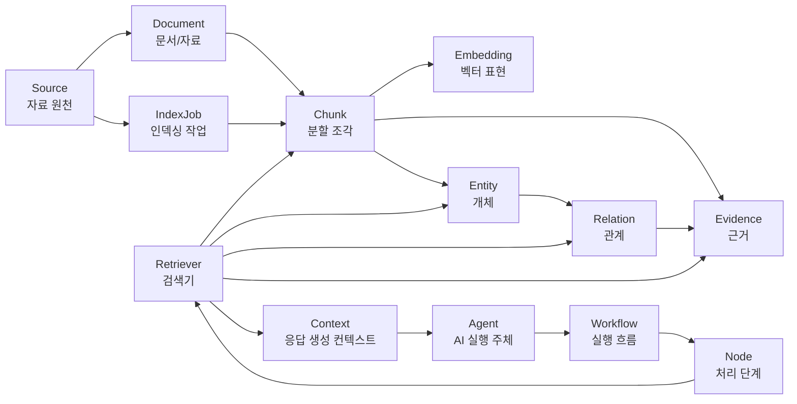

# GraphRAG AI Agent 공통 프레임워크 도메인 개념 및 용어정의서

## 1. 문서 개요

### 1.1 목적

본 문서는 GraphRAG AI Agent 공통 프레임워크 개발 프로젝트의 `230.분석` 단계 산출물로, 공통 프레임워크에서 사용할 핵심 도메인 개념과 표준 용어를 정의한다. 또한 기존 프로젝트(`Sol-Bat`, `VectorMoon`, `accountBook`, `lotto`)의 도메인 개념을 공통 용어에 매핑하여 이후 데이터 모델, API, 관리자 사이트, Agent 설계가 동일한 언어 체계로 진행되도록 한다.

### 1.2 적용 범위

| 구분 | 적용 내용 |
|---|---|
| 공통 프레임워크 | Source, Document, Chunk, Entity, Relation, Evidence, IndexJob, Retriever, Agent, Workflow 등 |
| 관리자 사이트 | 자료 등록, 인덱싱 실행, 작업 상태 모니터링, 검색 테스트, 미리보기 |
| GraphRAG Core | Entity/Relation 추출, Evidence 연결, Graph Store, Hybrid Retrieval |
| Agent Core | Workflow, Node, State, Context, Tool, LLM 응답 구조 |
| 기존 프로젝트 매핑 | `Sol-Bat`, `VectorMoon`, `accountBook`, `lotto` |

### 1.3 용어 정의 원칙

| 원칙 | 설명 |
|---|---|
| 공통 우선 | 특정 서비스명보다 프레임워크에서 재사용 가능한 용어를 우선 사용한다. |
| 도메인 확장 허용 | 공통 개념은 유지하되 서비스별 세부 속성은 Domain Schema로 확장한다. |
| 추적 가능성 | 검색 결과, Agent 답변, Graph 관계는 원천 Source와 Evidence까지 추적 가능해야 한다. |
| 관리자 친화성 | 관리자 사이트에서 보이는 용어는 사용자가 이해하기 쉬운 업무 용어를 병기한다. |
| 구현 중립성 | PGVector, FAISS, Chroma, PostgreSQL Graph Table 등 저장소 구현에 종속되지 않는 용어를 사용한다. |

## 2. 핵심 도메인 개념 모델

### 2.1 개념 관계 요약

### 2.2 처리 흐름

| 순서 | 단계 | 설명 |
|---:|---|---|
| 1 | Source 등록 | 관리자 또는 시스템이 분석할 자료 원천을 등록한다. |
| 2 | Document 생성 | Source에서 실제 처리 가능한 문서/자료 단위를 식별한다. |
| 3 | Chunk 분할 | Document를 검색과 추론에 적합한 작은 단위로 분할한다. |
| 4 | Embedding 생성 | Chunk 또는 항목을 벡터 검색 가능한 형태로 변환한다. |
| 5 | Entity/Relation 추출 | Chunk에서 핵심 개체와 관계를 추출한다. |
| 6 | Evidence 연결 | Entity/Relation이 어떤 Source/Chunk에서 나왔는지 근거를 연결한다. |
| 7 | IndexJob 상태 관리 | 인덱싱 실행, 성공, 실패, 재시도 상태를 기록한다. |
| 8 | Retrieval 수행 | Vector Search와 Graph Search를 조합해 관련 정보를 찾는다. |
| 9 | Agent 실행 | Workflow의 Node들이 외부 데이터, 검색 결과, LLM을 조합해 결과를 생성한다. |

## 3. 공통 핵심 용어 정의

### 3.1 Source

| 항목 | 정의 |
|---|---|
| 한글명 | 자료 원천 |
| 영문명 | Source |
| 정의 | AI 검색, 인덱싱, GraphRAG 구축의 출발점이 되는 원천 자료 또는 데이터 묶음 |
| 예시 | 업로드 PDF, 정책 문서, 투자 전략 문서, 카드 사용내역 파일, 로또 회차 데이터 API |
| 주요 속성 | source_id, domain, source_type, title, owner_id, scope, status, version, tags, created_at |
| 관리자 표시명 | 자료 |
| 주의사항 | 실제 파일 하나와 항상 1:1 관계일 필요는 없다. API, DB 조회 결과, 외부 서비스 데이터도 Source가 될 수 있다. |

### 3.2 Document

| 항목 | 정의 |
|---|---|
| 한글명 | 문서/자료 |
| 영문명 | Document |
| 정의 | Source에서 추출된 실제 처리 단위로, 텍스트 추출과 chunking 대상이 되는 자료 |
| 예시 | PDF 1개, DOCX 1개, CSV 1개, Excel 시트, API 응답을 문서화한 JSON |
| 주요 속성 | document_id, source_id, filename, mime_type, page_count, checksum, parse_status |
| 관리자 표시명 | 문서 |
| 주의사항 | Source가 ZIP이나 폴더인 경우 여러 Document가 생성될 수 있다. |

### 3.3 Chunk

| 항목 | 정의 |
|---|---|
| 한글명 | 청크 |
| 영문명 | Chunk |
| 정의 | 검색, embedding, entity/relation 추출을 위해 Document를 의미 단위 또는 길이 기준으로 나눈 조각 |
| 예시 | 정책 문서의 한 절, 투자 전략 문서의 단락, 거래 내역 한 건, 로또 회차 한 행 |
| 주요 속성 | chunk_id, document_id, content, chunk_index, token_count, page_no, section_title |
| 관리자 표시명 | 분할 내용 |
| 주의사항 | Chunk 크기와 overlap은 도메인별로 다를 수 있으며, GraphRAG에서는 Evidence의 기본 근거 단위가 된다. |

### 3.4 Embedding

| 항목 | 정의 |
|---|---|
| 한글명 | 임베딩 |
| 영문명 | Embedding |
| 정의 | Chunk 또는 검색 대상 텍스트를 벡터 검색 가능한 숫자 배열로 변환한 값 |
| 예시 | OpenAI `text-embedding-3-small` 결과, FAISS index vector, PGVector embedding |
| 주요 속성 | embedding_id, chunk_id, model_name, dimension, vector_store_provider, collection_name |
| 관리자 표시명 | 벡터 |
| 주의사항 | Embedding 자체는 업무 의미가 아니며, 원문 Chunk와 반드시 연결되어야 한다. |

### 3.5 Entity

| 항목 | 정의 |
|---|---|
| 한글명 | 개체 |
| 영문명 | Entity |
| 정의 | 문서나 데이터에서 추출되는 의미 있는 대상, 개념, 사물, 이벤트, 조건, 전략, 사람 또는 조직 |
| 예시 | 작물, 병해충, 종목, 전략, 가맹점, 카테고리, 로또 번호, 회차 |
| 주요 속성 | entity_id, domain, entity_type, name, normalized_name, aliases, confidence_score |
| 관리자 표시명 | 개체 |
| 주의사항 | 동일 개체의 다른 이름은 alias로 관리하며, Entity Resolver가 중복을 정리한다. |

### 3.6 Relation

| 항목 | 정의 |
|---|---|
| 한글명 | 관계 |
| 영문명 | Relation |
| 정의 | 두 개 이상의 Entity 사이에 존재하는 의미 있는 연결 |
| 예시 | 작물-발생가능-병해충, 종목-적용-투자전략, 가맹점-분류됨-카테고리, 번호-출현-회차 |
| 주요 속성 | relation_id, domain, relation_type, source_entity_id, target_entity_id, weight, confidence_score |
| 관리자 표시명 | 관계 |
| 주의사항 | Relation은 Evidence와 연결되어야 하며, 근거 없는 관계는 검수 대상이 된다. |

### 3.7 Evidence

| 항목 | 정의 |
|---|---|
| 한글명 | 근거 |
| 영문명 | Evidence |
| 정의 | Entity, Relation, 검색 결과, Agent 답변의 출처와 신뢰 근거가 되는 원문 또는 데이터 조각 |
| 예시 | 문서 chunk, API 응답 일부, 거래 원본 행, 회차 통계 결과 |
| 주요 속성 | evidence_id, source_id, document_id, chunk_id, quote_text, confidence_score, extraction_method |
| 관리자 표시명 | 근거 |
| 주의사항 | Agent 답변은 가능한 한 Evidence를 통해 설명 가능해야 한다. |

### 3.8 IndexJob

| 항목 | 정의 |
|---|---|
| 한글명 | 인덱싱 작업 |
| 영문명 | IndexJob |
| 정의 | Source 또는 Document를 파싱, chunking, embedding, graph extraction, 저장까지 처리하는 비동기 작업 |
| 예시 | 문서 업로드 후 벡터화 실행, 전체 재인덱싱, 실패 작업 재시도 |
| 주요 속성 | job_id, source_id, job_type, status, progress, started_at, ended_at, error_message, retry_count |
| 관리자 표시명 | 벡터화 작업 |
| 주의사항 | 관리자 사이트의 작업 상태 모니터링 핵심 단위이다. |

### 3.9 Retriever

| 항목 | 정의 |
|---|---|
| 한글명 | 검색기 |
| 영문명 | Retriever |
| 정의 | 사용자 질문 또는 Agent State를 기반으로 관련 Chunk, Entity, Relation, Evidence를 찾아오는 컴포넌트 |
| 예시 | Vector Retriever, Graph Retriever, Hybrid Retriever, RAG hint Retriever |
| 주요 속성 | retriever_id, retriever_type, domain, top_k, filter_policy, rerank_policy |
| 관리자 표시명 | 검색기 |
| 주의사항 | GraphRAG에서는 Vector 검색과 Graph 탐색을 조합한 Hybrid Retriever를 표준으로 한다. |

### 3.10 Agent

| 항목 | 정의 |
|---|---|
| 한글명 | 에이전트 |
| 영문명 | Agent |
| 정의 | 사용자 요청이나 스케줄 이벤트를 받아 Workflow를 실행하고 최종 판단, 추천, 답변, 작업 결과를 생성하는 AI 실행 주체 |
| 예시 | 농사 코치 Agent, 주식 분석 Agent, 거래 분류 Agent, 로또 추천 Agent |
| 주요 속성 | agent_id, domain, agent_type, model_policy, workflow_id, tools, status |
| 관리자 표시명 | AI 에이전트 |
| 주의사항 | Agent는 단일 LLM 호출이 아니라 상태, 검색, 도구, 노드 흐름을 포함하는 실행 단위로 정의한다. |

### 3.11 Workflow

| 항목 | 정의 |
|---|---|
| 한글명 | 실행 흐름 |
| 영문명 | Workflow |
| 정의 | Agent가 목적을 달성하기 위해 실행하는 노드와 전이 관계의 집합 |
| 예시 | 농장정보수집 -> 위험평가 -> 지식검색 -> 조언생성 |
| 주요 속성 | workflow_id, agent_id, version, entry_node, nodes, edges, status |
| 관리자 표시명 | 실행 흐름 |
| 주의사항 | LangGraph 기반 구현을 표준으로 하되, 설계 용어는 특정 라이브러리에 종속하지 않는다. |

### 3.12 Node

| 항목 | 정의 |
|---|---|
| 한글명 | 노드 |
| 영문명 | Node |
| 정의 | Workflow 안에서 하나의 책임을 수행하는 처리 단계 |
| 예시 | 외부 데이터 수집, RAG 검색, GraphRAG 검색, 요약, 최종 답변 생성, 결과 저장 |
| 주요 속성 | node_id, workflow_id, node_type, input_schema, output_schema, retry_policy |
| 관리자 표시명 | 처리 단계 |
| 주의사항 | Node는 재사용 가능하도록 domain logic과 framework logic을 분리한다. |

### 3.13 State

| 항목 | 정의 |
|---|---|
| 한글명 | 상태 |
| 영문명 | State |
| 정의 | Workflow 실행 중 노드 간 전달되는 데이터 구조 |
| 예시 | `FarmingState`, `AgentState`, `LottoAgentState`, 분류 작업 상태 |
| 주요 속성 | messages, context, metadata, error, next_node, domain_data |
| 관리자 표시명 | 실행 상태 |
| 주의사항 | 공통 필드는 `BaseAgentState`로 표준화하고 도메인별 필드는 확장한다. |

### 3.14 Context

| 항목 | 정의 |
|---|---|
| 한글명 | 컨텍스트 |
| 영문명 | Context |
| 정의 | LLM이나 Agent가 답변을 생성할 때 참고하는 검색 결과, 외부 데이터, 사용자 입력, 이전 상태의 묶음 |
| 예시 | 농업 지식 검색 결과, 종목 문서 요약, 거래 분류 hint, 로또 통계 요약 |
| 주요 속성 | context_id, source_refs, evidence_refs, content, token_count |
| 관리자 표시명 | 참고 정보 |
| 주의사항 | Context는 원천 근거를 잃지 않도록 Evidence reference를 포함해야 한다. |

## 4. GraphRAG 특화 용어

| 용어 | 한글명 | 정의 | 비고 |
|---|---|---|---|
| Graph Store | 그래프 저장소 | Entity, Relation, Evidence를 저장하고 탐색하는 저장소 | 1차는 PostgreSQL graph table 우선 |
| Entity Extractor | 개체 추출기 | Chunk에서 Entity 후보를 추출하는 컴포넌트 | LLM, rule, dictionary 혼합 가능 |
| Relation Extractor | 관계 추출기 | Entity 사이의 Relation 후보를 추출하는 컴포넌트 | Evidence 연결 필수 |
| Entity Resolver | 개체 정규화기 | 중복 Entity와 alias를 정리하는 컴포넌트 | 한글명/약어/코드 대응 |
| Evidence Linker | 근거 연결기 | Entity/Relation과 원문 Chunk를 연결하는 컴포넌트 | 설명 가능성 핵심 |
| Hybrid Retriever | 하이브리드 검색기 | Vector 검색, Graph 탐색, filter, reranking을 조합하는 검색기 | GraphRAG 검색 표준 |
| Reranker | 재순위화기 | 검색 후보를 질문과 맥락에 맞게 재정렬하는 컴포넌트 | 초기 MVP에서는 선택 적용 |
| Domain Schema | 도메인 스키마 | 도메인별 Entity Type, Relation Type, 속성 규칙 | Sol-Bat 등 서비스별 확장 |
| Ontology | 온톨로지 | 도메인 개념과 관계를 체계적으로 정의한 지식 구조 | 초기에는 경량 schema로 시작 |
| Traceability | 추적성 | 답변, 관계, 검색 결과가 원천 Source/Evidence까지 연결되는 성질 | 품질/감사 요구와 연결 |

## 5. 관리자 사이트 용어

| 화면/기능 용어 | 공통 도메인 용어 | 설명 |
|---|---|---|
| 자료 등록 | Source 등록 | 관리자가 파일, URL, API, DB 데이터를 등록 |
| 문서 목록 | Source/Document 목록 | 등록된 자료와 처리 문서 목록 조회 |
| 벡터화 실행 | IndexJob 실행 | parsing, chunking, embedding, graph extraction 실행 |
| 작업 상태 | IndexJob Status | 대기, 실행중, 성공, 실패, 취소, 재시도 상태 |
| 청크 미리보기 | Chunk Preview | 분할된 내용 확인 |
| 개체 미리보기 | Entity Preview | 추출된 개체 확인 |
| 관계 미리보기 | Relation Preview | 추출된 관계 확인 |
| 근거 보기 | Evidence View | 검색/답변/관계의 원문 근거 확인 |
| 검색 테스트 | Retrieval Test | 특정 질의로 검색 결과와 근거 확인 |
| 재처리 | Reindex | 기존 Source를 다시 인덱싱 |
| 비활성화 | Disable Source | 자료를 삭제하지 않고 검색 대상에서 제외 |

## 6. 프로젝트별 도메인 개념 매핑

### 6.1 공통 개념 매핑 요약

| 공통 용어 | Sol-Bat | VectorMoon | accountBook | lotto |
|---|---|---|---|---|
| Source | 농업 정책/농법 문서, 사용자 업로드 지식, 외부 농업 API | 투자 전략 문서, 종목 리포트, GLOBAL/CORE 전략 문서, 뉴스/공시 | 카드 사용내역 파일, 학습데이터, 카테고리 기준표 | 로또 회차 API, 추천 결과, 당첨 결과 데이터 |
| Document | PDF/TXT 농업 문서 | PDF/DOCX/CSV/MD/TXT 투자 문서 | Excel/CSV 거래 파일, 학습 데이터 파일 | 회차 데이터 묶음, 리포트 데이터 |
| Chunk | 농업 문서 분할 텍스트 | 투자 문서 분할 텍스트 | 거래 1건 또는 가맹점 분류 항목 | 회차 1건, 번호 조합, 통계 요약 |
| Entity | 작물, 지역, 병해충, 토양, 날씨, 정책, 작업 | 종목, 티커, 전략, 지표, 패턴, 뉴스, 리스크 | 가맹점, 카테고리, 거래, 사용자, 월, 고정비 | 회차, 번호, 번호대, 전략, 추천게임, 당첨결과 |
| Relation | 작물-발생가능-병해충, 날씨-영향-작업 | 종목-적용-전략, 지표-시사-신호 | 가맹점-분류됨-카테고리, 거래-발생-월 | 번호-출현-회차, 전략-생성-추천게임 |
| Evidence | 문서 chunk, API 응답, 위험 평가 결과 | 문서 chunk, 뉴스/공시, 기술지표 계산 결과 | 원본 거래 행, 유사 가맹점 검색 결과 | 회차 통계, 번호 빈도, 추천 근거 |
| IndexJob | KB 문서 벡터화 | 문서 업로드 후 인덱싱 | 학습데이터 embedding, 거래 파일 파싱 | 회차 동기화, 통계 재계산 후보 |
| Retriever | 농업 지식 검색 | 전략/종목 문서 검색 | 유사 가맹점 hint 검색 | 향후 번호/전략 패턴 검색 |
| Agent | 농사 코치 Agent | 주식 분석 Agent | 거래 분류 Agent | 로또 추천 Agent |
| Workflow | 상황수집-위험평가-지식검색-조언생성 | 가격/뉴스/문서/기술분석-최종의견 | 파일파싱-hint검색-분류-저장 | 분석-생성-LLM insight |

### 6.2 `Sol-Bat` 도메인 매핑

| 공통 용어 | 도메인 개념 | 설명 | GraphRAG 적용 |
|---|---|---|---|
| Source | 농업 지식 원천 | 정책 문서, 농법 문서, 사용자 업로드 KB, 농업 외부 API | SourceManager로 등록/상태 관리 |
| Entity | 작물 | 토마토, 고추 등 재배 대상 | 핵심 Entity Type |
| Entity | 병해충 | 병, 해충, 방제 대상 | 작물/날씨/토양과 관계 연결 |
| Entity | 기상 조건 | 온도, 습도, 강수, 무강수일 | 위험 평가 Evidence로 사용 |
| Entity | 토양 조건 | pH, 유기물, 질소, 인산, 칼륨 | 작물 적합성 관계 |
| Entity | 농작업 | 관수, 방제, 시비, 수확, 시설 관리 | 추천 action과 연결 |
| Relation | 작물-취약-병해충 | 특정 작물이 특정 병해충에 취약함 | 위험 예측에 사용 |
| Relation | 기상-유발-위험 | 특정 날씨가 병해충 또는 생육 위험을 높임 | GraphRAG 추론 후보 |
| Evidence | 문서 chunk/API 응답 | 추천 근거가 되는 정책/농법/실시간 데이터 | 답변 설명 가능성 확보 |
| Workflow | 농사 코치 실행 흐름 | fetch_context -> evaluate_rules -> retrieve_knowledge -> farm_agent | 1차 파일럿 대상 |

### 6.3 `VectorMoon` 도메인 매핑

| 공통 용어 | 도메인 개념 | 설명 | GraphRAG 적용 |
|---|---|---|---|
| Source | 투자 지식 원천 | 전략 문서, 종목 리포트, 뉴스/공시, GLOBAL/CORE 문서 | Source type 구분 필요 |
| Entity | 종목 | 분석 대상 회사 또는 ETF | ticker와 normalized_name 관리 |
| Entity | 티커 | 종목 코드 | 종목 Entity의 식별 속성 |
| Entity | 투자 전략 | EMA10, BB Squeeze, RSI, MFI 등 | 전략-조건-신호 관계 |
| Entity | 기술 지표 | 이동평균, RSI, MFI, ATR 등 | 분석 Evidence와 연결 |
| Entity | 리스크 | 손절, 변동성, 시장 패닉 등 | 최종 의견의 위험요인 |
| Relation | 종목-적용-전략 | 특정 종목에 전략이 적용됨 | 분석 컨텍스트 구성 |
| Relation | 지표-시사-신호 | 지표가 매수/보유/매도 신호를 시사 | Agent 판단 근거 |
| Evidence | 문서 chunk/뉴스/기술지표 | 최종 투자 의견의 근거 | 검색 결과와 답변 연결 |
| Workflow | 주식 분석 흐름 | fetch_price -> fetch_news -> retrieve_documents -> analyze_stock | Retrieval Node 공통화 대상 |

### 6.4 `accountBook` 도메인 매핑

| 공통 용어 | 도메인 개념 | 설명 | GraphRAG 적용 |
|---|---|---|---|
| Source | 가계부 원천 자료 | 카드 사용내역, 지출결의서, 학습데이터, 카테고리 기준표 | Source 등록/재처리 대상 |
| Document | 거래 파일 | Excel/CSV 형태의 월별 거래 파일 | ParserRegistry 적용 |
| Chunk | 거래 행 | 거래 일자, 가맹점, 금액, 메모 단위 | embedding 또는 분류 단위 |
| Entity | 가맹점 | 거래처 또는 결제처 | 유사도 검색 핵심 |
| Entity | 카테고리 | 대분류/소분류 | 분류 결과 Entity |
| Entity | 거래 | 개별 지출/수입 내역 | 가맹점/카테고리/월과 관계 |
| Relation | 가맹점-분류됨-카테고리 | 과거 분류 결과 또는 AI 분류 결과 | RAG hint 근거 |
| Relation | 거래-발생-월 | 거래가 특정 월에 발생 | 리포트/분석 |
| Evidence | 원본 거래 행/유사 검색 결과 | AI 분류 결과의 근거 | 분류 설명 가능성 |
| Workflow | 거래 분류 흐름 | parse -> retrieve_hint -> classify -> save/report | LangGraph 전환 후보 |

### 6.5 `lotto` 도메인 매핑

| 공통 용어 | 도메인 개념 | 설명 | GraphRAG 적용 |
|---|---|---|---|
| Source | 로또 원천 데이터 | 회차별 당첨번호 API, 추천 결과, 구독자 결과 리포트 | 향후 Source 관리 후보 |
| Document | 회차 데이터 묶음 | 특정 기간의 회차 데이터 또는 분석 리포트 | 정형 데이터 Document |
| Chunk | 회차/추천게임 | 회차 1건 또는 추천 번호 조합 1건 | 통계/근거 단위 |
| Entity | 회차 | 로또 추첨 회차 | 번호 출현 관계의 기준 |
| Entity | 번호 | 1~45 숫자 | 핵심 Entity |
| Entity | 추천 전략 | 빈도, cold number, 구간분산, EV 최적화 | 추천 근거 Entity |
| Entity | 추천게임 | 1~5 게임 번호 조합 | Agent 결과 Entity |
| Relation | 번호-출현-회차 | 특정 번호가 특정 회차에 출현 | 패턴 그래프 후보 |
| Relation | 전략-생성-추천게임 | 특정 전략이 추천게임을 생성 | 설명 가능성 강화 |
| Evidence | 빈도 통계/추천 근거 | Agent insight와 추천 근거 | 추후 성과 평가 |
| Workflow | 로또 추천 흐름 | analyze -> generate -> llm_insight | Agent Core 검증 대상 |

## 7. 공통 Entity Type 후보

| Entity Type | 설명 | 적용 도메인 |
|---|---|---|
| `DOMAIN_OBJECT` | 도메인 핵심 대상 | 작물, 종목, 가맹점, 번호 |
| `CONDITION` | 판단이나 위험에 영향을 주는 조건 | 기상, 토양, 기술지표, 거래 조건 |
| `EVENT` | 시간에 따라 발생하는 사건 | 병해충 발생, 뉴스, 거래, 로또 추첨 |
| `ACTION` | Agent가 추천하거나 수행하는 작업 | 농작업, 매매 권고, 분류 확정, 리포트 발송 |
| `POLICY_OR_RULE` | 판단 기준이나 업무 규칙 | 농업 정책, 투자 전략, 분류 규칙, 번호 검증 규칙 |
| `METRIC` | 수치 지표 | pH, RSI, 금액, 빈도 |
| `DOCUMENT_TOPIC` | 문서 내 주제 | 농법, 전략, 카테고리 기준, 추천 근거 |
| `USER_OR_OWNER` | 사용자 또는 소유자 | 개인 KB, 포트폴리오 사용자, 가계부 사용자, 구독자 |

## 8. 공통 Relation Type 후보

| Relation Type | 의미 | 예시 |
|---|---|---|
| `RELATED_TO` | 일반 연관 | 작물-농법, 종목-뉴스 |
| `HAS_CONDITION` | 조건 보유 | 작물-pH 조건, 전략-지표 조건 |
| `CAUSES` | 원인 관계 | 고습-병해충 위험 증가 |
| `AFFECTS` | 영향 관계 | 금리 뉴스-종목 리스크 |
| `CLASSIFIED_AS` | 분류 관계 | 가맹점-카테고리 |
| `GENERATED_BY` | 생성 관계 | 추천게임-전략 |
| `SUPPORTED_BY` | 근거 관계 | 답변-문서 chunk |
| `OCCURRED_IN` | 발생 관계 | 거래-월, 번호-회차 |
| `RECOMMENDS` | 추천 관계 | Agent-작업, Agent-매매의견 |
| `CONFLICTS_WITH` | 상충 관계 | 문서 내용과 최신 규칙 불일치 |

## 9. 상태 및 코드 용어

### 9.1 Source 상태

| 상태 | 설명 |
|---|---|
| `REGISTERED` | 자료가 등록되었으나 아직 처리 전 |
| `PARSING` | 문서 파싱 중 |
| `PARSED` | 문서 파싱 완료 |
| `INDEXING` | chunking, embedding, graph extraction 진행 중 |
| `INDEXED` | 인덱싱 완료 |
| `FAILED` | 처리 실패 |
| `DISABLED` | 검색 대상에서 제외 |
| `DELETED` | 삭제 처리됨 |

### 9.2 IndexJob 상태

| 상태 | 설명 |
|---|---|
| `PENDING` | 실행 대기 |
| `RUNNING` | 실행 중 |
| `SUCCEEDED` | 성공 |
| `FAILED` | 실패 |
| `CANCELED` | 취소 |
| `RETRYING` | 재시도 중 |
| `PARTIAL_SUCCEEDED` | 일부 성공, 일부 실패 |

### 9.3 Retrieval 결과 상태

| 상태 | 설명 |
|---|---|
| `HIT` | 충분한 검색 결과가 있음 |
| `MISS` | 검색 결과가 없거나 기준 미달 |
| `PARTIAL_HIT` | 일부 결과만 활용 가능 |
| `FALLBACK_USED` | 보조 검색기 또는 기본 응답 사용 |
| `FILTERED_OUT` | 권한/범위 필터로 제외됨 |

## 10. 표준 명명 규칙

| 구분 | 규칙 | 예시 |
|---|---|---|
| 공통 클래스 | 명사 + 역할 | `SourceManager`, `IndexJobManager`, `HybridRetriever` |
| Adapter | 구현 기술 + Adapter | `PGVectorAdapter`, `FAISSVectorStoreAdapter` |
| Agent Node | 동사 또는 목적 + Node | `RetrieveKnowledgeNode`, `SummarizeContextNode` |
| DB 테이블 | 복수형 snake_case | `graphrag_sources`, `graphrag_entities` |
| 상태값 | 대문자 snake_case | `PARTIAL_SUCCEEDED` |
| ID | 엔티티명 + `_id` | `source_id`, `entity_id`, `workflow_id` |
| 도메인 코드 | 소문자 snake_case | `sol_bat`, `vector_moon`, `account_book`, `lotto` |

## 11. 용어 사용 가이드

### 11.1 권장 용어

| 권장 용어 | 사용 이유 |
|---|---|
| Source | 파일, URL, API, DB 등 원천을 포괄 |
| Document | Source에서 실제 처리되는 문서 단위 |
| Chunk | 검색/근거의 최소 텍스트 단위 |
| Evidence | 설명 가능성과 추적성 확보 |
| IndexJob | 관리자 사이트 작업 상태와 직접 연결 |
| Retriever | Vector/Graph/Hybrid 검색 구현을 포괄 |
| Workflow | Agent 실행 흐름을 구현체와 분리해 표현 |

### 11.2 혼동 방지

| 혼동 용어 | 정리 기준 |
|---|---|
| Source vs Document | Source는 원천 등록 단위, Document는 파싱 대상 단위 |
| Chunk vs Evidence | Chunk는 분할 조각, Evidence는 근거로 채택된 Chunk 또는 데이터 조각 |
| Entity vs Keyword | Entity는 정규화와 관계 연결 대상, Keyword는 단순 검색어 |
| Relation vs Metadata | Relation은 Entity 간 의미 연결, Metadata는 자료의 속성 |
| Retriever vs Search API | Retriever는 검색 로직 컴포넌트, Search API는 외부 인터페이스 |
| Agent vs LLM | Agent는 Workflow와 도구를 포함한 실행 주체, LLM은 그중 하나의 도구 |

## 12. 후속 산출물 반영 기준

| 후속 산출물 | 반영 내용 |
|---|---|
| 논리 데이터 모델 분석서 | 본 문서의 Source, Document, Chunk, Entity, Relation, Evidence, IndexJob을 주요 엔티티로 사용 |
| API 명세서 | 관리자 API와 검색 API의 리소스명을 본 용어 기준으로 작성 |
| 화면정의서 | 관리자 화면 용어는 자료, 벡터화 작업, 청크, 개체, 관계, 근거를 사용 |
| 공통 모듈 상세설계서 | SourceManager, IndexJobManager, HybridRetriever 등 컴포넌트명을 본 문서 기준으로 사용 |
| 테스트 시나리오 | Source 등록부터 Agent 답변 Evidence 추적까지 end-to-end 시나리오 구성 |

## 13. 승인 및 변경 이력

### 13.1 승인 기록

| 구분 | 역할 | 승인 여부 | 일자 | 비고 |
|---|---|---|---|---|
| 작성 | 기획자 | 작성 완료 | 2026-06-21 | 초안 |
| 검토 | GraphRAG Engineer | 검토 필요 | - | GraphRAG 용어 검토 |
| 검토 | 아키텍터 | 검토 필요 | - | 데이터/컴포넌트 설계 반영 검토 |
| 검토 | PM | 검토 필요 | - | WBS 및 산출물 정합성 검토 |
| 승인 | Product Owner | 승인 필요 | - | 사용자 확인 필요 |

### 13.2 변경 이력

| 버전 | 일자 | 변경 내용 | 작성자 |
|---|---|---|---|
| v0.1 | 2026-06-21 | 도메인 개념 및 용어정의서 최초 작성 | 기획자 |
