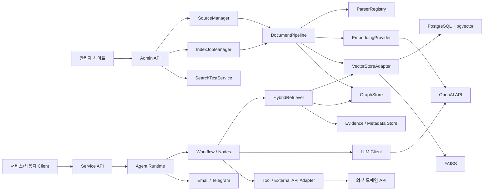

# GraphRAG AI Agent 공통 프레임워크 인터페이스 및 외부 연계 분석서

## 1. 문서 개요

### 1.1 목적

본 문서는 GraphRAG AI Agent 공통 프레임워크 개발 프로젝트의 `230.분석` 단계 산출물로, 공통 프레임워크에서 제공해야 할 내부 인터페이스, 관리자/API 인터페이스, 외부 시스템 연계 대상을 분석한다. 또한 기존 프로젝트(`Sol-Bat`, `VectorMoon`, `accountBook`, `lotto`, `vm-common-core`)에서 사용 중인 연계 구조를 기준으로 공통화 대상과 표준 연계 방식을 정의한다.

### 1.2 분석 범위

| 구분 | 분석 내용 |
|---|---|
| 내부 인터페이스 | SourceManager, DocumentPipeline, VectorStoreAdapter, GraphStore, HybridRetriever, Agent Node 간 계약 |
| 관리자/API 인터페이스 | 자료 등록, 벡터화 실행, 작업 상태 모니터링, 검색 테스트, Agent 실행 API |
| 외부 AI 연계 | OpenAI Chat/Embedding, 향후 LLM provider 확장 |
| 저장소 연계 | PostgreSQL, pgvector, FAISS, Chroma 후보 |
| 외부 도메인 API | 농업 API, 투자 API, 로또 API, Google OAuth |
| 운영 연계 | Email, Telegram, Scheduler, 로그/모니터링 |

### 1.3 분석 기준

| 기준 | 설명 |
|---|---|
| 재사용성 | 서비스별 구현을 공통 프레임워크 인터페이스로 추상화할 수 있는가 |
| 교체 가능성 | OpenAI, Vector Store, 외부 API provider를 설정만으로 교체할 수 있는가 |
| 추적성 | 외부 연계 요청과 결과가 Source, Evidence, AgentRun과 연결되는가 |
| 운영성 | 실패, 재시도, timeout, rate limit, 알림을 표준화할 수 있는가 |
| 보안성 | API Key, OAuth, 사용자 권한, 자료 범위 필터를 통제할 수 있는가 |

## 2. 전체 인터페이스 구조



## 3. 기존 프로젝트 외부 연계 현황

### 3.1 프로젝트별 연계 요약

| 프로젝트 | 외부 연계 | 용도 | 공통화 후보 |
|---|---|---|---|
| `vm-common-core` | OpenAI Embedding, PostgreSQL, FAISS, Chroma, Email, Telegram, Google OAuth | 공통 AI/DB/알림/인증 기반 | Provider Adapter, Notifier Adapter, Auth Adapter |
| `Sol-Bat` | OpenAI, Supabase PostgreSQL/pgvector, KMA, Nongsaro, NPMS, Telegram | 농업 지식 RAG, 기상/토양/병해충 수집, 알림 | ExternalDataAdapter, VectorStoreAdapter, NotificationAdapter |
| `VectorMoon` | OpenAI, PostgreSQL/pgvector, yfinance, OpenDART, Kiwoom, Telegram, Email, Google OAuth | 투자 분석, 전략 문서 RAG, 시세/공시/주문 연계 | MarketDataAdapter, BrokerAdapter, RetrievalAdapter |
| `accountBook` | OpenAI, FAISS, PostgreSQL/SQLite, Google OAuth, Email, Telegram | 거래 분류, 유사 가맹점 검색, 리포트 발송 | LocalVectorAdapter, StructuredOutputParser, ReportNotifier |
| `lotto` | PostgreSQL, 로또 API, Email/Telegram, Scheduler | 회차 동기화, 추천 리포트, 알림 | ExternalSyncAdapter, SchedulerAdapter |

### 3.2 주요 환경변수

| 환경변수 | 사용처 | 설명 |
|---|---|---|
| `OPENAI_API_KEY` | 공통, Sol-Bat, VectorMoon, accountBook | Chat/Embedding API 인증 |
| `DATABASE_URL` | vm-common-core, VectorMoon, accountBook, lotto | PostgreSQL 또는 SQLite 연결 |
| `VECTOR_DB_URL` | VectorMoon, vm-common-core | pgvector 전용 연결 |
| `SUPABASE_DB_URL` | Sol-Bat | Supabase PostgreSQL/pgvector 연결 |
| `TELEGRAM_BOT_TOKEN` | 공통, Sol-Bat, VectorMoon, accountBook | Telegram Bot 연계 |
| `TELEGRAM_CHAT_ID` | 공통, Sol-Bat, VectorMoon, accountBook | 기본 알림 대상 |
| `MAIL_USER`, `MAIL_PASSWORD` | 공통, accountBook | SMTP 메일 발송 |
| `KMA_SERVICE_KEY` | Sol-Bat | 기상청 API |
| `DART_API_KEY` | VectorMoon | OpenDART 공시 API |
| `KIWOOM_APP_KEY`, `KIWOOM_SECRET_KEY` | VectorMoon | Kiwoom API |
| `GOOGLE_CLIENT_ID` | 공통, VectorMoon, accountBook | Google OAuth |

## 4. 내부 공통 인터페이스 분석

### 4.1 SourceManager Interface

| 항목 | 내용 |
|---|---|
| 목적 | 자료 원천 등록, 조회, 상태 변경, 삭제/비활성화 |
| 입력 | SourceCreateRequest, SourceUpdateRequest, user context |
| 출력 | Source, SourceVersion, SourceStatus |
| 주요 메서드 | register_source, get_source, list_sources, update_source_status, delete_source, disable_source |
| 연계 엔티티 | Source, SourceVersion, Document, IndexJob |
| 기존 근거 | Sol-Bat KB upload/list/delete, VectorMoon document list/delete |

#### 표준 계약 초안

```text
SourceManager.register_source(request, actor) -> Source
SourceManager.create_version(source_id, payload, actor) -> SourceVersion
SourceManager.list_sources(filter, pagination) -> Page[Source]
SourceManager.disable_source(source_id, actor) -> Source
SourceManager.delete_source(source_id, delete_policy, actor) -> DeleteResult
```

### 4.2 IndexJobManager Interface

| 항목 | 내용 |
|---|---|
| 목적 | 벡터화/GraphRAG 인덱싱 작업 생성, 실행, 상태 모니터링, 재시도 |
| 입력 | source_id, job_type, option, actor |
| 출력 | IndexJob, IndexJobStep, progress |
| 주요 메서드 | create_job, run_job, cancel_job, retry_job, get_job_status, list_jobs |
| 연계 엔티티 | IndexJob, IndexJobStep, Source, Document, Chunk |
| 기존 근거 | Sol-Bat ingest/upload, VectorMoon process_document_with_preview, accountBook vectorize_training_data |

#### 표준 계약 초안

```text
IndexJobManager.create_job(source_id, job_type, options, actor) -> IndexJob
IndexJobManager.run_job(job_id) -> IndexJobResult
IndexJobManager.get_status(job_id) -> IndexJobStatus
IndexJobManager.retry(job_id, actor) -> IndexJob
IndexJobManager.cancel(job_id, actor) -> IndexJob
```

### 4.3 DocumentPipeline Interface

| 항목 | 내용 |
|---|---|
| 목적 | 파일/외부 자료를 로딩, 파싱, chunking, metadata enrich 처리 |
| 입력 | SourceVersion, parser option, chunk option |
| 출력 | Document, Chunk 목록, preview |
| 주요 메서드 | load, parse, split, normalize, build_metadata, preview |
| 기존 근거 | vm-common-core document_loader, Sol-Bat ingest, VectorMoon get_document_loader/process_document |

#### 처리 단계

| 단계 | 설명 | 오류 처리 |
|---|---|---|
| LOAD | 파일 또는 외부 URI 로딩 | source not found, auth error |
| PARSE | 텍스트/표/메타데이터 추출 | unsupported file, parse failure |
| NORMALIZE | 한글 NFC, 공백, 특수문자 정규화 | warning 처리 |
| SPLIT | chunk 분할 | chunk count 0이면 실패 |
| ENRICH | domain, scope, filename, page 등 metadata 부여 | 필수 metadata 누락 검증 |
| PREVIEW | 관리자 검수용 sample 반환 | 일부 chunk만 반환 |

### 4.4 VectorStoreAdapter Interface

| 항목 | 내용 |
|---|---|
| 목적 | PGVector, FAISS, Chroma 등 vector store 구현 차이 흡수 |
| 입력 | Chunk, embedding, metadata, query |
| 출력 | VectorSearchResult, Chunk, score |
| 주요 메서드 | add, search, delete_by_source, delete_by_document, list_documents, get_chunks |
| 기존 근거 | Sol-Bat RAGManager, VectorMoon vector_store, accountBook FAISS VectorStore, vm-common-core VectorStoreFactory |

#### 표준 계약 초안

```text
VectorStoreAdapter.add_chunks(chunks, embeddings, metadata) -> AddResult
VectorStoreAdapter.search(query, filter, top_k) -> list[VectorSearchResult]
VectorStoreAdapter.delete_by_source(source_id) -> DeleteResult
VectorStoreAdapter.delete_by_document(document_id) -> DeleteResult
VectorStoreAdapter.get_chunks(filter, pagination) -> Page[Chunk]
VectorStoreAdapter.health_check() -> HealthStatus
```

### 4.5 GraphStore Interface

| 항목 | 내용 |
|---|---|
| 목적 | Entity, Relation, Evidence 저장 및 그래프 탐색 |
| 입력 | Entity 후보, Relation 후보, EvidenceLink |
| 출력 | Entity, Relation, GraphSearchResult |
| 주요 메서드 | upsert_entity, upsert_relation, link_evidence, traverse, find_neighbors |
| 1차 구현 | PostgreSQL graph tables |
| 향후 확장 | Neo4j, RDF store 등 별도 graph backend adapter |

### 4.6 HybridRetriever Interface

| 항목 | 내용 |
|---|---|
| 목적 | Vector 검색과 Graph 탐색을 조합하여 Agent context 생성 |
| 입력 | query, domain, filter, retrieval policy |
| 출력 | RetrievalRun, RetrievalResult, Context |
| 주요 메서드 | retrieve, retrieve_vector, retrieve_graph, rerank, assemble_context |
| 기존 근거 | Sol-Bat retrieve_knowledge, VectorMoon retrieve_documents, accountBook RAG hint |

#### 검색 정책

| 정책 | 설명 |
|---|---|
| VECTOR_ONLY | 기존 RAG 방식 |
| GRAPH_ONLY | Entity/Relation 탐색 중심 |
| HYBRID | Vector 결과를 seed로 graph 확장 |
| FALLBACK_CHAIN | 주 검색 실패 시 대체 검색기 사용 |
| FILTERED | user_id, scope, domain, source_type 기준 필터 |

### 4.7 Agent Runtime Interface

| 항목 | 내용 |
|---|---|
| 목적 | Agent 실행, Workflow compile/run, 노드 상태 기록 |
| 입력 | agent_id, workflow_id, input, requester |
| 출력 | AgentRun, final_output, cited evidence |
| 주요 메서드 | run_agent, run_workflow, run_node, record_step, attach_evidence |
| 기존 근거 | Sol-Bat StateGraph, VectorMoon StateGraph, lotto StateGraph |

## 5. 관리자/API 인터페이스 분석

### 5.1 관리자 API 그룹

| API 그룹 | 목적 | 주요 리소스 |
|---|---|---|
| Source API | 자료 등록/목록/상세/삭제 | Source, Document |
| IndexJob API | 벡터화 작업 실행/상태/재시도 | IndexJob, IndexJobStep |
| Preview API | Chunk/Entity/Relation/Evidence 미리보기 | Chunk, Entity, Relation, Evidence |
| Retrieval Test API | 관리자 검색 테스트 | RetrievalRun, RetrievalResult |
| Agent API | Agent 실행 및 이력 조회 | AgentRun, AgentRunStep |
| Config API | Retriever, DomainSchema, Provider 설정 | RetrieverConfig, DomainSchema |

### 5.2 API 초안

| Method | Path | 설명 |
|---|---|---|
| POST | `/api/admin/sources` | 자료 등록 |
| GET | `/api/admin/sources` | 자료 목록 조회 |
| GET | `/api/admin/sources/{source_id}` | 자료 상세 조회 |
| DELETE | `/api/admin/sources/{source_id}` | 자료 삭제 또는 비활성화 |
| POST | `/api/admin/sources/{source_id}/index-jobs` | 벡터화/GraphRAG 인덱싱 작업 생성 |
| GET | `/api/admin/index-jobs` | 작업 목록 조회 |
| GET | `/api/admin/index-jobs/{job_id}` | 작업 상태 상세 조회 |
| POST | `/api/admin/index-jobs/{job_id}/retry` | 작업 재시도 |
| POST | `/api/admin/index-jobs/{job_id}/cancel` | 작업 취소 |
| GET | `/api/admin/sources/{source_id}/chunks` | 청크 목록/미리보기 |
| GET | `/api/admin/sources/{source_id}/entities` | 추출 개체 목록 |
| GET | `/api/admin/sources/{source_id}/relations` | 추출 관계 목록 |
| POST | `/api/admin/retrieval-tests` | 검색 테스트 실행 |
| POST | `/api/agents/{agent_id}/runs` | Agent 실행 |
| GET | `/api/agents/runs/{agent_run_id}` | Agent 실행 결과 조회 |

### 5.3 API 공통 요청/응답 규칙

| 항목 | 표준 |
|---|---|
| 인증 | JWT Bearer Token |
| 권한 | ADMIN, OPERATOR, USER, SYSTEM |
| Content-Type | JSON 기본, 파일 업로드는 multipart/form-data |
| Pagination | page, size, sort |
| Filter | domain_code, status, source_type, owner_id, created_from, created_to |
| Error Format | error_code, message, detail, trace_id |
| Trace Header | X-Request-Id 또는 서버 생성 trace_id |
| 시간대 | ISO-8601, KST 표시와 UTC 저장 정책 병행 검토 |

### 5.4 파일 업로드 인터페이스

| 항목 | 기준 |
|---|---|
| 업로드 방식 | multipart/form-data |
| 입력 필드 | file, domain_code, title, source_type, scope, tags, metadata |
| 지원 파일 | PDF, TXT, DOCX, CSV, XLSX, MD |
| 크기 제한 | MVP에서 설정값으로 관리 |
| 보안 | 확장자, MIME, 파일 크기, 악성 파일 검사 hook |
| 처리 방식 | 등록 즉시 Source 생성, 인덱싱은 별도 IndexJob으로 실행 |

## 6. 외부 AI/LLM 연계 분석

### 6.1 OpenAI Chat API

| 항목 | 내용 |
|---|---|
| 사용처 | Agent 답변 생성, 요약, 분류, 개체/관계 추출 |
| 기존 구현 | Sol-Bat, VectorMoon, accountBook, lotto |
| 공통화 대상 | LLMClient, StructuredOutputParser, PromptTemplate |
| 주요 입력 | system prompt, user prompt, context, response schema |
| 주요 출력 | text, JSON object, usage, model, error |
| 운영 고려 | timeout, retry, rate limit, token 사용량 기록, fallback |

### 6.2 OpenAI Embedding API

| 항목 | 내용 |
|---|---|
| 사용처 | Chunk embedding, 가맹점 embedding |
| 기존 모델 | `text-embedding-3-small` |
| 공통화 대상 | EmbeddingProvider |
| 주요 입력 | text list, model name |
| 주요 출력 | embedding vector, dimension, usage |
| 운영 고려 | batch size, 실패 항목 재시도, 비용 기록, 개인정보 마스킹 |

### 6.3 Structured Output 표준

| 항목 | 기준 |
|---|---|
| 사용처 | Entity/Relation 추출, 거래 분류, Agent action 생성, insight 생성 |
| 응답 형식 | JSON object |
| 검증 방식 | schema validation |
| 실패 처리 | JSON repair, retry, fallback output |
| 저장 대상 | AgentRunStep.output_json, IndexJobStep output, ErrorLog |

## 7. 저장소 연계 분석

### 7.1 PostgreSQL

| 항목 | 내용 |
|---|---|
| 사용처 | 공통 메타데이터, Agent 실행 이력, Source/IndexJob, Graph tables |
| 기존 구현 | vm-common-core, VectorMoon, accountBook, lotto |
| 공통화 대상 | DB Session, BaseModel, migration, repository pattern |
| 고려사항 | 트랜잭션, connection pool, soft delete, audit |

### 7.2 pgvector

| 항목 | 내용 |
|---|---|
| 사용처 | Sol-Bat, VectorMoon RAG |
| 기존 collection | `solbat_knowledge`, `stock_docs` |
| 공통화 대상 | PGVectorAdapter |
| 고려사항 | collection naming, metadata JSONB filter, delete by source/document, similarity score 표준화 |

### 7.3 FAISS

| 항목 | 내용 |
|---|---|
| 사용처 | accountBook 유사 가맹점 검색 |
| 저장 방식 | local `.index`, `.meta` |
| 공통화 대상 | FAISSVectorStoreAdapter |
| 고려사항 | index rebuild, metadata sync, 동시성, 백업 |

### 7.4 Graph Store

| 항목 | 내용 |
|---|---|
| 1차 후보 | PostgreSQL graph tables |
| 저장 대상 | Entity, Relation, Evidence, EvidenceLink |
| 향후 후보 | Neo4j, RDF/OWL store |
| 공통화 대상 | GraphStore adapter |
| 고려사항 | relation traversal 성능, evidence join, schema version |

## 8. 외부 도메인 API 연계 분석

### 8.1 농업 API 연계

| API | 사용 프로젝트 | 용도 | 공통화 방향 |
|---|---|---|---|
| KMA 기상 API | Sol-Bat | 실시간 기상, 예보 | WeatherAdapter |
| Nongsaro API | Sol-Bat | 영농 기술, 토양/작물 정보 | AgricultureKnowledgeAdapter |
| NPMS API | Sol-Bat | 병해충 예찰/검색 | PestRiskAdapter |
| 토양 API | Sol-Bat | 토양 화학성/특성 | SoilAdapter |

#### 표준 연계 항목

| 항목 | 기준 |
|---|---|
| 요청 timeout | adapter 설정값 |
| 실패 처리 | mock/fallback 여부 명시 |
| 응답 저장 | Evidence 또는 ExternalObservation 후보 |
| Agent 주입 | State.metadata 또는 Context로 변환 |
| 보안 | API Key 환경변수 관리 |

### 8.2 투자 API 연계

| API | 사용 프로젝트 | 용도 | 공통화 방향 |
|---|---|---|---|
| yfinance | VectorMoon | 가격/시세/차트 데이터 | MarketDataAdapter |
| OpenDART | VectorMoon | 공시/재무 데이터 | DisclosureAdapter |
| Kiwoom API | VectorMoon | 계좌/주문/잔고/시세 | BrokerAdapter |
| NotebookLM fallback | VectorMoon | 전략 문서 fallback 질의 | KnowledgeFallbackAdapter |

#### 투자 연계 주의사항

| 항목 | 설명 |
|---|---|
| 주문 API | 실거래 연계는 방어 모드, 권한, 이중 확인 필요 |
| Rate limit | Kiwoom, DART 등 호출 제한 고려 |
| 데이터 지연 | 시세 데이터는 지연 또는 누락 가능성 표시 |
| 감사 | 주문/추천 관련 AgentRun과 Evidence 보존 |

### 8.3 가계부/인증/리포트 연계

| 연계 | 사용 프로젝트 | 용도 | 공통화 방향 |
|---|---|---|---|
| Google OAuth | vm-common-core, VectorMoon, accountBook | 로그인 인증 | AuthAdapter |
| SMTP Email | vm-common-core, accountBook, VectorMoon | 리포트/알림 발송 | EmailNotifier |
| Telegram Bot | vm-common-core, Sol-Bat, VectorMoon, accountBook | 운영/사용자 알림 | TelegramNotifier |
| Excel/CSV 파일 | accountBook | 거래 데이터 업로드 | ParserRegistry |

### 8.4 로또 API 연계

| 항목 | 내용 |
|---|---|
| 사용 프로젝트 | lotto |
| 용도 | 회차별 당첨번호 동기화 |
| 공통화 방향 | ExternalSyncAdapter, SchedulerAdapter |
| 저장 후보 | Source, Chunk, Entity, Relation, Evidence |
| 운영 고려 | 토요일 추첨 후 동기화, 실패 재시도, 결과 리포트 알림 |

## 9. 운영 연계 분석

### 9.1 Scheduler

| 항목 | 내용 |
|---|---|
| 기존 구현 | vm-common-core BaseScheduler, VectorMoon scheduler, lotto AsyncIOScheduler, accountBook scheduler |
| 용도 | 정기 인덱싱, 외부 API 동기화, 리포트 발송, 평가 실행 |
| 공통화 대상 | SchedulerAdapter, JobRegistry |
| 표준 데이터 | scheduled_job_id, job_type, cron_expr, status, last_run_at, next_run_at |

### 9.2 Notification

| 채널 | 사용처 | 표준 이벤트 |
|---|---|---|
| Email | accountBook 리포트, VectorMoon 리포트 | INDEX_FAILED, REPORT_READY, AGENT_RUN_FAILED |
| Telegram | Sol-Bat, VectorMoon, accountBook, lotto | JOB_FAILED, JOB_SUCCEEDED, RISK_ALERT |
| 내부 알림 | 관리자 사이트 | IndexJob 상태 변경, 검색 품질 경고 |

### 9.3 Logging/Monitoring

| 로그 | 기록 대상 |
|---|---|
| API Access Log | 요청자, endpoint, status, latency, trace_id |
| External Call Log | provider, endpoint, status, latency, retry_count |
| IndexJob Log | 단계별 처리 수, 실패 사유 |
| AgentRun Log | 노드별 input/output summary, 오류 |
| Retrieval Log | query, top_k, score, hit/miss |
| Cost Log | LLM token, embedding count, provider 비용 |

## 10. 보안 및 권한 인터페이스

### 10.1 인증/인가

| 항목 | 기준 |
|---|---|
| 인증 방식 | JWT Bearer Token, Google OAuth 연계 가능 |
| 역할 | SYSTEM, ADMIN, OPERATOR, USER |
| 관리자 API | ADMIN 또는 OPERATOR 권한 필요 |
| 개인 자료 | owner_id, user_id, tenant_id, scope 기반 필터 |
| 시스템 작업 | Scheduler는 SYSTEM 권한으로 실행 이력 기록 |

### 10.2 Secret 관리

| 항목 | 기준 |
|---|---|
| API Key | 환경변수 또는 secret manager 사용 |
| 로그 마스킹 | API Key, token, 계좌번호, 개인정보 마스킹 |
| 설정 조회 | 관리자 화면에 secret 원문 노출 금지 |
| 회전 | provider credential 교체 절차 필요 |

### 10.3 자료 접근 통제

| Scope | 설명 |
|---|---|
| PUBLIC | 전체 사용 가능 |
| PRIVATE | 등록자 또는 소유자만 사용 가능 |
| TENANT | 같은 조직/서비스 tenant 내 사용 |
| SYSTEM | 시스템 내부 전용 |

## 11. 오류 및 재시도 표준

### 11.1 오류 분류

| 오류 코드 Prefix | 설명 |
|---|---|
| `SRC` | Source 등록/조회 오류 |
| `PRS` | 문서 파싱 오류 |
| `IDX` | 인덱싱 작업 오류 |
| `EMB` | Embedding 오류 |
| `VEC` | Vector Store 오류 |
| `GRP` | Graph Store 오류 |
| `RET` | Retrieval 오류 |
| `LLM` | LLM 호출/응답 파싱 오류 |
| `EXT` | 외부 API 오류 |
| `AGT` | Agent Workflow 오류 |
| `AUTH` | 인증/인가 오류 |

### 11.2 재시도 정책

| 대상 | 재시도 기준 |
|---|---|
| 외부 API | timeout, 429, 5xx는 지수 backoff |
| LLM 호출 | rate limit, transient error 재시도 |
| Embedding | batch 단위 실패 시 실패 항목만 재시도 |
| Vector Store 저장 | connection error 재시도, 데이터 오류는 실패 처리 |
| IndexJob | 단계별 재시도 가능, 최대 횟수 설정 |
| AgentRun | 노드 단위 retry_policy 적용 |

## 12. 공통 Adapter 후보

| Adapter | 목적 | 1차 구현 |
|---|---|---|
| `LLMClient` | Chat completion 호출 표준화 | OpenAI |
| `EmbeddingProvider` | Embedding 생성 표준화 | OpenAI |
| `VectorStoreAdapter` | Vector 저장소 표준화 | PGVector, FAISS |
| `GraphStoreAdapter` | Graph 저장소 표준화 | PostgreSQL tables |
| `ParserAdapter` | 파일 파서 표준화 | PDF, TXT, DOCX, CSV, XLSX, MD |
| `ExternalDataAdapter` | 도메인 외부 API 표준화 | KMA, DART, Lotto 등 |
| `AuthAdapter` | 인증 provider 표준화 | JWT, Google OAuth |
| `NotificationAdapter` | 알림 채널 표준화 | Email, Telegram |
| `SchedulerAdapter` | 정기 작업 표준화 | APScheduler |

## 13. MVP 인터페이스 범위

### 13.1 1차 필수

| 우선순위 | 인터페이스 | 이유 |
|---:|---|---|
| 1 | Source API / SourceManager | 관리자 자료 관리의 시작점 |
| 2 | IndexJob API / IndexJobManager | 벡터화 실행과 상태 모니터링의 핵심 |
| 3 | DocumentPipeline / ParserRegistry | 자료 파싱과 chunking 표준화 |
| 4 | EmbeddingProvider | 벡터화 공통 처리 |
| 5 | VectorStoreAdapter | PGVector/FAISS 중복 제거 |
| 6 | GraphStoreAdapter | Entity/Relation/Evidence 저장 |
| 7 | HybridRetriever | GraphRAG 검색 실행 |
| 8 | Agent Runtime API | 공통 Agent 실행과 이력 관리 |

### 13.2 후속 확장

| 인터페이스 | 확장 시점 |
|---|---|
| Evaluation API | 검색/답변 품질 평가 자동화 |
| PromptTemplate API | 프롬프트 관리 화면 도입 |
| ToolConfig API | Agent tool marketplace 또는 plugin 구조 도입 |
| Advanced Notification API | 사용자별 구독/알림 정책 도입 |
| External API Credential Admin | provider credential 관리 고도화 |

## 14. 리스크 및 대응

| 리스크 ID | 리스크 | 영향 | 대응 |
|---|---|---|---|
| IF-001 | 외부 API별 응답 형식 차이 | Adapter 구현 복잡도 증가 | provider별 adapter + 표준 DTO 변환 |
| IF-002 | LLM 응답 JSON 파싱 실패 | Agent/Graph 추출 품질 저하 | schema validation, retry, fallback |
| IF-003 | Vector Store별 기능 차이 | delete/list/metadata filter 동작 불일치 | 최소 공통 계약 정의 후 provider별 capability 표시 |
| IF-004 | API Key 노출 위험 | 보안 사고 | secret masking, 환경변수/secret manager 사용 |
| IF-005 | 외부 API rate limit | 작업 실패/지연 | backoff, queue, scheduler 분산 |
| IF-006 | 실거래 API 연계 위험 | 금전 손실 가능성 | 권한 분리, 방어 모드, 이중 승인, audit |
| IF-007 | 대용량 파일 업로드 | timeout/메모리 문제 | 비동기 IndexJob, 파일 크기 제한, streaming 검토 |
| IF-008 | 개인 자료 검색 노출 | 개인정보/권한 이슈 | scope, owner_id, tenant_id 필터 강제 |

## 15. 분석 결론

기존 프로젝트는 이미 OpenAI, PGVector/FAISS, 외부 도메인 API, Email/Telegram, Scheduler를 각 서비스 내부에서 개별 구현하고 있다. GraphRAG AI Agent 공통 프레임워크에서는 이를 `Adapter`, `Manager`, `Runtime` 계층으로 분리해 교체 가능하고 추적 가능한 인터페이스로 표준화해야 한다.

1차 MVP는 관리자 사이트의 자료 관리와 벡터화 실행 요구사항을 기준으로 `SourceManager`, `IndexJobManager`, `DocumentPipeline`, `EmbeddingProvider`, `VectorStoreAdapter`, `GraphStoreAdapter`, `HybridRetriever`를 우선 구현하는 것이 적합하다. 이후 Agent Runtime과 외부 도메인 API Adapter를 확장하여 `Sol-Bat` 파일럿에서 검증하고, `VectorMoon`, `accountBook`, `lotto`로 적용 범위를 넓힌다.

## 16. 후속 작업

| 우선순위 | WBS 연계 | 후속 작업 | 산출물 |
|---:|---|---|---|
| 1 | 230.분석 | 분석 단계 산출물 검토 및 확정 | 분석산출물 검토확정서 |
| 2 | 240.설계 | 관리자 사이트 화면/API 설계 | 화면정의서, API명세서 |
| 3 | 240.설계 | 공통 모듈 상세 설계 | 공통모듈상세설계서 |
| 4 | 240.설계 | 물리 데이터 모델 설계 | 물리 ERD, 테이블정의서 |
| 5 | 300.구현 | Source/IndexJob/VectorStore MVP 구현 | 공통 프레임워크 소스 |

## 17. 승인 및 변경 이력

### 17.1 승인 기록

| 구분 | 역할 | 승인 여부 | 일자 | 비고 |
|---|---|---|---|---|
| 작성 | 아키텍터 | 작성 완료 | 2026-06-21 | 초안 |
| 검토 | GraphRAG Engineer | 검토 필요 | - | GraphRAG 검색/LLM 인터페이스 검토 |
| 검토 | Data Architect | 검토 필요 | - | 데이터 모델 정합성 검토 |
| 검토 | PM | 검토 필요 | - | WBS 및 산출물 정합성 검토 |
| 승인 | Product Owner | 승인 필요 | - | 사용자 확인 필요 |

### 17.2 변경 이력

| 버전 | 일자 | 변경 내용 | 작성자 |
|---|---|---|---|
| v0.1 | 2026-06-21 | 인터페이스 및 외부 연계 분석서 최초 작성 | 아키텍터 |
