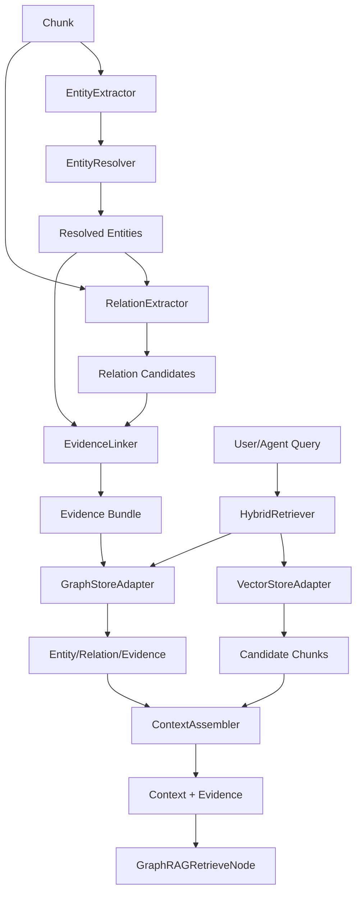
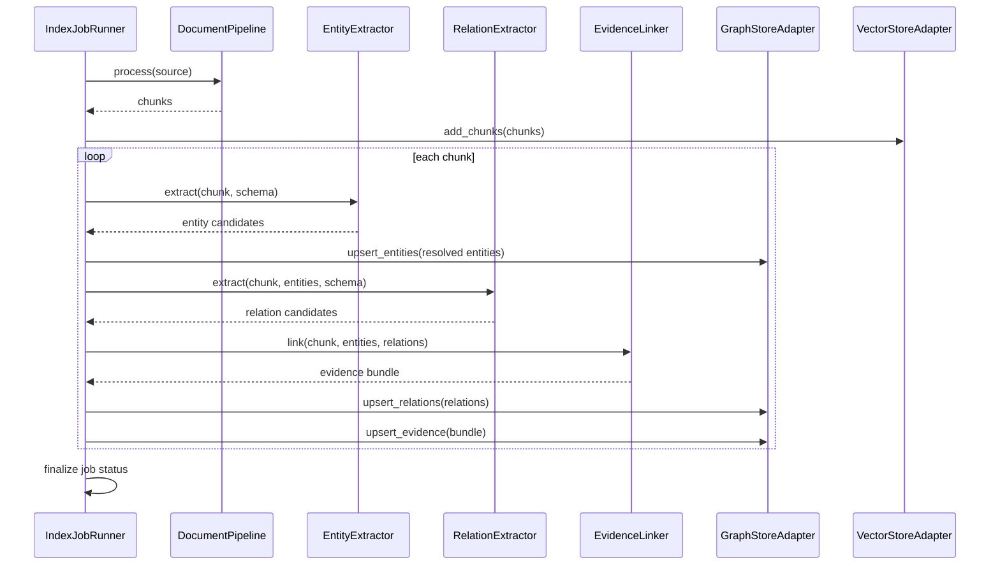
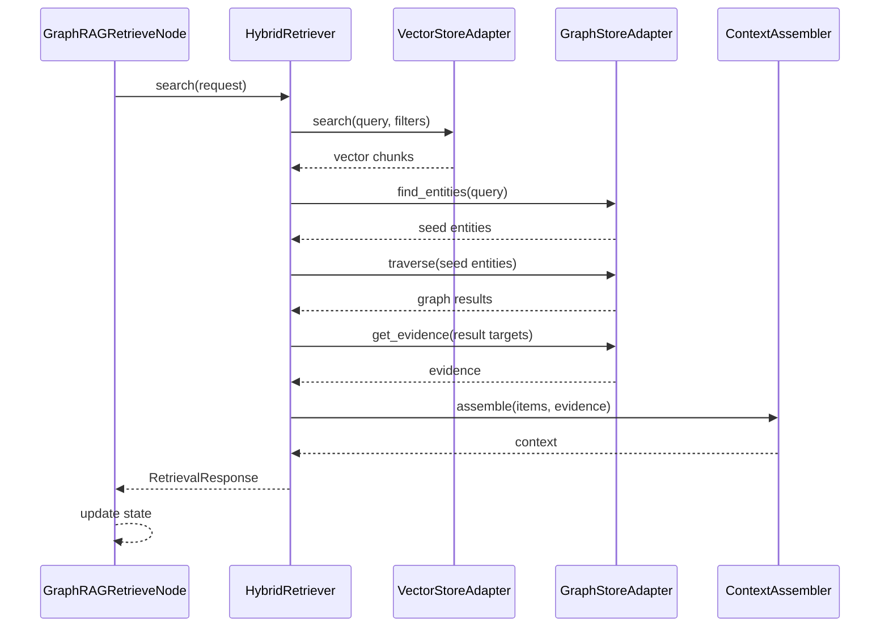

# GraphRAG AI Agent 공통 프레임워크 GraphRAG Core 상세설계서

## 1. 문서 개요

### 1.1 목적

본 문서는 GraphRAG AI Agent 공통 프레임워크의 핵심 기능인 GraphRAG Core를 구현 가능한 수준으로 상세 설계한다. 대상 컴포넌트는 `EntityExtractor`, `RelationExtractor`, `EvidenceLinker`, `GraphStoreAdapter`, `HybridRetriever`, `ContextAssembler`, `GraphRAGRetrieveNode`이며, 자료 인덱싱부터 Agent 응답 근거 주입까지의 처리 흐름과 입출력 schema를 정의한다.

### 1.2 설계 범위

| 구분 | 설계 대상 |
|---|---|
| 개체 추출 | `EntityExtractor`, `EntityResolver` |
| 관계 추출 | `RelationExtractor` |
| 근거 연결 | `EvidenceLinker` |
| 그래프 저장 | `GraphStoreAdapter`, PostgreSQL Graph Tables |
| 하이브리드 검색 | `HybridRetriever`, vector + graph 결합 |
| 컨텍스트 조립 | `ContextAssembler`, evidence-aware prompt context |
| Agent 연계 | `GraphRAGRetrieveNode`, LangGraph State 입출력 |

### 1.3 전제 조건

| 항목 | 전제 |
|---|---|
| 1차 파일럿 | `Sol-Bat` KB와 Agent 검색 노드 |
| Vector Store | PGVector 기본, FAISS 보조 |
| Graph Store | PostgreSQL Graph Tables 1차 구현 |
| LLM 출력 | JSON schema validation 우선 |
| 추적성 | 모든 Entity/Relation/Agent Context는 Source, Chunk, Evidence까지 추적 가능해야 함 |
| 권한 | 모든 검색과 preview는 `AuthContext` 기반으로 접근 제어 |

### 1.4 선행 산출물 반영

| 선행 산출물 | 반영 내용 |
|---|---|
| 공통 모듈 상세설계서 | GraphRAG Core의 패키지 구조, 공통 DTO, 관리자/Agent 연계 기준 반영 |
| 도메인 개념 및 용어정의서 | Source, Chunk, Entity, Relation, Evidence, Retriever, Context 용어 반영 |
| 논리 데이터 모델 분석서 | Entity, EntityMention, Relation, Evidence, EvidenceLink, RetrievalRun 모델 반영 |
| RAG/Agent 구현현황분석서 | `Sol-Bat.retrieve_knowledge`, `VectorMoon.retrieve_documents` 공통화 방향 반영 |

## 2. GraphRAG Core 전체 구조

### 2.1 처리 흐름



### 2.2 패키지 구조

```text
common_core/
  ai_pipeline/
    graphrag/
      schemas.py
      schema_registry.py
      entity_extractor.py
      entity_resolver.py
      relation_extractor.py
      evidence_linker.py
      graph_store.py
      hybrid_retriever.py
      context_assembler.py
      scoring.py
      prompts/
        entity_extraction.md
        relation_extraction.md
    agents/
      nodes/
        graphrag_retrieve_node.py
```

### 2.3 컴포넌트 책임

| 컴포넌트 | 핵심 책임 |
|---|---|
| `EntityExtractor` | Chunk에서 domain schema 기반 entity 후보 추출 |
| `EntityResolver` | entity 후보 정규화, alias 병합, 중복 제거 |
| `RelationExtractor` | entity 후보 사이의 relation 후보 추출 |
| `EvidenceLinker` | entity/relation을 source/chunk 근거와 연결 |
| `GraphStoreAdapter` | entity/relation/evidence 저장, 조회, traversal |
| `HybridRetriever` | vector search와 graph traversal 결과 결합 |
| `ContextAssembler` | Agent/LLM에 전달할 context와 citation 구성 |
| `GraphRAGRetrieveNode` | LangGraph state에서 검색 수행 후 context/evidence 주입 |

## 3. 공통 Schema

### 3.1 AuthContext

```python
class AuthContext(BaseModel):
    tenant_id: str | None = None
    user_id: str | None = None
    roles: list[str] = []
    scope: str = "PRIVATE"
    domain_roles: dict[str, list[str]] = {}
```

### 3.2 ChunkInput

```python
class ChunkInput(BaseModel):
    chunk_id: str
    source_id: str
    source_version_id: str | None = None
    document_id: str
    domain: str
    content: str
    chunk_index: int
    page_no: int | None = None
    section_title: str | None = None
    start_offset: int | None = None
    end_offset: int | None = None
    metadata: dict = {}
```

### 3.3 DomainSchema

```python
class EntityTypeDef(BaseModel):
    type: str
    description: str
    required_attributes: list[str] = []
    optional_attributes: list[str] = []
    aliases: list[str] = []

class RelationTypeDef(BaseModel):
    type: str
    description: str
    source_types: list[str]
    target_types: list[str]
    required_attributes: list[str] = []

class DomainSchema(BaseModel):
    domain: str
    version: str
    entity_types: list[EntityTypeDef]
    relation_types: list[RelationTypeDef]
    validation_rules: dict = {}
```

### 3.4 EntityCandidate

```python
class EntityCandidate(BaseModel):
    candidate_id: str
    domain: str
    entity_type: str
    name: str
    normalized_name: str
    aliases: list[str] = []
    mention_text: str
    chunk_id: str
    source_id: str
    start_offset: int | None = None
    end_offset: int | None = None
    confidence_score: float
    extraction_method: str
    attributes: dict = {}
```

### 3.5 ResolvedEntity

```python
class ResolvedEntity(BaseModel):
    entity_id: str | None = None
    domain: str
    entity_type: str
    name: str
    normalized_name: str
    aliases: list[str] = []
    mention_texts: list[str] = []
    confidence_score: float
    merge_reason: str | None = None
    attributes: dict = {}
    evidence_chunk_ids: list[str] = []
```

### 3.6 RelationCandidate

```python
class RelationCandidate(BaseModel):
    candidate_id: str
    domain: str
    relation_type: str
    source_entity_ref: str
    target_entity_ref: str
    source_entity_type: str
    target_entity_type: str
    chunk_id: str
    source_id: str
    confidence_score: float
    extraction_method: str
    attributes: dict = {}
    rationale: str | None = None
```

### 3.7 EvidenceRecord

```python
class EvidenceRecord(BaseModel):
    evidence_id: str | None = None
    source_id: str
    document_id: str | None = None
    chunk_id: str | None = None
    evidence_type: str = "CHUNK"
    quote_text: str
    confidence_score: float
    extraction_method: str
    metadata: dict = {}
```

### 3.8 EvidenceLinkRecord

```python
class EvidenceLinkRecord(BaseModel):
    evidence_link_id: str | None = None
    evidence_id: str | None = None
    target_type: str
    target_id: str | None = None
    target_ref: str
    support_type: str = "SUPPORTS"
    confidence_score: float
```

### 3.9 RetrievalRequest

```python
class RetrievalRequest(BaseModel):
    domain: str
    query: str
    filters: dict = {}
    top_k: int = 5
    strategy: str = "HYBRID"
    include_evidence: bool = True
    max_graph_depth: int = 2
    auth: AuthContext | None = None
```

### 3.10 RetrievalResponse

```python
class RetrievalResponse(BaseModel):
    retrieval_run_id: str
    domain: str
    query: str
    status: str
    results: list["RetrievalItem"]
    context: str
    evidence: list[EvidenceRecord]
    metrics: dict = {}
```

### 3.11 RetrievalItem

```python
class RetrievalItem(BaseModel):
    rank: int
    result_type: str
    chunk_id: str | None = None
    entity_id: str | None = None
    relation_id: str | None = None
    evidence_ids: list[str] = []
    text: str
    score: float
    vector_score: float | None = None
    graph_score: float | None = None
    evidence_score: float | None = None
    metadata: dict = {}
```

## 4. EntityExtractor 상세설계

### 4.1 책임

`EntityExtractor`는 Chunk 텍스트에서 domain schema에 정의된 entity 후보를 추출한다. 1차 구현은 rule/dictionary 기반 후보 추출과 LLM structured output을 결합한다.

### 4.2 Public Interface

```python
class EntityExtractor:
    def extract(
        self,
        chunk: ChunkInput,
        schema: DomainSchema,
        options: EntityExtractionOptions,
    ) -> list[EntityCandidate]: ...
```

### 4.3 입력 Schema

```python
class EntityExtractionOptions(BaseModel):
    use_rule: bool = True
    use_llm: bool = True
    confidence_threshold: float = 0.60
    max_entities_per_chunk: int = 30
    language: str = "ko"
    model: str | None = None
```

### 4.4 출력 Schema

출력은 `list[EntityCandidate]`이다. 최소 필수 필드는 다음과 같다.

| 필드 | 필수 | 설명 |
|---|---|---|
| `candidate_id` | Y | 추출 후보 임시 ID |
| `entity_type` | Y | DomainSchema에 등록된 entity type |
| `name` | Y | 원문 또는 대표명 |
| `normalized_name` | Y | 정규화된 이름 |
| `mention_text` | Y | chunk 내 실제 표현 |
| `chunk_id` | Y | 근거 chunk |
| `source_id` | Y | 원천 source |
| `confidence_score` | Y | 추출 신뢰도 |
| `extraction_method` | Y | `RULE`, `LLM`, `HYBRID` |

### 4.5 처리 흐름

1. Chunk content를 Unicode NFC, 공백, 제어문자 기준으로 정규화한다.
2. DomainSchema에서 entity type, alias, dictionary, validation rule을 조회한다.
3. rule/dictionary 기반으로 명확한 후보를 추출한다.
4. LLM structured output으로 문맥 기반 후보를 추출한다.
5. schema validation으로 허용되지 않은 type과 필수값 누락 후보를 제거한다.
6. mention offset을 계산한다.
7. confidence threshold 미만 후보를 제외한다.
8. 같은 chunk 내 동일 normalized_name/entity_type 후보를 병합한다.
9. EntityCandidate 목록을 반환한다.

### 4.6 LLM 출력 Schema

```json
{
  "entities": [
    {
      "entity_type": "CROP",
      "name": "토마토",
      "mention_text": "토마토",
      "aliases": ["tomato"],
      "attributes": {
        "growth_stage": "착과기"
      },
      "confidence_score": 0.91,
      "rationale": "문서에서 재배 대상 작물로 언급됨"
    }
  ]
}
```

### 4.7 오류 처리

| 상황 | 처리 |
|---|---|
| LLM JSON parsing 실패 | 1회 retry 후 rule 결과만 사용 |
| 허용되지 않은 entity_type | 후보 제외, validation warning 기록 |
| confidence 미달 | 후보 제외 |
| chunk content 비어 있음 | 빈 목록 반환 |
| LLM provider 장애 | `GRAG-LLM-001` 기록, rule 결과 fallback |

## 5. EntityResolver 상세설계

### 5.1 책임

`EntityResolver`는 추출된 entity 후보를 기존 entity와 비교하여 중복을 제거하고 canonical entity로 정규화한다.

### 5.2 Public Interface

```python
class EntityResolver:
    def resolve(
        self,
        candidates: list[EntityCandidate],
        schema: DomainSchema,
        graph_store: GraphStoreAdapter,
    ) -> list[ResolvedEntity]: ...
```

### 5.3 정규화 규칙

| 규칙 | 설명 |
|---|---|
| Unicode 정규화 | NFC 적용 |
| 공백/기호 정리 | 다중 공백 제거, 앞뒤 공백 제거 |
| 대소문자 | 영문은 lower-case 비교 |
| alias 비교 | schema alias, 기존 entity aliases와 비교 |
| domain 분리 | 다른 domain의 entity와 병합하지 않음 |
| type 분리 | entity_type이 다르면 기본적으로 병합하지 않음 |

### 5.4 병합 기준

```text
same_entity =
  domain 동일
  AND entity_type 동일
  AND (
    normalized_name 동일
    OR alias 교차 일치
    OR provider별 external_code 동일
  )
```

## 6. RelationExtractor 상세설계

### 6.1 책임

`RelationExtractor`는 하나의 chunk 또는 인접 chunk 범위에서 발견된 entity 사이의 의미 있는 관계를 추출한다.

### 6.2 Public Interface

```python
class RelationExtractor:
    def extract(
        self,
        chunk: ChunkInput,
        entities: list[ResolvedEntity],
        schema: DomainSchema,
        options: RelationExtractionOptions,
    ) -> list[RelationCandidate]: ...
```

### 6.3 입력 Schema

```python
class RelationExtractionOptions(BaseModel):
    use_llm: bool = True
    confidence_threshold: float = 0.60
    max_relations_per_chunk: int = 40
    allow_inferred_relation: bool = False
    model: str | None = None
```

### 6.4 출력 Schema

출력은 `list[RelationCandidate]`이다.

| 필드 | 필수 | 설명 |
|---|---|---|
| `relation_type` | Y | DomainSchema에 등록된 relation type |
| `source_entity_ref` | Y | source entity 후보 ID 또는 entity ID |
| `target_entity_ref` | Y | target entity 후보 ID 또는 entity ID |
| `chunk_id` | Y | 관계가 추출된 chunk |
| `confidence_score` | Y | 추출 신뢰도 |
| `rationale` | N | 관계 판단 이유 |

### 6.5 처리 흐름

1. 같은 chunk 내 entity 후보 목록을 relation 후보 생성 대상으로 구성한다.
2. DomainSchema의 relation type별 허용 source/target entity type을 조회한다.
3. 허용 가능한 entity pair만 LLM 입력에 포함한다.
4. LLM structured output으로 relation 후보를 추출한다.
5. source/target entity 존재 여부와 type 제약을 검증한다.
6. confidence threshold 미만 relation을 제외한다.
7. 동일 source-target-type 관계를 병합하고 confidence를 재계산한다.
8. RelationCandidate 목록을 반환한다.

### 6.6 LLM 출력 Schema

```json
{
  "relations": [
    {
      "relation_type": "AFFECTS",
      "source_entity_name": "고온다습",
      "target_entity_name": "잎곰팡이병",
      "source_entity_type": "WEATHER_CONDITION",
      "target_entity_type": "DISEASE",
      "attributes": {
        "risk_level": "HIGH"
      },
      "confidence_score": 0.87,
      "rationale": "고온다습 조건에서 병 발생 위험이 증가한다고 설명됨"
    }
  ]
}
```

### 6.7 오류 처리

| 상황 | 처리 |
|---|---|
| entity가 2개 미만 | 빈 relation 목록 반환 |
| schema에 없는 relation type | 후보 제외 |
| source/target type 불일치 | 후보 제외 |
| LLM 실패 | `GRAG-LLM-001` 기록 후 빈 relation 목록 반환 |
| 낮은 confidence | 후보 제외 |

## 7. EvidenceLinker 상세설계

### 7.1 책임

`EvidenceLinker`는 추출된 entity와 relation이 어떤 source/chunk에서 근거를 갖는지 연결한다. GraphRAG에서 답변 출처를 보장하는 핵심 컴포넌트다.

### 7.2 Public Interface

```python
class EvidenceLinker:
    def link(
        self,
        chunk: ChunkInput,
        entities: list[ResolvedEntity],
        relations: list[RelationCandidate],
        options: EvidenceLinkOptions,
    ) -> EvidenceBundle: ...
```

### 7.3 입력 Schema

```python
class EvidenceLinkOptions(BaseModel):
    quote_window_chars: int = 300
    require_relation_evidence: bool = True
    default_support_type: str = "SUPPORTS"
```

### 7.4 출력 Schema

```python
class EvidenceBundle(BaseModel):
    evidence: list[EvidenceRecord]
    links: list[EvidenceLinkRecord]
    warnings: list[dict] = []
```

### 7.5 처리 흐름

1. Chunk에서 entity mention과 relation 근거 문장을 찾는다.
2. mention offset이 있으면 해당 위치 주변 quote를 생성한다.
3. offset이 없으면 chunk 전체 또는 relation rationale 기반 quote를 생성한다.
4. EvidenceRecord를 생성한다.
5. Entity 대상 EvidenceLink를 생성한다.
6. Relation 대상 EvidenceLink를 생성한다.
7. relation에 근거가 없으면 `warnings`에 기록하고 저장 대상에서 제외하거나 낮은 confidence로 저장한다.
8. EvidenceBundle을 반환한다.

### 7.6 Evidence Type

| Type | 설명 |
|---|---|
| `CHUNK` | 문서 chunk 기반 근거 |
| `API_RESPONSE` | 외부 API 응답 근거 |
| `CALCULATION` | 계산/통계 결과 근거 |
| `USER_INPUT` | 사용자 입력 근거 |
| `AGENT_OUTPUT` | Agent 이전 실행 결과 근거 |

### 7.7 제약 조건

| 제약 | 내용 |
|---|---|
| Evidence 필수 | Relation은 최소 1개 EvidenceLink가 있어야 검색 대상으로 사용 |
| Source 추적 | Evidence는 source_id 또는 chunk_id 중 하나 이상을 가져야 함 |
| Quote 길이 | 기본 300자 이내, 관리자 preview에서 원문 chunk 링크 제공 |
| 권한 상속 | Evidence 접근 권한은 연결 Source 권한을 상속 |

## 8. GraphStoreAdapter 상세설계

### 8.1 책임

`GraphStoreAdapter`는 Entity, EntityMention, Relation, Evidence, EvidenceLink를 저장하고 Graph Traversal 조회를 제공한다.

### 8.2 Public Interface

```python
class GraphStoreAdapter:
    def upsert_entities(self, entities: list[ResolvedEntity]) -> list[EntityRecord]: ...
    def upsert_relations(self, relations: list[RelationCandidate]) -> list[RelationRecord]: ...
    def upsert_evidence(self, bundle: EvidenceBundle) -> EvidenceWriteResult: ...
    def find_entities(self, query: EntityQuery, auth: AuthContext) -> list[EntityRecord]: ...
    def find_relations(self, query: RelationQuery, auth: AuthContext) -> list[RelationRecord]: ...
    def get_evidence(self, query: EvidenceQuery, auth: AuthContext) -> list[EvidenceRecord]: ...
    def traverse(self, request: GraphTraversalRequest, auth: AuthContext) -> GraphTraversalResult: ...
    def delete_by_source(self, source_id: str, auth: AuthContext) -> GraphDeleteResult: ...
```

### 8.3 Query Schema

```python
class EntityQuery(BaseModel):
    domain: str
    text: str | None = None
    entity_ids: list[str] = []
    entity_types: list[str] = []
    filters: dict = {}
    limit: int = 20

class RelationQuery(BaseModel):
    domain: str
    source_entity_ids: list[str] = []
    target_entity_ids: list[str] = []
    relation_types: list[str] = []
    filters: dict = {}
    limit: int = 50

class EvidenceQuery(BaseModel):
    domain: str
    evidence_ids: list[str] = []
    target_type: str | None = None
    target_ids: list[str] = []
    source_ids: list[str] = []
    limit: int = 50
```

### 8.4 Traversal Schema

```python
class GraphTraversalRequest(BaseModel):
    domain: str
    seed_entity_ids: list[str]
    relation_types: list[str] = []
    max_depth: int = 2
    direction: str = "BOTH"
    limit: int = 100
    include_evidence: bool = True

class GraphTraversalResult(BaseModel):
    entities: list[EntityRecord]
    relations: list[RelationRecord]
    evidence: list[EvidenceRecord]
    paths: list[dict] = []
```

### 8.5 저장 처리 흐름

1. `upsert_entities`가 normalized_name/domain/entity_type 기준으로 기존 entity를 조회한다.
2. 기존 entity가 있으면 alias, confidence, metadata를 병합한다.
3. 신규 entity는 insert한다.
4. EntityMention을 chunk 기준으로 insert한다.
5. `upsert_relations`가 source/target/type 기준 중복 relation을 조회한다.
6. 기존 relation이 있으면 weight와 confidence를 갱신한다.
7. Evidence와 EvidenceLink를 저장한다.
8. source_id, domain, entity_type, relation_type 기준 index를 갱신한다.

### 8.6 삭제 처리 흐름

| 삭제 방식 | 처리 |
|---|---|
| soft delete | source_id 기준 evidence/relation/entity mention을 비활성화 |
| hard delete | source_id 기준 evidence/evidence_link/entity_mention 삭제, orphan relation/entity 정리 |
| reindex | 기존 source version 데이터를 soft delete 후 새 version 저장 |

### 8.7 권한 필터

GraphStore 조회는 Evidence가 연결된 Source 권한을 기준으로 필터링한다. Entity 자체가 여러 Source에 연결된 경우, 요청자가 접근 가능한 Evidence가 하나 이상 있는 entity만 반환한다.

## 9. HybridRetriever 상세설계

### 9.1 책임

`HybridRetriever`는 vector search와 graph traversal을 결합하여 질문에 대한 관련 chunk, entity, relation, evidence를 반환한다.

### 9.2 Public Interface

```python
class HybridRetriever:
    def search(self, request: RetrievalRequest) -> RetrievalResponse: ...
```

### 9.3 검색 전략

| 전략 | 처리 |
|---|---|
| `VECTOR_ONLY` | VectorStore 검색 결과만 반환 |
| `GRAPH_ONLY` | query entity 추출 후 graph traversal 결과 반환 |
| `HYBRID` | vector 결과와 graph 결과를 결합 |
| `HYBRID_RERANK` | HYBRID 결과를 LLM 또는 cross-encoder reranker로 재정렬 |

### 9.4 처리 흐름

1. 요청 query를 정규화한다.
2. AuthContext로 접근 가능한 source scope를 계산한다.
3. VectorStoreAdapter로 top-k chunk를 검색한다.
4. query에서 seed entity 후보를 추출한다.
5. GraphStoreAdapter에서 seed entity를 조회한다.
6. seed entity와 vector 검색 chunk의 연결 entity를 기준으로 traversal을 수행한다.
7. chunk, entity, relation, evidence 후보를 하나의 candidate set으로 합친다.
8. 중복 evidence와 chunk를 병합한다.
9. score를 계산하고 rank를 부여한다.
10. ContextAssembler를 호출해 context를 생성한다.
11. RetrievalRun과 RetrievalResult를 저장한다.
12. RetrievalResponse를 반환한다.

### 9.5 Score Schema

```python
class HybridScore(BaseModel):
    vector_score: float = 0.0
    graph_score: float = 0.0
    evidence_score: float = 0.0
    recency_score: float = 0.0
    final_score: float
    reason: str
```

### 9.6 기본 점수 계산

```text
final_score =
  vector_score * 0.60
  + graph_score * 0.25
  + evidence_score * 0.10
  + recency_score * 0.05
```

### 9.7 Graph Score 기준

| 요소 | 점수 반영 |
|---|---|
| seed entity 직접 일치 | 높음 |
| graph distance 1 | 높음 |
| graph distance 2 | 중간 |
| relation confidence | relation 신뢰도에 비례 |
| evidence count | 근거가 많을수록 가산 |
| 접근 불가 evidence | 제외 |

### 9.8 RetrievalItem 병합 규칙

| 병합 기준 | 처리 |
|---|---|
| 같은 chunk_id | 가장 높은 score 사용, evidence_ids 병합 |
| 같은 relation_id | graph_score와 evidence_score 재계산 |
| 같은 evidence_id | 중복 제거 |
| 같은 entity_id | mention과 relation context 병합 |

## 10. ContextAssembler 상세설계

### 10.1 책임

`ContextAssembler`는 검색 결과를 LLM/Agent가 사용할 수 있는 구조화된 context로 변환한다. 답변에 근거를 표시할 수 있도록 citation marker와 evidence 목록을 함께 제공한다.

### 10.2 Public Interface

```python
class ContextAssembler:
    def assemble(
        self,
        request: ContextAssembleRequest,
    ) -> ContextAssembleResult: ...
```

### 10.3 입력 Schema

```python
class ContextAssembleRequest(BaseModel):
    query: str
    domain: str
    items: list[RetrievalItem]
    evidence: list[EvidenceRecord]
    max_tokens: int = 3500
    citation_style: str = "INLINE"
    include_graph_summary: bool = True
```

### 10.4 출력 Schema

```python
class ContextAssembleResult(BaseModel):
    context: str
    citations: list[dict]
    evidence: list[EvidenceRecord]
    token_estimate: int
    truncated: bool = False
    warnings: list[dict] = []
```

### 10.5 Context Template

```text
[질문]
{query}

[검색 요약]
- 검색 전략: {strategy}
- 주요 개체: {entities}
- 주요 관계: {relations}

[근거 자료]
({citation_id}) {snippet}
출처: source={source_id}, chunk={chunk_id}, score={score}

[주의]
- 근거가 없는 내용은 답변에 포함하지 않는다.
- 상충되는 근거가 있으면 함께 표시한다.
```

### 10.6 처리 흐름

1. RetrievalItem을 score 내림차순으로 정렬한다.
2. 같은 evidence를 참조하는 항목을 병합한다.
3. token budget에 맞게 상위 evidence를 선택한다.
4. entity/relation 요약을 생성한다.
5. citation_id를 부여한다.
6. context 문자열을 생성한다.
7. 잘린 항목이 있으면 warnings에 기록한다.
8. ContextAssembleResult를 반환한다.

### 10.7 Citation 규칙

| 규칙 | 내용 |
|---|---|
| citation_id | `E1`, `E2`, `E3` 순번 |
| chunk 기반 | source_id, document_id, chunk_id 포함 |
| API 기반 | provider, endpoint, observed_at 포함 |
| 계산 기반 | calculation_type, input_hash 포함 |
| Agent 답변 | 최종 답변은 citation_id를 참조하도록 prompt에 명시 |

## 11. GraphRAGRetrieveNode 상세설계

### 11.1 책임

`GraphRAGRetrieveNode`는 LangGraph workflow 안에서 `HybridRetriever`를 호출하고, 검색 결과를 Agent state에 주입한다.

### 11.2 Public Interface

```python
class GraphRAGRetrieveNode:
    def __init__(
        self,
        retriever: HybridRetriever,
        default_domain: str | None = None,
        default_strategy: str = "HYBRID",
    ): ...

    async def __call__(self, state: BaseAgentState) -> BaseAgentState: ...
```

### 11.3 State 입력 Schema

```python
class GraphRAGNodeInputState(TypedDict, total=False):
    run_id: str
    domain: str
    query: str
    messages: list[dict]
    filters: dict
    retrieval_options: dict
    tenant_id: str
    user_id: str
    roles: list[str]
```

### 11.4 State 출력 Schema

```python
class GraphRAGNodeOutputState(TypedDict, total=False):
    retrieval: dict
    context: str
    evidence: list[dict]
    citations: list[dict]
    error: dict | None
    next_node: str | None
```

### 11.5 처리 흐름

1. state에서 `query`를 확인한다.
2. `query`가 없으면 마지막 user message에서 query를 추출한다.
3. domain, filters, retrieval_options를 구성한다.
4. tenant_id, user_id, roles로 AuthContext를 생성한다.
5. HybridRetriever.search를 호출한다.
6. RetrievalResponse의 context, evidence, results를 state에 기록한다.
7. 검색 결과가 없으면 `retrieval.status = MISS`로 기록하고 fallback context를 생성한다.
8. 오류가 발생하면 `state.error`에 error code와 message를 기록한다.
9. 다음 노드가 지정되어 있으면 `next_node`를 설정한다.

### 11.6 오류 처리

| 상황 | 처리 |
|---|---|
| query 없음 | `GRAG-RET-001`, fallback message |
| domain 없음 | default_domain 사용, 없으면 오류 |
| 검색 결과 없음 | MISS 상태, 일반 답변 가능 여부를 후속 노드가 판단 |
| 권한 없음 | `GRAG-AUTH-403`, context 비움 |
| Retriever 장애 | `GRAG-RET-500`, fallback context |

### 11.7 `Sol-Bat` 적용 예

```python
workflow.add_node(
    "retrieve_knowledge",
    GraphRAGRetrieveNode(
        retriever=hybrid_retriever,
        default_domain="sol_bat",
        default_strategy="HYBRID",
    ),
)
```

## 12. `Sol-Bat` 1차 Domain Schema 상세

### 12.1 Entity Type

| Type | 설명 | 예 |
|---|---|---|
| `CROP` | 작물 | 토마토, 고추, 딸기 |
| `FIELD` | 농장/포장 | 1번 하우스, 노지 포장 |
| `DISEASE` | 병해 | 잎곰팡이병, 탄저병 |
| `PEST` | 해충 | 진딧물, 총채벌레 |
| `WEATHER_CONDITION` | 기상 조건 | 고온다습, 강우, 저온 |
| `SOIL_CONDITION` | 토양 조건 | pH, 질소, 인산, 수분 |
| `ACTION` | 작업 | 관수, 방제, 시비, 환기 |
| `RULE` | 규칙/권고 기준 | 방제 기준, 생육 관리 기준 |

### 12.2 Relation Type

| Type | Source | Target | 설명 |
|---|---|---|---|
| `AFFECTS` | CONDITION/PEST/DISEASE | CROP | 조건/병해충이 작물에 영향 |
| `CAUSES` | CONDITION | DISEASE/PEST | 조건이 병해충 위험 유발 |
| `RECOMMENDS` | RULE | ACTION | 규칙이 작업 권고 |
| `PREVENTS` | ACTION | DISEASE/PEST | 작업이 위험 예방 |
| `APPLIES_TO` | RULE/ACTION | CROP/FIELD | 규칙/작업 적용 대상 |
| `SUPPORTED_BY` | ENTITY/RELATION | EVIDENCE | 근거 연결 |

### 12.3 추출 Prompt 핵심 규칙

| 규칙 | 내용 |
|---|---|
| 근거 기반 | chunk에 없는 entity/relation은 생성하지 않음 |
| 도메인 제한 | schema에 없는 type은 사용하지 않음 |
| 불확실성 | 모호하면 confidence를 낮게 부여 |
| 원문 보존 | mention_text에는 원문 표현 사용 |
| 정규화 | normalized_name에는 대표 표현 사용 |

## 13. 인덱싱 E2E 흐름

### 13.1 Sequence



### 13.2 IndexJob Step 매핑

| Step | GraphRAG Core 처리 |
|---|---|
| `EXTRACT_ENTITY` | EntityExtractor + EntityResolver |
| `EXTRACT_RELATION` | RelationExtractor |
| `LINK_EVIDENCE` | EvidenceLinker |
| `SAVE_GRAPH` | GraphStoreAdapter upsert |
| `FINALIZE` | graph count, evidence count, warning count 저장 |

## 14. 검색 E2E 흐름

### 14.1 Sequence



### 14.2 검색 결과 상태

| 상태 | 의미 |
|---|---|
| `HIT` | 충분한 검색 결과와 evidence 있음 |
| `PARTIAL_HIT` | 일부 결과만 있음 |
| `MISS` | 기준 score 이상의 결과 없음 |
| `FILTERED_OUT` | 권한/필터로 결과 제외 |
| `FALLBACK_USED` | fallback context 사용 |

## 15. 관리자 Preview 설계

### 15.1 Preview Response

```python
class GraphRAGPreviewResponse(BaseModel):
    source_id: str
    source_status: str
    chunks: list[ChunkInput]
    entities: list[ResolvedEntity]
    relations: list[RelationCandidate]
    evidence: list[EvidenceRecord]
    warnings: list[dict] = []
```

### 15.2 관리자 화면 표시 기준

| 화면 요소 | 표시 내용 |
|---|---|
| Chunk Preview | chunk_index, page_no, section_title, content |
| Entity Preview | type, name, normalized_name, confidence |
| Relation Preview | relation_type, source_entity, target_entity, confidence |
| Evidence View | quote_text, source, chunk, support target |
| Warning | schema validation 실패, confidence 미달, evidence 누락 |

## 16. 품질 기준

### 16.1 추출 품질 지표

| 지표 | 설명 |
|---|---|
| Entity Extraction Count | chunk당 entity 추출 수 |
| Relation Extraction Count | chunk당 relation 추출 수 |
| Evidence Coverage | relation 중 evidence 연결 비율 |
| Schema Violation Count | schema 위반 후보 수 |
| Low Confidence Ratio | threshold 미만 후보 비율 |

### 16.2 검색 품질 지표

| 지표 | 설명 |
|---|---|
| Hit Rate | 검색 결과 존재 비율 |
| Evidence Citation Rate | 답변 근거 연결 비율 |
| Average Retrieval Latency | 평균 검색 시간 |
| Graph Expansion Count | 검색당 graph traversal 결과 수 |
| Filtered Result Count | 권한/필터로 제외된 결과 수 |

### 16.3 기본 Threshold

| 항목 | 기본값 |
|---|---:|
| entity confidence | 0.60 |
| relation confidence | 0.60 |
| evidence confidence | 0.50 |
| vector top_k | 5 |
| graph max_depth | 2 |
| context max_tokens | 3,500 |

## 17. 보안 및 권한

| 대상 | 정책 |
|---|---|
| Entity 조회 | 접근 가능한 Evidence가 있는 entity만 반환 |
| Relation 조회 | source/target 중 하나라도 접근 불가 evidence만 있으면 제외 |
| Evidence 조회 | Source 권한 상속 |
| RetrievalRun 저장 | 요청자 user_id, tenant_id 기록 |
| Agent State | evidence 원문은 필요한 범위만 포함 |
| 관리자 Preview | ADMIN/OPERATOR만 접근 |

## 18. 오류 코드

| 오류 코드 | 설명 |
|---|---|
| `GRAG-EXT-001` | Entity 추출 실패 |
| `GRAG-EXT-002` | Relation 추출 실패 |
| `GRAG-EXT-003` | Schema validation 실패 |
| `GRAG-EVD-001` | Evidence 생성 실패 |
| `GRAG-EVD-002` | Relation evidence 누락 |
| `GRAG-GPH-001` | Graph 저장 실패 |
| `GRAG-GPH-002` | Graph traversal 실패 |
| `GRAG-RET-001` | 검색 query 없음 |
| `GRAG-RET-404` | 검색 결과 없음 |
| `GRAG-RET-500` | Retriever 실행 실패 |

## 19. 테스트 관점

| 테스트 | 검증 내용 |
|---|---|
| Entity 추출 단위 테스트 | schema 기반 type 검증, threshold 적용 |
| Relation 추출 단위 테스트 | source/target type 제약 검증 |
| Evidence 연결 테스트 | 모든 relation에 evidence 연결 확인 |
| GraphStore 저장 테스트 | upsert, 중복 병합, source 삭제 |
| HybridRetriever 테스트 | vector/graph score 결합, 권한 필터 |
| ContextAssembler 테스트 | token budget, citation 생성 |
| GraphRAGRetrieveNode 테스트 | state 입력/출력, 오류 fallback |
| E2E 테스트 | Source 등록부터 Agent 답변 evidence 추적까지 |

## 20. 후속 작업

| 순서 | 역할 | 작업 | 산출물 |
|---:|---|---|---|
| 1 | Data Architect | 물리 데이터 모델 설계 | GraphRAG Core 테이블정의서/ERD |
| 2 | 아키텍터/Backend Engineer | API 명세 설계 | GraphRAG 관리자/검색 API 명세서 |
| 3 | 기획자/디자이너 | 관리자 사이트 화면 정의 | GraphRAG 자료/작업/검색 테스트 화면정의서 |
| 4 | QA | 테스트 설계 | GraphRAG Core 테스트 시나리오 |

### 20.1 다음 요청 권고

```text
[Data Architect] 240.설계 단계의 물리 데이터 모델 설계서를 작성해 주세요. Source, Document, Chunk, EmbeddingRef, Entity, EntityMention, Relation, Evidence, EvidenceLink, RetrievalRun, RetrievalResult, AgentRun 관련 테이블정의서와 ERD를 포함해 주세요.
```

## 21. 승인 및 변경 이력

### 21.1 승인 기록

| 구분 | 역할 | 승인 여부 | 일자 | 비고 |
|---|---|---|---|---|
| 작성 | GraphRAG Engineer | 작성 완료 | 2026-06-21 | 초안 |
| 검토 | 아키텍터 | 검토 필요 | - | 공통 모듈 설계 정합성 |
| 검토 | Data Architect | 검토 필요 | - | 물리 모델 전환 |
| 검토 | PM | 검토 필요 | - | WBS 및 산출물 추적 |
| 승인 | Product Owner | 승인 필요 | - | MVP 범위 확인 |

### 21.2 변경 이력

| 버전 | 일자 | 변경 내용 | 작성자 |
|---|---|---|---|
| v0.1 | 2026-06-21 | GraphRAG Core 상세설계서 최초 작성 | GraphRAG Engineer |
