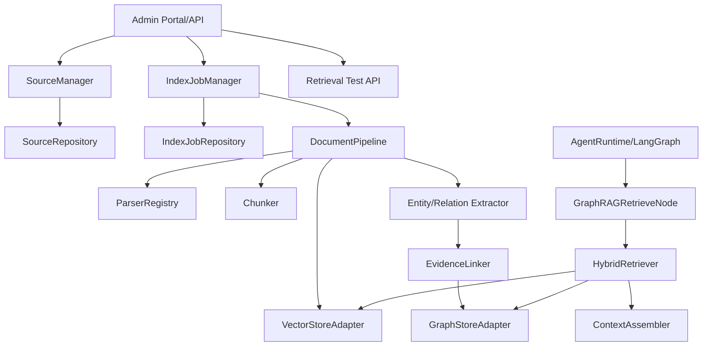

# GraphRAG AI Agent 공통 프레임워크 공통 모듈 상세설계서

## 1. 문서 개요

### 1.1 목적

본 문서는 GraphRAG AI Agent 공통 프레임워크 개발 프로젝트의 `240.설계` 단계 산출물로, `230.분석` 단계에서 도출된 공통화 대상 모듈을 구현 가능한 수준으로 상세 설계한다. 대상 모듈은 `vm-common-core`에 추가하거나 확장하는 공통 기능이며, `Sol-Bat` 1차 파일럿을 기준으로 검증한 뒤 `VectorMoon`, `accountBook`, `lotto`로 확장할 수 있도록 설계한다.

### 1.2 설계 범위

| 구분 | 설계 대상 |
|---|---|
| Source 관리 | `SourceManager`, `SourceRepository`, `SourceValidator` |
| 인덱싱 작업 관리 | `IndexJobManager`, `IndexJobRunner`, `IndexJobStepLogger` |
| 문서 처리 | `DocumentPipeline`, `ParserRegistry`, `Chunker`, `MetadataEnricher` |
| Vector Store | `VectorStoreAdapter`, `PGVectorAdapter`, `FAISSAdapter` |
| Graph Store | `GraphStoreAdapter`, PostgreSQL Graph Tables 기반 구현 |
| GraphRAG 추출 | `EntityExtractor`, `RelationExtractor`, `EvidenceLinker` |
| 검색 | `HybridRetriever`, `ContextAssembler`, `Reranker` |
| Agent 실행 | `AgentRuntime`, `WorkflowFactory`, `GraphRAGRetrieveNode` |
| 관리자 연계 | Source API, Index Job API, 검색 테스트 API |
| 공통 운영 | error code, audit log, metrics, retry, notification hook |

### 1.3 설계 원칙

| 원칙 | 내용 |
|---|---|
| 기존 자산 우선 | `vm-common-core`의 DB, auth, notifier, scheduler, ai_pipeline 기반을 우선 재사용한다. |
| Adapter 기반 확장 | Vector Store, Graph Store, LLM Provider, 외부 Source는 공통 interface 뒤에 provider 구현체를 둔다. |
| 추적성 유지 | Source, Document, Chunk, Entity, Relation, Evidence, RetrievalRun, AgentRun 사이의 추적 관계를 보존한다. |
| 관리자 사이트 대응 | 자료 등록, 벡터화 실행, 작업 상태 모니터링, 검색 테스트가 가능한 API와 상태 모델을 제공한다. |
| 파일럿 우선 | 1차 구현은 `Sol-Bat` KB와 Agent 검색 노드 적용을 기준으로 범위를 제한한다. |
| 점진적 GraphRAG | 1차 Graph Store는 PostgreSQL Graph Tables로 시작하고, 향후 Neo4j/RDF Store로 교체 가능하게 한다. |

### 1.4 선행 산출물 반영

| 선행 산출물 | 반영 내용 |
|---|---|
| 기존 프로젝트 공통기능분석서 | 공통 모듈 분해, MVP 우선순위, `Sol-Bat` 파일럿 범위 반영 |
| RAG/Agent 구현현황분석서 | `VectorStoreAdapter`, `DocumentPipeline`, `GraphRAGRetrieveNode`, `StructuredOutputParser` 반영 |
| 도메인 개념 및 용어정의서 | Source, Document, Chunk, Entity, Relation, Evidence, IndexJob 용어 기준 적용 |
| 논리 데이터 모델 분석서 | Source~Evidence~AgentRun 추적 모델을 모듈 입출력과 Repository 설계에 반영 |
| 인터페이스 및 외부 연계 분석서 | 관리자 API, Adapter, 외부 API 연계, provider capability 기준 반영 |
| 분석산출물 검토 및 확정 문서 | 240.설계 보완사항 AN-CMP-001, AN-API-001, AN-GR-001, AN-SEC-001, AN-OPS-001 반영 |

## 2. 전체 모듈 구조

### 2.1 목표 패키지 구조

```text
common_core/
  ai_pipeline/
    document/
      parser_registry.py
      document_pipeline.py
      chunker.py
      metadata_enricher.py
      normalizer.py
    vectorstores/
      base.py
      pgvector_adapter.py
      faiss_adapter.py
      factory.py
    graphrag/
      models.py
      schema_registry.py
      source_manager.py
      index_job_manager.py
      entity_extractor.py
      relation_extractor.py
      evidence_linker.py
      graph_store.py
      hybrid_retriever.py
      context_assembler.py
    agents/
      base_state.py
      workflow_factory.py
      runtime.py
      nodes/
        graphrag_retrieve_node.py
        llm_answer_node.py
        structured_output_node.py
    admin/
      source_router.py
      index_job_router.py
      retrieval_test_router.py
  ops/
    error_codes.py
    metrics.py
    audit.py
```

### 2.2 계층 구조



### 2.3 공통 의존성

| 의존성 | 사용 모듈 | 설명 |
|---|---|---|
| SQLAlchemy Session | Source, IndexJob, GraphStore, RetrievalRun | 메타데이터와 추적 데이터 저장 |
| Auth Context | SourceManager, Retriever, AgentRuntime | tenant/user/scope 기반 접근 제어 |
| OpenAI/LangChain | DocumentPipeline, Extractor, AgentRuntime | embedding, LLM extraction, Agent 응답 생성 |
| pgvector | PGVectorAdapter | 1차 Vector Store provider |
| FAISS | FAISSAdapter | 로컬 Vector Store provider |
| APScheduler | IndexJobManager | 예약 인덱싱과 재시도 |
| Email/Telegram Notifier | IndexJobManager, AgentRuntime | 작업 실패/완료 알림 |

## 3. 공통 데이터 계약

### 3.1 핵심 DTO

```python
class AuthContext:
    tenant_id: str | None
    user_id: str | None
    roles: list[str]
    scope: str

class SourceCreateRequest:
    domain: str
    source_type: str
    name: str
    uri: str | None
    metadata: dict
    scope: str
    tags: list[str]

class SourceResponse:
    source_id: str
    domain: str
    source_type: str
    name: str
    status: str
    version: int
    chunk_count: int
    last_indexed_at: str | None

class IndexJobRequest:
    source_id: str
    job_type: str
    options: dict
    requested_by: str

class RetrievalRequest:
    domain: str
    query: str
    filters: dict
    top_k: int
    strategy: str

class RetrievalResult:
    chunk_id: str | None
    entity_ids: list[str]
    relation_ids: list[str]
    evidence_ids: list[str]
    score: float
    text: str
    metadata: dict
```

### 3.2 상태 코드

| 구분 | 코드 | 의미 |
|---|---|---|
| Source | `REGISTERED` | 자료 등록 완료 |
| Source | `INDEXING` | 인덱싱 진행 중 |
| Source | `INDEXED` | 인덱싱 완료 |
| Source | `FAILED` | 마지막 인덱싱 실패 |
| Source | `DISABLED` | 검색 제외 |
| IndexJob | `PENDING` | 대기 |
| IndexJob | `RUNNING` | 실행 중 |
| IndexJob | `COMPLETED` | 완료 |
| IndexJob | `FAILED` | 실패 |
| IndexJob | `CANCELED` | 취소 |
| IndexJob | `RETRYING` | 재시도 대기 |

### 3.3 공통 오류 코드

| 오류 코드 | HTTP | 설명 |
|---|---:|---|
| `GRAG-SRC-001` | 400 | Source 요청값 검증 실패 |
| `GRAG-SRC-404` | 404 | Source 없음 |
| `GRAG-SRC-409` | 409 | 중복 Source |
| `GRAG-JOB-001` | 400 | IndexJob 실행 조건 미충족 |
| `GRAG-JOB-409` | 409 | 동일 Source 인덱싱 중복 실행 |
| `GRAG-VEC-001` | 500 | Vector Store 저장/검색 실패 |
| `GRAG-GPH-001` | 500 | Graph Store 저장/조회 실패 |
| `GRAG-LLM-001` | 502 | LLM 추출/응답 실패 |
| `GRAG-AUTH-403` | 403 | 자료 접근 권한 없음 |

## 4. SourceManager 상세설계

### 4.1 책임

`SourceManager`는 GraphRAG 인덱싱 대상 자료를 등록, 조회, 수정, 비활성화, 삭제하는 공통 서비스이다. 파일 업로드 자료뿐 아니라 외부 API, DB, URL, 수동 입력 자료까지 하나의 Source 모델로 관리한다.

### 4.2 Public Interface

```python
class SourceManager:
    def create_source(self, request: SourceCreateRequest, auth: AuthContext) -> SourceResponse: ...
    def get_source(self, source_id: str, auth: AuthContext) -> SourceResponse: ...
    def list_sources(self, query: SourceListQuery, auth: AuthContext) -> Page[SourceResponse]: ...
    def update_source(self, source_id: str, request: SourceUpdateRequest, auth: AuthContext) -> SourceResponse: ...
    def disable_source(self, source_id: str, auth: AuthContext) -> SourceResponse: ...
    def delete_source(self, source_id: str, auth: AuthContext, hard_delete: bool = False) -> None: ...
    def get_preview(self, source_id: str, auth: AuthContext) -> SourcePreviewResponse: ...
```

### 4.3 처리 흐름

1. AuthContext에서 tenant/user/role/scope를 확인한다.
2. SourceCreateRequest의 domain, source_type, name, uri, metadata를 검증한다.
3. 동일 domain/source_type/name/uri 조합 중복 여부를 확인한다.
4. Source와 SourceVersion을 생성한다.
5. Source 상태를 `REGISTERED`로 저장한다.
6. 관리자 화면에서 인덱싱 실행이 가능하도록 SourceResponse를 반환한다.

### 4.4 권한 정책

| 역할 | 가능 작업 |
|---|---|
| `ADMIN` | 전체 Source 등록, 수정, 삭제, 재인덱싱 |
| `OPERATOR` | 담당 domain Source 등록, 수정, 인덱싱 실행 |
| `USER` | 본인 소유 또는 공개 Source 조회, 검색 |

### 4.5 `Sol-Bat` 파일럿 매핑

| 기존 기능 | 공통 모듈 전환 |
|---|---|
| `/kb/upload` | `SourceManager.create_source` + `IndexJobManager.create_job` |
| 파일명 기준 chunk 조회 | `SourceManager.get_preview` |
| 파일명 기준 삭제 | `SourceManager.delete_source` + `VectorStoreAdapter.delete_by_source` |
| `scope=PUBLIC`, `user_id` 필터 | AuthContext 기반 scope/user/tenant 필터 |

## 5. IndexJobManager 상세설계

### 5.1 책임

`IndexJobManager`는 Source를 Vector Store와 Graph Store에 인덱싱하는 작업의 생성, 실행, 상태 추적, 재시도, 취소, 알림을 담당한다.

### 5.2 Public Interface

```python
class IndexJobManager:
    def create_job(self, request: IndexJobRequest, auth: AuthContext) -> IndexJobResponse: ...
    def run_job(self, job_id: str, auth: AuthContext | None = None) -> IndexJobResponse: ...
    def retry_job(self, job_id: str, auth: AuthContext) -> IndexJobResponse: ...
    def cancel_job(self, job_id: str, auth: AuthContext) -> IndexJobResponse: ...
    def get_job(self, job_id: str, auth: AuthContext) -> IndexJobResponse: ...
    def list_jobs(self, query: IndexJobListQuery, auth: AuthContext) -> Page[IndexJobResponse]: ...
```

### 5.3 IndexJob Step

| Step | 설명 | 실패 시 처리 |
|---|---|---|
| `LOAD_SOURCE` | 원천 자료 로딩 | Source 상태 `FAILED`, 재시도 가능 |
| `PARSE_DOCUMENT` | 문서/데이터 파싱 | 오류 상세 저장 |
| `CHUNK_DOCUMENT` | chunk 분할 | chunk 정책 검증 |
| `EMBED_CHUNK` | embedding 생성 | LLM/provider retry |
| `SAVE_VECTOR` | vector 저장 | provider별 rollback |
| `EXTRACT_ENTITY` | entity 추출 | skip 가능 옵션 |
| `EXTRACT_RELATION` | relation 추출 | skip 가능 옵션 |
| `LINK_EVIDENCE` | evidence 연결 | GraphRAG 추적성 검증 |
| `SAVE_GRAPH` | graph 저장 | graph only 재시도 가능 |
| `FINALIZE` | 상태/통계 업데이트 | 운영 알림 |

### 5.4 재시도 정책

| 항목 | 정책 |
|---|---|
| 기본 재시도 | 최대 3회 |
| 재시도 간격 | 1분, 5분, 15분 exponential backoff |
| 재시도 대상 | embedding, vector save, LLM extraction, external source fetch |
| 재시도 제외 | validation error, permission error, unsupported file type |
| 알림 | 최종 실패 시 ADMIN/OPERATOR에게 Email/Telegram hook 호출 |

## 6. DocumentPipeline 상세설계

### 6.1 책임

`DocumentPipeline`은 Source를 Document와 Chunk로 변환하고, metadata를 정규화한 뒤 embedding과 GraphRAG 추출 단계로 전달한다.

### 6.2 Public Interface

```python
class DocumentPipeline:
    def process(self, source: Source, options: PipelineOptions) -> PipelineResult: ...
    def preview(self, source: Source, options: PipelineOptions) -> PipelinePreview: ...
```

### 6.3 내부 구성

| 구성요소 | 책임 |
|---|---|
| `ParserRegistry` | PDF, DOCX, CSV, Excel, Markdown, Text, API JSON parser 선택 |
| `TextNormalizer` | Unicode NFC, 공백, 제어문자, encoding 정규화 |
| `Chunker` | chunk size, overlap, semantic boundary 정책 적용 |
| `MetadataEnricher` | domain, source_id, tenant_id, user_id, tags, page, section 부여 |
| `DocumentValidator` | 비어 있는 문서, 초과 크기, 금지 확장자 검증 |

### 6.4 기본 chunk 정책

| 항목 | 기본값 |
|---|---|
| chunk_size | 1,000 characters |
| chunk_overlap | 100 characters |
| max_file_size | 50MB |
| supported_types | pdf, docx, csv, xlsx, md, txt, json |
| metadata 필수값 | domain, source_id, source_version_id, scope, tenant_id, user_id |

## 7. VectorStoreAdapter 상세설계

### 7.1 책임

Vector Store provider 차이를 감추고, 문서 추가, 검색, 삭제, chunk 조회, preview를 일관된 계약으로 제공한다.

### 7.2 Public Interface

```python
class VectorStoreAdapter(Protocol):
    provider: str

    def add_chunks(self, chunks: list[ChunkInput], options: VectorWriteOptions) -> VectorWriteResult: ...
    def search(self, request: VectorSearchRequest) -> list[VectorSearchResult]: ...
    def delete_by_source(self, source_id: str, auth: AuthContext) -> int: ...
    def list_sources(self, query: VectorSourceQuery) -> list[VectorSourceSummary]: ...
    def get_chunks(self, source_id: str, query: ChunkQuery) -> list[ChunkResponse]: ...
    def health_check(self) -> ProviderHealth: ...
```

### 7.3 Provider Capability Matrix

| 기능 | PGVector | FAISS | 비고 |
|---|---|---|---|
| metadata filter | 지원 | 부분 지원 | FAISS는 metadata sidecar 검색 |
| delete_by_source | 지원 | rebuild 필요 | FAISS는 index 재생성 |
| tenant isolation | DB filter | 파일 경로/metadata | 공통 계층에서 보강 |
| transaction | DB transaction | 제한 | FAISS는 write lock 필요 |
| 운영 모니터링 | SQL 가능 | 파일 상태 중심 | metrics adapter 필요 |

### 7.4 1차 구현 결정

| 항목 | 결정 |
|---|---|
| 기본 provider | PGVector |
| 보조 provider | FAISS |
| Chroma | 2차 이후 선택 provider |
| embedding model | `text-embedding-3-small` 기본, 설정으로 교체 |

## 8. GraphStoreAdapter 상세설계

### 8.1 책임

Entity, Relation, Evidence를 저장하고, Hybrid Retrieval 단계에서 graph traversal이 가능하도록 조회 interface를 제공한다.

### 8.2 1차 저장 방식

1차 구현은 PostgreSQL Graph Tables를 사용한다. 별도 Graph DB 도입 전에도 `Sol-Bat` 파일럿을 빠르게 검증할 수 있고, `vm-common-core`의 DB 기반과 잘 맞기 때문이다.

### 8.3 Public Interface

```python
class GraphStoreAdapter:
    def upsert_entities(self, entities: list[EntityInput]) -> list[EntityResponse]: ...
    def upsert_relations(self, relations: list[RelationInput]) -> list[RelationResponse]: ...
    def link_evidence(self, links: list[EvidenceLinkInput]) -> list[EvidenceLinkResponse]: ...
    def find_entities(self, query: EntityQuery) -> list[EntityResponse]: ...
    def traverse(self, request: GraphTraversalRequest) -> GraphTraversalResult: ...
    def delete_by_source(self, source_id: str) -> GraphDeleteResult: ...
```

### 8.4 주요 테이블

| 테이블 | 설명 |
|---|---|
| `graphrag_entities` | domain별 개체 canonical record |
| `graphrag_entity_mentions` | chunk에서 발견된 entity mention |
| `graphrag_relations` | entity 간 관계 |
| `graphrag_evidence` | chunk/source 기반 근거 |
| `graphrag_evidence_links` | entity/relation과 evidence 연결 |

## 9. GraphRAG 추출 모듈 상세설계

### 9.1 EntityExtractor

| 항목 | 설계 |
|---|---|
| 입력 | Chunk, DomainSchema |
| 출력 | EntityCandidate 목록 |
| 방식 | rule 기반 후보 추출 + LLM structured output |
| 검증 | schema validation, type whitelist, confidence threshold |
| 실패 처리 | chunk 단위 실패 저장 후 다음 chunk 계속 처리 |

### 9.2 RelationExtractor

| 항목 | 설계 |
|---|---|
| 입력 | Chunk, EntityCandidate 목록, DomainSchema |
| 출력 | RelationCandidate 목록 |
| 방식 | LLM structured output, relation type whitelist |
| 검증 | source/target entity 존재 여부, confidence threshold |
| 실패 처리 | relation 추출만 skip 가능 |

### 9.3 EvidenceLinker

| 항목 | 설계 |
|---|---|
| 입력 | Chunk, EntityCandidate, RelationCandidate |
| 출력 | Evidence, EvidenceLink |
| 원칙 | 모든 Entity/Relation은 최소 1개 이상의 Evidence와 연결 |
| 활용 | 답변 출처, 관리자 preview, 검색 결과 설명 |

### 9.4 `Sol-Bat` 1차 Domain Schema

| Entity Type | 설명 |
|---|---|
| `CROP` | 작물 |
| `FIELD` | 농장/포장 |
| `DISEASE` | 병해 |
| `PEST` | 해충 |
| `WEATHER_CONDITION` | 기상 조건 |
| `SOIL_CONDITION` | 토양 조건 |
| `ACTION` | 방제/관수/시비 등 작업 |
| `RULE` | 재배 규칙/권고 기준 |

| Relation Type | 설명 |
|---|---|
| `AFFECTS` | 병해/해충/기상이 작물에 영향 |
| `RECOMMENDS` | 규칙이 작업을 권고 |
| `PREVENTS` | 작업이 병해/위험을 예방 |
| `CAUSES` | 조건이 현상을 유발 |
| `APPLIES_TO` | 규칙/작업이 작물/상황에 적용 |

## 10. HybridRetriever 상세설계

### 10.1 책임

`HybridRetriever`는 vector search 결과와 graph traversal 결과를 결합하여 Agent가 사용할 context와 evidence를 구성한다.

### 10.2 Public Interface

```python
class HybridRetriever:
    def search(self, request: RetrievalRequest, auth: AuthContext) -> RetrievalResponse: ...
```

### 10.3 검색 전략

| 전략 | 설명 | 사용 시점 |
|---|---|---|
| `VECTOR_ONLY` | vector similarity만 사용 | 기존 RAG 호환 |
| `GRAPH_ONLY` | entity/relation traversal만 사용 | 개체 중심 질의 |
| `HYBRID` | vector 결과에서 entity를 찾고 graph 확장 | 기본 전략 |
| `HYBRID_RERANK` | hybrid 결과를 reranking | 2차 고도화 |

### 10.4 처리 흐름

1. query를 정규화하고 domain/schema를 조회한다.
2. VectorStoreAdapter로 top-k chunk를 검색한다.
3. 검색 chunk와 연결된 entity/relation/evidence를 조회한다.
4. query에서 entity 후보를 추출하고 graph traversal을 수행한다.
5. vector score, graph distance, evidence confidence를 결합한다.
6. ContextAssembler가 Agent 입력용 context를 생성한다.
7. RetrievalRun과 RetrievalResult를 저장한다.

### 10.5 기본 점수 계산

```text
final_score =
  vector_score * 0.60
  + graph_relevance_score * 0.25
  + evidence_confidence * 0.15
```

## 11. Agent Runtime 상세설계

### 11.1 책임

Agent Runtime은 LangGraph 기반 Agent가 공통 GraphRAG 검색 노드, LLM 응답 노드, structured output parser를 일관되게 사용할 수 있도록 실행 표준을 제공한다.

### 11.2 BaseAgentState

```python
class BaseAgentState(TypedDict, total=False):
    run_id: str
    domain: str
    user_id: str | None
    tenant_id: str | None
    messages: list[dict]
    query: str
    retrieval: dict
    context: str
    evidence: list[dict]
    result: dict
    error: dict | None
    next_node: str | None
```

### 11.3 GraphRAGRetrieveNode

| 항목 | 설계 |
|---|---|
| 입력 | `BaseAgentState.query`, domain, filters |
| 처리 | `HybridRetriever.search` 호출 |
| 출력 | `state.retrieval`, `state.context`, `state.evidence` |
| 실패 처리 | 오류를 `state.error`에 기록하고 fallback context 사용 가능 |

### 11.4 WorkflowFactory

```python
class WorkflowFactory:
    def register_node(self, name: str, node: Callable) -> None: ...
    def build(self, definition: WorkflowDefinition) -> CompiledGraph: ...
```

### 11.5 기존 프로젝트 적용

| 프로젝트 | 적용 방식 |
|---|---|
| `Sol-Bat` | `retrieve_knowledge` 노드를 `GraphRAGRetrieveNode`로 대체 |
| `VectorMoon` | `retrieve_documents` 노드를 공통 Retrieval Node로 대체 |
| `accountBook` | RAG hint 검색을 `VectorStoreAdapter` + structured parser로 정리 |
| `lotto` | `BaseAgentState`, `WorkflowFactory`, structured output 표준 우선 적용 |

## 12. 관리자 API 상세설계

### 12.1 Source API

| Method | URI | 설명 |
|---|---|---|
| `POST` | `/api/admin/sources` | Source 등록 |
| `GET` | `/api/admin/sources` | Source 목록 조회 |
| `GET` | `/api/admin/sources/{source_id}` | Source 상세 조회 |
| `PATCH` | `/api/admin/sources/{source_id}` | Source 수정 |
| `DELETE` | `/api/admin/sources/{source_id}` | Source 삭제/비활성화 |
| `GET` | `/api/admin/sources/{source_id}/preview` | chunk/entity/relation preview |

### 12.2 Index Job API

| Method | URI | 설명 |
|---|---|---|
| `POST` | `/api/admin/index-jobs` | 인덱싱 작업 생성 |
| `POST` | `/api/admin/index-jobs/{job_id}/run` | 작업 실행 |
| `POST` | `/api/admin/index-jobs/{job_id}/retry` | 실패 작업 재시도 |
| `POST` | `/api/admin/index-jobs/{job_id}/cancel` | 작업 취소 |
| `GET` | `/api/admin/index-jobs` | 작업 목록 조회 |
| `GET` | `/api/admin/index-jobs/{job_id}` | 작업 상세/step 조회 |

### 12.3 Retrieval Test API

| Method | URI | 설명 |
|---|---|---|
| `POST` | `/api/admin/retrieval-tests` | 검색 테스트 실행 |
| `GET` | `/api/admin/retrieval-tests/{run_id}` | 검색 테스트 결과 조회 |

## 13. 보안 및 운영 설계

### 13.1 접근 제어

| 대상 | 제어 기준 |
|---|---|
| Source | tenant_id, owner_id, scope, domain role |
| Chunk | Source 접근 권한 상속 |
| Entity/Relation | 연결 Evidence의 Source 접근 권한 상속 |
| RetrievalResult | 요청자의 Source 접근 가능 범위 내 결과만 반환 |
| AgentRun | 실행자 본인 또는 관리자만 조회 |

### 13.2 Audit Log

| 이벤트 | 기록 항목 |
|---|---|
| Source 등록/수정/삭제 | actor, source_id, before/after, timestamp |
| IndexJob 실행/재시도/취소 | actor, job_id, status, error |
| 검색 테스트 | actor, query, filters, result count |
| Agent 실행 | actor, agent_id, run_id, evidence ids |

### 13.3 Metrics

| 지표 | 설명 |
|---|---|
| `index_job_duration_seconds` | 인덱싱 작업 소요 시간 |
| `index_job_failure_total` | 작업 실패 건수 |
| `embedding_token_total` | embedding 토큰 사용량 |
| `retrieval_latency_seconds` | 검색 응답 시간 |
| `retrieval_result_count` | 검색 결과 수 |
| `agent_run_duration_seconds` | Agent 실행 시간 |

## 14. MVP 구현 범위

### 14.1 1차 구현 포함

| 우선순위 | 모듈 | 포함 기능 |
|---:|---|---|
| 1 | SourceManager | 등록, 목록, 상세, 삭제, preview |
| 2 | IndexJobManager | 작업 생성, 실행, 상태, 실패 기록, 재시도 |
| 3 | DocumentPipeline | file load, parse, chunk, metadata |
| 4 | PGVectorAdapter | add, search, delete_by_source, get_chunks |
| 5 | GraphStoreAdapter | entity/relation/evidence 저장과 source 기준 삭제 |
| 6 | Entity/Relation Extractor | `Sol-Bat` domain schema 기반 추출 |
| 7 | HybridRetriever | vector + graph 기본 결합 |
| 8 | GraphRAGRetrieveNode | LangGraph state에 context/evidence 주입 |

### 14.2 1차 제외

| 항목 | 제외 사유 | 후속 단계 |
|---|---|---|
| Neo4j/RDF Store | 초기 복잡도 증가 | 2차 고도화 |
| 고급 reranker | MVP 검증 후 필요성 판단 | 2차 고도화 |
| Entity 수동 보정 UI | 화면 설계와 구현 규모 큼 | 관리자 사이트 2차 |
| 다중 프로젝트 동시 적용 | 파일럿 안정화 우선 | `Sol-Bat` 이후 순차 적용 |
| 자동 평가 Runner | 기준 데이터셋 필요 | 테스트 설계 이후 |

## 15. 설계 의사결정

| ID | 의사결정 | 결정 |
|---|---|---|
| DD-001 | 1차 Graph Store | PostgreSQL Graph Tables |
| DD-002 | 1차 Vector Store | PGVector 기본, FAISS 보조 |
| DD-003 | 1차 파일럿 | `Sol-Bat` KB + Agent 검색 노드 |
| DD-004 | 관리자 사이트 MVP | 자료 등록, 벡터화 실행, 작업 상태, 검색 테스트 |
| DD-005 | LLM structured output | schema validation 우선, provider native 기능은 선택 적용 |
| DD-006 | 권한 모델 | tenant_id, owner_id, scope, role 기반 |

## 16. 요구사항 추적

| 설계 항목 | 관련 요구사항/분석 항목 |
|---|---|
| SourceManager | 관리자 사이트 자료 등록, Source 관리, CF-011, GR-CF-001 |
| IndexJobManager | 벡터화 실행, 작업 상태 모니터링, CF-012, GR-CF-002 |
| DocumentPipeline | 자료 인덱싱, 문서 파싱/chunking, CF-007, CF-008, GR-CF-003 |
| VectorStoreAdapter | Vector Store 공통화, CF-010, GR-CF-004 |
| GraphStoreAdapter | Entity/Relation/Evidence 저장, GR-CF-005 |
| HybridRetriever | GraphRAG 검색, GR-CF-007 |
| GraphRAGRetrieveNode | Agent 실행, LangGraph 공통 노드, CF-013 |
| Audit/Metrics | 보안/운영/품질 요구사항 |

## 17. 위험 및 대응

| 위험 ID | 위험 | 대응 |
|---|---|---|
| DS-RSK-001 | 공통 모듈 범위 과대 | MVP 범위는 Source/Index/Retrieval/Agent Node로 제한 |
| DS-RSK-002 | GraphRAG 추출 품질 불안정 | confidence, schema validation, evidence 필수 연결 |
| DS-RSK-003 | provider별 기능 차이 | capability matrix와 최소 공통 계약 우선 |
| DS-RSK-004 | 기존 프로젝트 적용 부담 | `Sol-Bat` adapter 방식으로 먼저 적용 |
| DS-RSK-005 | 권한 누락으로 자료 노출 | 모든 검색/preview에 AuthContext 필수 적용 |
| DS-RSK-006 | 작업 실패 원인 추적 어려움 | IndexJobStep 단위 로그와 error code 저장 |

## 18. 후속 설계 작업

| 순서 | 역할 | 작업 | 산출물 |
|---:|---|---|---|
| 1 | GraphRAG Engineer | GraphRAG Core 상세설계 | Entity/Relation/Evidence 추출 및 검색 상세설계서 |
| 2 | Data Architect | 물리 데이터 모델 설계 | ERD, 테이블정의서 |
| 3 | 아키텍터/Backend Engineer | API 명세 설계 | 관리자/Agent API 명세서 |
| 4 | 기획자/디자이너 | 관리자 사이트 화면 정의 | 화면정의서 |
| 5 | QA | 테스트 설계 기준 수립 | 테스트 시나리오/검증 기준 |

### 18.1 다음 요청 권고

```text
[GraphRAG Engineer] 240.설계 단계의 GraphRAG Core 상세설계서를 작성해 주세요. EntityExtractor, RelationExtractor, EvidenceLinker, GraphStoreAdapter, HybridRetriever, ContextAssembler, GraphRAGRetrieveNode의 처리 흐름과 입출력 schema를 포함해 주세요.
```

## 19. 승인 및 변경 이력

### 19.1 승인 기록

| 구분 | 역할 | 승인 여부 | 일자 | 비고 |
|---|---|---|---|---|
| 작성 | 아키텍터 | 작성 완료 | 2026-06-21 | 초안 |
| 검토 | PM | 검토 필요 | - | 일정/WBS 반영 |
| 검토 | GraphRAG Engineer | 검토 필요 | - | GraphRAG Core 상세 검토 |
| 검토 | Data Architect | 검토 필요 | - | 물리 모델 전환 검토 |
| 승인 | Product Owner | 승인 필요 | - | MVP 범위 확인 |

### 19.2 변경 이력

| 버전 | 일자 | 변경 내용 | 작성자 |
|---|---|---|---|
| v0.1 | 2026-06-21 | 공통 모듈 상세설계서 최초 작성 | 아키텍터 |
