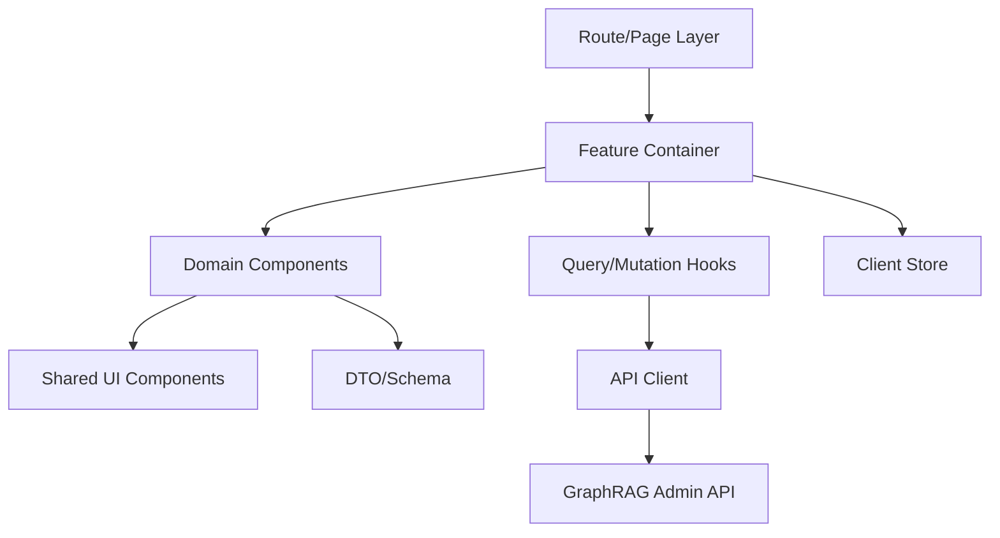
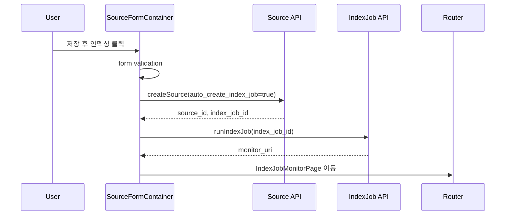
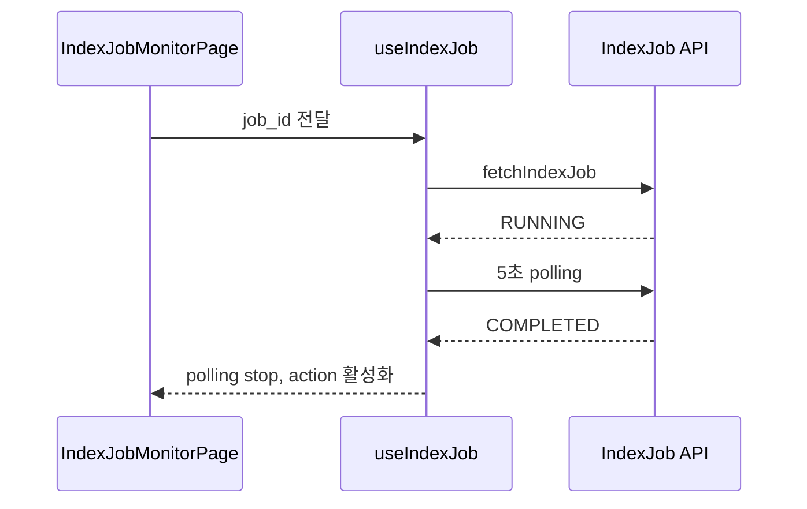
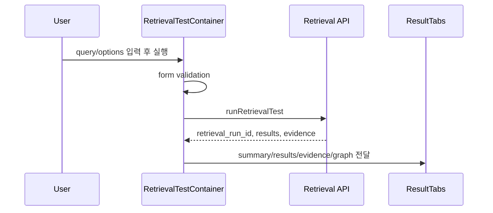

# GraphRAG AI Agent 공통 프레임워크 관리자 사이트 Frontend 컴포넌트 설계서

## 1. 문서 개요

### 1.1 목적

본 문서는 GraphRAG AI Agent 공통 프레임워크의 `240.설계` 단계 산출물로, 관리자 사이트 Frontend 구현에 필요한 컴포넌트 구조, 상태 관리, API 연동 방식을 정의한다.

설계 대상은 Source 관리, IndexJob 모니터링, GraphRAG 검색 테스트 화면이며, 화면정의서와 관리자 API 명세서를 기준으로 실제 개발 단위까지 분해한다.

### 1.2 설계 범위

| 구분 | 포함 범위 |
|---|---|
| 화면 | Source 목록/등록/상세/Preview, IndexJob 실행/목록/상태 모니터링, GraphRAG 검색 테스트/결과 상세 |
| 컴포넌트 | Layout, Filter, Table, Form, Detail, Preview, Monitoring, Result Viewer |
| 상태 관리 | 인증/권한, 검색 조건, pagination, form state, API cache, polling, 오류 상태 |
| API 연동 | REST client, query/mutation hook, 오류 mapping, optimistic update 적용 기준 |
| 품질 기준 | loading/empty/error 상태, 권한별 버튼 제어, 접근성, 테스트 기준 |

### 1.3 전제 기술 스택

현재 프로젝트는 공통 프레임워크 산출물 단계이므로 특정 Frontend 프로젝트가 생성되기 전이다. 본 설계서는 다음 기술 스택을 기준안으로 제시한다.

| 영역 | 권장 기술 | 비고 |
|---|---|---|
| Framework | React + TypeScript | 관리자 콘솔 구성에 적합 |
| Routing | React Router 또는 Next.js App Router | 실제 구현 프로젝트 선택에 따라 조정 |
| Server State | TanStack Query | API cache, polling, mutation 처리 |
| Client State | Zustand 또는 React Context | auth/session, UI preference 등 최소 상태 |
| Form | React Hook Form + Zod | DTO 검증 schema 재사용 |
| Table | TanStack Table | server-side pagination/sorting/filter |
| UI | 기존 디자인 시스템 또는 shadcn/ui 계열 | 프로젝트 표준 확정 필요 |
| Chart/Graph | Recharts, React Flow | IndexJob 현황, relation graph preview |

## 2. Frontend 아키텍처

### 2.1 계층 구조



### 2.2 책임 분리

| 계층 | 책임 |
|---|---|
| Route/Page | URL parameter, 권한 guard, page layout 조립 |
| Feature Container | 화면별 데이터 조회, 이벤트 핸들러, modal 상태 관리 |
| Domain Components | Source, IndexJob, Retrieval 도메인 UI 표시 |
| Shared UI Components | Button, Input, Select, Table, Badge, Modal 등 공통 요소 |
| Query/Mutation Hooks | API 호출, cache key, polling, mutation 후 invalidation |
| API Client | HTTP client, 인증 header, 표준 응답 unwrap, 오류 변환 |
| Schema/Types | request/response DTO type, form validation schema |

## 3. 권장 디렉터리 구조

```text
src/
|- app/
|  |- routes/
|  |  |- graphrag/
|  |     |- sources/
|  |     |- index-jobs/
|  |     |- retrieval-tests/
|  |- providers/
|  |- layout/
|- features/
|  |- graphrag-admin/
|     |- sources/
|     |  |- components/
|     |  |- hooks/
|     |  |- schemas/
|     |  |- pages/
|     |- index-jobs/
|     |  |- components/
|     |  |- hooks/
|     |  |- pages/
|     |- retrieval-tests/
|     |  |- components/
|     |  |- hooks/
|     |  |- pages/
|     |- shared/
|        |- components/
|        |- constants/
|        |- types/
|- shared/
|  |- api/
|  |- auth/
|  |- components/
|  |- hooks/
|  |- utils/
```

### 3.1 명명 규칙

| 유형 | 규칙 | 예시 |
|---|---|---|
| Page | `{Domain}{Action}Page` | `SourceListPage` |
| Container | `{Domain}{Action}Container` | `IndexJobMonitorContainer` |
| Component | `{Domain}{Purpose}` | `SourceStatusBadge` |
| Hook | `use{Action}{Domain}` | `useSourceList` |
| API 함수 | `{verb}{Domain}` | `fetchSources`, `createSource` |
| DTO Type | `{Action}{Domain}Request/Response` | `CreateSourceRequest` |

## 4. 공통 컴포넌트 설계

### 4.1 Layout 컴포넌트

| 컴포넌트 | 책임 | 주요 Props |
|---|---|---|
| `AdminLayout` | Header, SideNav, Content 영역 구성 | `children`, `currentUser`, `currentDomain` |
| `PageHeader` | 화면명, 설명, primary action 표시 | `title`, `description`, `actions` |
| `FilterBar` | 검색 조건 영역 wrapper | `children`, `onSubmit`, `onReset` |
| `ContentPanel` | 본문 영역 표준 여백/구분 | `title`, `actions`, `children` |

### 4.2 Data Display 컴포넌트

| 컴포넌트 | 책임 |
|---|---|
| `DataTable<T>` | server-side pagination/sorting/filter table |
| `StatusBadge` | Source/IndexJob/Retrieval 상태별 색상 표시 |
| `ProgressBar` | IndexJob 진행률 표시 |
| `KeyValueList` | 상세 정보 표시 |
| `JsonViewer` | metadata, raw response 표시 |
| `ErrorPanel` | API 오류 코드, 메시지, request_id 표시 |
| `EmptyState` | 빈 데이터 상태와 주요 액션 안내 |
| `ConfirmDialog` | 삭제/취소/재시도 확인 |

### 4.3 GraphRAG 전용 공통 컴포넌트

| 컴포넌트 | 책임 | 사용 화면 |
|---|---|---|
| `SourceSelect` | 권한 내 Source 검색/선택 | 등록, IndexJob, 검색 테스트 |
| `DomainSelect` | domain 선택 | 전체 화면 |
| `SourceTypeBadge` | Source 유형 표시 | 목록, 상세 |
| `EvidenceViewer` | quote, document, chunk 연결 표시 | Preview, 검색 결과 |
| `ChunkPreviewPanel` | chunk 원문과 metadata 표시 | Source Preview, 검색 결과 |
| `GraphPathViewer` | entity-relation 경로 표시 | 검색 테스트 |
| `RetrievalResultTabs` | 검색 결과/근거/그래프/Raw JSON 탭 | 검색 테스트 |

## 5. Source 관리 컴포넌트

### 5.1 Source 목록

| 컴포넌트 | 책임 |
|---|---|
| `SourceListPage` | route page, 권한 guard, layout |
| `SourceListContainer` | 목록 query, 필터 상태, bulk action 관리 |
| `SourceFilterForm` | domain/type/status/keyword/기간 검색 |
| `SourceTable` | Source 목록 table 렌더링 |
| `SourceBulkActions` | 선택 삭제, 선택 IndexJob 실행 |
| `SourceRowActions` | 상세, Preview, IndexJob 실행, 삭제 |
| `DeleteSourceDialog` | 삭제/비활성화 confirm 및 옵션 입력 |

### 5.2 Source 목록 상태

| 상태 | 위치 | 설명 |
|---|---|---|
| `filters` | URL search params | 검색 조건 공유/복원 |
| `page`, `size`, `sort` | URL search params | pagination/sorting |
| `selectedSourceIds` | component state | bulk action 대상 |
| `deleteDialogState` | component state | 삭제 modal open/source/mode |
| `sourceListQuery` | TanStack Query | Source 목록 API cache |

### 5.3 Source 등록/수정

| 컴포넌트 | 책임 |
|---|---|
| `SourceCreatePage` | 등록 화면 route |
| `SourceFormContainer` | form 초기값, submit 처리 |
| `SourceBasicInfoSection` | domain, type, title, scope 입력 |
| `SourceInputSection` | file/url/api/manual 입력 |
| `IndexOptionsSection` | chunk/embedding/entity/relation/evidence 옵션 |
| `MetadataJsonSection` | metadata_json 입력과 검증 |
| `SourceFormActions` | 저장, 저장 후 인덱싱, 취소 |

### 5.4 Source Form State

```ts
type SourceFormState = {
  domain_code: string;
  source_type: "FILE" | "URL" | "API" | "DATABASE" | "MANUAL" | "GENERATED";
  title: string;
  description?: string;
  scope: "PRIVATE" | "DOMAIN" | "PUBLIC";
  source_uri?: string;
  file?: File;
  manual_text?: string;
  metadata_json: Record<string, unknown>;
  index_options: {
    chunk_size: number;
    chunk_overlap: number;
    embedding_model: string;
    extract_entities: boolean;
    extract_relations: boolean;
    link_evidence: boolean;
  };
  auto_create_index_job: boolean;
};
```

### 5.5 Source 상세/Preview

| 컴포넌트 | 책임 |
|---|---|
| `SourceDetailPage` | source_id route 처리 |
| `SourceDetailContainer` | 상세 query, tab 상태, action 처리 |
| `SourceSummaryCards` | document/chunk/entity/relation/evidence count |
| `SourceDetailTabs` | 기본정보, 문서/Chunk, Entity/Relation, IndexJob 이력 |
| `SourcePreviewPage` | preview route |
| `SourcePreviewContainer` | preview query, filter, selected item 상태 |
| `SourcePreviewList` | chunk/evidence 목록 |
| `SourcePreviewDetail` | 선택 item 상세 |
| `EntityRelationMiniGraph` | 선택 entity 기준 1-hop relation 표시 |

## 6. IndexJob 모니터링 컴포넌트

### 6.1 IndexJob 실행

| 컴포넌트 | 책임 |
|---|---|
| `IndexJobRunDialog` | Source 목록/상세에서 실행 modal |
| `IndexJobRunPage` | 독립 실행 화면이 필요한 경우 |
| `IndexJobTypeSelector` | FULL_INDEX/REINDEX 등 선택 |
| `IndexJobOptionsForm` | force_rebuild, dry_run, priority 입력 |
| `IndexJobRunSummary` | 대상 Source와 실행 옵션 확인 |

### 6.2 IndexJob 목록/상태

| 컴포넌트 | 책임 |
|---|---|
| `IndexJobListPage` | 작업 목록 route |
| `IndexJobListContainer` | 목록 query, filter, action 처리 |
| `IndexJobFilterForm` | domain/job_type/status/기간 검색 |
| `IndexJobTable` | 작업 이력 table |
| `IndexJobMonitorPage` | job_id별 모니터링 route |
| `IndexJobMonitorContainer` | 상태 query, polling, 취소/재시도 |
| `IndexJobProgressSummary` | status/progress/elapsed 표시 |
| `IndexJobStepTimeline` | Parse/Chunk/Embedding/Graph/Evidence 단계 표시 |
| `IndexJobLogPanel` | 처리 로그와 오류 상세 |
| `IndexJobActionBar` | 새로고침, 취소, 재시도, Preview 이동 |

### 6.3 Polling 정책

| 조건 | 정책 |
|---|---|
| `PENDING`, `RUNNING`, `RETRYING` | 5초 interval polling |
| 브라우저 tab 비활성화 | polling interval 30초로 완화 |
| `COMPLETED`, `FAILED`, `CANCELED` | polling 중지 |
| 수동 새로고침 | 상태와 무관하게 query refetch |
| 네트워크 오류 3회 연속 | polling 중지 후 재시도 버튼 표시 |

### 6.4 IndexJob 상태 모델

```ts
type IndexJobMonitorViewState = {
  jobId: string;
  autoRefresh: boolean;
  lastRefreshedAt?: string;
  selectedLogLevel?: "INFO" | "WARN" | "ERROR";
  actionDialog?: {
    type: "CANCEL" | "RETRY";
    open: boolean;
  };
};
```

## 7. GraphRAG 검색 테스트 컴포넌트

### 7.1 검색 테스트

| 컴포넌트 | 책임 |
|---|---|
| `RetrievalTestPage` | 검색 테스트 route |
| `RetrievalTestContainer` | form state, 실행 mutation, 결과 state |
| `RetrievalQueryEditor` | query 입력 |
| `RetrievalScopeSelector` | domain/source_ids 선택 |
| `RetrievalOptionsPanel` | strategy, top_k, graph_depth, min_score |
| `RetrievalExecuteBar` | 실행, 초기화, 최근 실행 정보 |
| `RetrievalResultSummary` | hit_count, elapsed_ms, score, fallback 표시 |
| `RetrievalResultTabs` | 검색 결과, 근거, 그래프 경로, Raw JSON |
| `RetrievalResultTable` | result 목록 |
| `EvidenceViewer` | evidence quote와 source/chunk link |
| `GraphPathViewer` | graph context 경로 시각화 |

### 7.2 검색 테스트 Form State

```ts
type RetrievalTestFormState = {
  query: string;
  domain_code: string;
  source_ids: string[];
  strategy: "VECTOR_ONLY" | "GRAPH_ONLY" | "HYBRID" | "HYBRID_RERANK";
  top_k: number;
  graph_depth: number;
  min_score?: number;
  include_evidence: boolean;
  include_graph_context: boolean;
  filters: Record<string, unknown>;
};
```

### 7.3 결과 표시 상태

| 상태 | 처리 |
|---|---|
| `idle` | 검색 실행 전 안내 |
| `loading` | 실행 버튼 disabled, skeleton 표시 |
| `success_hit` | 요약/결과/근거/그래프 표시 |
| `success_empty` | 조건 완화 안내 |
| `partial_hit` | amber 상태와 fallback_used 표시 |
| `error` | ErrorPanel 표시 |

### 7.4 검색 결과 Navigation

| 액션 | 이동 |
|---|---|
| Source 클릭 | `SourceDetailPage(source_id)` |
| Chunk 클릭 | `SourcePreviewPage(source_id, chunk_id)` |
| Evidence 클릭 | `SourcePreviewPage(source_id, evidence_id)` |
| Raw JSON 복사 | clipboard 복사 후 toast |

## 8. API Client 설계

### 8.1 API Client 구조

```text
shared/api/
|- httpClient.ts
|- apiError.ts
|- response.ts
|- graphrag/
|  |- sourceApi.ts
|  |- indexJobApi.ts
|  |- retrievalApi.ts
|  |- dto.ts
```

### 8.2 표준 응답 처리

```ts
type ApiResponse<T> = {
  success: boolean;
  data?: T;
  error?: {
    code: string;
    message: string;
    detail?: unknown;
  };
  meta?: {
    request_id: string;
    page?: number;
    size?: number;
    total_count?: number;
  };
};
```

Frontend API client는 `success=false` 응답을 throw하지 않고 `ApiError`로 변환하여 query/mutation의 error state에서 공통 처리한다.

### 8.3 API 함수 목록

| API 함수 | Method/URI | 용도 |
|---|---|---|
| `fetchSources` | `GET /api/admin/graphrag/sources` | Source 목록 |
| `fetchSourceDetail` | `GET /api/admin/graphrag/sources/{source_id}` | Source 상세 |
| `createSource` | `POST /api/admin/graphrag/sources` | Source 등록 |
| `updateSource` | `PATCH /api/admin/graphrag/sources/{source_id}` | Source 수정 |
| `deleteSource` | `DELETE /api/admin/graphrag/sources/{source_id}` | Source 삭제/비활성화 |
| `fetchSourcePreview` | `GET /api/admin/graphrag/sources/{source_id}/preview` | Source Preview |
| `createIndexJob` | `POST /api/admin/graphrag/index-jobs` | IndexJob 생성 |
| `runIndexJob` | `POST /api/admin/graphrag/index-jobs/{job_id}/run` | IndexJob 실행 |
| `fetchIndexJobs` | `GET /api/admin/graphrag/index-jobs` | 작업 목록 |
| `fetchIndexJob` | `GET /api/admin/graphrag/index-jobs/{job_id}` | 작업 상태 |
| `retryIndexJob` | `POST /api/admin/graphrag/index-jobs/{job_id}/retry` | 재시도 |
| `cancelIndexJob` | `POST /api/admin/graphrag/index-jobs/{job_id}/cancel` | 취소 |
| `runRetrievalTest` | `POST /api/admin/graphrag/retrieval-tests` | 검색 테스트 실행 |
| `fetchRetrievalTest` | `GET /api/admin/graphrag/retrieval-tests/{retrieval_run_id}` | 검색 결과 상세 |

### 8.4 Query Key 설계

```ts
export const graphragQueryKeys = {
  sources: (params: SourceListParams) => ["graphrag", "sources", params],
  source: (sourceId: string) => ["graphrag", "source", sourceId],
  sourcePreview: (sourceId: string, params: SourcePreviewParams) =>
    ["graphrag", "source-preview", sourceId, params],
  indexJobs: (params: IndexJobListParams) => ["graphrag", "index-jobs", params],
  indexJob: (jobId: string) => ["graphrag", "index-job", jobId],
  retrievalRun: (runId: string) => ["graphrag", "retrieval-run", runId],
};
```

### 8.5 Mutation 후 Cache Invalidation

| Mutation | Invalidate |
|---|---|
| `createSource` | `sources`, 생성된 `source` |
| `updateSource` | `sources`, `source(source_id)` |
| `deleteSource` | `sources`, `source(source_id)`, `sourcePreview(source_id)` |
| `createIndexJob` | `indexJobs`, `source(source_id)` |
| `runIndexJob` | `indexJobs`, `indexJob(job_id)` |
| `retryIndexJob` | `indexJobs`, `indexJob(job_id)` |
| `cancelIndexJob` | `indexJobs`, `indexJob(job_id)` |
| `runRetrievalTest` | `retrievalRun(retrieval_run_id)` |

## 9. 상태 관리 설계

### 9.1 상태 분류

| 상태 유형 | 저장 위치 | 예시 |
|---|---|---|
| Server State | TanStack Query | Source 목록, IndexJob 상태, 검색 결과 |
| URL State | URL search params | filter, page, sort, selected tab |
| Form State | React Hook Form | Source 등록, Retrieval 검색 조건 |
| UI State | component state | modal open, selected row |
| Session State | Auth store/context | user, roles, tenant, domain |
| Preference State | localStorage | table column visibility, page size |

### 9.2 Auth/Permission Store

```ts
type AuthState = {
  userId: string;
  tenantId?: string;
  roles: Array<"ADMIN" | "OPERATOR" | "VIEWER">;
  allowedDomains: string[];
  defaultDomain?: string;
};
```

### 9.3 권한 Helper

| 함수 | 설명 |
|---|---|
| `canViewSource(user, source)` | Source 조회 가능 여부 |
| `canManageSource(user, source)` | 등록/수정/삭제 가능 여부 |
| `canRunIndexJob(user, source)` | IndexJob 실행 가능 여부 |
| `canRunRetrievalTest(user, domain)` | 검색 테스트 가능 여부 |
| `isAdmin(user)` | 전체 domain 조회 가능 여부 |

## 10. 오류 처리 설계

### 10.1 오류 매핑

| 오류 Prefix | 화면 처리 |
|---|---|
| `GRAG-SRC-*` | Source form/table/detail ErrorPanel |
| `GRAG-JOB-*` | IndexJob 실행/모니터링 오류 표시 |
| `GRAG-RET-*` | 검색 테스트 결과 영역 오류 표시 |
| `GRAG-VEC-*` | Vector Store 오류 상세 표시 |
| `GRAG-GPH-*` | Graph Store 오류 상세 표시 |
| `GRAG-AUTH-*` | 로그인 이동, 접근 제한, 버튼 비활성화 |

### 10.2 오류 UI 정책

| 오류 위치 | UI |
|---|---|
| 필드 검증 | field helper text |
| 목록 조회 실패 | table 영역 `ErrorPanel` |
| mutation 실패 | toast + modal 또는 form 상단 오류 |
| polling 실패 | banner 표시 후 자동 새로고침 중지 |
| 인증 만료 | session expired modal 후 로그인 이동 |

## 11. Loading/Empty 상태

| 컴포넌트 | Loading | Empty |
|---|---|---|
| `SourceTable` | table skeleton | Source 등록 CTA |
| `SourceDetailContainer` | detail skeleton | 권한 없음 또는 삭제 안내 |
| `SourcePreviewContainer` | split panel skeleton | IndexJob 실행 CTA |
| `IndexJobTable` | table skeleton | 작업 이력 없음 |
| `IndexJobMonitorContainer` | progress skeleton | job_id 없음 |
| `RetrievalResultTabs` | result skeleton | 검색 결과 없음 |

## 12. 라우팅 설계

| Route | Page |
|---|---|
| `/admin/graphrag/sources` | `SourceListPage` |
| `/admin/graphrag/sources/new` | `SourceCreatePage` |
| `/admin/graphrag/sources/:sourceId` | `SourceDetailPage` |
| `/admin/graphrag/sources/:sourceId/preview` | `SourcePreviewPage` |
| `/admin/graphrag/index-jobs` | `IndexJobListPage` |
| `/admin/graphrag/index-jobs/:jobId` | `IndexJobMonitorPage` |
| `/admin/graphrag/retrieval-tests` | `RetrievalTestPage` |
| `/admin/graphrag/retrieval-tests/:runId` | `RetrievalResultDetailPage` |

### 12.1 URL Search Params

| 화면 | Params |
|---|---|
| Source 목록 | `domain`, `type`, `status`, `keyword`, `page`, `size`, `sort` |
| Source Preview | `document_id`, `result_type`, `keyword`, `chunk_id`, `evidence_id` |
| IndexJob 목록 | `domain`, `job_type`, `status`, `source_keyword`, `page`, `size` |
| 검색 테스트 | `domain`, `source_ids`, `strategy` |

## 13. 타입 및 Schema 설계

### 13.1 공통 Enum

```ts
export type SourceStatus =
  | "REGISTERED"
  | "INDEXING"
  | "INDEXED"
  | "PARTIAL_INDEXED"
  | "FAILED"
  | "DELETED";

export type IndexJobStatus =
  | "PENDING"
  | "RUNNING"
  | "COMPLETED"
  | "FAILED"
  | "CANCELED"
  | "RETRYING"
  | "PARTIAL_COMPLETED";

export type RetrievalStrategy =
  | "VECTOR_ONLY"
  | "GRAPH_ONLY"
  | "HYBRID"
  | "HYBRID_RERANK";
```

### 13.2 Form Validation 기준

| Form | 검증 |
|---|---|
| Source 등록 | title 필수, source_type별 입력값 필수, metadata JSON 유효성 |
| IndexJob 실행 | source_id 필수, job_type 필수, 실행 중 job 중복 방지 |
| 검색 테스트 | query 필수, top_k 1~50, graph_depth 0~5, min_score 0~1 |

## 14. 컴포넌트 이벤트 흐름

### 14.1 Source 등록 후 인덱싱



### 14.2 IndexJob 모니터링



### 14.3 GraphRAG 검색 테스트



## 15. 테스트 설계

### 15.1 단위 테스트

| 대상 | 검증 |
|---|---|
| `StatusBadge` | 상태별 label/color |
| `SourceForm` | source_type별 validation |
| `IndexJobStepTimeline` | 단계별 상태 표시 |
| `RetrievalOptionsPanel` | top_k, graph_depth 범위 검증 |
| 권한 helper | role/domain별 버튼 노출 여부 |

### 15.2 통합 테스트

| 시나리오 | 검증 |
|---|---|
| Source 목록 검색 | URL params와 API query 동기화 |
| Source 등록 후 상세 이동 | mutation success 후 route 이동 |
| 저장 후 인덱싱 | Source 생성, IndexJob 실행, 모니터링 이동 |
| IndexJob 완료 | polling 중지, Preview/검색 테스트 버튼 활성화 |
| 검색 테스트 실행 | 결과 탭과 EvidenceViewer 표시 |
| API 오류 | ErrorPanel에 code/message/request_id 표시 |

### 15.3 E2E 테스트 후보

| ID | 흐름 |
|---|---|
| `E2E-ADM-001` | Source 등록 -> IndexJob 실행 -> 완료 상태 확인 |
| `E2E-ADM-002` | Source Preview에서 chunk/evidence 확인 |
| `E2E-ADM-003` | GraphRAG 검색 테스트 실행 -> evidence에서 Source Preview 이동 |
| `E2E-ADM-004` | 실패 IndexJob 재시도 |
| `E2E-ADM-005` | VIEWER 권한에서 등록/삭제/실행 버튼 미노출 |

## 16. 성능 및 UX 고려사항

| 항목 | 기준 |
|---|---|
| Source 목록 | server-side pagination, 기본 size 20 |
| Preview | chunk/evidence lazy loading, 긴 원문 접기 |
| IndexJob polling | 실행 중 상태만 polling, tab 비활성화 시 완화 |
| GraphPath | 노드 수 50개 초과 시 list mode fallback |
| Raw JSON | 대용량 응답은 접힘 처리 및 복사 버튼 제공 |
| 검색 실행 | 중복 클릭 방지, 요청 중 버튼 disabled |

## 17. 보안 고려사항

| 항목 | Frontend 처리 |
|---|---|
| 인증 token | secure storage 정책은 공통 인증 모듈 기준 적용 |
| 권한 제어 | 화면 제어는 UX 보조이며 최종 권한은 Backend API가 검증 |
| 민감정보 masking | quote_text, raw JSON 표시 전 masking flag 반영 |
| 파일 업로드 | 허용 확장자/크기 사전 검증, 서버 검증과 병행 |
| XSS 방지 | chunk/evidence 원문은 HTML 렌더링 금지, text로 표시 |
| 감사 추적 | 상태 변경 action에는 request_id와 사용자 정보 표시 |

## 18. 구현 우선순위

| 우선순위 | 범위 | 이유 |
|---:|---|---|
| 1 | API client, DTO, 공통 Query Hook | 전체 화면 기반 |
| 2 | Source 목록/등록/상세 | 자료 등록이 인덱싱의 시작점 |
| 3 | IndexJob 실행/모니터링 | 벡터화/그래프 추출 운영 핵심 |
| 4 | Source Preview | 인덱싱 결과 검증 |
| 5 | GraphRAG 검색 테스트 | 검색 품질 검증 |
| 6 | 검색 결과 상세, 이력 화면 | 운영 분석 고도화 |

## 19. 산출물 검증 기준

| 검증 항목 | 기준 |
|---|---|
| 컴포넌트 구조 | 화면정의서의 주요 화면이 컴포넌트 단위로 분해되어야 함 |
| 상태 관리 | server state, form state, URL state, UI state가 구분되어야 함 |
| API 연동 | API 명세서의 endpoint와 query/mutation hook이 매핑되어야 함 |
| IndexJob 모니터링 | polling, 중지 조건, 재시도/취소 흐름이 정의되어야 함 |
| GraphRAG 검색 테스트 | query/options/result/evidence/graph 표시 구조가 정의되어야 함 |
| 오류 처리 | API 오류 코드와 ErrorPanel 표시 방식이 정의되어야 함 |
| 권한 제어 | ADMIN/OPERATOR/VIEWER별 UI 제어 기준이 포함되어야 함 |

## 20. 보완 및 확정 필요 사항

| 구분 | 내용 | 담당 |
|---|---|---|
| 실제 Frontend Framework | React SPA, Next.js 중 선택 | 아키텍터/Frontend Engineer |
| 디자인 시스템 | 사용할 UI library와 theme token 확정 | 디자이너/Frontend Engineer |
| Graph 시각화 범위 | 1차 릴리스에서 React Flow 적용 여부 | 기획자/GraphRAG Engineer |
| 실시간 통신 | polling 우선, SSE/WebSocket 전환 시점 확정 | Backend Engineer |
| API 자동 생성 | OpenAPI 기반 type/client 생성 여부 | Backend Engineer/Frontend Engineer |

## 21. 다음 작업 제안

| 순번 | 담당 | 작업 | 산출물 |
|---:|---|---|---|
| 1 | Backend Engineer | OpenAPI YAML 작성 | 관리자 및 GraphRAG API OpenAPI 명세 |
| 2 | Frontend Engineer | 관리자 사이트 HTML prototype 작성 | Source/IndexJob/Retrieval 화면 prototype |
| 3 | QA | Frontend 화면/API 통합 테스트 시나리오 작성 | 테스트 시나리오 |
| 4 | PM | 240.설계 단계 산출물 검토 및 확정 | 설계 산출물 검토 및 확정서 |

### 21.1 다음 요청 문구

```text
[Backend Engineer] 240.설계 단계의 관리자 및 GraphRAG API OpenAPI YAML을 작성해 주세요. Source, IndexJob, GraphRAG 검색 테스트, Agent 실행 API를 포함해 주세요.
```

## 22. 변경 이력

| 버전 | 일자 | 작성자 | 변경 내용 |
|---|---|---|---|
| 0.1 | 2026-06-21 | Frontend Engineer | 최초 작성 |
