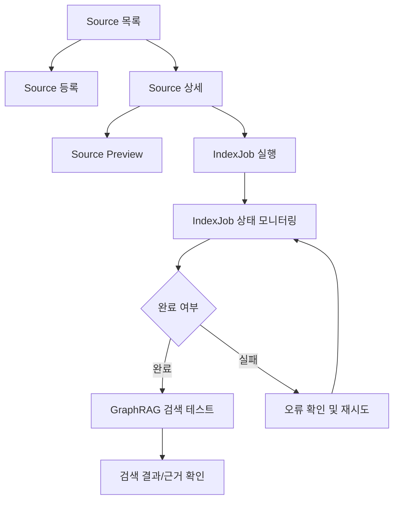

# GraphRAG AI Agent 공통 프레임워크 관리자 사이트 화면정의서

## 1. 문서 개요

### 1.1 목적

본 문서는 GraphRAG AI Agent 공통 프레임워크의 `240.설계` 단계 산출물로, 관리자 사이트에서 제공할 자료 관리, 인덱싱 작업 관리, GraphRAG 검색 테스트 화면의 구조와 화면별 기능을 정의한다.

관리자 사이트는 서비스 운영자가 Source를 등록하고, 벡터화/그래프 추출 작업을 실행하며, 인덱싱 상태와 GraphRAG 검색 품질을 확인할 수 있는 운영 도구를 목표로 한다.

### 1.2 범위

| 구분 | 화면 |
|---|---|
| Source 관리 | Source 목록, Source 등록, Source 상세, Source Preview, Source 삭제/비활성화 |
| IndexJob 관리 | IndexJob 실행, IndexJob 목록, IndexJob 상태 모니터링, 재시도/취소 |
| GraphRAG 테스트 | GraphRAG 검색 테스트, 검색 결과 상세, 근거/그래프 확인 |
| 공통 | 권한, 오류 표시, 상태 배지, 감사 로그 연계 |

### 1.3 연계 산출물

| 산출물 | 연계 내용 |
|---|---|
| 관리자 및 GraphRAG API 명세서 | 화면별 API 호출, request/response DTO, 오류 코드 |
| 물리 데이터 모델 설계서 | 화면 표시 항목과 Source/Document/Chunk/Entity/Relation/Evidence/IndexJob 테이블 매핑 |
| GraphRAG Core 상세설계서 | 검색 테스트 처리 흐름, ContextAssembler 결과 표시 |
| 공통 모듈 상세설계서 | 인증/권한, 오류 응답, 감사 로그, 설정 관리 |

## 2. 사용자 및 권한

### 2.1 사용자 역할

| 역할 | 설명 | 주요 화면 권한 |
|---|---|---|
| `ADMIN` | 전체 관리자 | 모든 Source/IndexJob/검색 테스트 조회 및 실행 |
| `OPERATOR` | 도메인 운영자 | 담당 domain Source 관리, IndexJob 실행, 검색 테스트 |
| `VIEWER` | 조회 담당자 | Source/IndexJob/검색 테스트 조회만 가능 |

### 2.2 권한별 제어

| 기능 | ADMIN | OPERATOR | VIEWER |
|---|---:|---:|---:|
| Source 목록/상세 조회 | Y | Y | Y |
| Source 등록/수정 | Y | Y | N |
| Source 삭제/비활성화 | Y | Y | N |
| IndexJob 실행 | Y | Y | N |
| IndexJob 재시도/취소 | Y | Y | N |
| GraphRAG 검색 테스트 | Y | Y | Y |
| 시스템 전체 domain 조회 | Y | N | N |

## 3. 정보 구조

### 3.1 메뉴 구조

```text
GraphRAG Admin
|- Dashboard
|- Source 관리
|  |- Source 목록
|  |- Source 등록
|  |- Source 상세
|  |- Source Preview
|- IndexJob 관리
|  |- IndexJob 목록
|  |- IndexJob 상태 모니터링
|- GraphRAG 테스트
|  |- 검색 테스트
|  |- 검색 결과 상세
|- 운영 로그
```

### 3.2 주요 이동 흐름



## 4. 공통 화면 정책

### 4.1 레이아웃

| 영역 | 설명 |
|---|---|
| Header | 서비스명, 현재 tenant/domain, 사용자 정보, 로그아웃 |
| Left Navigation | Dashboard, Source 관리, IndexJob 관리, GraphRAG 테스트 |
| Content Header | 화면명, 설명, 주요 액션 버튼 |
| Filter Bar | domain, status, type, 기간, keyword 검색 |
| Data Area | 테이블, 상세 패널, preview 패널, 모니터링 카드 |
| Toast/Modal | 저장/삭제/실행 결과, 확인 창, 오류 상세 |

### 4.2 공통 컴포넌트

| 컴포넌트 | 사용 화면 | 설명 |
|---|---|---|
| 상태 배지 | Source, IndexJob, 검색 결과 | 상태값별 색상 표시 |
| 진행률 바 | IndexJob | 전체 처리율, 단계별 처리율 표시 |
| JSON Viewer | Source 상세, 검색 테스트 | metadata, index_options, retrieval_options 표시 |
| Evidence Viewer | Preview, 검색 테스트 | chunk, entity, relation, evidence를 탭으로 표시 |
| Confirm Modal | 삭제, 취소, 재시도 | 파괴적/상태 변경 작업 전 확인 |
| Error Panel | 모든 화면 | API 오류 코드, 메시지, request_id 표시 |

### 4.3 상태 색상

| 상태 | 색상 | 설명 |
|---|---|---|
| `REGISTERED`, `PENDING` | Gray | 등록 또는 대기 |
| `INDEXING`, `RUNNING`, `RETRYING` | Blue | 처리 중 |
| `INDEXED`, `COMPLETED`, `HIT` | Green | 정상 완료 |
| `PARTIAL_COMPLETED`, `PARTIAL_HIT`, `FALLBACK_USED` | Amber | 부분 성공 또는 보완 필요 |
| `FAILED`, `MISS` | Red | 실패 또는 결과 없음 |
| `DELETED`, `CANCELED` | Slate | 삭제/취소 |

### 4.4 오류 표시 정책

| 오류 유형 | 표시 방식 |
|---|---|
| 입력 검증 오류 | 해당 필드 하단에 메시지 표시, 상단 toast 표시 |
| 권한 오류 | 접근 불가 안내 화면 또는 버튼 비활성화 |
| 중복/충돌 오류 | modal로 사유와 후속 액션 표시 |
| 서버/외부 연계 오류 | Error Panel에 오류 코드, request_id, 재시도 버튼 표시 |

## 5. 화면 목록

| 화면 ID | 화면명 | 목적 | 주요 API |
|---|---|---|---|
| `ADM-SRC-001` | Source 목록 | 등록된 자료 조회 및 관리 진입 | `GET /api/admin/graphrag/sources` |
| `ADM-SRC-002` | Source 등록 | 파일/URL/API/수기 Source 등록 | `POST /api/admin/graphrag/sources` |
| `ADM-SRC-003` | Source 상세 | Source 속성, 인덱싱 상태, 관련 작업 조회 | `GET /api/admin/graphrag/sources/{source_id}` |
| `ADM-SRC-004` | Source Preview | chunk/entity/relation/evidence 미리보기 | `GET /api/admin/graphrag/sources/{source_id}/preview` |
| `ADM-JOB-001` | IndexJob 실행 | Source 대상 인덱싱 작업 생성/실행 | `POST /api/admin/graphrag/index-jobs`, `POST /api/admin/graphrag/index-jobs/{job_id}/run` |
| `ADM-JOB-002` | IndexJob 상태 모니터링 | 진행률, 단계별 상태, 오류 로그 확인 | `GET /api/admin/graphrag/index-jobs/{job_id}` |
| `ADM-JOB-003` | IndexJob 목록 | 작업 이력 조회, 실패 작업 재시도 | `GET /api/admin/graphrag/index-jobs` |
| `ADM-RET-001` | GraphRAG 검색 테스트 | 검색 조건 입력 및 결과 품질 확인 | `POST /api/admin/graphrag/retrieval-tests` |
| `ADM-RET-002` | 검색 결과 상세 | 검색 근거, 점수, context 구성 확인 | `GET /api/admin/graphrag/retrieval-tests/{retrieval_run_id}` |

## 6. Source 목록 화면

### 6.1 화면 개요

| 항목 | 내용 |
|---|---|
| 화면 ID | `ADM-SRC-001` |
| 화면명 | Source 목록 |
| 목적 | 등록된 Source를 검색/필터링하고 상세, 등록, 삭제, 인덱싱 실행 화면으로 이동한다. |
| 진입 경로 | Left Navigation > Source 관리 |
| 권한 | `ADMIN`, `OPERATOR`, `VIEWER` |

### 6.2 화면 구성

```text
+--------------------------------------------------------------------------------+
| Source 관리                                                   [Source 등록]     |
+--------------------------------------------------------------------------------+
| Domain [전체 v] Type [전체 v] Status [전체 v] Keyword [__________] [검색] [초기화] |
+--------------------------------------------------------------------------------+
| 선택 | 자료명 | 유형 | Domain | 상태 | 버전 | 최근 인덱싱 | 등록자 | 등록일 | 작업 |
| ---- | ------ | ---- | ------ | ---- | ---- | ----------- | ------ | ------ | ---- |
| []   | ...    | FILE | SOLBAT | INDEXED | 3 | 2026-06-21 | user01 | ... | 상세 |
+--------------------------------------------------------------------------------+
| [선택 삭제] [선택 IndexJob 실행]                         < 1 2 3 ... >          |
+--------------------------------------------------------------------------------+
```

### 6.3 검색 조건

| 필드 | 유형 | 설명 | 기본값 |
|---|---|---|---|
| domain_code | select | 도메인 코드 | 권한 내 전체 |
| source_type | select | `FILE`, `URL`, `API`, `DATABASE`, `MANUAL`, `GENERATED` | 전체 |
| status | select | Source 상태 | 전체 |
| keyword | text | title, uri, metadata 검색 | 빈 값 |
| created_from/to | date | 등록일 범위 | 최근 30일 |

### 6.4 목록 컬럼

| 컬럼 | 설명 | 정렬 |
|---|---|---:|
| 선택 | bulk action 대상 선택 | N |
| 자료명 | Source title, 클릭 시 상세 이동 | Y |
| 유형 | source_type 배지 | Y |
| Domain | domain_code | Y |
| 상태 | status 배지 | Y |
| 버전 | current_version | Y |
| 문서/Chunk 수 | document_count, chunk_count | N |
| 최근 인덱싱 | last_indexed_at | Y |
| 등록자 | owner_id 또는 created_by | Y |
| 등록일 | created_at | Y |
| 작업 | 상세, Preview, IndexJob 실행, 삭제 | N |

### 6.5 주요 액션

| 액션 | 조건 | 처리 |
|---|---|---|
| Source 등록 | `ADMIN`, `OPERATOR` | `ADM-SRC-002` 이동 |
| 상세 | 전체 권한 | `ADM-SRC-003` 이동 |
| Preview | Source 상태가 `INDEXED`, `PARTIAL_INDEXED` | `ADM-SRC-004` 이동 |
| IndexJob 실행 | `ADMIN`, `OPERATOR`, 삭제 상태 제외 | `ADM-JOB-001` modal 또는 화면 이동 |
| 삭제/비활성화 | `ADMIN`, `OPERATOR`, 실행 중 작업 없음 | confirm modal 후 삭제 API 호출 |

## 7. Source 등록 화면

### 7.1 화면 개요

| 항목 | 내용 |
|---|---|
| 화면 ID | `ADM-SRC-002` |
| 화면명 | Source 등록 |
| 목적 | GraphRAG 인덱싱 대상 자료를 등록하고 필요 시 즉시 IndexJob을 생성한다. |
| 진입 경로 | Source 목록 > Source 등록 |
| 권한 | `ADMIN`, `OPERATOR` |

### 7.2 화면 구성

```text
+--------------------------------------------------------------------------------+
| Source 등록                                             [취소] [저장] [저장 후 인덱싱] |
+--------------------------------------------------------------------------------+
| 기본 정보                                                                      |
| Domain * [SOLBAT v]  Source Type * [FILE v]  공개 범위 [PRIVATE v]             |
| 자료명 * [____________________________________________________________]          |
| 설명   [____________________________________________________________]          |
+--------------------------------------------------------------------------------+
| Source 입력                                                                    |
| FILE: [파일 선택]                                                              |
| URL : [https://____________________________________________] [접속 확인]        |
| API : Endpoint, Method, Header, Body                                           |
| MANUAL: [텍스트 입력 영역]                                                     |
+--------------------------------------------------------------------------------+
| 인덱싱 옵션                                                                    |
| Chunk Size [1000] Overlap [150] Embedding Model [text-embedding-3-large v]      |
| [x] Entity 추출  [x] Relation 추출  [x] Evidence 연결  [ ] 즉시 실행           |
+--------------------------------------------------------------------------------+
| Metadata(JSON)                                                                 |
| { }                                                                            |
+--------------------------------------------------------------------------------+
```

### 7.3 입력 항목

| 필드 | 필수 | 설명 | 검증 |
|---|---:|---|---|
| domain_code | Y | 적용 도메인 | 권한 내 domain만 선택 |
| source_type | Y | Source 유형 | 지원 코드만 허용 |
| title | Y | 자료명 | 1~300자 |
| description | N | 설명 | 2,000자 이하 |
| scope | Y | `PRIVATE`, `DOMAIN`, `PUBLIC` | 권한별 선택 제한 |
| source_uri | 조건부 | URL/API/DATABASE 접근 경로 | source_type별 형식 검증 |
| file | 조건부 | 업로드 파일 | 허용 확장자/크기 검증 |
| manual_text | 조건부 | 수기 입력 원문 | 최소 길이 검증 |
| metadata_json | N | 확장 속성 | JSON 유효성 검증 |
| chunk_size | Y | chunk 분할 크기 | 200~4,000 |
| chunk_overlap | Y | chunk 중첩 크기 | 0~chunk_size 미만 |
| embedding_model | Y | embedding model | 시스템 설정값 중 선택 |
| extract_entities | N | Entity 추출 여부 | boolean |
| extract_relations | N | Relation 추출 여부 | boolean |
| link_evidence | N | EvidenceLink 생성 여부 | boolean |
| auto_create_index_job | N | 저장 후 IndexJob 생성 여부 | boolean |

### 7.4 저장 처리

| 버튼 | 처리 |
|---|---|
| 저장 | Source 등록 API 호출 후 상세 화면 이동 |
| 저장 후 인덱싱 | Source 등록 API 호출 시 `auto_create_index_job=true`, 생성된 IndexJob 상태 화면 이동 |
| 취소 | 입력 내용이 있으면 이탈 확인 modal 표시 |

### 7.5 오류/예외

| 상황 | 표시 |
|---|---|
| 필수값 누락 | 해당 필드 하단 오류 메시지 |
| 중복 Source | `GRAG-SRC-409` 표시, 기존 Source 상세 이동 링크 제공 |
| 파일 업로드 실패 | 파일 영역에 실패 사유와 재시도 버튼 표시 |
| JSON 오류 | JSON Viewer 라인 근처에 파싱 오류 표시 |

## 8. Source 상세 화면

### 8.1 화면 개요

| 항목 | 내용 |
|---|---|
| 화면 ID | `ADM-SRC-003` |
| 화면명 | Source 상세 |
| 목적 | Source 메타정보, 처리 현황, 문서/Chunk 통계, 최근 IndexJob 이력을 확인한다. |
| 진입 경로 | Source 목록 > 상세 |
| 권한 | `ADMIN`, `OPERATOR`, `VIEWER` |

### 8.2 화면 구성

```text
+--------------------------------------------------------------------------------+
| Source 상세: 솔밭 투자 보고서                         [수정] [Preview] [IndexJob 실행] |
+--------------------------------------------------------------------------------+
| 상태 INDEXED | Domain SOLBAT | Type FILE | Version 3 | Owner user01             |
+--------------------------------------------------------------------------------+
| Summary                                                                        |
| Documents 12 | Chunks 1,240 | Entities 350 | Relations 810 | Evidence 1,100     |
+--------------------------------------------------------------------------------+
| Tabs: [기본정보] [문서/Chunk] [Entity/Relation] [IndexJob 이력] [감사 로그]       |
+--------------------------------------------------------------------------------+
```

### 8.3 기본정보 탭

| 항목 | 설명 |
|---|---|
| source_id | Source 식별자 |
| domain_code | 도메인 |
| source_type | Source 유형 |
| title | 자료명 |
| description | 설명 |
| source_uri | 원본 위치 |
| checksum | 중복 검증 hash |
| current_version | 현재 버전 |
| status | Source 상태 |
| metadata_json | 확장 속성 |
| created_at/updated_at | 등록/수정 일시 |

### 8.4 문서/Chunk 탭

| 영역 | 표시 내용 |
|---|---|
| 문서 목록 | filename, document_type, parse_status, chunk_count |
| Chunk 샘플 | chunk_index, token_count, content preview |
| 필터 | document_type, parse_status, keyword |

### 8.5 Entity/Relation 탭

| 영역 | 표시 내용 |
|---|---|
| Entity 요약 | entity_type별 개수, 상위 entity |
| Relation 요약 | relation_type별 개수, confidence 평균 |
| 그래프 미니뷰 | 선택 entity 기준 1-hop 관계 |

### 8.6 IndexJob 이력 탭

| 컬럼 | 설명 |
|---|---|
| job_id | 작업 식별자 |
| job_type | FULL_INDEX, REINDEX 등 |
| status | 작업 상태 |
| progress | 진행률 |
| started_at/ended_at | 시작/종료 시각 |
| action | 상태 보기, 재시도, 취소 |

## 9. Source Preview 화면

### 9.1 화면 개요

| 항목 | 내용 |
|---|---|
| 화면 ID | `ADM-SRC-004` |
| 화면명 | Source Preview |
| 목적 | 인덱싱 결과로 생성된 chunk, entity, relation, evidence를 검토한다. |
| 진입 경로 | Source 목록/상세 > Preview |
| 권한 | `ADMIN`, `OPERATOR`, `VIEWER` |

### 9.2 화면 구성

```text
+--------------------------------------------------------------------------------+
| Source Preview: 솔밭 투자 보고서                         [검색 테스트로 이동]       |
+--------------------------------------------------------------------------------+
| Keyword [__________] Document [전체 v] Result Type [전체 v] [검색]              |
+--------------------------------------------------------------------------------+
| Left: Chunk List                         | Right: Detail                       |
| - #001 투자 목적...                      | Tabs [Chunk] [Entity] [Relation]    |
| - #002 위험 요소...                      | Evidence: ...                       |
| - #003 수익률...                         | Connected Entities: ...             |
+--------------------------------------------------------------------------------+
```

### 9.3 Preview 탭

| 탭 | 표시 내용 |
|---|---|
| Chunk | chunk 원문, chunk_index, token_count, embedding_ref 상태 |
| Entity | entity_name, entity_type, mention_text, confidence |
| Relation | source_entity, relation_type, target_entity, evidence |
| Evidence | quote_text, evidence_type, source/document/chunk 연결 |

### 9.4 사용자 액션

| 액션 | 설명 |
|---|---|
| keyword 검색 | chunk/evidence 원문 검색 |
| 결과 유형 필터 | chunk/entity/relation/evidence별 표시 |
| 검색 테스트로 이동 | 선택 Source를 검색 테스트 조건에 자동 반영 |
| 원문 위치 보기 | document/chunk 기준 원문 위치 표시 |

## 10. IndexJob 실행 화면

### 10.1 화면 개요

| 항목 | 내용 |
|---|---|
| 화면 ID | `ADM-JOB-001` |
| 화면명 | IndexJob 실행 |
| 목적 | 선택 Source에 대해 인덱싱 작업을 생성하고 실행한다. |
| 진입 경로 | Source 목록/상세 > IndexJob 실행 |
| 권한 | `ADMIN`, `OPERATOR` |

### 10.2 화면 구성

```text
+--------------------------------------------------------------------------------+
| IndexJob 실행                                                        [실행] [취소] |
+--------------------------------------------------------------------------------+
| 대상 Source                                                                     |
| 자료명: 솔밭 투자 보고서 | Domain: SOLBAT | Version: 3 | Status: REGISTERED       |
+--------------------------------------------------------------------------------+
| 작업 유형                                                                       |
| (o) FULL_INDEX  ( ) REINDEX  ( ) PARSE_ONLY  ( ) EMBED_ONLY                    |
| ( ) GRAPH_EXTRACT_ONLY  ( ) DELETE_INDEX                                       |
+--------------------------------------------------------------------------------+
| 실행 옵션                                                                       |
| [x] force_rebuild  [x] delete_previous_vectors  [ ] dry_run                    |
| Worker Priority [NORMAL v]                                                     |
+--------------------------------------------------------------------------------+
```

### 10.3 입력 항목

| 필드 | 필수 | 설명 |
|---|---:|---|
| source_id | Y | 대상 Source |
| job_type | Y | 실행 작업 유형 |
| force_rebuild | N | 기존 산출물 재생성 여부 |
| delete_previous_vectors | N | 기존 vector 삭제 여부 |
| dry_run | N | 실제 저장 없이 검증만 수행 |
| priority | N | 작업 우선순위 |
| index_options | N | chunk/embedding/extraction 상세 옵션 |

### 10.4 실행 전 검증

| 검증 | 실패 시 |
|---|---|
| 삭제된 Source 여부 | 실행 버튼 비활성화 |
| 동일 Source 실행 중 작업 존재 | `GRAG-JOB-409` 안내 |
| 필수 인덱싱 설정 존재 | 설정 누락 항목 표시 |
| 권한 확인 | 접근 불가 또는 버튼 비활성화 |

## 11. IndexJob 상태 모니터링 화면

### 11.1 화면 개요

| 항목 | 내용 |
|---|---|
| 화면 ID | `ADM-JOB-002` |
| 화면명 | IndexJob 상태 모니터링 |
| 목적 | 인덱싱 진행률, 단계별 처리 상태, 실패 원인을 실시간에 가깝게 확인한다. |
| 진입 경로 | IndexJob 실행 후 자동 이동, IndexJob 목록 > 상태 보기 |
| 권한 | `ADMIN`, `OPERATOR`, `VIEWER` |

### 11.2 화면 구성

```text
+--------------------------------------------------------------------------------+
| IndexJob 상태: FULL_INDEX                              [새로고침] [취소] [재시도] |
+--------------------------------------------------------------------------------+
| Status RUNNING | Progress 64% | Started 09:30 | Elapsed 00:04:32               |
| [########################--------------]                                       |
+--------------------------------------------------------------------------------+
| 단계별 상태                                                                     |
| 1. Parse Document       COMPLETED  12/12                                       |
| 2. Chunking             COMPLETED  1240/1240                                   |
| 3. Embedding            RUNNING    820/1240                                    |
| 4. Entity Extraction    PENDING    0/1240                                      |
| 5. Relation Extraction  PENDING    0/0                                         |
| 6. Evidence Linking     PENDING    0/0                                         |
+--------------------------------------------------------------------------------+
| 처리 로그                                                                       |
| 09:31 embedding batch 12 completed                                             |
+--------------------------------------------------------------------------------+
```

### 11.3 상태 표시 항목

| 항목 | 설명 |
|---|---|
| job_id | 작업 ID |
| source_id/source_title | 대상 Source |
| job_type | 작업 유형 |
| status | PENDING/RUNNING/COMPLETED/FAILED/CANCELED 등 |
| progress_ratio | 전체 진행률 |
| step_status | 단계별 상태 |
| processed_count/total_count | 처리 건수 |
| error_code/error_message | 실패 시 오류 |
| started_at/ended_at | 시작/종료 일시 |

### 11.4 모니터링 정책

| 항목 | 정책 |
|---|---|
| 자동 새로고침 | RUNNING/RETRYING 상태에서 5초 주기 |
| 수동 새로고침 | 모든 상태에서 가능 |
| 취소 | PENDING/RUNNING 상태에서만 가능 |
| 재시도 | FAILED/PARTIAL_COMPLETED 상태에서 가능 |
| 완료 후 이동 | Source Preview, GraphRAG 검색 테스트 버튼 활성화 |

### 11.5 실패 표시

| 실패 위치 | 표시 |
|---|---|
| Parse 실패 | 실패 문서명, 파싱 오류 메시지 |
| Embedding 실패 | provider, model, batch index, 재시도 가능 여부 |
| Graph 추출 실패 | chunk_id, LLM 오류, JSON 파싱 실패 여부 |
| Evidence 연결 실패 | relation/entity 연결 실패 건수 |

## 12. IndexJob 목록 화면

### 12.1 화면 개요

| 항목 | 내용 |
|---|---|
| 화면 ID | `ADM-JOB-003` |
| 화면명 | IndexJob 목록 |
| 목적 | 전체 작업 이력을 조회하고 실패/진행 중 작업을 관리한다. |
| 진입 경로 | Left Navigation > IndexJob 관리 |
| 권한 | `ADMIN`, `OPERATOR`, `VIEWER` |

### 12.2 검색 조건

| 필드 | 설명 |
|---|---|
| domain_code | 도메인 |
| job_type | 작업 유형 |
| status | 작업 상태 |
| source_keyword | Source title/source_id 검색 |
| started_from/to | 시작일 범위 |

### 12.3 목록 컬럼

| 컬럼 | 설명 |
|---|---|
| job_id | 작업 ID |
| Source | 대상 Source |
| job_type | 작업 유형 |
| status | 상태 배지 |
| progress | 진행률 |
| counts | total/processed/failed |
| requester | 실행자 |
| started_at/ended_at | 시작/종료 시각 |
| action | 상태 보기, 재시도, 취소 |

## 13. GraphRAG 검색 테스트 화면

### 13.1 화면 개요

| 항목 | 내용 |
|---|---|
| 화면 ID | `ADM-RET-001` |
| 화면명 | GraphRAG 검색 테스트 |
| 목적 | Source/Domain 기준으로 GraphRAG 검색 품질을 테스트하고 검색 근거를 확인한다. |
| 진입 경로 | Left Navigation > GraphRAG 테스트, Source Preview > 검색 테스트로 이동 |
| 권한 | `ADMIN`, `OPERATOR`, `VIEWER` |

### 13.2 화면 구성

```text
+--------------------------------------------------------------------------------+
| GraphRAG 검색 테스트                                           [실행] [초기화]      |
+--------------------------------------------------------------------------------+
| Query *                                                                         |
| [솔밭 투자 보고서에서 핵심 위험 요소를 알려줘______________________________]         |
+--------------------------------------------------------------------------------+
| 검색 범위                                                                       |
| Domain [SOLBAT v] Source [솔밭 투자 보고서 v] Strategy [HYBRID_RERANK v]         |
| Top K [10] Graph Depth [2] Min Score [0.65]                                     |
| [x] Include Evidence [x] Include Graph Context [ ] Vector Only Compare          |
+--------------------------------------------------------------------------------+
| Result                                                                          |
| Answer Preview / Context Summary                                                |
| Tabs [검색 결과] [근거] [그래프 경로] [Raw JSON]                                 |
+--------------------------------------------------------------------------------+
```

### 13.3 입력 항목

| 필드 | 필수 | 설명 | 기본값 |
|---|---:|---|---|
| query | Y | 테스트 질문 | 빈 값 |
| domain_code | Y | 검색 domain | 사용자 기본 domain |
| source_ids | N | 검색 대상 Source 목록 | 전체 |
| strategy | Y | `VECTOR_ONLY`, `GRAPH_ONLY`, `HYBRID`, `HYBRID_RERANK` | `HYBRID_RERANK` |
| top_k | Y | 반환 결과 수 | 10 |
| graph_depth | N | graph traversal depth | 2 |
| min_score | N | 최소 점수 | 0.0 |
| include_evidence | N | evidence 포함 여부 | true |
| include_graph_context | N | graph context 포함 여부 | true |
| filters | N | metadata/domain/source 필터 | `{}` |

### 13.4 결과 영역

| 탭 | 표시 내용 |
|---|---|
| 검색 결과 | result_type, score, title, snippet, source_title |
| 근거 | evidence quote, document/chunk 위치, confidence |
| 그래프 경로 | entity -> relation -> entity 경로, relation_type, confidence |
| Raw JSON | RetrievalRun/Result response 원문 |

### 13.5 품질 확인 지표

| 지표 | 설명 |
|---|---|
| hit_count | 검색 결과 건수 |
| max_score/avg_score | 검색 점수 |
| evidence_count | 근거 수 |
| graph_path_count | graph context 경로 수 |
| elapsed_ms | 검색 소요 시간 |
| fallback_used | fallback 사용 여부 |

### 13.6 사용자 액션

| 액션 | 설명 |
|---|---|
| 실행 | 검색 테스트 API 호출 |
| 초기화 | 입력 조건 초기화 |
| Source 상세 이동 | 결과의 Source 클릭 시 상세 화면 이동 |
| Chunk Preview | 결과 chunk 클릭 시 Source Preview의 해당 chunk로 이동 |
| Raw JSON 복사 | 테스트 결과를 개발/분석용으로 복사 |

### 13.7 오류/예외

| 상황 | 표시 |
|---|---|
| query 없음 | 입력 필드 오류 |
| 검색 대상 없음 | Source 등록/IndexJob 실행 안내 |
| Vector Store 오류 | `GRAG-VEC-001`과 provider 정보 표시 |
| Graph Store 오류 | `GRAG-GPH-001`, `GRAG-GPH-002` 표시 |
| 결과 없음 | 빈 상태 화면과 조건 완화 안내 |

## 14. 검색 결과 상세 화면

### 14.1 화면 개요

| 항목 | 내용 |
|---|---|
| 화면 ID | `ADM-RET-002` |
| 화면명 | 검색 결과 상세 |
| 목적 | RetrievalRun 기준으로 검색 입력, 결과, 근거, context 조립 내역을 재확인한다. |
| 진입 경로 | GraphRAG 검색 테스트 실행 후, 검색 이력 선택 |
| 권한 | `ADMIN`, `OPERATOR`, `VIEWER` |

### 14.2 표시 항목

| 영역 | 표시 내용 |
|---|---|
| 실행 정보 | retrieval_run_id, requester, query, strategy, status |
| 검색 조건 | domain, source_ids, top_k, graph_depth, filters |
| 결과 요약 | hit_count, elapsed_ms, fallback_used |
| 결과 목록 | chunk/entity/relation/evidence별 result |
| Context 조립 | answer context에 포함된 순서와 token 비중 |
| Raw JSON | API 응답 원문 |

## 15. 빈 상태 및 접근 제한 화면

### 15.1 빈 상태

| 화면 | 조건 | 안내 |
|---|---|---|
| Source 목록 | 등록된 Source 없음 | Source 등록 버튼과 간단한 안내 |
| Source Preview | 인덱싱 결과 없음 | IndexJob 실행 버튼 표시 |
| IndexJob 목록 | 작업 이력 없음 | Source에서 인덱싱 실행 안내 |
| 검색 테스트 | 검색 대상 Source 없음 | Source 등록/인덱싱 필요 안내 |
| 검색 결과 | hit_count 0 | query/strategy/source 조건 변경 안내 |

### 15.2 접근 제한

| 상황 | 처리 |
|---|---|
| 미인증 | 로그인 화면 이동 |
| 권한 없음 | 접근 제한 화면 표시 |
| 버튼 권한 없음 | 버튼 비활성화 및 tooltip 표시 |
| Source 권한 없음 | 목록/상세 조회 대상에서 제외 |

## 16. 화면-API 매핑

| 화면 ID | API | 호출 시점 |
|---|---|---|
| `ADM-SRC-001` | `GET /api/admin/graphrag/sources` | 최초 진입, 검색, pagination |
| `ADM-SRC-002` | `POST /api/admin/graphrag/sources` | 저장, 저장 후 인덱싱 |
| `ADM-SRC-003` | `GET /api/admin/graphrag/sources/{source_id}` | 상세 진입, 새로고침 |
| `ADM-SRC-003` | `PATCH /api/admin/graphrag/sources/{source_id}` | Source 수정 |
| `ADM-SRC-003` | `DELETE /api/admin/graphrag/sources/{source_id}` | 삭제/비활성화 |
| `ADM-SRC-004` | `GET /api/admin/graphrag/sources/{source_id}/preview` | Preview 진입, 필터 변경 |
| `ADM-JOB-001` | `POST /api/admin/graphrag/index-jobs` | IndexJob 생성 |
| `ADM-JOB-001` | `POST /api/admin/graphrag/index-jobs/{job_id}/run` | IndexJob 실행 |
| `ADM-JOB-002` | `GET /api/admin/graphrag/index-jobs/{job_id}` | 모니터링 조회 |
| `ADM-JOB-002` | `POST /api/admin/graphrag/index-jobs/{job_id}/cancel` | 작업 취소 |
| `ADM-JOB-002` | `POST /api/admin/graphrag/index-jobs/{job_id}/retry` | 작업 재시도 |
| `ADM-JOB-003` | `GET /api/admin/graphrag/index-jobs` | 목록 조회 |
| `ADM-RET-001` | `POST /api/admin/graphrag/retrieval-tests` | 검색 테스트 실행 |
| `ADM-RET-002` | `GET /api/admin/graphrag/retrieval-tests/{retrieval_run_id}` | 결과 상세 조회 |

## 17. 화면-데이터 매핑

| 화면 | 주요 데이터 |
|---|---|
| Source 목록/상세 | `graphrag_sources`, `graphrag_documents`, `graphrag_chunks` |
| Source Preview | `graphrag_chunks`, `graphrag_entities`, `graphrag_entity_mentions`, `graphrag_relations`, `graphrag_evidence` |
| IndexJob 실행/상태 | `graphrag_sources`, IndexJob 실행 이력 저장소 |
| GraphRAG 검색 테스트 | `graphrag_retrieval_runs`, `graphrag_retrieval_results`, `graphrag_evidence` |
| 검색 결과 상세 | `graphrag_retrieval_runs`, `graphrag_retrieval_results`, `graphrag_agent_runs` |

## 18. UI 검증 기준

| 검증 항목 | 기준 |
|---|---|
| 필수 화면 포함 | Source 목록/등록/상세/Preview, IndexJob 실행/상태 모니터링, GraphRAG 검색 테스트 포함 |
| API 정합성 | 화면 액션이 API 명세서의 endpoint와 매핑되어야 함 |
| 권한 제어 | ADMIN/OPERATOR/VIEWER별 버튼과 조회 범위가 구분되어야 함 |
| 상태 표시 | Source/IndexJob/Retrieval 상태가 배지와 진행률로 식별 가능해야 함 |
| 오류 표시 | 오류 코드, 메시지, request_id가 확인 가능해야 함 |
| 운영성 | 실패 작업 재시도, 취소, 로그 확인이 가능해야 함 |
| 추적성 | 검색 결과에서 Source/Document/Chunk/Evidence까지 이동 가능해야 함 |

## 19. 보완 및 확정 필요 사항

| 구분 | 내용 | 담당 |
|---|---|---|
| 디자인 시스템 | 색상, 폰트, 테이블, 버튼, modal 표준 정의 | 디자이너 |
| 파일 업로드 정책 | 허용 확장자, 크기, 저장 위치, 보안 스캔 정책 확정 | 아키텍터/Backend Engineer |
| 실시간 모니터링 | polling, SSE, WebSocket 중 구현 방식 확정 | Backend Engineer |
| Graph Preview | 1차 릴리스에서 미니 그래프 제공 여부 확정 | 기획자/GraphRAG Engineer |
| 검색 이력 | 관리자 테스트 이력 보관 기간 및 개인정보 masking 정책 확정 | PM/보안 |

## 20. 다음 작업 제안

| 순번 | 담당 | 작업 | 산출물 |
|---:|---|---|---|
| 1 | 디자이너 | 관리자 사이트 와이어프레임/화면 설계 구체화 | 화면설계서 또는 HTML prototype |
| 2 | Backend Engineer | OpenAPI YAML 작성 | API 명세 자동화 산출물 |
| 3 | Frontend Engineer | 관리자 사이트 컴포넌트 설계 | Frontend 컴포넌트 설계서 |
| 4 | QA | 화면/API 통합 테스트 시나리오 작성 | 테스트 시나리오 |

### 20.1 다음 요청 문구

```text
[Frontend Engineer] 240.설계 단계의 관리자 사이트 Frontend 컴포넌트 설계서를 작성해 주세요. Source 관리, IndexJob 모니터링, GraphRAG 검색 테스트 화면의 컴포넌트 구조, 상태 관리, API 연동 방식을 포함해 주세요.
```

## 21. 변경 이력

| 버전 | 일자 | 작성자 | 변경 내용 |
|---|---|---|---|
| 0.1 | 2026-06-21 | 기획자/디자이너 | 최초 작성 |
