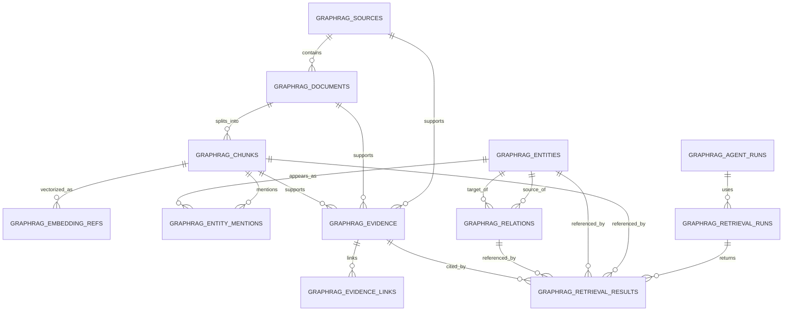

# GraphRAG AI Agent 공통 프레임워크 물리 데이터 모델 설계서

## 1. 문서 개요

### 1.1 목적

본 문서는 GraphRAG AI Agent 공통 프레임워크의 `240.설계` 단계 산출물로, GraphRAG Core와 Agent 실행 추적에 필요한 물리 데이터 모델을 정의한다. `Source`, `Document`, `Chunk`, `EmbeddingRef`, `Entity`, `EntityMention`, `Relation`, `Evidence`, `EvidenceLink`, `RetrievalRun`, `RetrievalResult`, `AgentRun` 관련 테이블정의서와 ERD를 포함한다.

### 1.2 설계 범위

| 구분 | 테이블 |
|---|---|
| 자료 관리 | `graphrag_sources`, `graphrag_documents`, `graphrag_chunks` |
| Vector 참조 | `graphrag_embedding_refs` |
| GraphRAG | `graphrag_entities`, `graphrag_entity_mentions`, `graphrag_relations`, `graphrag_evidence`, `graphrag_evidence_links` |
| 검색 추적 | `graphrag_retrieval_runs`, `graphrag_retrieval_results` |
| Agent 실행 | `graphrag_agent_runs` |

### 1.3 설계 기준

| 항목 | 기준 |
|---|---|
| DBMS | PostgreSQL 15 이상 권장 |
| Vector Store | PGVector 기본, FAISS는 `EmbeddingRef`로 외부 참조 |
| ID 타입 | UUID |
| JSON 타입 | PostgreSQL `jsonb` |
| 시각 타입 | `timestamptz` |
| 삭제 정책 | 기본 soft delete, 운영자 요청/재인덱싱 시 hard delete 옵션 |
| 다중 테넌트 | `tenant_id`, `owner_id`, `scope` 기반 접근 제어 |
| 추적성 | Agent 답변에서 Source/Document/Chunk/Evidence까지 역추적 가능 |

### 1.4 공통 컬럼 규칙

| 컬럼 | 타입 | 설명 |
|---|---|---|
| `created_at` | `timestamptz` | 생성 일시 |
| `created_by` | `varchar(100)` | 생성자 |
| `updated_at` | `timestamptz` | 수정 일시 |
| `updated_by` | `varchar(100)` | 수정자 |
| `deleted_at` | `timestamptz` | soft delete 일시 |
| `deleted_by` | `varchar(100)` | 삭제자 |
| `is_deleted` | `boolean` | soft delete 여부 |

## 2. 전체 ERD



## 3. 테이블 목록

| No | 테이블명 | 논리명 | 주요 목적 |
|---:|---|---|---|
| 1 | `graphrag_sources` | Source | 자료 원천 관리 |
| 2 | `graphrag_documents` | Document | Source에서 추출된 처리 문서 |
| 3 | `graphrag_chunks` | Chunk | 검색/추출 단위 텍스트 |
| 4 | `graphrag_embedding_refs` | EmbeddingRef | Vector Store 저장 참조 |
| 5 | `graphrag_entities` | Entity | 정규화된 개체 |
| 6 | `graphrag_entity_mentions` | EntityMention | chunk 내 개체 언급 |
| 7 | `graphrag_relations` | Relation | 개체 간 관계 |
| 8 | `graphrag_evidence` | Evidence | 답변/관계 근거 |
| 9 | `graphrag_evidence_links` | EvidenceLink | 근거와 대상 연결 |
| 10 | `graphrag_retrieval_runs` | RetrievalRun | 검색 실행 이력 |
| 11 | `graphrag_retrieval_results` | RetrievalResult | 검색 결과 상세 |
| 12 | `graphrag_agent_runs` | AgentRun | Agent 실행 이력 |

## 4. 테이블정의서

### 4.1 `graphrag_sources`

자료 등록, 인덱싱 상태, 권한 범위의 기준 테이블이다.

| 컬럼명 | 타입 | PK | FK | Null | 기본값 | 설명 |
|---|---|---|---|---|---|---|
| `source_id` | `uuid` | Y |  | N | `gen_random_uuid()` | Source ID |
| `tenant_id` | `varchar(100)` |  |  | Y |  | 테넌트 ID |
| `domain_code` | `varchar(50)` |  |  | N |  | 도메인 코드 |
| `source_type` | `varchar(30)` |  |  | N |  | FILE, URL, API, DATABASE, MANUAL, GENERATED |
| `title` | `varchar(300)` |  |  | N |  | 자료명 |
| `description` | `text` |  |  | Y |  | 설명 |
| `uri` | `text` |  |  | Y |  | 파일 경로, URL, API endpoint 등 |
| `owner_id` | `varchar(100)` |  |  | Y |  | 소유자 |
| `scope` | `varchar(20)` |  |  | N | `'PRIVATE'` | PUBLIC, PRIVATE, TENANT |
| `status` | `varchar(30)` |  |  | N | `'REGISTERED'` | Source 상태 |
| `current_version` | `integer` |  |  | N | `1` | 현재 버전 |
| `checksum` | `varchar(128)` |  |  | Y |  | 중복 식별 checksum |
| `tags` | `jsonb` |  |  | N | `'[]'::jsonb` | 태그 목록 |
| `metadata_json` | `jsonb` |  |  | N | `'{}'::jsonb` | 도메인 확장 속성 |
| `last_indexed_at` | `timestamptz` |  |  | Y |  | 마지막 인덱싱 일시 |
| `created_at` | `timestamptz` |  |  | N | `now()` | 생성 일시 |
| `created_by` | `varchar(100)` |  |  | Y |  | 생성자 |
| `updated_at` | `timestamptz` |  |  | N | `now()` | 수정 일시 |
| `updated_by` | `varchar(100)` |  |  | Y |  | 수정자 |
| `deleted_at` | `timestamptz` |  |  | Y |  | 삭제 일시 |
| `deleted_by` | `varchar(100)` |  |  | Y |  | 삭제자 |
| `is_deleted` | `boolean` |  |  | N | `false` | 삭제 여부 |

**인덱스**

| 인덱스명 | 컬럼 | 유형 | 설명 |
|---|---|---|---|
| `pk_graphrag_sources` | `source_id` | PK | 기본키 |
| `ix_graphrag_sources_domain_status` | `domain_code`, `status` | btree | 도메인별 상태 조회 |
| `ix_graphrag_sources_owner` | `tenant_id`, `owner_id`, `scope` | btree | 권한 필터 |
| `ux_graphrag_sources_checksum` | `domain_code`, `owner_id`, `checksum` | unique partial | 삭제되지 않은 Source 중복 방지 |
| `gin_graphrag_sources_metadata` | `metadata_json` | gin | 도메인 확장 검색 |

### 4.2 `graphrag_documents`

Source에서 파싱된 처리 단위 문서를 저장한다.

| 컬럼명 | 타입 | PK | FK | Null | 기본값 | 설명 |
|---|---|---|---|---|---|---|
| `document_id` | `uuid` | Y |  | N | `gen_random_uuid()` | Document ID |
| `source_id` | `uuid` |  | `graphrag_sources.source_id` | N |  | Source ID |
| `source_version` | `integer` |  |  | N | `1` | Source 버전 |
| `filename` | `varchar(500)` |  |  | Y |  | 파일명 |
| `document_type` | `varchar(50)` |  |  | N |  | PDF, DOCX, CSV, API_JSON 등 |
| `mime_type` | `varchar(150)` |  |  | Y |  | MIME type |
| `language` | `varchar(20)` |  |  | Y | `'ko'` | 언어 |
| `page_count` | `integer` |  |  | Y |  | 페이지 수 |
| `parser_name` | `varchar(100)` |  |  | Y |  | Parser 이름 |
| `parse_status` | `varchar(30)` |  |  | N | `'PENDING'` | 파싱 상태 |
| `content_hash` | `varchar(128)` |  |  | Y |  | 문서 내용 hash |
| `metadata_json` | `jsonb` |  |  | N | `'{}'::jsonb` | 문서 확장 정보 |
| `created_at` | `timestamptz` |  |  | N | `now()` | 생성 일시 |
| `created_by` | `varchar(100)` |  |  | Y |  | 생성자 |
| `updated_at` | `timestamptz` |  |  | N | `now()` | 수정 일시 |
| `updated_by` | `varchar(100)` |  |  | Y |  | 수정자 |
| `deleted_at` | `timestamptz` |  |  | Y |  | 삭제 일시 |
| `deleted_by` | `varchar(100)` |  |  | Y |  | 삭제자 |
| `is_deleted` | `boolean` |  |  | N | `false` | 삭제 여부 |

**인덱스**

| 인덱스명 | 컬럼 | 유형 | 설명 |
|---|---|---|---|
| `pk_graphrag_documents` | `document_id` | PK | 기본키 |
| `ix_graphrag_documents_source` | `source_id`, `source_version` | btree | Source별 문서 조회 |
| `ix_graphrag_documents_status` | `parse_status` | btree | 파싱 상태 조회 |
| `gin_graphrag_documents_metadata` | `metadata_json` | gin | 확장 속성 검색 |

### 4.3 `graphrag_chunks`

검색, embedding, Entity/Relation 추출의 기본 단위다.

| 컬럼명 | 타입 | PK | FK | Null | 기본값 | 설명 |
|---|---|---|---|---|---|---|
| `chunk_id` | `uuid` | Y |  | N | `gen_random_uuid()` | Chunk ID |
| `document_id` | `uuid` |  | `graphrag_documents.document_id` | N |  | Document ID |
| `source_id` | `uuid` |  | `graphrag_sources.source_id` | N |  | Source ID |
| `domain_code` | `varchar(50)` |  |  | N |  | 도메인 코드 |
| `chunk_index` | `integer` |  |  | N |  | 문서 내 순번 |
| `content` | `text` |  |  | N |  | chunk 원문 |
| `content_hash` | `varchar(128)` |  |  | N |  | chunk hash |
| `token_count` | `integer` |  |  | Y |  | token 수 |
| `page_no` | `integer` |  |  | Y |  | 페이지 번호 |
| `section_title` | `varchar(500)` |  |  | Y |  | 섹션 제목 |
| `start_offset` | `integer` |  |  | Y |  | 원문 시작 위치 |
| `end_offset` | `integer` |  |  | Y |  | 원문 종료 위치 |
| `status` | `varchar(30)` |  |  | N | `'ACTIVE'` | ACTIVE, DISABLED, DELETED |
| `metadata_json` | `jsonb` |  |  | N | `'{}'::jsonb` | chunk 확장 속성 |
| `created_at` | `timestamptz` |  |  | N | `now()` | 생성 일시 |
| `created_by` | `varchar(100)` |  |  | Y |  | 생성자 |
| `updated_at` | `timestamptz` |  |  | N | `now()` | 수정 일시 |
| `updated_by` | `varchar(100)` |  |  | Y |  | 수정자 |
| `deleted_at` | `timestamptz` |  |  | Y |  | 삭제 일시 |
| `deleted_by` | `varchar(100)` |  |  | Y |  | 삭제자 |
| `is_deleted` | `boolean` |  |  | N | `false` | 삭제 여부 |

**인덱스**

| 인덱스명 | 컬럼 | 유형 | 설명 |
|---|---|---|---|
| `pk_graphrag_chunks` | `chunk_id` | PK | 기본키 |
| `ix_graphrag_chunks_document_order` | `document_id`, `chunk_index` | btree | 문서 내 chunk 순서 조회 |
| `ix_graphrag_chunks_source` | `source_id`, `status` | btree | Source별 chunk 조회 |
| `ix_graphrag_chunks_domain` | `domain_code`, `status` | btree | 도메인별 검색 |
| `ux_graphrag_chunks_hash` | `document_id`, `content_hash` | unique partial | 문서 내 중복 chunk 방지 |

### 4.4 `graphrag_embedding_refs`

실제 vector 저장소의 vector ID와 collection 정보를 참조한다.

| 컬럼명 | 타입 | PK | FK | Null | 기본값 | 설명 |
|---|---|---|---|---|---|---|
| `embedding_ref_id` | `uuid` | Y |  | N | `gen_random_uuid()` | Embedding 참조 ID |
| `chunk_id` | `uuid` |  | `graphrag_chunks.chunk_id` | N |  | Chunk ID |
| `provider` | `varchar(50)` |  |  | N |  | PGVECTOR, FAISS, CHROMA |
| `collection_name` | `varchar(200)` |  |  | N |  | collection/index 이름 |
| `vector_id` | `varchar(300)` |  |  | N |  | provider 내 vector ID |
| `model_name` | `varchar(100)` |  |  | N |  | embedding model |
| `dimension` | `integer` |  |  | N |  | vector 차원 |
| `status` | `varchar(30)` |  |  | N | `'ACTIVE'` | ACTIVE, DELETED, FAILED |
| `embedded_at` | `timestamptz` |  |  | N | `now()` | embedding 생성 일시 |
| `metadata_json` | `jsonb` |  |  | N | `'{}'::jsonb` | provider 확장 정보 |
| `created_at` | `timestamptz` |  |  | N | `now()` | 생성 일시 |
| `created_by` | `varchar(100)` |  |  | Y |  | 생성자 |
| `updated_at` | `timestamptz` |  |  | N | `now()` | 수정 일시 |
| `updated_by` | `varchar(100)` |  |  | Y |  | 수정자 |
| `deleted_at` | `timestamptz` |  |  | Y |  | 삭제 일시 |
| `deleted_by` | `varchar(100)` |  |  | Y |  | 삭제자 |
| `is_deleted` | `boolean` |  |  | N | `false` | 삭제 여부 |

**인덱스**

| 인덱스명 | 컬럼 | 유형 | 설명 |
|---|---|---|---|
| `pk_graphrag_embedding_refs` | `embedding_ref_id` | PK | 기본키 |
| `ix_graphrag_embedding_refs_chunk` | `chunk_id`, `status` | btree | chunk별 vector 참조 |
| `ux_graphrag_embedding_refs_provider_vector` | `provider`, `collection_name`, `vector_id` | unique | provider 내 중복 방지 |

### 4.5 `graphrag_entities`

도메인별 정규화된 개체를 저장한다.

| 컬럼명 | 타입 | PK | FK | Null | 기본값 | 설명 |
|---|---|---|---|---|---|---|
| `entity_id` | `uuid` | Y |  | N | `gen_random_uuid()` | Entity ID |
| `tenant_id` | `varchar(100)` |  |  | Y |  | 테넌트 ID |
| `domain_code` | `varchar(50)` |  |  | N |  | 도메인 코드 |
| `entity_type` | `varchar(80)` |  |  | N |  | CROP, DISEASE 등 |
| `name` | `varchar(300)` |  |  | N |  | 대표명 |
| `normalized_name` | `varchar(300)` |  |  | N |  | 정규화명 |
| `aliases_json` | `jsonb` |  |  | N | `'[]'::jsonb` | alias 목록 |
| `description` | `text` |  |  | Y |  | 설명 |
| `confidence_score` | `numeric(5,4)` |  |  | N | `0` | 신뢰도 |
| `status` | `varchar(30)` |  |  | N | `'ACTIVE'` | ACTIVE, MERGED, DISABLED |
| `metadata_json` | `jsonb` |  |  | N | `'{}'::jsonb` | 도메인 확장 속성 |
| `created_at` | `timestamptz` |  |  | N | `now()` | 생성 일시 |
| `created_by` | `varchar(100)` |  |  | Y |  | 생성자 |
| `updated_at` | `timestamptz` |  |  | N | `now()` | 수정 일시 |
| `updated_by` | `varchar(100)` |  |  | Y |  | 수정자 |
| `deleted_at` | `timestamptz` |  |  | Y |  | 삭제 일시 |
| `deleted_by` | `varchar(100)` |  |  | Y |  | 삭제자 |
| `is_deleted` | `boolean` |  |  | N | `false` | 삭제 여부 |

**인덱스**

| 인덱스명 | 컬럼 | 유형 | 설명 |
|---|---|---|---|
| `pk_graphrag_entities` | `entity_id` | PK | 기본키 |
| `ux_graphrag_entities_normalized` | `tenant_id`, `domain_code`, `entity_type`, `normalized_name` | unique partial | 정규화 개체 중복 방지 |
| `ix_graphrag_entities_type` | `domain_code`, `entity_type`, `status` | btree | 개체 유형 조회 |
| `gin_graphrag_entities_aliases` | `aliases_json` | gin | alias 검색 |
| `gin_graphrag_entities_metadata` | `metadata_json` | gin | 확장 속성 검색 |

### 4.6 `graphrag_entity_mentions`

Chunk 원문에서 entity가 언급된 위치를 저장한다.

| 컬럼명 | 타입 | PK | FK | Null | 기본값 | 설명 |
|---|---|---|---|---|---|---|
| `entity_mention_id` | `uuid` | Y |  | N | `gen_random_uuid()` | EntityMention ID |
| `entity_id` | `uuid` |  | `graphrag_entities.entity_id` | N |  | Entity ID |
| `chunk_id` | `uuid` |  | `graphrag_chunks.chunk_id` | N |  | Chunk ID |
| `source_id` | `uuid` |  | `graphrag_sources.source_id` | N |  | Source ID |
| `mention_text` | `varchar(500)` |  |  | N |  | 원문 표현 |
| `start_offset` | `integer` |  |  | Y |  | 시작 위치 |
| `end_offset` | `integer` |  |  | Y |  | 종료 위치 |
| `extraction_method` | `varchar(30)` |  |  | N |  | RULE, LLM, HYBRID |
| `confidence_score` | `numeric(5,4)` |  |  | N | `0` | 신뢰도 |
| `metadata_json` | `jsonb` |  |  | N | `'{}'::jsonb` | 확장 정보 |
| `created_at` | `timestamptz` |  |  | N | `now()` | 생성 일시 |
| `created_by` | `varchar(100)` |  |  | Y |  | 생성자 |

**인덱스**

| 인덱스명 | 컬럼 | 유형 | 설명 |
|---|---|---|---|
| `pk_graphrag_entity_mentions` | `entity_mention_id` | PK | 기본키 |
| `ix_graphrag_entity_mentions_entity` | `entity_id` | btree | entity별 mention 조회 |
| `ix_graphrag_entity_mentions_chunk` | `chunk_id` | btree | chunk별 mention 조회 |
| `ix_graphrag_entity_mentions_source` | `source_id` | btree | source 기준 삭제/조회 |

### 4.7 `graphrag_relations`

Entity 간 의미 관계를 저장한다.

| 컬럼명 | 타입 | PK | FK | Null | 기본값 | 설명 |
|---|---|---|---|---|---|---|
| `relation_id` | `uuid` | Y |  | N | `gen_random_uuid()` | Relation ID |
| `tenant_id` | `varchar(100)` |  |  | Y |  | 테넌트 ID |
| `domain_code` | `varchar(50)` |  |  | N |  | 도메인 코드 |
| `relation_type` | `varchar(80)` |  |  | N |  | AFFECTS, RECOMMENDS 등 |
| `source_entity_id` | `uuid` |  | `graphrag_entities.entity_id` | N |  | 출발 Entity |
| `target_entity_id` | `uuid` |  | `graphrag_entities.entity_id` | N |  | 도착 Entity |
| `weight` | `numeric(8,4)` |  |  | N | `1.0` | 관계 가중치 |
| `confidence_score` | `numeric(5,4)` |  |  | N | `0` | 신뢰도 |
| `status` | `varchar(30)` |  |  | N | `'ACTIVE'` | ACTIVE, DISABLED, DELETED |
| `metadata_json` | `jsonb` |  |  | N | `'{}'::jsonb` | 관계 확장 속성 |
| `created_at` | `timestamptz` |  |  | N | `now()` | 생성 일시 |
| `created_by` | `varchar(100)` |  |  | Y |  | 생성자 |
| `updated_at` | `timestamptz` |  |  | N | `now()` | 수정 일시 |
| `updated_by` | `varchar(100)` |  |  | Y |  | 수정자 |
| `deleted_at` | `timestamptz` |  |  | Y |  | 삭제 일시 |
| `deleted_by` | `varchar(100)` |  |  | Y |  | 삭제자 |
| `is_deleted` | `boolean` |  |  | N | `false` | 삭제 여부 |

**인덱스**

| 인덱스명 | 컬럼 | 유형 | 설명 |
|---|---|---|---|
| `pk_graphrag_relations` | `relation_id` | PK | 기본키 |
| `ux_graphrag_relations_pair` | `tenant_id`, `domain_code`, `relation_type`, `source_entity_id`, `target_entity_id` | unique partial | 동일 관계 중복 방지 |
| `ix_graphrag_relations_source` | `source_entity_id`, `relation_type` | btree | 출발 entity traversal |
| `ix_graphrag_relations_target` | `target_entity_id`, `relation_type` | btree | 도착 entity traversal |
| `gin_graphrag_relations_metadata` | `metadata_json` | gin | 확장 속성 검색 |

### 4.8 `graphrag_evidence`

Entity, Relation, Retrieval, Agent 답변의 근거 단위다.

| 컬럼명 | 타입 | PK | FK | Null | 기본값 | 설명 |
|---|---|---|---|---|---|---|
| `evidence_id` | `uuid` | Y |  | N | `gen_random_uuid()` | Evidence ID |
| `source_id` | `uuid` |  | `graphrag_sources.source_id` | N |  | Source ID |
| `document_id` | `uuid` |  | `graphrag_documents.document_id` | Y |  | Document ID |
| `chunk_id` | `uuid` |  | `graphrag_chunks.chunk_id` | Y |  | Chunk ID |
| `domain_code` | `varchar(50)` |  |  | N |  | 도메인 코드 |
| `evidence_type` | `varchar(50)` |  |  | N | `'CHUNK'` | CHUNK, API_RESPONSE, CALCULATION 등 |
| `quote_text` | `text` |  |  | N |  | 근거 원문/요약 |
| `confidence_score` | `numeric(5,4)` |  |  | N | `0` | 신뢰도 |
| `extraction_method` | `varchar(30)` |  |  | N |  | RULE, LLM, HYBRID, SYSTEM |
| `metadata_json` | `jsonb` |  |  | N | `'{}'::jsonb` | 확장 정보 |
| `created_at` | `timestamptz` |  |  | N | `now()` | 생성 일시 |
| `created_by` | `varchar(100)` |  |  | Y |  | 생성자 |
| `updated_at` | `timestamptz` |  |  | N | `now()` | 수정 일시 |
| `updated_by` | `varchar(100)` |  |  | Y |  | 수정자 |
| `deleted_at` | `timestamptz` |  |  | Y |  | 삭제 일시 |
| `deleted_by` | `varchar(100)` |  |  | Y |  | 삭제자 |
| `is_deleted` | `boolean` |  |  | N | `false` | 삭제 여부 |

**인덱스**

| 인덱스명 | 컬럼 | 유형 | 설명 |
|---|---|---|---|
| `pk_graphrag_evidence` | `evidence_id` | PK | 기본키 |
| `ix_graphrag_evidence_source` | `source_id`, `evidence_type` | btree | Source별 근거 조회 |
| `ix_graphrag_evidence_chunk` | `chunk_id` | btree | chunk 근거 조회 |
| `ix_graphrag_evidence_domain` | `domain_code`, `evidence_type` | btree | 도메인별 근거 조회 |
| `gin_graphrag_evidence_metadata` | `metadata_json` | gin | 확장 속성 검색 |

### 4.9 `graphrag_evidence_links`

Evidence를 Entity, Relation, Agent 출력 등 대상과 연결한다.

| 컬럼명 | 타입 | PK | FK | Null | 기본값 | 설명 |
|---|---|---|---|---|---|---|
| `evidence_link_id` | `uuid` | Y |  | N | `gen_random_uuid()` | EvidenceLink ID |
| `evidence_id` | `uuid` |  | `graphrag_evidence.evidence_id` | N |  | Evidence ID |
| `target_type` | `varchar(30)` |  |  | N |  | ENTITY, RELATION, AGENT_OUTPUT |
| `target_id` | `uuid` |  |  | N |  | 대상 ID |
| `support_type` | `varchar(30)` |  |  | N | `'SUPPORTS'` | SUPPORTS, CONFLICTS, WARNING |
| `confidence_score` | `numeric(5,4)` |  |  | N | `0` | 신뢰도 |
| `metadata_json` | `jsonb` |  |  | N | `'{}'::jsonb` | 확장 정보 |
| `created_at` | `timestamptz` |  |  | N | `now()` | 생성 일시 |
| `created_by` | `varchar(100)` |  |  | Y |  | 생성자 |

**인덱스**

| 인덱스명 | 컬럼 | 유형 | 설명 |
|---|---|---|---|
| `pk_graphrag_evidence_links` | `evidence_link_id` | PK | 기본키 |
| `ix_graphrag_evidence_links_evidence` | `evidence_id` | btree | evidence별 연결 조회 |
| `ix_graphrag_evidence_links_target` | `target_type`, `target_id` | btree | 대상별 근거 조회 |
| `ux_graphrag_evidence_links_target` | `evidence_id`, `target_type`, `target_id`, `support_type` | unique | 중복 연결 방지 |

### 4.10 `graphrag_retrieval_runs`

검색 요청 1회의 실행 이력을 저장한다.

| 컬럼명 | 타입 | PK | FK | Null | 기본값 | 설명 |
|---|---|---|---|---|---|---|
| `retrieval_run_id` | `uuid` | Y |  | N | `gen_random_uuid()` | RetrievalRun ID |
| `agent_run_id` | `uuid` |  | `graphrag_agent_runs.agent_run_id` | Y |  | AgentRun ID |
| `tenant_id` | `varchar(100)` |  |  | Y |  | 테넌트 ID |
| `domain_code` | `varchar(50)` |  |  | N |  | 도메인 코드 |
| `query_text` | `text` |  |  | N |  | 검색 질의 |
| `strategy` | `varchar(30)` |  |  | N | `'HYBRID'` | VECTOR_ONLY, GRAPH_ONLY, HYBRID |
| `requester_type` | `varchar(30)` |  |  | N |  | USER, AGENT, ADMIN_TEST, SCHEDULER |
| `requester_id` | `varchar(100)` |  |  | Y |  | 요청자 |
| `status` | `varchar(30)` |  |  | N | `'RUNNING'` | HIT, MISS, FAILED 등 |
| `top_k` | `integer` |  |  | N | `5` | 검색 개수 |
| `max_graph_depth` | `integer` |  |  | N | `2` | graph 탐색 깊이 |
| `filters_json` | `jsonb` |  |  | N | `'{}'::jsonb` | 검색 필터 |
| `metrics_json` | `jsonb` |  |  | N | `'{}'::jsonb` | latency, count 등 |
| `error_code` | `varchar(50)` |  |  | Y |  | 오류 코드 |
| `error_message` | `text` |  |  | Y |  | 오류 메시지 |
| `started_at` | `timestamptz` |  |  | N | `now()` | 시작 일시 |
| `ended_at` | `timestamptz` |  |  | Y |  | 종료 일시 |
| `created_at` | `timestamptz` |  |  | N | `now()` | 생성 일시 |
| `created_by` | `varchar(100)` |  |  | Y |  | 생성자 |

**인덱스**

| 인덱스명 | 컬럼 | 유형 | 설명 |
|---|---|---|---|
| `pk_graphrag_retrieval_runs` | `retrieval_run_id` | PK | 기본키 |
| `ix_graphrag_retrieval_runs_agent` | `agent_run_id` | btree | AgentRun별 검색 조회 |
| `ix_graphrag_retrieval_runs_requester` | `tenant_id`, `requester_type`, `requester_id`, `started_at` | btree | 요청자별 검색 이력 |
| `ix_graphrag_retrieval_runs_domain` | `domain_code`, `status`, `started_at` | btree | 도메인별 검색 모니터링 |

### 4.11 `graphrag_retrieval_results`

검색 결과 항목과 점수, 참조 대상을 저장한다.

| 컬럼명 | 타입 | PK | FK | Null | 기본값 | 설명 |
|---|---|---|---|---|---|---|
| `retrieval_result_id` | `uuid` | Y |  | N | `gen_random_uuid()` | RetrievalResult ID |
| `retrieval_run_id` | `uuid` |  | `graphrag_retrieval_runs.retrieval_run_id` | N |  | RetrievalRun ID |
| `result_type` | `varchar(30)` |  |  | N |  | CHUNK, ENTITY, RELATION, EVIDENCE |
| `chunk_id` | `uuid` |  | `graphrag_chunks.chunk_id` | Y |  | Chunk ID |
| `entity_id` | `uuid` |  | `graphrag_entities.entity_id` | Y |  | Entity ID |
| `relation_id` | `uuid` |  | `graphrag_relations.relation_id` | Y |  | Relation ID |
| `evidence_id` | `uuid` |  | `graphrag_evidence.evidence_id` | Y |  | Evidence ID |
| `rank_no` | `integer` |  |  | N |  | 순위 |
| `score` | `numeric(8,5)` |  |  | N | `0` | 최종 점수 |
| `vector_score` | `numeric(8,5)` |  |  | Y |  | vector 점수 |
| `graph_score` | `numeric(8,5)` |  |  | Y |  | graph 점수 |
| `evidence_score` | `numeric(8,5)` |  |  | Y |  | evidence 점수 |
| `snippet` | `text` |  |  | Y |  | 검색 결과 요약 |
| `metadata_json` | `jsonb` |  |  | N | `'{}'::jsonb` | 확장 정보 |
| `created_at` | `timestamptz` |  |  | N | `now()` | 생성 일시 |

**인덱스**

| 인덱스명 | 컬럼 | 유형 | 설명 |
|---|---|---|---|
| `pk_graphrag_retrieval_results` | `retrieval_result_id` | PK | 기본키 |
| `ix_graphrag_retrieval_results_run_rank` | `retrieval_run_id`, `rank_no` | btree | 검색 결과 순서 조회 |
| `ix_graphrag_retrieval_results_chunk` | `chunk_id` | btree | chunk 참조 검색 |
| `ix_graphrag_retrieval_results_entity` | `entity_id` | btree | entity 참조 검색 |
| `ix_graphrag_retrieval_results_relation` | `relation_id` | btree | relation 참조 검색 |
| `ix_graphrag_retrieval_results_evidence` | `evidence_id` | btree | evidence 참조 검색 |

### 4.12 `graphrag_agent_runs`

Agent 실행 1회의 입력, 출력, 상태, 오류를 저장한다.

| 컬럼명 | 타입 | PK | FK | Null | 기본값 | 설명 |
|---|---|---|---|---|---|---|
| `agent_run_id` | `uuid` | Y |  | N | `gen_random_uuid()` | AgentRun ID |
| `tenant_id` | `varchar(100)` |  |  | Y |  | 테넌트 ID |
| `domain_code` | `varchar(50)` |  |  | N |  | 도메인 코드 |
| `agent_id` | `varchar(100)` |  |  | N |  | Agent ID |
| `workflow_id` | `varchar(100)` |  |  | Y |  | Workflow ID |
| `workflow_version` | `varchar(30)` |  |  | Y |  | Workflow 버전 |
| `requester_type` | `varchar(30)` |  |  | N |  | USER, SCHEDULER, SYSTEM |
| `requester_id` | `varchar(100)` |  |  | Y |  | 요청자 |
| `input_text` | `text` |  |  | Y |  | 사용자 입력 |
| `input_json` | `jsonb` |  |  | N | `'{}'::jsonb` | 구조화 입력 |
| `final_output` | `text` |  |  | Y |  | 최종 응답 |
| `output_json` | `jsonb` |  |  | N | `'{}'::jsonb` | 구조화 출력 |
| `status` | `varchar(30)` |  |  | N | `'RUNNING'` | RUNNING, SUCCEEDED, FAILED 등 |
| `model_name` | `varchar(100)` |  |  | Y |  | 사용 모델 |
| `token_usage_json` | `jsonb` |  |  | N | `'{}'::jsonb` | token 사용량 |
| `error_code` | `varchar(50)` |  |  | Y |  | 오류 코드 |
| `error_message` | `text` |  |  | Y |  | 오류 메시지 |
| `started_at` | `timestamptz` |  |  | N | `now()` | 시작 일시 |
| `ended_at` | `timestamptz` |  |  | Y |  | 종료 일시 |
| `created_at` | `timestamptz` |  |  | N | `now()` | 생성 일시 |
| `created_by` | `varchar(100)` |  |  | Y |  | 생성자 |

**인덱스**

| 인덱스명 | 컬럼 | 유형 | 설명 |
|---|---|---|---|
| `pk_graphrag_agent_runs` | `agent_run_id` | PK | 기본키 |
| `ix_graphrag_agent_runs_requester` | `tenant_id`, `requester_type`, `requester_id`, `started_at` | btree | 사용자별 실행 이력 |
| `ix_graphrag_agent_runs_agent` | `domain_code`, `agent_id`, `status`, `started_at` | btree | Agent별 실행 모니터링 |
| `gin_graphrag_agent_runs_input` | `input_json` | gin | 구조화 입력 검색 |
| `gin_graphrag_agent_runs_output` | `output_json` | gin | 구조화 출력 검색 |

## 5. 관계 및 FK 정책

| 관계 | FK | 삭제 정책 |
|---|---|---|
| Source - Document | `graphrag_documents.source_id` | Source soft delete 시 Document soft delete |
| Source - Chunk | `graphrag_chunks.source_id` | Source soft delete 시 Chunk soft delete |
| Document - Chunk | `graphrag_chunks.document_id` | Document hard delete 시 cascade 가능 |
| Chunk - EmbeddingRef | `graphrag_embedding_refs.chunk_id` | Chunk 재인덱싱 시 provider 삭제 후 soft delete |
| Entity - EntityMention | `graphrag_entity_mentions.entity_id` | Entity merge 시 신규 entity로 재연결 |
| Chunk - EntityMention | `graphrag_entity_mentions.chunk_id` | Chunk delete 시 mention soft delete 또는 hard delete |
| Entity - Relation | `source_entity_id`, `target_entity_id` | Entity hard delete 전 relation 정리 필요 |
| Source/Document/Chunk - Evidence | `source_id`, `document_id`, `chunk_id` | Source delete 시 evidence soft delete |
| Evidence - EvidenceLink | `evidence_id` | Evidence hard delete 시 cascade |
| RetrievalRun - RetrievalResult | `retrieval_run_id` | RetrievalRun hard delete 시 cascade |
| AgentRun - RetrievalRun | `agent_run_id` | AgentRun 보관 기간과 동일 |

## 6. 제약 조건

| ID | 제약 조건 |
|---|---|
| PHY-C-001 | `graphrag_chunks.chunk_index`는 동일 document 내에서 유일해야 한다. |
| PHY-C-002 | `graphrag_entities.normalized_name`은 tenant/domain/entity_type 범위에서 유일해야 한다. |
| PHY-C-003 | `graphrag_relations.source_entity_id`와 `target_entity_id`는 서로 다른 entity를 권장한다. 자기 참조가 필요한 경우 metadata에 사유를 기록한다. |
| PHY-C-004 | `graphrag_evidence`는 `source_id`를 필수로 가져야 하며, 가능한 경우 `chunk_id`를 함께 가져야 한다. |
| PHY-C-005 | `graphrag_evidence_links.target_type`은 `ENTITY`, `RELATION`, `AGENT_OUTPUT` 중 하나여야 한다. |
| PHY-C-006 | `graphrag_retrieval_results`는 result_type에 맞는 참조 ID 중 하나 이상을 가져야 한다. |
| PHY-C-007 | score 계열 컬럼은 0 이상 1 이하를 기본 범위로 한다. |
| PHY-C-008 | 모든 사용자 조회 쿼리는 Source 권한 기준 tenant_id, owner_id, scope 조건을 포함해야 한다. |

## 7. 파티셔닝 및 보관 정책

| 테이블 | 정책 |
|---|---|
| `graphrag_retrieval_runs` | 월 단위 range partition 검토. 초기 MVP는 단일 테이블로 시작 |
| `graphrag_retrieval_results` | `retrieval_run_id` 기준 조회가 대부분이며, run 보관 기간과 동일 |
| `graphrag_agent_runs` | 월 단위 range partition 검토. 운영 이력 증가 시 적용 |
| `graphrag_chunks` | 대용량 문서 증가 시 domain 또는 source 기준 partition 검토 |
| `graphrag_evidence` | source 기준 삭제/재인덱싱이 많으면 source hash partition 검토 |

**기본 보관 기간**

| 데이터 | 보관 기준 |
|---|---|
| Source/Document/Chunk | Source 삭제 전까지 보관 |
| Entity/Relation/Evidence | 연결 Source가 모두 삭제되면 정리 대상 |
| RetrievalRun/Result | 기본 180일, 관리자 테스트는 90일 |
| AgentRun | 기본 180일, 감사 필요 도메인은 1년 이상 |

## 8. 권한 필터 설계

### 8.1 Source 권한 조건

```sql
(
  scope = 'PUBLIC'
  OR (scope = 'TENANT' AND tenant_id = :tenant_id)
  OR (scope = 'PRIVATE' AND owner_id = :user_id)
  OR :is_admin = true
)
AND is_deleted = false
```

### 8.2 Evidence 권한 상속

Evidence 자체에는 owner/scope를 중복 저장하지 않는다. 조회 시 `graphrag_sources`와 join하여 Source 권한을 상속한다.

### 8.3 Entity/Relation 권한 상속

Entity/Relation은 하나 이상의 접근 가능한 Evidence를 가진 경우에만 사용자 검색 결과로 반환한다. 관리자 preview는 ADMIN/OPERATOR 권한에서 전체 조회를 허용한다.

## 9. 재인덱싱 정책

| 대상 | 처리 |
|---|---|
| Source 재인덱싱 | 기존 Document/Chunk/EmbeddingRef/Evidence는 soft delete 후 신규 생성 |
| Entity 재사용 | normalized_name 기준 기존 Entity를 재사용하고 mention/evidence만 추가 |
| Relation 재사용 | source_entity_id, target_entity_id, relation_type 기준 upsert |
| Vector 삭제 | PGVector는 source_id metadata로 삭제, FAISS는 index rebuild |
| Evidence 정리 | 신규 evidence 생성 후 이전 source version evidence는 비활성화 |

## 10. PostgreSQL DDL 초안

아래 DDL은 구현 단계에서 Alembic migration으로 전환한다.

```sql
CREATE EXTENSION IF NOT EXISTS pgcrypto;

CREATE TABLE graphrag_sources (
  source_id uuid PRIMARY KEY DEFAULT gen_random_uuid(),
  tenant_id varchar(100),
  domain_code varchar(50) NOT NULL,
  source_type varchar(30) NOT NULL,
  title varchar(300) NOT NULL,
  description text,
  uri text,
  owner_id varchar(100),
  scope varchar(20) NOT NULL DEFAULT 'PRIVATE',
  status varchar(30) NOT NULL DEFAULT 'REGISTERED',
  current_version integer NOT NULL DEFAULT 1,
  checksum varchar(128),
  tags jsonb NOT NULL DEFAULT '[]'::jsonb,
  metadata_json jsonb NOT NULL DEFAULT '{}'::jsonb,
  last_indexed_at timestamptz,
  created_at timestamptz NOT NULL DEFAULT now(),
  created_by varchar(100),
  updated_at timestamptz NOT NULL DEFAULT now(),
  updated_by varchar(100),
  deleted_at timestamptz,
  deleted_by varchar(100),
  is_deleted boolean NOT NULL DEFAULT false
);

CREATE TABLE graphrag_documents (
  document_id uuid PRIMARY KEY DEFAULT gen_random_uuid(),
  source_id uuid NOT NULL REFERENCES graphrag_sources(source_id),
  source_version integer NOT NULL DEFAULT 1,
  filename varchar(500),
  document_type varchar(50) NOT NULL,
  mime_type varchar(150),
  language varchar(20) DEFAULT 'ko',
  page_count integer,
  parser_name varchar(100),
  parse_status varchar(30) NOT NULL DEFAULT 'PENDING',
  content_hash varchar(128),
  metadata_json jsonb NOT NULL DEFAULT '{}'::jsonb,
  created_at timestamptz NOT NULL DEFAULT now(),
  created_by varchar(100),
  updated_at timestamptz NOT NULL DEFAULT now(),
  updated_by varchar(100),
  deleted_at timestamptz,
  deleted_by varchar(100),
  is_deleted boolean NOT NULL DEFAULT false
);

CREATE TABLE graphrag_chunks (
  chunk_id uuid PRIMARY KEY DEFAULT gen_random_uuid(),
  document_id uuid NOT NULL REFERENCES graphrag_documents(document_id),
  source_id uuid NOT NULL REFERENCES graphrag_sources(source_id),
  domain_code varchar(50) NOT NULL,
  chunk_index integer NOT NULL,
  content text NOT NULL,
  content_hash varchar(128) NOT NULL,
  token_count integer,
  page_no integer,
  section_title varchar(500),
  start_offset integer,
  end_offset integer,
  status varchar(30) NOT NULL DEFAULT 'ACTIVE',
  metadata_json jsonb NOT NULL DEFAULT '{}'::jsonb,
  created_at timestamptz NOT NULL DEFAULT now(),
  created_by varchar(100),
  updated_at timestamptz NOT NULL DEFAULT now(),
  updated_by varchar(100),
  deleted_at timestamptz,
  deleted_by varchar(100),
  is_deleted boolean NOT NULL DEFAULT false
);
```

후속 구현 단계에서는 나머지 테이블도 동일한 규칙으로 migration 파일에 분리한다. 본 문서는 설계 기준 산출물이므로 DDL은 주요 테이블 중심 초안으로 관리한다.

## 11. 구현 시 고려사항

| 항목 | 고려사항 |
|---|---|
| UUID 생성 | DB `gen_random_uuid()` 또는 애플리케이션 UUID 중 하나로 통일 |
| JSONB 사용 | 도메인 확장 속성은 JSONB로 시작하되, 조회 빈도가 높은 속성은 컬럼 승격 |
| score 타입 | `numeric(5,4)`는 정확도 중심, 성능 필요 시 `double precision` 검토 |
| content 저장 | chunk 원문은 DB 저장, 대용량 원본 파일은 object/file storage 참조 |
| graph traversal | 1차는 self join/recursive CTE, 성능 한계 시 graph DB adapter 검토 |
| audit | 생성/수정/삭제 공통 컬럼과 별도 audit log 연계 가능 |

## 12. 요구사항 추적

| 설계 항목 | 관련 요구사항/설계 |
|---|---|
| `graphrag_sources` | 관리자 사이트 자료 등록, SourceManager |
| `graphrag_documents`, `graphrag_chunks` | 자료 인덱싱, DocumentPipeline |
| `graphrag_embedding_refs` | VectorStoreAdapter, PGVector/FAISS provider 추상화 |
| `graphrag_entities`, `graphrag_entity_mentions` | EntityExtractor, EntityResolver |
| `graphrag_relations` | RelationExtractor, GraphStoreAdapter |
| `graphrag_evidence`, `graphrag_evidence_links` | EvidenceLinker, 답변 근거 추적 |
| `graphrag_retrieval_runs`, `graphrag_retrieval_results` | HybridRetriever, 검색 테스트 |
| `graphrag_agent_runs` | GraphRAGRetrieveNode, Agent 실행 추적 |

## 13. 후속 작업

| 순서 | 역할 | 작업 | 산출물 |
|---:|---|---|---|
| 1 | 아키텍터/Backend Engineer | API 명세 설계 | 관리자/GraphRAG 검색/Agent API 명세서 |
| 2 | 기획자/디자이너 | 관리자 사이트 화면 정의 | Source, IndexJob, Preview, Retrieval Test 화면정의서 |
| 3 | Data Architect | Alembic migration 초안 | 물리 테이블 생성 스크립트 |
| 4 | QA | 데이터 모델 테스트 기준 | FK, 인덱스, 재인덱싱, 권한 필터 테스트 |

### 13.1 다음 요청 권고

```text
[아키텍터/Backend Engineer] 240.설계 단계의 관리자 및 GraphRAG API 명세서를 작성해 주세요. Source 등록/조회/삭제, IndexJob 실행/상태조회, GraphRAG 검색 테스트, Agent 실행 API의 request/response DTO와 오류 코드를 포함해 주세요.
```

## 14. 승인 및 변경 이력

### 14.1 승인 기록

| 구분 | 역할 | 승인 여부 | 일자 | 비고 |
|---|---|---|---|---|
| 작성 | Data Architect | 작성 완료 | 2026-06-21 | 초안 |
| 검토 | 아키텍터 | 검토 필요 | - | 공통 모듈/API 정합성 |
| 검토 | GraphRAG Engineer | 검토 필요 | - | GraphRAG Core 처리 흐름 정합성 |
| 검토 | Backend Engineer | 검토 필요 | - | migration 구현 가능성 |
| 승인 | Product Owner | 승인 필요 | - | MVP 범위 확인 |

### 14.2 변경 이력

| 버전 | 일자 | 변경 내용 | 작성자 |
|---|---|---|---|
| v0.1 | 2026-06-21 | 물리 데이터 모델 설계서 최초 작성 | Data Architect |
