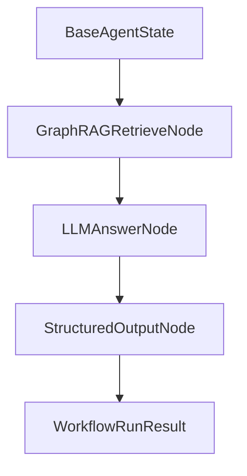

# GraphRAG AI Agent 공통 프레임워크 Agent Workflow Factory 구현 결과

## 1. 문서 개요

본 문서는 `250.구현` 단계의 `6.7 Agent Workflow Factory 구현` 결과를 정리한다. LangGraph 실제 의존성을 붙이기 전에도 공통 Agent Workflow를 테스트하고 재사용할 수 있도록 dependency-free workflow runner, GraphRAG 검색 노드 연계, LLM Answer Node 골격, Structured Output Node를 구현하였다.

## 2. 구현 범위

| 구성요소 | 파일 | 구현 내용 |
|---|---|---|
| WorkflowDefinition | `workflow_factory.py` | entry/finish/edge/stop_on_error 정의 |
| CompiledWorkflow | `workflow_factory.py` | async node 실행, next_node routing, error stop |
| WorkflowRunResult | `workflow_factory.py` | 실행 상태, 최종 state, 실행 node 목록 |
| GraphRAGRetrieveNode | `graphrag_retrieve_node.py` | retrieval 결과, context, evidence, citations state 주입 |
| LLMAnswerNode | `llm_answer_node.py` | LLM provider 주입형 answer node 골격 |
| StructuredOutputNode | `structured_output_node.py` | answer/retrieval/evidence를 안정적 output envelope로 정리 |
| 테스트 | `tests/test_agent_workflow.py` | retrieve-answer-format workflow 실행 및 오류 중단 테스트 |

## 3. Workflow 실행 흐름



## 4. 주요 설계

| 항목 | 내용 |
|---|---|
| 실행 방식 | async callable node를 순차 실행 |
| Routing | `state.next_node`, edge, node list 순서 순으로 다음 node 결정 |
| 오류 처리 | `state.error` 존재 시 `stop_on_error=True`이면 workflow 중단 |
| LLM 연동 | `AnswerProvider` callable 주입 방식 |
| LangGraph 전환 | node callable/state contract를 유지하여 후속 LangGraph compile로 확장 가능 |

## 5. 테스트 결과

| 테스트 | 결과 |
|---|---|
| Retrieve -> Answer -> Structured Output workflow 실행 | 통과 |
| Retrieve 오류 발생 시 workflow 중단 | 통과 |
| 기존 GraphRAG/RAG/Vector/Graph/Extractor/Hybrid 테스트 | 통과 |
| `compileall` 문법 검증 | 통과 |

## 6. 후속 작업

다음 작업은 WBS 기준 `6.8 관리자 사이트 MVP 구현 및 구현 결과 정리`이다.

권장 요청 형식:

```text
[Backend Engineer/Frontend Engineer] 250.구현 단계의 관리자 사이트 MVP를 구현해 주세요. Source 등록/조회, IndexJob 실행/상태, GraphRAG 검색 테스트 API/화면 골격과 테스트를 포함해 주세요.
```

## 7. 변경 이력

| 버전 | 일자 | 변경 내용 | 작성자 |
|---|---|---|---|
| v0.1 | 2026-06-21 | Agent Workflow Factory 기본 구현 | Backend Engineer/AI Engineer |

