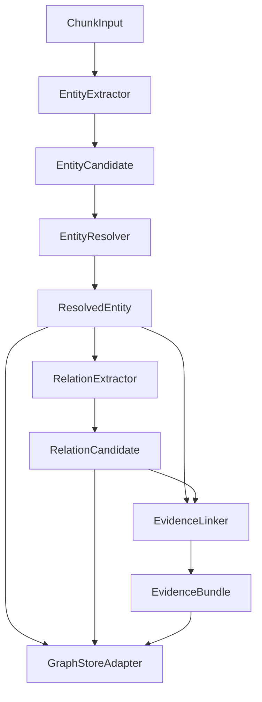

# GraphRAG AI Agent 공통 프레임워크 Entity/Relation Extractor 구현 결과

## 1. 문서 개요

본 문서는 `250.구현` 단계의 `6.5 Entity/Relation Extractor 구현` 결과를 정리한다. Sol-Bat 도메인 스키마 기반으로 rule 기반 Entity 추출을 고도화하고, `EntityResolver`, `RelationExtractor`, `EvidenceLinker`를 보강하여 Chunk에서 Graph Store 저장 가능한 Entity/Relation/Evidence 흐름을 구성하였다.

## 2. 구현 범위

| 구성요소 | 파일 | 구현 내용 |
|---|---|---|
| Sol-Bat Domain Schema | `schema_registry.py` | 한국어/영어 alias 보강 |
| EntityExtractor | `entity_extractor.py` | dictionary 기반 term matching, 한글/영문 term pattern, confidence 산정 |
| EntityResolver | `entity_resolver.py` | domain/type/normalized_name/alias 기반 canonical entity 병합 |
| RelationExtractor | `relation_extractor.py` | relation keyword rule, schema-valid pair 검증, confidence/rationale 생성 |
| EvidenceLinker | `evidence_linker.py` | entity mention 주변 quote 생성, target_id/ref 보강 |
| 테스트 | `tests/test_extractors.py` | Sol-Bat entity/relation/evidence end-to-end 테스트 |

## 3. 처리 흐름



## 4. 주요 구현 내용

### 4.1 EntityExtractor

| 항목 | 내용 |
|---|---|
| 입력 | `ChunkInput`, `DomainSchema`, `EntityExtractionOptions` |
| 출력 | `list[EntityCandidate]` |
| 방식 | schema alias + options dictionary term matching |
| 보강 | 한글 term 부분 매칭, 영문 term word boundary 매칭 |
| Sol-Bat alias | 토마토, 고추, 하우스, 역병, 진딧물, 다습, 토양, 방제 등 |

### 4.2 EntityResolver

| 항목 | 내용 |
|---|---|
| 기준 | domain, entity_type, normalized_name |
| 병합 대상 | aliases, mention_texts, attributes, evidence_chunk_ids |
| 결과 | Graph Store 저장 전 canonical `ResolvedEntity` 목록 |

### 4.3 RelationExtractor

| Relation | Keyword 예시 |
|---|---|
| `AFFECTS` | 영향, 피해, 발생, 감염 |
| `CAUSES` | 유발, 원인, 증가 |
| `RECOMMENDS` | 권고, 추천, 필요 |
| `PREVENTS` | 예방, 방지, 억제 |
| `APPLIES_TO` | 적용, 대상 |

Relation은 DomainSchema의 source/target type 제약을 통과하고, 문장 내 relation keyword가 존재하는 경우 추출된다.

### 4.4 EvidenceLinker

Entity mention 위치를 기준으로 주변 quote를 생성하고, Entity/Relation 각각에 대해 `EvidenceLinkRecord`를 생성한다. Graph Store 저장 후 target 추적이 가능하도록 `target_id`, `target_ref`를 함께 채운다.

## 5. 테스트 결과

| 테스트 | 결과 |
|---|---|
| Sol-Bat 한국어 alias Entity 추출 | 통과 |
| EntityResolver 중복 entity 병합 | 통과 |
| RelationExtractor schema/keyword 기반 relation 추출 | 통과 |
| Extractor -> GraphStore -> Evidence flow | 통과 |
| `compileall` 문법 검증 | 통과 |

## 6. 후속 작업

다음 작업은 WBS 기준 `6.6 Hybrid Retriever 구현`이다.

권장 요청 형식:

```text
[GraphRAG Engineer/AI Engineer] 250.구현 단계의 Hybrid Retriever를 고도화해 주세요. VectorStore + GraphStore 결합 검색, score 병합, ContextAssembler 개선, RetrievalRun 테스트를 포함해 주세요.
```

## 7. 변경 이력

| 버전 | 일자 | 변경 내용 | 작성자 |
|---|---|---|---|
| v0.1 | 2026-06-21 | Entity/Relation Extractor 기본 구현 | GraphRAG Engineer/AI Engineer |

