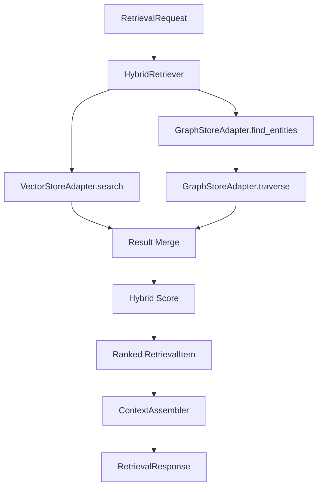

# GraphRAG AI Agent 공통 프레임워크 Hybrid Retriever 구현 결과

## 1. 문서 개요

본 문서는 `250.구현` 단계의 `6.6 Hybrid Retriever 구현` 결과를 정리한다. VectorStore와 GraphStore의 검색 결과를 결합하고, vector score, graph score, evidence score를 병합하여 Agent가 사용할 수 있는 evidence-aware context를 생성하도록 Hybrid Retriever를 고도화하였다.

## 2. 구현 범위

| 구성요소 | 파일 | 구현 내용 |
|---|---|---|
| HybridRetriever | `hybrid_retriever.py` | Vector/Graph 검색, result merge, score 병합, metrics 기록 |
| Scoring | `scoring.py` | score clamp, weight metadata 포함 |
| ContextAssembler | `context_assembler.py` | retrieval summary, citation metadata, relation/evidence context 보강 |
| 테스트 | `tests/test_hybrid_retriever.py` | hybrid/vector-only retrieval, score 병합 테스트 |

## 3. 처리 흐름



## 4. Score 계산

기본 score는 아래 가중치를 적용한다.

```text
final_score =
  vector_score * 0.60
  + graph_score * 0.25
  + evidence_score * 0.10
  + recency_score * 0.05
```

각 score는 `0.0 ~ 1.0` 범위로 정규화한다.

## 5. RetrievalResponse Metrics

| Metric | 설명 |
|---|---|
| `result_count` | 최종 반환 결과 수 |
| `vector_result_count` | VectorStore 검색 결과 수 |
| `graph_relation_count` | Graph traversal relation 수 |
| `evidence_count` | context에 포함된 evidence 수 |
| `strategy` | VECTOR_ONLY, GRAPH_ONLY, HYBRID |
| `latency_ms` | 검색 처리 시간 |

## 6. ContextAssembler 개선

| 항목 | 개선 내용 |
|---|---|
| Retrieval Summary | domain, item_count, evidence_count 표시 |
| Citation | chunk_id, evidence_id, relation_id, entity_id, score 포함 |
| Evidence matching | chunk_id 및 evidence_id 기반 evidence 연결 |
| Source 표시 | source, chunk, result_type, score 표시 |

## 7. 테스트 결과

| 테스트 | 결과 |
|---|---|
| VectorStore + GraphStore + Evidence 결합 검색 | 통과 |
| VECTOR_ONLY 검색 metrics | 통과 |
| Hybrid score normalize/weight 검증 | 통과 |
| 기존 GraphRAG/RAG/Vector/Graph/Extractor 테스트 | 통과 |
| `compileall` 문법 검증 | 통과 |

## 8. 후속 작업

다음 작업은 WBS 기준 `6.7 Agent Workflow Factory 구현`이다.

권장 요청 형식:

```text
[Backend Engineer/AI Engineer] 250.구현 단계의 Agent Workflow Factory를 구현해 주세요. WorkflowDefinition, GraphRAGRetrieveNode 연계, LLM Answer Node 골격, structured output node, workflow 실행 테스트를 포함해 주세요.
```

## 9. 변경 이력

| 버전 | 일자 | 변경 내용 | 작성자 |
|---|---|---|---|
| v0.1 | 2026-06-21 | Hybrid Retriever 고도화 | GraphRAG Engineer/AI Engineer |

