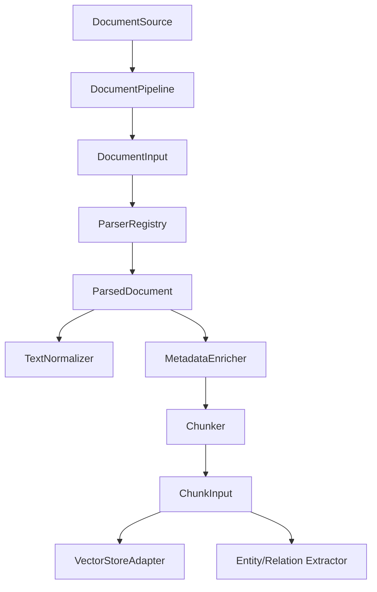

# GraphRAG AI Agent 공통 프레임워크 RAG Core 구현 결과

## 1. 문서 개요

본 문서는 `250.구현` 단계의 `6.2 RAG Core 구현` 결과를 정리한다. `Source` 자료를 표준 `Document`와 `Chunk`로 변환하고, 후속 `Vector Store`, `GraphRAG Extractor`, `Hybrid Retriever`가 공통으로 사용할 수 있는 기본 문서 처리 파이프라인을 구성하였다.

## 2. 구현 범위

| 구성요소 | 파일 | 구현 내용 |
|---|---|---|
| Document DTO | `src/common_core/ai_pipeline/document/schemas.py` | `DocumentSource`, `DocumentInput`, `ParsedDocument`, `DocumentParseResult`, `SourceType` |
| TextNormalizer | `normalizer.py` | Unicode NFC, CRLF 정규화, 제어문자 제거, 공백 정리 |
| ParserRegistry | `parser_registry.py` | SourceType별 Parser 등록/조회, text/markdown/json/csv 기본 Parser |
| Chunker | `chunker.py` | chunk size/overlap 기반 문서 분할, paragraph 우선 분할 |
| MetadataEnricher | `metadata_enricher.py` | source, domain, tenant, user, scope, version metadata 부여 |
| DocumentPipeline | `document_pipeline.py` | Source -> Document -> Chunk 처리, preview 지원 |
| 테스트 | `tests/test_document_pipeline.py` | Normalizer, Parser, Chunker, Pipeline metadata 검증 |

## 3. 패키지 구조

```text
src/common_core/ai_pipeline/document/
  __init__.py
  schemas.py
  normalizer.py
  parser_registry.py
  chunker.py
  metadata_enricher.py
  document_pipeline.py
```

## 4. 처리 흐름



## 5. 주요 결정사항

| 항목 | 결정 |
|---|---|
| 초기 Parser | `TEXT`, `MARKDOWN`, `JSON`, `CSV` 중심 |
| 파일 처리 | 초기에는 `source.content` 기반 처리, 실제 파일 로더는 후속 확장 |
| PDF/DOCX/XLSX | 외부 라이브러리 의존이 필요하므로 Parser 확장 지점만 제공 |
| Chunk 기본값 | `chunk_size=1000`, `chunk_overlap=100` |
| Metadata | Source 기준 metadata를 Document/Chunk에 일관 반영 |
| Preview | 관리자 사이트 Source Preview에서 사용할 `DocumentPipeline.preview()` 제공 |

## 6. 테스트 결과

| 테스트 | 결과 |
|---|---|
| TextNormalizer 공백/제어문자 정리 | 통과 |
| JSON Parser 처리 | 통과 |
| Chunker overlap 분할 | 통과 |
| DocumentPipeline metadata enrichment | 통과 |
| `compileall` 문법 검증 | 통과 |

## 7. 후속 작업

다음 작업은 WBS 기준 `6.3 VectorStoreFactory 개선`이다.

권장 요청 형식:

```text
[Backend Engineer/Data Engineer] 250.구현 단계의 VectorStoreFactory를 개선해 주세요. InMemoryVectorStore, FAISS/PGVector Adapter 골격, provider registry, search/add/delete 테스트를 포함해 주세요.
```

## 8. 변경 이력

| 버전 | 일자 | 변경 내용 | 작성자 |
|---|---|---|---|
| v0.1 | 2026-06-21 | RAG Core 기본 구현 | Backend Engineer/AI Engineer |

