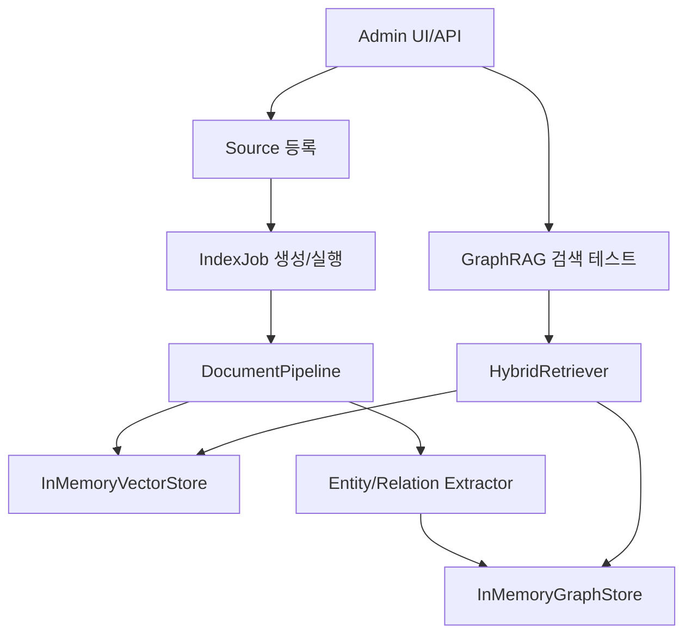

# GraphRAG AI Agent 공통 프레임워크 관리자 사이트 MVP 구현 결과

## 1. 문서 개요

본 문서는 `250.구현` 단계의 `6.8 관리자 사이트 MVP 구현 및 구현 결과 정리` 결과를 정리한다. Source 등록/조회/삭제, IndexJob 생성/실행/상태조회, GraphRAG 검색 테스트를 수행할 수 있는 dependency-free AdminService와 선택형 FastAPI Router 골격, 정적 관리자 화면 MVP를 구성하였다.

## 2. 구현 범위

| 구성요소 | 파일 | 구현 내용 |
|---|---|---|
| Admin DTO | `src/common_core/admin/schemas.py` | Source, IndexJob, SearchTest request/response |
| Admin Service | `src/common_core/admin/service.py` | Source 관리, IndexJob 동기 실행, GraphRAG 검색 테스트 |
| FastAPI Router 골격 | `src/common_core/admin/routers.py` | `/api/admin` endpoint 정의 |
| 관리자 화면 MVP | `src/common_core/admin/web/admin_mvp.html` | Source, IndexJob, Search Test 3개 영역 |
| 테스트 | `tests/test_admin_mvp.py` | Source 등록 -> IndexJob 실행 -> GraphRAG 검색 flow |

## 3. API 골격

| Method | Path | 기능 |
|---|---|---|
| `POST` | `/api/admin/sources` | Source 등록 |
| `GET` | `/api/admin/sources` | Source 목록 조회 |
| `GET` | `/api/admin/sources/{source_id}` | Source 상세/상태 조회 |
| `DELETE` | `/api/admin/sources/{source_id}` | Source 삭제 |
| `POST` | `/api/admin/index-jobs` | IndexJob 생성 |
| `POST` | `/api/admin/index-jobs/{job_id}/run` | IndexJob 실행 |
| `GET` | `/api/admin/index-jobs` | IndexJob 목록 조회 |
| `GET` | `/api/admin/index-jobs/{job_id}` | IndexJob 상태 조회 |
| `POST` | `/api/admin/retrieval-tests` | GraphRAG 검색 테스트 |

## 4. MVP 처리 흐름



## 5. 테스트 결과

| 테스트 | 결과 |
|---|---|
| Source 등록 -> IndexJob 실행 -> GraphRAG 검색 | 통과 |
| Source 삭제 후 목록 제외 | 통과 |
| 기존 GraphRAG/RAG/Vector/Graph/Extractor/Hybrid/Agent 테스트 | 통과 |
| `compileall` 문법 검증 | 통과 |

## 6. 후속 작업

다음 PM 작업은 `6.0 구현 단계 산출물 검토 및 확정` 또는 WBS 업데이트이다.

권장 요청 형식:

```text
[PM] 250.구현 단계 산출물 검토 및 확정 문서를 작성하고 WBS에 6.1~6.8 완료 상태를 반영해 주세요.
```

## 7. 변경 이력

| 버전 | 일자 | 변경 내용 | 작성자 |
|---|---|---|---|
| v0.1 | 2026-06-21 | 관리자 사이트 MVP 구현 | Backend Engineer/Frontend Engineer |

