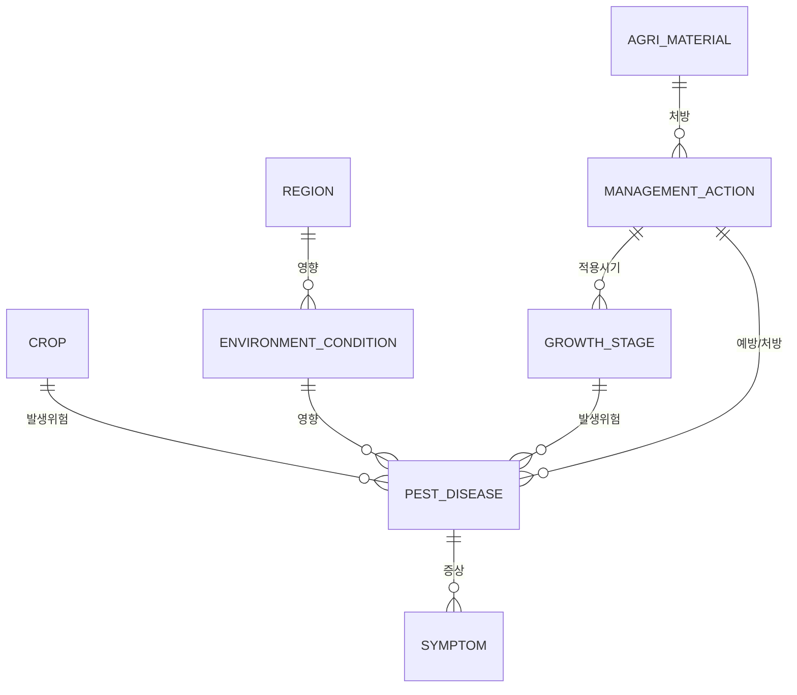

# GraphRAG AI Agent 공통 프레임워크 Sol-Bat 파일럿 도메인 스키마 정의서

## 1. 문서 개요

| 항목 | 내용 |
| --- | --- |
| 프로젝트 | GraphRAG AI Agent 공통 프레임워크 개발 |
| 단계 | 270.파일럿 적용 |
| WBS | 7.2 Sol-Bat 도메인 스키마 정의 |
| 담당 | Knowledge Engineer / GraphRAG Engineer |
| 대상 도메인 | Sol-Bat AI 농사 코치 |
| 작성 목적 | Sol-Bat 파일럿에서 GraphRAG Entity/Relation/Evidence 추출, GraphStore 저장, Hybrid Retrieval, Agent 근거 생성을 위한 도메인 스키마를 정의 |
| 작성일 | 2026-06-21 |

## 2. 스키마 정의 범위

본 문서는 Sol-Bat 1차 파일럿에서 사용할 GraphRAG 도메인 스키마를 정의한다. 적용 범위는 농업 지식 문서, 병해충/토양/기상 정보, 농사 코치 추천 문맥에 한정한다.

| 구분 | 포함 |
| --- | --- |
| Entity | 작물, 병해충, 증상, 환경조건, 관리작업, 농자재, 지역, 생육단계 |
| Relation | 발생위험, 예방, 처방, 영향, 적용시기 |
| Evidence | 문서 Chunk, 원문 인용, 출처 파일, 페이지/섹션 metadata |
| Retrieval | Entity/Relation/Evidence 기반 Hybrid Retrieval |

## 3. 도메인 개념 모델



## 4. Entity Type 정의

### 4.1 Entity 목록

| Entity Type | 한글명 | 설명 | 주요 속성 | 예시 |
| --- | --- | --- | --- | --- |
| `CROP` | 작물 | 재배 대상 작물 또는 품종 | crop_name, variety, crop_group | 토마토, 고추, 딸기, 마늘, 배추 |
| `PEST_DISEASE` | 병해충 | 작물에 피해를 주는 병, 해충, 생리장해 | category, severity, npms_code | 역병, 흰가루병, 진딧물, 총채벌레 |
| `SYMPTOM` | 증상 | 병해충 또는 환경 이상으로 관찰되는 현상 | symptom_type, affected_part | 잎마름, 반점, 시듦, 황화, 과실 부패 |
| `ENVIRONMENT_CONDITION` | 환경조건 | 병해충/생육에 영향을 주는 기상·토양 조건 | condition_type, value, unit, threshold | 고온, 다습, 강우, pH 5.5, 배수불량 |
| `MANAGEMENT_ACTION` | 관리작업 | 예방, 방제, 관수, 시비, 환기 등 농작업 | action_type, timing, frequency | 방제, 관수, 배수로 정비, 환기, 웃거름 |
| `AGRI_MATERIAL` | 농자재 | 농작업에 투입되는 약제, 비료, 자재 | material_type, active_ingredient, dosage | 살균제, 살충제, 석회, 퇴비, 멀칭필름 |
| `REGION` | 지역 | 농장, 행정구역, 기상/토양 조회 위치 | region_name, bcode, pnu, nx, ny | 전라남도 고흥군, 강진군, 경기도 여주 |
| `GROWTH_STAGE` | 생육단계 | 작물의 생육 또는 재배 단계 | stage_order, stage_group | 정식기, 생육기, 개화기, 착과기, 수확기 |

### 4.2 Entity 별칭 사전

| Entity Type | 별칭/동의어 |
| --- | --- |
| `CROP` | 작물, 재배작물, 농작물, 토마토, 고추, 딸기, 마늘, 양파, 배추, 상추, 오이, 참외 |
| `PEST_DISEASE` | 병해충, 병, 해충, 질병, 역병, 탄저병, 흰가루병, 잿빛곰팡이병, 진딧물, 응애, 총채벌레 |
| `SYMPTOM` | 증상, 피해증상, 병징, 반점, 갈변, 황화, 위조, 시듦, 잎마름, 낙화, 낙과 |
| `ENVIRONMENT_CONDITION` | 환경, 기상, 날씨, 토양, 고온, 저온, 다습, 건조, 강우, 습도, 온도, pH, 배수 |
| `MANAGEMENT_ACTION` | 관리, 작업, 조치, 방제, 예방, 처방, 관수, 시비, 환기, 전정, 제거, 예찰 |
| `AGRI_MATERIAL` | 농자재, 약제, 농약, 살균제, 살충제, 비료, 퇴비, 석회, 유기물, 멀칭 |
| `REGION` | 지역, 농장, 위치, 주소, 시군구, 읍면동, 전라남도, 경기도, 강진군, 고흥군 |
| `GROWTH_STAGE` | 생육단계, 재배단계, 정식기, 활착기, 생육기, 개화기, 착과기, 비대기, 수확기 |

## 5. Relation Type 정의

### 5.1 Relation 목록

| Relation Type | 한글명 | Source Entity | Target Entity | 설명 |
| --- | --- | --- | --- | --- |
| `HAS_RISK_OF` | 발생위험 | `CROP`, `GROWTH_STAGE`, `REGION` | `PEST_DISEASE` | 특정 작물/생육단계/지역에서 병해충 발생 위험이 있음 |
| `PREVENTS` | 예방 | `MANAGEMENT_ACTION`, `AGRI_MATERIAL` | `PEST_DISEASE`, `SYMPTOM` | 관리작업 또는 농자재가 병해충/증상을 예방함 |
| `TREATS` | 처방 | `MANAGEMENT_ACTION`, `AGRI_MATERIAL` | `PEST_DISEASE`, `SYMPTOM` | 발생한 병해충/증상에 대한 처방 또는 대응 |
| `AFFECTS` | 영향 | `ENVIRONMENT_CONDITION`, `PEST_DISEASE` | `CROP`, `PEST_DISEASE`, `SYMPTOM` | 환경조건 또는 병해충이 작물/증상/병해충에 영향을 줌 |
| `APPLIES_AT` | 적용시기 | `MANAGEMENT_ACTION`, `AGRI_MATERIAL` | `GROWTH_STAGE`, `ENVIRONMENT_CONDITION` | 관리작업 또는 농자재의 적용 시기/조건 |

### 5.2 Relation 추출 키워드

| Relation Type | 키워드 |
| --- | --- |
| `HAS_RISK_OF` | 발생, 위험, 주의, 경보, 예찰, 감염, 번식, 유행, 피해 가능 |
| `PREVENTS` | 예방, 방지, 억제, 차단, 사전 방제, 발생 전, 관리 필요 |
| `TREATS` | 처방, 방제, 살포, 처리, 제거, 대응, 조치, 치료 |
| `AFFECTS` | 영향, 유발, 원인, 증가, 감소, 악화, 촉진, 피해, 관련 |
| `APPLIES_AT` | 시기, 단계, 때, 전, 후, 동안, 정식기, 개화기, 수확기, 고온 시, 강우 후 |

## 6. 스키마 JSON 초안

```json
{
  "domain": "sol_bat",
  "version": "1.1.0-pilot",
  "entity_types": [
    {
      "type": "CROP",
      "description": "재배 대상 작물 또는 품종",
      "aliases": ["작물", "재배작물", "토마토", "고추", "딸기", "마늘", "배추", "상추", "오이"]
    },
    {
      "type": "PEST_DISEASE",
      "description": "작물에 피해를 주는 병, 해충, 생리장해",
      "aliases": ["병해충", "병", "해충", "역병", "탄저병", "흰가루병", "진딧물", "응애", "총채벌레"]
    },
    {
      "type": "SYMPTOM",
      "description": "병해충 또는 환경 이상으로 관찰되는 현상",
      "aliases": ["증상", "병징", "반점", "갈변", "황화", "시듦", "잎마름", "낙과"]
    },
    {
      "type": "ENVIRONMENT_CONDITION",
      "description": "병해충과 생육에 영향을 주는 기상 또는 토양 조건",
      "aliases": ["환경", "기상", "토양", "고온", "저온", "다습", "건조", "강우", "습도", "온도", "pH", "배수"]
    },
    {
      "type": "MANAGEMENT_ACTION",
      "description": "예방, 방제, 관수, 시비, 환기 등 농작업",
      "aliases": ["관리", "작업", "방제", "예방", "처방", "관수", "시비", "환기", "전정", "제거", "예찰"]
    },
    {
      "type": "AGRI_MATERIAL",
      "description": "농작업에 투입되는 약제, 비료, 자재",
      "aliases": ["농자재", "약제", "농약", "살균제", "살충제", "비료", "퇴비", "석회", "유기물", "멀칭"]
    },
    {
      "type": "REGION",
      "description": "농장, 행정구역, 기상/토양 조회 위치",
      "aliases": ["지역", "농장", "위치", "주소", "전라남도", "경기도", "강진군", "고흥군"]
    },
    {
      "type": "GROWTH_STAGE",
      "description": "작물의 생육 또는 재배 단계",
      "aliases": ["생육단계", "재배단계", "정식기", "활착기", "생육기", "개화기", "착과기", "비대기", "수확기"]
    }
  ],
  "relation_types": [
    {
      "type": "HAS_RISK_OF",
      "description": "특정 작물/생육단계/지역에서 병해충 발생 위험이 있음",
      "source_types": ["CROP", "GROWTH_STAGE", "REGION"],
      "target_types": ["PEST_DISEASE"]
    },
    {
      "type": "PREVENTS",
      "description": "관리작업 또는 농자재가 병해충/증상을 예방함",
      "source_types": ["MANAGEMENT_ACTION", "AGRI_MATERIAL"],
      "target_types": ["PEST_DISEASE", "SYMPTOM"]
    },
    {
      "type": "TREATS",
      "description": "발생한 병해충/증상에 대한 처방 또는 대응",
      "source_types": ["MANAGEMENT_ACTION", "AGRI_MATERIAL"],
      "target_types": ["PEST_DISEASE", "SYMPTOM"]
    },
    {
      "type": "AFFECTS",
      "description": "환경조건 또는 병해충이 작물/증상/병해충에 영향을 줌",
      "source_types": ["ENVIRONMENT_CONDITION", "PEST_DISEASE"],
      "target_types": ["CROP", "PEST_DISEASE", "SYMPTOM"]
    },
    {
      "type": "APPLIES_AT",
      "description": "관리작업 또는 농자재의 적용 시기/조건",
      "source_types": ["MANAGEMENT_ACTION", "AGRI_MATERIAL"],
      "target_types": ["GROWTH_STAGE", "ENVIRONMENT_CONDITION"]
    }
  ]
}
```

## 7. Entity/Relation 추출 예시

### 7.1 예시 문장 1

> 토마토 개화기에는 다습한 환경에서 잿빛곰팡이병 발생 위험이 증가하므로 환기와 예방 방제를 실시한다.

| 추출 유형 | 결과 |
| --- | --- |
| Entity | `토마토/CROP`, `개화기/GROWTH_STAGE`, `다습/ENVIRONMENT_CONDITION`, `잿빛곰팡이병/PEST_DISEASE`, `환기/MANAGEMENT_ACTION`, `예방 방제/MANAGEMENT_ACTION` |
| Relation | `토마토 HAS_RISK_OF 잿빛곰팡이병`, `개화기 HAS_RISK_OF 잿빛곰팡이병`, `다습 AFFECTS 잿빛곰팡이병`, `환기 PREVENTS 잿빛곰팡이병`, `예방 방제 PREVENTS 잿빛곰팡이병` |

### 7.2 예시 문장 2

> 강우 후 고추 탄저병이 확산될 수 있어 살균제를 살포하고 병든 과실을 제거한다.

| 추출 유형 | 결과 |
| --- | --- |
| Entity | `강우 후/ENVIRONMENT_CONDITION`, `고추/CROP`, `탄저병/PEST_DISEASE`, `살균제/AGRI_MATERIAL`, `살포/MANAGEMENT_ACTION`, `병든 과실/SYMPTOM`, `제거/MANAGEMENT_ACTION` |
| Relation | `고추 HAS_RISK_OF 탄저병`, `강우 후 AFFECTS 탄저병`, `살균제 TREATS 탄저병`, `살포 TREATS 탄저병`, `제거 TREATS 병든 과실` |

## 8. Evidence 연결 기준

| Evidence 항목 | 정의 |
| --- | --- |
| evidence_type | `CHUNK`, `SENTENCE`, `TABLE_ROW`, `API_RESPONSE` |
| quote_text | Entity/Relation을 뒷받침하는 원문 문장 또는 표 행 |
| source_id | Source 등록 ID |
| document_id | 원본 문서 ID |
| chunk_id | Chunk ID |
| metadata | filename, page, section, row, source_url, created_at |

EvidenceLink 기준:

| target_type | 연결 대상 |
| --- | --- |
| `ENTITY` | 추출된 Entity 후보 또는 Resolve된 Entity |
| `RELATION` | 추출된 RelationCandidate |
| `ANSWER` | Agent 답변 또는 추천 작업 |

## 9. Sol-Bat 기존 기능과 매핑

| Sol-Bat 기능 | GraphRAG 스키마 매핑 |
| --- | --- |
| `target_crops` | `CROP` |
| `growth_stage` | `GROWTH_STAGE` |
| `weather_context` | `ENVIRONMENT_CONDITION` |
| `soil_context` | `ENVIRONMENT_CONDITION` |
| `detected_risks` | `PEST_DISEASE`, `SYMPTOM`, `HAS_RISK_OF` |
| `recommended_actions` | `MANAGEMENT_ACTION`, `PREVENTS`, `TREATS`, `APPLIES_AT` |
| `pest_context` | `PEST_DISEASE`, `HAS_RISK_OF`, `AFFECTS` |
| `knowledge_context` | `Evidence`, `Chunk`, `Relation` |

## 10. 검증 질의 세트

| 질의 ID | 질의 | 기대 Entity | 기대 Relation |
| --- | --- | --- | --- |
| Q-01 | 토마토 다습 환경에서 주의할 병해는? | CROP, ENVIRONMENT_CONDITION, PEST_DISEASE | HAS_RISK_OF, AFFECTS |
| Q-02 | 고추 탄저병은 강우 후 어떻게 관리해야 하나요? | CROP, PEST_DISEASE, ENVIRONMENT_CONDITION, MANAGEMENT_ACTION | AFFECTS, TREATS |
| Q-03 | 개화기에는 어떤 방제 작업이 필요한가요? | GROWTH_STAGE, MANAGEMENT_ACTION, PEST_DISEASE | APPLIES_AT, PREVENTS |
| Q-04 | 토양 pH가 낮을 때 어떤 농자재를 써야 하나요? | ENVIRONMENT_CONDITION, AGRI_MATERIAL, MANAGEMENT_ACTION | TREATS, APPLIES_AT |
| Q-05 | 진딧물 예방을 위한 관리작업은 무엇인가요? | PEST_DISEASE, MANAGEMENT_ACTION | PREVENTS |

## 11. 구현 반영 기준

| 대상 | 반영 기준 |
| --- | --- |
| `SchemaRegistry.with_defaults()` | 현재 `sol_bat` 기본 스키마를 본 문서의 Entity/Relation 기준으로 갱신 |
| `EntityExtractor` | Entity 별칭 사전과 도메인 dictionary 확장 |
| `RelationExtractor` | Relation keyword_rules를 본 문서의 키워드 기준으로 갱신 |
| `HybridRetriever` | Relation type별 score 보정 후보 검토 |
| 관리자 Preview | Entity/Relation/Evidence count와 상세 내용 확인 |
| Agent 연계 | Evidence quote와 Relation path를 `knowledge_context` 또는 별도 `graphrag_context`에 반영 |

## 12. 완료 기준

| 기준 | 설명 |
| --- | --- |
| 스키마 완성 | 8개 Entity Type, 5개 Relation Type 정의 완료 |
| 예시 검증 | 예시 문장 2건 이상 Entity/Relation 추출 기준 제시 |
| Sol-Bat 매핑 | 기존 Agent state/RAG field와 GraphRAG 스키마 매핑 완료 |
| 다음 단계 준비 | 7.3 GraphRAG 검색 노드 적용 시 코드 반영 기준 제공 |

## 13. 다음 작업

다음 작업은 WBS 기준 `7.3 GraphRAG 검색 노드 적용`이다.

권장 요청 문구:

```text
[GraphRAG Engineer/Backend Engineer] 270.파일럿 적용 단계의 Sol-Bat GraphRAG 검색 노드 적용 결과서를 작성하고 PoC 소스를 구성해 주세요. SchemaRegistry sol_bat 스키마 보완, Source 인덱싱 샘플, HybridRetriever 검색, retrieve_knowledge 연계 방안을 포함해 주세요.
```
