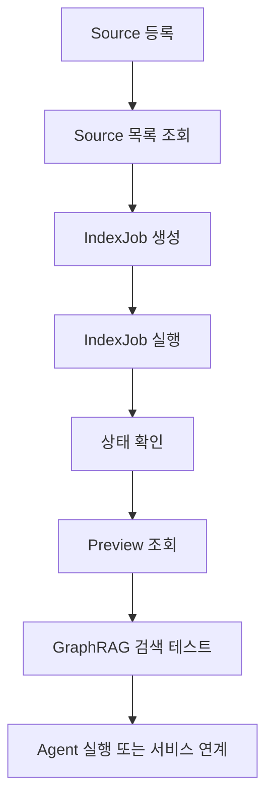

# GraphRAG AI Agent 공통 프레임워크 사용자매뉴얼

## 1. 문서 개요

| 항목 | 내용 |
| --- | --- |
| 프로젝트 | GraphRAG AI Agent 공통 프레임워크 개발 |
| 단계 | 290.이행 |
| WBS | 9.1 사용자매뉴얼 작성 |
| 담당 | Technical Writer / 개발자 |
| 작성 목적 | 관리자 사이트와 GraphRAG/Agent 공통 기능의 기본 사용 절차 안내 |
| 작성일 | 2026-06-21 |

## 2. 사용 대상

| 사용자 | 주요 사용 기능 |
| --- | --- |
| 관리자 | Source 등록/조회/삭제, IndexJob 실행/상태 확인, Preview 조회, GraphRAG 검색 테스트 |
| 운영자 | IndexJob 상태 모니터링, 실패 원인 확인, 재실행 요청 |
| 개발자 | 관리자 API 연동, GraphRAG 검색 테스트, Agent Workflow 실행 연계 |
| 도메인 담당자 | Source 내용 확인, Preview 결과 확인, 검색 결과의 Evidence/Citation 검토 |

## 3. 사용 전 준비사항

### 3.1 기본 저장소 위치

| 구분 | 경로 |
| --- | --- |
| 프로젝트 루트 | `D:\Dev\codex\GitHub\GraphRAG-AI-Agnet` |
| 관리자 화면 | `src/common_core/admin/web/admin_mvp.html` |
| 관리자 API Router | `src/common_core/admin/routers.py` |
| 관리자 Service | `src/common_core/admin/service.py` |
| 관리자 DTO | `src/common_core/admin/schemas.py` |
| Agent Workflow | `src/common_core/agents` |

### 3.2 테스트 검증 상태

본 매뉴얼 작성 시점의 자동화 테스트 결과는 다음과 같다.

```text
pytest 9.1.1
32 passed
```

### 3.3 관리자 사이트 사용 방식

현재 관리자 사이트 MVP는 정적 HTML 화면과 Python service/API 골격으로 구성되어 있다.

- 화면 확인: `src/common_core/admin/web/admin_mvp.html`
- API Prefix: `/api/admin`
- 구현된 관리자 API: Source, IndexJob, Preview, Retrieval Test
- Agent 실행 API: 설계 산출물 기준 `/api/agents/{agent_id}/runs`, 현재 구현은 WorkflowFactory 기반 공통 모듈 연계 중심

## 4. 전체 업무 흐름

관리자 사이트의 기본 사용 흐름은 다음과 같다.



## 5. Source 등록

### 5.1 목적

Source 등록은 GraphRAG 인덱싱 대상 자료를 시스템에 등록하는 기능이다. 등록된 Source는 IndexJob을 통해 Document, Chunk, Entity, Relation, Evidence로 처리된다.

### 5.2 화면 사용 절차

1. 관리자 화면에서 `Source 등록` 영역을 확인한다.
2. `Domain`에 사용할 도메인 값을 입력한다.
   예: `sol_bat`
3. `Name`에 Source 이름을 입력한다.
   예: `토마토 병해충 예방 가이드`
4. `Content`에 인덱싱할 본문 내용을 입력한다.
5. 필요한 경우 `Tags`, `Scope`, `Metadata`를 입력한다.
6. `Source 등록` 버튼을 선택한다.
7. 등록 완료 후 Source 목록에 신규 Source가 표시되는지 확인한다.

### 5.3 API 사용 절차

```http
POST /api/admin/sources
```

요청 예시는 다음과 같다.

```json
{
  "domain": "sol_bat",
  "source_type": "TEXT",
  "name": "tomato disease guide",
  "content": "Tomato disease prevention guide. Humid weather can cause disease.",
  "metadata": {
    "category": "disease",
    "owner": "domain-team"
  },
  "scope": "GLOBAL",
  "tags": ["pilot", "sol-bat"],
  "auto_run_index": false
}
```

정상 응답의 주요 확인 항목은 다음과 같다.

| 항목 | 설명 |
| --- | --- |
| `source_id` | 등록된 Source 식별자 |
| `domain` | Source 도메인 |
| `status` | 최초 등록 시 `REGISTERED` |
| `chunk_count` | 최초 등록 시 0 |
| `last_job_id` | 자동 인덱싱 실행 전에는 비어 있을 수 있음 |

## 6. Source 조회

### 6.1 Source 목록 조회

화면에서 `Source 목록` 영역을 확인하거나 다음 API를 호출한다.

```http
GET /api/admin/sources
```

목록에서 확인할 항목은 다음과 같다.

| 항목 | 확인 내용 |
| --- | --- |
| Source ID | IndexJob 실행과 Preview 조회에 사용 |
| Name | 등록한 자료명 |
| Domain | 검색/인덱싱 도메인 |
| Status | `REGISTERED`, `INDEXING`, `INDEXED`, `FAILED`, `DELETED` |
| Chunk/Entity/Relation/Evidence Count | 인덱싱 결과 건수 |
| Last Job ID | 마지막 IndexJob 식별자 |

### 6.2 Source 상세 조회

```http
GET /api/admin/sources/{source_id}
```

상세 조회에서는 Source 상태, 태그, 메타데이터, 인덱싱 결과 건수를 확인한다.

## 7. Source 삭제

### 7.1 화면 사용 절차

1. Source 목록에서 삭제할 Source를 확인한다.
2. 삭제 대상의 Source ID와 이름이 맞는지 확인한다.
3. 삭제 버튼 또는 삭제 API를 실행한다.
4. 목록에서 삭제된 Source가 더 이상 표시되지 않는지 확인한다.

### 7.2 API 사용 절차

```http
DELETE /api/admin/sources/{source_id}
```

정상 처리 시 Source 상태는 `DELETED`로 변경되며, 일반 목록 조회에서는 제외된다.

### 7.3 주의사항

- 삭제된 Source의 Chunk, Entity, Relation, Evidence 검색 노출 정책은 저장소 구현 정책에 따른다.
- 운영 환경에서는 삭제 전 영향 Source, 연결 Evidence, Agent 검색 결과 영향도를 확인해야 한다.
- 중요한 도메인 자료는 삭제보다 비활성화 정책을 우선 검토한다.

## 8. IndexJob 실행

### 8.1 목적

IndexJob은 등록된 Source를 GraphRAG 검색에 사용할 수 있도록 처리하는 작업이다.

IndexJob의 주요 처리 단계는 다음과 같다.

| 단계 | 설명 |
| --- | --- |
| Source Load | Source 본문과 메타데이터 로드 |
| Parse | Source Type에 맞는 문서 파싱 |
| Normalize | 텍스트 정규화 |
| Chunk | 검색 단위 Chunk 생성 |
| Metadata Enrich | Source/Document/Chunk 메타데이터 보강 |
| Vector Write | VectorStore에 Chunk 저장 |
| Entity Extract | Entity 후보 추출 |
| Relation Extract | Entity 간 Relation 추출 |
| Evidence Link | Relation과 Chunk/Evidence 연결 |
| Finalize | Source 상태 및 Job 결과 정리 |

### 8.2 IndexJob 생성

```http
POST /api/admin/index-jobs
```

요청 예시는 다음과 같다.

```json
{
  "source_id": "source-001",
  "job_type": "INDEX",
  "options": {
    "strategy": "FULL"
  }
}
```

정상 응답에서 `job_id`, `status`, `step`을 확인한다.

### 8.3 IndexJob 실행

```http
POST /api/admin/index-jobs/{job_id}/run
```

실행 후 상태는 일반적으로 `RUNNING`을 거쳐 `COMPLETED` 또는 `FAILED`로 변경된다.

## 9. IndexJob 상태 확인

### 9.1 목록 조회

```http
GET /api/admin/index-jobs
```

### 9.2 상세 조회

```http
GET /api/admin/index-jobs/{job_id}
```

상세 조회에서 확인할 항목은 다음과 같다.

| 항목 | 설명 |
| --- | --- |
| `status` | `PENDING`, `RUNNING`, `COMPLETED`, `FAILED`, `CANCELLED` |
| `step` | 현재 또는 최종 처리 단계 |
| `steps` | 단계별 처리 이력 |
| `metrics.chunk_count` | 생성된 Chunk 수 |
| `metrics.entity_count` | 추출된 Entity 수 |
| `metrics.relation_count` | 추출된 Relation 수 |
| `metrics.evidence_count` | 연결된 Evidence 수 |
| `error` | 실패 시 오류 코드와 메시지 |

### 9.3 실패 Job 재실행

```http
POST /api/admin/index-jobs/{job_id}/retry
```

재실행 전 확인 사항은 다음과 같다.

- Source content가 비어 있지 않은지 확인한다.
- domain 값이 SchemaRegistry에 등록되어 있는지 확인한다.
- 동일 Source에 대해 중복 실행 중인 Job이 없는지 확인한다.
- 오류가 반복되면 `steps`의 실패 단계와 `error` 내용을 개발자에게 전달한다.

## 10. Preview 조회

### 10.1 목적

Preview는 IndexJob 처리 결과를 관리자와 도메인 담당자가 검토하기 위한 기능이다. Chunk, Entity, Relation, Evidence가 예상대로 생성되었는지 확인한다.

### 10.2 화면 사용 절차

1. Source 목록에서 `INDEXED` 상태의 Source ID를 확인한다.
2. `GraphRAG Preview` 영역에 Source ID를 입력한다.
3. `Preview 조회` 버튼을 선택한다.
4. Chunk, Entity, Relation, Evidence 목록과 metrics를 확인한다.

### 10.3 API 사용 절차

```http
GET /api/admin/sources/{source_id}/preview?limit=20
```

정상 응답의 주요 구성은 다음과 같다.

| 항목 | 설명 |
| --- | --- |
| `chunks` | 검색 단위로 분할된 본문 |
| `entities` | 추출/정규화된 Entity |
| `relations` | Entity 간 관계 |
| `evidence` | Relation 또는 검색 결과의 근거 |
| `metrics` | 생성 건수 요약 |

### 10.4 검토 기준

| 항목 | 정상 기준 |
| --- | --- |
| Chunk | 원문이 누락 없이 적절한 크기로 분할됨 |
| Entity | 도메인 핵심 개념이 추출됨 |
| Relation | Entity 간 의미 있는 관계가 생성됨 |
| Evidence | Relation 또는 답변 근거로 사용할 문장이 연결됨 |
| Metrics | Source 상세의 count와 Preview 건수가 크게 어긋나지 않음 |

## 11. GraphRAG 검색 테스트

### 11.1 목적

GraphRAG 검색 테스트는 인덱싱된 Source가 실제 질의에 대해 Vector 검색, Graph 검색, Evidence 기반 결과를 제공하는지 확인하는 기능이다.

### 11.2 화면 사용 절차

1. `GraphRAG 검색 테스트` 영역을 확인한다.
2. `Domain`에 검색 대상 도메인을 입력한다.
   예: `sol_bat`
3. `Query`에 질의문을 입력한다.
   예: `토마토 다습 환경 병해충 예방 방법`
4. 필요 시 `Source Filter`에 Source ID를 입력한다.
5. `Strategy`는 기본 `HYBRID`를 사용한다.
6. `Top K`는 기본 5로 두고, 필요 시 조정한다.
7. 검색 실행 후 결과 상태, score, evidence, citation을 확인한다.

### 11.3 API 사용 절차

```http
POST /api/admin/retrieval-tests
```

요청 예시는 다음과 같다.

```json
{
  "domain": "sol_bat",
  "query": "tomato disease prevention",
  "top_k": 5,
  "strategy": "HYBRID",
  "filters": {
    "source_id": "source-001"
  },
  "vector_weight": 0.6,
  "graph_weight": 0.4,
  "include_evidence": true
}
```

### 11.4 결과 확인 기준

| 항목 | 설명 |
| --- | --- |
| `status` | 검색 결과가 있으면 `HIT`, 없으면 `MISS` |
| `results` | 검색 결과 목록 |
| `score` | vector score와 graph score가 반영된 최종 점수 |
| `evidence` | 답변 근거로 사용할 수 있는 원문 조각 |
| `citations` | Source/Chunk 기반 출처 정보 |
| `metrics.result_count` | 반환된 결과 수 |

### 11.5 검색 품질 확인 포인트

- 상위 결과가 질의 의도와 맞는지 확인한다.
- Evidence가 실제 원문에 존재하는지 확인한다.
- Source Filter 적용 시 지정 Source의 결과만 반환되는지 확인한다.
- 질의어가 한글/영문 혼합인 경우에도 관련 결과가 반환되는지 확인한다.
- 검색 결과가 없을 때는 Source가 `INDEXED` 상태인지 먼저 확인한다.

## 12. Agent 실행

### 12.1 현재 제공 방식

Agent 실행은 설계 API와 공통 Agent Workflow 모듈을 기준으로 제공한다.

| 구분 | 상태 |
| --- | --- |
| 설계 API | `/api/agents/{agent_id}/runs`, `/api/agents/{agent_id}/runs/{agent_run_id}` 정의 |
| 구현 모듈 | `WorkflowFactory`, `GraphRAGRetrieveNode`, `LLMAnswerNode`, `StructuredOutputNode` |
| 관리자 MVP 화면 | Agent 실행 화면은 후속 보완 대상 |
| 검증 테스트 | `tests/test_agent_workflow.py` 기준 workflow 실행 검증 완료 |

### 12.2 API 기준 실행 절차

Agent 실행 요청은 다음 API 계약을 기준으로 한다.

```http
POST /api/agents/{agent_id}/runs
```

요청 예시는 다음과 같다.

```json
{
  "domain": "sol_bat",
  "input_text": "토마토 재배 중 다습한 날씨에 병해충 예방 방법을 알려줘",
  "retrieval_options": {
    "strategy": "HYBRID",
    "top_k": 5,
    "filters": {
      "source_id": "source-001"
    }
  },
  "output_schema": {
    "type": "advice",
    "include_citations": true
  }
}
```

정상 응답에서는 다음 항목을 확인한다.

| 항목 | 설명 |
| --- | --- |
| `agent_run_id` | Agent 실행 식별자 |
| `agent_id` | 실행 Agent ID |
| `status` | `PENDING`, `RUNNING`, `SUCCEEDED`, `FAILED`, `CANCELED` |
| `retrieval_run_id` | GraphRAG 검색 실행 이력 |

### 12.3 Agent 실행 결과 조회

```http
GET /api/agents/{agent_id}/runs/{agent_run_id}
```

결과 조회 시 확인할 항목은 다음과 같다.

| 항목 | 설명 |
| --- | --- |
| `input_text` | 사용자 입력 |
| `final_output` | Agent 최종 응답 |
| `retrieval` | GraphRAG 검색 상태와 결과 |
| `evidence` | 응답 근거 |
| `citations` | 출처 정보 |
| `error` | 실패 시 오류 정보 |

### 12.4 개발자 기준 Workflow 실행 절차

개발 환경에서는 `WorkflowFactory`를 사용해 Agent 실행 흐름을 구성할 수 있다.

```python
import asyncio

from common_core.agents import WorkflowDefinition, WorkflowFactory
from common_core.agents.nodes import GraphRAGRetrieveNode, LLMAnswerNode, StructuredOutputNode

factory = WorkflowFactory()
factory.register_node("retrieve", GraphRAGRetrieveNode(retriever=retriever, default_domain="sol_bat"))
factory.register_node("answer", LLMAnswerNode())
factory.register_node("format", StructuredOutputNode())

workflow = factory.build(
    WorkflowDefinition(
        name="graphrag_agent",
        nodes=["retrieve", "answer", "format"],
        edges=[("retrieve", "answer"), ("answer", "format")],
        finish_nodes=["format"],
    )
)

result = asyncio.run(
    workflow.run(
        {
            "query": "토마토 병해충 예방 방법",
            "retrieval_options": {"strategy": "HYBRID", "top_k": 5},
            "roles": ["ADMIN"],
        }
    )
)
```

### 12.5 Agent 실행 확인 기준

| 항목 | 정상 기준 |
| --- | --- |
| Workflow 상태 | `COMPLETED` |
| 실행 노드 | `retrieve`, `answer`, `format` 순서로 실행 |
| Retrieval | `HIT` 상태와 검색 결과 포함 |
| Answer | 검색 context 기반 응답 생성 |
| Structured Output | 지정 schema 또는 기본 구조로 응답 정리 |
| Evidence/Citation | 근거와 출처가 최종 응답에 반영 |

## 13. 권한 및 보안 유의사항

| 기능 | 권장 권한 |
| --- | --- |
| Source 등록/삭제 | `ADMIN` 또는 자료 관리자 |
| Source 조회/Preview | `ADMIN`, 운영자, 도메인 담당자 |
| IndexJob 실행/재실행 | `ADMIN`, 운영자 |
| GraphRAG 검색 테스트 | `ADMIN`, 운영자, 허가된 도메인 담당자 |
| Agent 실행 | `ADMIN`, 서비스 사용자, 권한 있는 업무 사용자 |

운영 환경에서는 다음 사항을 지켜야 한다.

- API Key, DB Password, Token은 Source content 또는 metadata에 저장하지 않는다.
- tenant/user/scope가 있는 Source는 권한 범위 내에서만 조회한다.
- 삭제 작업은 감사 로그와 승인 절차를 거친다.
- Agent 답변은 Evidence와 Citation을 함께 확인한다.
- 민감정보가 포함된 자료는 별도 보안 분류와 접근 제어를 적용한다.

## 14. 오류 처리 가이드

| 상황 | 확인 사항 | 조치 |
| --- | --- | --- |
| Source 등록 실패 | 필수값 domain/name/content 누락 여부 | 입력값 보완 후 재등록 |
| Source 목록에 보이지 않음 | 삭제 상태 또는 scope 필터 여부 | 권한/상태 확인 |
| IndexJob 실패 | `steps`, `error`, Source content 확인 | 오류 수정 후 retry |
| Preview가 비어 있음 | Source가 `INDEXED` 상태인지 확인 | IndexJob 실행 또는 재실행 |
| 검색 결과 없음 | domain, query, source filter 확인 | Source 인덱싱 여부 확인 후 재검색 |
| Agent 실행 실패 | query, retrieval_options, 권한, retriever 구성 확인 | 오류 코드와 state를 개발자에게 전달 |

## 15. 운영 점검 체크리스트

| 점검 항목 | 확인 |
| --- | --- |
| Source 등록 후 목록에 표시되는가 |  |
| IndexJob이 `COMPLETED` 상태가 되었는가 |  |
| Preview에서 Chunk/Entity/Relation/Evidence가 확인되는가 |  |
| GraphRAG 검색 테스트 결과가 `HIT`로 반환되는가 |  |
| 검색 결과에 Evidence/Citation이 포함되는가 |  |
| Agent 실행 결과가 context 기반으로 생성되는가 |  |
| 실패 시 오류 메시지와 조치 방향이 확인되는가 |  |
| 삭제/재실행 등 영향 큰 작업은 승인 후 수행했는가 |  |

## 16. 자주 사용하는 API 요약

| 기능 | Method | URI |
| --- | --- | --- |
| Source 등록 | POST | `/api/admin/sources` |
| Source 목록 조회 | GET | `/api/admin/sources` |
| Source 상세 조회 | GET | `/api/admin/sources/{source_id}` |
| Source 삭제 | DELETE | `/api/admin/sources/{source_id}` |
| Source Preview 조회 | GET | `/api/admin/sources/{source_id}/preview` |
| IndexJob 생성 | POST | `/api/admin/index-jobs` |
| IndexJob 실행 | POST | `/api/admin/index-jobs/{job_id}/run` |
| IndexJob 목록 조회 | GET | `/api/admin/index-jobs` |
| IndexJob 상세 조회 | GET | `/api/admin/index-jobs/{job_id}` |
| IndexJob 재실행 | POST | `/api/admin/index-jobs/{job_id}/retry` |
| GraphRAG 검색 테스트 | POST | `/api/admin/retrieval-tests` |
| Agent 실행 | POST | `/api/agents/{agent_id}/runs` |
| Agent 실행 결과 조회 | GET | `/api/agents/{agent_id}/runs/{agent_run_id}` |

## 17. 다음 작업

사용자매뉴얼 작성 이후 다음 작업은 WBS 기준 `9.2 운영자매뉴얼 작성`이다.

권장 요청 문구는 다음과 같다.

```text
[Technical Writer/DevOps] 290.이행 단계의 운영자매뉴얼을 작성해 주세요. 배포 구성, 환경 변수, 로그 확인, IndexJob 장애 대응, VectorStore/GraphStore 점검, 백업/복구, 보안 점검 절차를 포함해 주세요.
```
