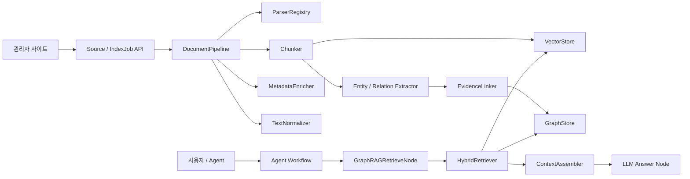

# GraphRAG AI Agent Common Framework

GraphRAG AI Agent 공통 프레임워크는 `VectorMoon`, `Sol-Bat`, `accountBook`, `lotto` 등 바이브코딩으로 진행한 서비스에서 반복적으로 필요한 RAG, GraphRAG, Agent Workflow, 관리자 기능을 공통화하기 위한 프로젝트입니다.

본 저장소는 공통 프레임워크 소스, Sol-Bat 파일럿 PoC, 관리자 사이트 MVP, 테스트 자동화 구조, 단계별 산출물을 함께 관리합니다.

> 저장소명은 현재 GitHub 생성명에 따라 `GraphRAG-AI-Agnet`로 유지합니다.

## 1. 프로젝트 개요

| 항목 | 내용 |
|---|---|
| 프로젝트명 | GraphRAG AI Agent 공통 프레임워크 개발 |
| 목적 | 신규 AI Agent 서비스 개발 시 재사용 가능한 GraphRAG/RAG/Agent 공통 기반 제공 |
| 기준 저장소 | `HwangByungChul/GraphRAG-AI-Agnet` |
| 패키지명 | `graphrag-ai-agent-common-framework` |
| 현재 버전 | `0.1.0` |
| 현재 상태 | MVP 및 Sol-Bat 파일럿 PoC 완료, 프로젝트 종료 산출물 작성 완료 |
| 1차 파일럿 | `Sol-Bat` |
| 산출물 기준 | 단계별 프로젝트 산출물 구조 |

## 2. 추진 배경

기존 프로젝트를 진행하면서 다음 기능이 여러 서비스에서 반복적으로 필요했습니다.

- 자료 등록, 문서 파싱, 정규화, 청킹, 메타데이터 보강
- Vector Store 기반 유사도 검색
- Entity, Relation, Evidence 기반 GraphRAG 검색
- Vector 검색과 Graph 검색을 결합한 Hybrid Retrieval
- Agent Workflow에서 GraphRAG 검색 노드를 재사용하는 구조
- 관리자 사이트에서 Source 등록, IndexJob 실행, Preview, 검색 테스트를 수행하는 기능
- 신규 서비스 도메인별 Schema를 등록하고 파일럿 데이터를 빠르게 검증하는 절차

이 프로젝트는 위 기능을 `vm-common-core` 성격의 공통 프레임워크로 발전시키기 위한 첫 번째 기준선입니다.

## 3. 핵심 목표

- GraphRAG AI Agent 서비스 개발에 필요한 공통 모듈 정의
- RAG Core, VectorStore, GraphStore, Entity/Relation Extractor, EvidenceLinker, HybridRetriever 구현
- Agent Workflow Factory와 GraphRAGRetrieveNode 연계 구조 구현
- 관리자 사이트 MVP로 Source/IndexJob/Preview/RetrievalTest 관리 기능 제공
- Sol-Bat 도메인 스키마와 샘플 데이터 기반 파일럿 검증
- 단계별 산출물 기준으로 프로젝트 계획부터 종료까지 문서화
- 테스트 자동화 기본 구조와 회귀 테스트 기준 마련

## 4. 전체 아키텍처



## 5. 주요 기능

### 5.1 RAG Core

| 모듈 | 설명 |
|---|---|
| `DocumentPipeline` | Source 입력부터 문서 정규화, 파싱, 청킹, 메타데이터 보강까지의 기본 처리 흐름 |
| `ParserRegistry` | 파일/콘텐츠 유형별 Parser 등록 및 선택 구조 |
| `Chunker` | 검색 단위 Chunk 생성 |
| `MetadataEnricher` | Source, Document, Chunk 메타데이터 보강 |
| `TextNormalizer` | 공백, 특수문자, 문장 구조 등 텍스트 정규화 |

### 5.2 Vector Store

| 모듈 | 설명 |
|---|---|
| `VectorStoreFactory` | provider 기반 VectorStore 생성 |
| `InMemoryVectorStore` | 테스트와 PoC용 메모리 기반 벡터 저장소 |
| `FAISSVectorStoreAdapter` | FAISS 연동을 위한 Adapter 골격 |
| `PGVectorStoreAdapter` | PostgreSQL pgvector 연동을 위한 Adapter 골격 |

### 5.3 GraphRAG Core

| 모듈 | 설명 |
|---|---|
| `SchemaRegistry` | 도메인별 Entity/Relation Schema 등록 |
| `EntityExtractor` | rule 기반 Entity 추출 |
| `RelationExtractor` | rule 기반 Relation 추출 |
| `EntityResolver` | Entity 정규화 및 중복 해소 |
| `EvidenceLinker` | Chunk, Entity, Relation, Evidence 연결 |
| `InMemoryGraphStore` | 테스트와 PoC용 메모리 기반 Graph Store |
| `PostgreSQLGraphStoreAdapter` | PostgreSQL 기반 Graph Store Adapter 골격 |
| `HybridRetriever` | Vector 검색과 Graph 검색 결과를 병합 |
| `ContextAssembler` | 검색 결과를 Agent 답변 생성용 Context로 조립 |

### 5.4 Agent Workflow

| 모듈 | 설명 |
|---|---|
| `WorkflowDefinition` | Agent Workflow 구성 정의 |
| `WorkflowFactory` | 노드 기반 Workflow 생성 |
| `GraphRAGRetrieveNode` | Agent 실행 중 GraphRAG 검색 수행 |
| `LLMAnswerNode` | LLM 답변 생성 노드 골격 |
| `StructuredOutputNode` | 구조화 출력 변환 노드 |

### 5.5 관리자 사이트 MVP

| 기능 | 설명 |
|---|---|
| Source 관리 | Source 등록, 조회, 삭제 |
| IndexJob 관리 | 인덱싱 작업 실행, 상태 조회 |
| Preview | Chunk, Entity, Relation, Evidence Preview 조회 |
| GraphRAG 검색 테스트 | 관리자 화면에서 Hybrid Retrieval 결과 확인 |
| Agent 실행 | Agent 실행 API 골격 제공 |

## 6. 프로젝트 구조

```text
GraphRAG-AI-Agnet/
  README.md
  pyproject.toml
  update_github.bat
  src/
    common_core/
      admin/
      agents/
      ai_pipeline/
        document/
        graphrag/
        vectorstores/
      ops/
      pilots/
  tests/
  tools/
    run_tests.py
  01.docs/
    01.산출물/
      100.프로젝트계획/
      200.프로젝트실행/
        210.아키텍처정의/
        220.요구정의/
        230.분석/
        240.설계/
        250.구현/
        260.테스트/
        270.파일럿적용/
        280.테스트/
        290.이행/
      300.프로젝트종료/
      400.프로젝트관리/
```

## 7. 소스 디렉터리

| 경로 | 설명 |
|---|---|
| `src/common_core/ai_pipeline/document` | 문서 파이프라인, Parser, Chunker, Normalizer |
| `src/common_core/ai_pipeline/vectorstores` | VectorStore 추상화, InMemory, FAISS, PGVector Adapter |
| `src/common_core/ai_pipeline/graphrag` | GraphRAG Schema, Extractor, GraphStore, HybridRetriever |
| `src/common_core/agents` | Agent Workflow Factory와 공통 State |
| `src/common_core/agents/nodes` | GraphRAGRetrieveNode, LLMAnswerNode, StructuredOutputNode |
| `src/common_core/admin` | 관리자 API Schema, Service, Router, 정적 MVP 화면 |
| `src/common_core/pilots` | Sol-Bat 파일럿 스키마, 샘플 인덱싱, 검색 연계 코드 |
| `src/common_core/ops` | 공통 오류 코드 |
| `tests` | 단위/통합/파일럿 회귀 테스트 |
| `tools` | 테스트 실행 보조 도구 |

## 8. 산출물 구조

프로젝트 산출물은 `01.docs/01.산출물` 아래에 단계별로 정리되어 있습니다.

| 단계 | 폴더 | 주요 산출물 |
|---|---|---|
| 100.프로젝트계획 | `01.docs/01.산출물/100.프로젝트계획` | 프로젝트계획서, WBS, WBS Gantt, 단계별 인력정의서, 계획산출물 검토및확정 |
| 210.아키텍처정의 | `01.docs/01.산출물/200.프로젝트실행/210.아키텍처정의` | 시스템아키텍처정의서, GraphRAG 아키텍처정의서, 데이터/저장소 아키텍처정의서, 개발표준정의서 |
| 220.요구정의 | `01.docs/01.산출물/200.프로젝트실행/220.요구정의` | 액터목록/유스케이스목록, 요구사항정의서, 요구사항추적표 |
| 230.분석 | `01.docs/01.산출물/200.프로젝트실행/230.분석` | 기존 프로젝트 공통기능분석서, RAG/Agent 구현현황분석서, 도메인 개념 및 용어정의서, 논리 데이터 모델 분석서, 인터페이스 분석서 |
| 240.설계 | `01.docs/01.산출물/200.프로젝트실행/240.설계` | 공통 모듈 상세설계서, GraphRAG Core 상세설계서, 물리 데이터 모델, API 명세/OpenAPI, 화면정의서, Frontend 컴포넌트 설계서 |
| 250.구현 | `01.docs/01.산출물/200.프로젝트실행/250.구현` | RAG Core, VectorStoreFactory, GraphStore, Extractor, HybridRetriever, Agent Workflow, 관리자 사이트 구현 결과 |
| 270.파일럿적용 | `01.docs/01.산출물/200.프로젝트실행/270.파일럿적용` | Sol-Bat 적용 범위, 도메인 스키마, GraphRAG 검색 노드 적용, 데이터 인덱싱, 파일럿 결과 |
| 280.테스트 | `01.docs/01.산출물/200.프로젝트실행/280.테스트` | 테스트계획서, 테스트시나리오, 테스트 자동화 구조 및 수행 결과서, 결함관리대장, 테스트 결과 확정 |
| 290.이행 | `01.docs/01.산출물/200.프로젝트실행/290.이행` | 사용자매뉴얼, 운영자매뉴얼, 신규 서비스 적용 가이드, 배포 및 운영 체크리스트, 이행 준비상태 검토서 |
| 300.프로젝트종료 | `01.docs/01.산출물/300.프로젝트종료` | 최종 산출물 목록, 프로젝트 완료보고서, Lessons Learned, 릴리즈 태그 및 버전 정리, 최종 종료 검토서 |

## 9. 주요 산출물 바로가기

- [프로젝트계획서](01.docs/01.산출물/100.프로젝트계획/GraphRAG_AI_Agent_공통프레임워크_프로젝트계획서.md)
- [WBS](01.docs/01.산출물/100.프로젝트계획/GraphRAG_AI_Agent_공통프레임워크_WBS.md)
- [WBS Gantt HTML](01.docs/01.산출물/100.프로젝트계획/GraphRAG_AI_Agent_공통프레임워크_WBS_Gantt.html)
- [시스템아키텍처정의서](01.docs/01.산출물/200.프로젝트실행/210.아키텍처정의/GraphRAG_AI_Agent_공통프레임워크_시스템아키텍처정의서.md)
- [GraphRAG 아키텍처정의서](01.docs/01.산출물/200.프로젝트실행/210.아키텍처정의/GraphRAG_AI_Agent_공통프레임워크_GraphRAG아키텍처정의서.md)
- [요구사항정의서](01.docs/01.산출물/200.프로젝트실행/220.요구정의/GraphRAG_AI_Agent_공통프레임워크_요구사항정의서.md)
- [GraphRAG Core 상세설계서](01.docs/01.산출물/200.프로젝트실행/240.설계/GraphRAG_AI_Agent_공통프레임워크_GraphRAG_Core상세설계서.md)
- [관리자 및 GraphRAG API OpenAPI YAML](01.docs/01.산출물/200.프로젝트실행/240.설계/GraphRAG_AI_Agent_공통프레임워크_관리자_GraphRAG_API_OpenAPI.yaml)
- [Sol-Bat 파일럿 동작 확인 및 결과서](01.docs/01.산출물/200.프로젝트실행/270.파일럿적용/GraphRAG_AI_Agent_공통프레임워크_Sol-Bat파일럿_동작확인및결과서.md)
- [테스트 자동화 구조 및 수행 결과서](01.docs/01.산출물/200.프로젝트실행/280.테스트/GraphRAG_AI_Agent_공통프레임워크_테스트자동화구조_및_수행결과서.md)
- [신규 서비스 적용 가이드](01.docs/01.산출물/200.프로젝트실행/290.이행/GraphRAG_AI_Agent_공통프레임워크_신규서비스적용가이드.md)
- [최종 산출물 목록](01.docs/01.산출물/300.프로젝트종료/GraphRAG_AI_Agent_공통프레임워크_최종산출물목록.md)
- [프로젝트 완료보고서](01.docs/01.산출물/300.프로젝트종료/GraphRAG_AI_Agent_공통프레임워크_프로젝트완료보고서.md)
- [Lessons Learned](01.docs/01.산출물/300.프로젝트종료/GraphRAG_AI_Agent_공통프레임워크_Lessons_Learned.md)
- [릴리즈 태그 및 버전 정리](01.docs/01.산출물/300.프로젝트종료/GraphRAG_AI_Agent_공통프레임워크_릴리즈태그_및_버전정리.md)
- [최종 종료 검토서](01.docs/01.산출물/300.프로젝트종료/GraphRAG_AI_Agent_공통프레임워크_최종종료검토서.md)

## 10. 설치 및 실행

### 10.1 개발 환경

```bash
python -m venv .venv
.venv\Scripts\activate
python -m pip install -U pip
python -m pip install -e ".[test,api,db]"
```

### 10.2 테스트 실행

```bash
python -m pytest
```

또는 보조 스크립트를 사용할 수 있습니다.

```bash
python tools/run_tests.py
```

현재 기준 자동화 테스트 결과는 다음과 같습니다.

```text
32 passed
```

## 11. 관리자 사이트 MVP

관리자 사이트 MVP는 Source와 IndexJob 중심의 GraphRAG 자료 관리 기능을 검증하기 위한 골격입니다.

| 화면/기능 | 설명 |
|---|---|
| Source 목록 | 등록된 Source 조회 |
| Source 등록 | 자료명, 유형, 본문, 메타데이터 등록 |
| Source 상세/Preview | Chunk, Entity, Relation, Evidence Preview 확인 |
| IndexJob 실행 | Source 기준 인덱싱 작업 실행 |
| IndexJob 상태 모니터링 | 작업 상태, 처리 건수, 오류 상태 확인 |
| GraphRAG 검색 테스트 | 질의 입력 후 Hybrid Retrieval 결과 확인 |
| Agent 실행 | GraphRAG 검색 결과를 Agent Workflow에 연결하는 API 골격 |

정적 MVP 화면은 다음 위치에 있습니다.

```text
src/common_core/admin/web/admin_mvp.html
```

## 12. Sol-Bat 파일럿

Sol-Bat 파일럿은 농업 도메인 지식 검색을 기준으로 GraphRAG 공통 프레임워크 적용 가능성을 검증했습니다.

### 12.1 Entity

- 작물
- 병해충
- 증상
- 환경조건
- 관리작업
- 농자재
- 지역
- 생육단계

### 12.2 Relation

- 발생위험
- 예방
- 처방
- 영향
- 적용시기

### 12.3 검증 범위

- P1 샘플 데이터 3건 인덱싱
- Source 등록
- IndexJob 실행
- Chunk/Entity/Relation/Evidence Preview
- HybridRetriever 검색
- `retrieve_knowledge` 연계 방안 검증

## 13. 테스트 범위

| 테스트 파일 | 검증 대상 |
|---|---|
| `tests/test_document_pipeline.py` | DocumentPipeline, ParserRegistry, Chunker, MetadataEnricher, TextNormalizer |
| `tests/test_vectorstores.py` | InMemoryVectorStore, VectorStoreFactory, Adapter 골격 |
| `tests/test_graph_store.py` | InMemoryGraphStore, entity/relation/evidence upsert/find/traverse/delete |
| `tests/test_extractors.py` | Entity/Relation Extractor, EntityResolver, EvidenceLinker |
| `tests/test_hybrid_retriever.py` | VectorStore + GraphStore 결합 검색, score 병합 |
| `tests/test_context_assembler.py` | Retrieval Context 조립 |
| `tests/test_graphrag_retrieve_node.py` | Agent GraphRAGRetrieveNode |
| `tests/test_agent_workflow.py` | WorkflowDefinition, WorkflowFactory, 노드 실행 |
| `tests/test_admin_mvp.py` | 관리자 Source/IndexJob/Preview/RetrievalTest Service |
| `tests/test_sol_bat_pilot.py` | Sol-Bat 스키마, 샘플 인덱싱, 파일럿 회귀 |

## 14. 프로젝트 진행 상태

| WBS | 단계 | 상태 |
|---|---|---|
| 1.0 | 프로젝트계획 | 완료 |
| 2.0 | 아키텍처정의 | 완료 |
| 3.0 | 요구정의 | 완료 |
| 4.0 | 분석 | 완료 |
| 5.0 | 설계 | 완료 |
| 6.0 | 구현 | 완료 |
| 7.0 | 파일럿 적용 | 완료 |
| 8.0 | 테스트 | 완료 |
| 9.0 | 이행 | 완료 |
| 10.0 | 종료 | 완료 |

최종 종료 검토 결과는 MVP 및 Sol-Bat 파일럿 PoC 범위에서 `조건부 종료 승인`입니다.

## 15. 잔여 리스크 및 후속 과제

운영 적용 또는 상용 서비스 반영 전에는 다음 항목을 후속 과제로 수행해야 합니다.

- PostgreSQL, PGVector, FAISS 실제 저장소 통합 테스트
- 관리자 사이트 브라우저 기반 E2E 자동화 테스트
- 인증/인가, 역할 기반 접근 제어, 감사 로그 구현
- 대용량 Source/Chunk/Entity 기준 성능 벤치마크
- 운영 배포 파이프라인과 모니터링 구성
- GitHub 릴리즈 태그 `v0.1.0-poc` 생성

## 16. 신규 서비스 적용 흐름

신규 서비스에 본 프레임워크를 적용할 때의 기본 흐름은 다음과 같습니다.

1. 서비스 도메인의 Entity/Relation Schema를 정의합니다.
2. `SchemaRegistry`에 도메인 스키마를 등록합니다.
3. Source 유형과 Parser를 결정하고 `ParserRegistry`에 등록합니다.
4. `DocumentPipeline`으로 Source를 Document/Chunk로 변환합니다.
5. Chunk를 VectorStore에 저장하고 Entity/Relation/Evidence를 GraphStore에 저장합니다.
6. `HybridRetriever`로 Vector + Graph 결합 검색을 수행합니다.
7. `GraphRAGRetrieveNode`를 Agent Workflow에 연결합니다.
8. 관리자 사이트에서 Source, IndexJob, Preview, RetrievalTest를 검증합니다.
9. 테스트 시나리오와 회귀 테스트를 서비스 도메인 기준으로 확장합니다.

## 17. 릴리즈 권고

현재 프로젝트는 `0.1.0` MVP 기준선입니다.

권고 릴리즈 태그:

```text
v0.1.0-poc
```

태그 생성 전 권고 확인 항목:

- README 최신화
- WBS 100% 완료 반영
- 최종 종료 검토서 작성 완료
- pytest 전체 통과
- GitHub 원격 저장소 최신 반영

## 18. 참고

- 본 저장소는 공통 프레임워크 기반을 만들기 위한 MVP/PoC 성격의 프로젝트입니다.
- 실제 운영 적용 전에는 보안, 성능, 실제 저장소, 배포 자동화 검증이 추가로 필요합니다.
- 산출물 파일명과 폴더명은 프로젝트 단계별 산출물 구조와 사용자의 단계별 요청 흐름을 기준으로 유지합니다.
